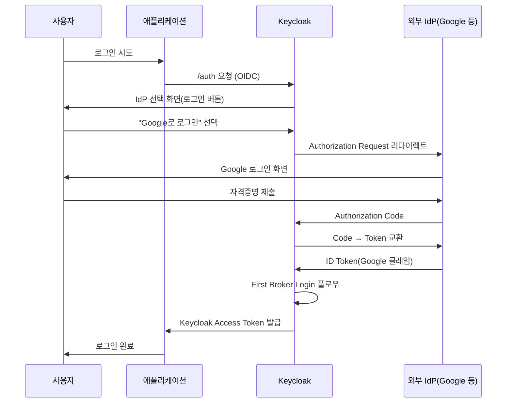
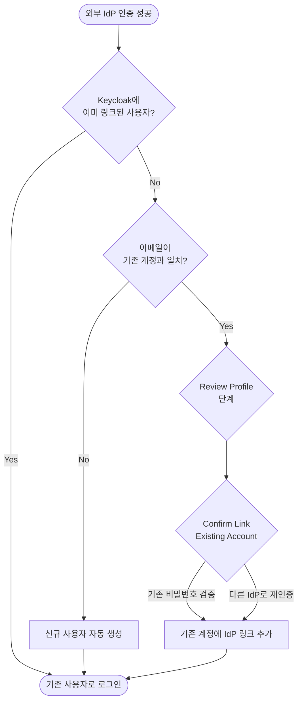

# Identity Brokering

::: info 학습 목표
- Identity Brokering과 User Federation의 차이를 구분하고 언제 어느 쪽을 선택해야 하는지 설명할 수 있다.
- Google/GitHub/Kakao 같은 소셜 IdP와 기업용 SAML IdP(Azure AD, Okta)를 Keycloak에 등록할 수 있다.
- First Broker Login 플로우의 단계와 기존 계정 병합 옵션을 이해한다.
- Identity Provider Mapper로 외부 토큰의 클레임을 Keycloak 속성·Role에 매핑할 수 있다.
:::

---

## 1. Identity Brokering vs User Federation

Keycloak이 외부 사용자 소스를 다루는 방식은 크게 두 가지다. 같은 "외부 연동"이라는 말로 묶이지만 동작은 전혀 다르다.

| 구분 | Identity Brokering | User Federation |
|------|-------------------|----------------|
| 대상 프로토콜 | OIDC / SAML / 소셜 OAuth | LDAP / Kerberos / 커스텀 DB |
| 인증 주체 | 외부 IdP가 직접 사용자 인증 | Keycloak이 직접 검증(Bind/Hash 비교) |
| 사용자 저장소 | 외부 IdP에 존재, Keycloak은 링크만 유지 | 외부 디렉토리를 읽어 로컬 캐시 |
| 로그인 화면 | 외부 IdP로 리다이렉트 | Keycloak 자체 로그인 폼 |
| 대표 케이스 | Google/Kakao 소셜 로그인, 기업 SSO | 사내 AD 사용자 직접 로그인 |

[CH14. User Federation](/study/keycloak/14-user-federation)에서 다룬 LDAP 연동은 Keycloak이 디렉토리에서 사용자 정보를 읽어 들여 <strong>직접</strong>인증을 수행한다. 반면 Identity Brokering은 사용자를 외부 IdP로 넘긴 뒤 그 결과(ID Token/SAML Assertion)만 신뢰한다.



흐름의 핵심은 Keycloak이 "중개자(Broker)"로 서서 외부 IdP의 인증 결과를 자기 토큰으로 다시 포장한다는 점이다. 애플리케이션 입장에서는 어떤 소셜이든 항상 Keycloak 토큰만 보면 된다. 이 개념 자체는 [OAuth 스터디 CH18. SSO와 Federation](/study/oauth/18-sso-federation)에서 다룬 Federated Identity 모델을 그대로 따른다.

### 어느 쪽을 선택하나

- 사내 직원이 AD 비밀번호로 Keycloak에 직접 로그인 → User Federation
- Google/Kakao로 일반 사용자 가입 → Identity Brokering
- 자회사가 이미 Okta/Azure AD를 쓰고 있음 → Identity Brokering(SAML 또는 OIDC)
- 레거시 사용자 DB를 그대로 사용 → [CH18. 커스텀 User Storage](/study/keycloak/18-custom-user-storage)

---

## 2. 내장 IdP 목록

Keycloak Admin Console의 Identity Providers → Add Provider 메뉴를 열면 내장된 소셜 IdP 템플릿이 나열된다. 이들은 OAuth/OIDC 엔드포인트가 사전 설정되어 있어 Client ID/Secret만 넣으면 동작한다.

| IdP | 프로토콜 | 비고 |
|-----|---------|------|
| Google | OIDC | Google Cloud Console에서 OAuth Client 발급 |
| GitHub | OAuth2 | Settings → Developer settings → OAuth Apps |
| Facebook | OAuth2 | Meta for Developers 앱 생성 |
| Microsoft | OIDC | Azure AD Entra 앱 등록과 다름(공용 Microsoft 계정) |
| Instagram | OAuth2 | Facebook 플랫폼 기반 |
| LinkedIn | OAuth2 | LinkedIn Developers |
| GitLab | OIDC | SaaS 또는 Self-hosted |
| Bitbucket | OAuth2 | Atlassian Workspace |
| Stack Overflow | OAuth2 | |
| Twitter(X) | OAuth1 | 구 스펙이라 콜백 방식 다름 |
| PayPal | OIDC | |
| OpenShift | OIDC | |

### Google 등록 예시

1. Google Cloud Console → APIs & Services → Credentials → Create OAuth Client ID
2. Application type: Web application
3. Authorized redirect URIs에 `https://keycloak.example.com/realms/myrealm/broker/google/endpoint` 추가
4. 발급된 Client ID/Secret을 Keycloak Admin의 Google IdP 설정에 입력

Redirect URI 포맷은 `{kc-base}/realms/{realm}/broker/{alias}/endpoint`로 고정된다. alias는 IdP를 등록할 때 지정하는 식별자로, URL에 그대로 노출되므로 `google`, `kakao`처럼 짧고 의미 있는 값을 쓴다.

---

## 3. Custom OIDC IdP — 한국 소셜 수동 등록

Kakao, Naver는 내장 템플릿에 없어 "OpenID Connect v1.0" 또는 "OAuth v2" 템플릿을 선택한 뒤 엔드포인트를 직접 입력해야 한다.

### Kakao 설정 예

| 항목 | 값 |
|------|-----|
| Alias | `kakao` |
| Provider | OpenID Connect v1.0 |
| Authorization URL | `https://kauth.kakao.com/oauth/authorize` |
| Token URL | `https://kauth.kakao.com/oauth/token` |
| User Info URL | `https://kapi.kakao.com/v2/user/me` |
| Client Authentication | Client secret sent as post |
| Client ID | (Kakao 개발자 콘솔에서 발급) |
| Client Secret | (발급된 시크릿) |
| Default Scopes | `profile_nickname account_email` |
| Validate Signatures | Off (Kakao는 표준 JWKS 미제공) |

Kakao는 엄밀히 말해 OIDC 완전 준수가 아니다. ID Token 서명 검증이 까다롭기 때문에 실무에서는 "OAuth v2" 타입으로 등록하고 User Info를 호출하는 방식이 더 안정적이다. User Info 응답은 다음 형태다.

```json
{
  "id": 123456789,
  "kakao_account": {
    "email": "user@kakao.com",
    "profile": {
      "nickname": "홍길동",
      "profile_image_url": "https://..."
    }
  }
}
```

중첩 구조라서 단순 매핑이 안 된다. 뒤의 Identity Provider Mapper 절에서 JsonPath로 꺼내는 방법을 본다.

### Naver 설정 예

| 항목 | 값 |
|------|-----|
| Authorization URL | `https://nid.naver.com/oauth2.0/authorize` |
| Token URL | `https://nid.naver.com/oauth2.0/token` |
| User Info URL | `https://openapi.naver.com/v1/nid/me` |
| Default Scopes | `name,email,profile_image` |

Naver 역시 OIDC가 아니라 OAuth2이므로 "OAuth v2" 템플릿을 사용한다.

---

## 4. Custom SAML IdP — 기업 IdP 연결

엔터프라이즈 환경에서는 Okta, Azure AD, OneLogin, ADFS 같은 기업 IdP를 SAML 2.0으로 연결하는 케이스가 많다. Keycloak은 SAML SP(Service Provider) 역할을 하고, 외부 IdP가 SAML IdP 역할을 한다.

### Azure AD(Entra ID) 연동 예

1. Azure Portal → Enterprise Applications → New application → Create your own application
2. Single sign-on → SAML 선택
3. Identifier(Entity ID): `https://keycloak.example.com/realms/myrealm`
4. Reply URL(ACS): `https://keycloak.example.com/realms/myrealm/broker/azure-saml/endpoint`
5. SAML Signing Certificate → Federation Metadata XML 다운로드

Keycloak Admin Console에서는 다음과 같이 등록한다.

| 항목 | 값 |
|------|-----|
| Provider | SAML v2.0 |
| Alias | `azure-saml` |
| Service Provider Entity ID | 자동 생성(위 Identifier와 일치) |
| Import from URL | Federation Metadata URL 직접 입력 가능 |
| Single Sign-On Service URL | 메타데이터에서 자동 추출 |
| Want AuthnRequests Signed | On(권장) |
| Validate Signature | On |
| Signing Certificate | 메타데이터에서 자동 |

Import from URL 또는 파일 업로드를 쓰면 엔드포인트와 인증서를 한 번에 불러올 수 있어 수동 입력 오류가 줄어든다.

### NameID와 주요 속성 매핑

SAML Assertion은 `<NameID>`와 `<AttributeStatement>`로 구성된다. Keycloak은 기본적으로 NameID를 사용자 식별자로 쓰되, `NameID Policy Format`을 `emailAddress` 또는 `persistent`로 지정해 IdP 쪽과 맞춘다. 속성은 뒤의 Mapper에서 Keycloak 사용자 필드로 연결한다.

---

## 5. First Broker Login Flow

외부 IdP가 발급한 토큰·Assertion을 받은 직후 Keycloak은 내부적으로 "이 외부 사용자를 이 Realm에서 어떻게 처리할까?"를 결정한다. 이 분기를 관장하는 것이 <strong>First Broker Login</strong>플로우다. Authentication → Flows → First Broker Login에서 기본 플로우가 제공되며, 필요하면 복제해 커스터마이징한다.



### 주요 Authenticator

- <strong>Review Profile</strong>: 외부 IdP가 제공한 이름/이메일을 사용자가 확인·수정하는 단계. 정책에 따라 "항상 보여주기 / 빈 값일 때만 / 표시 안 함"을 선택한다.
- <strong>Create User If Unique</strong>: 이메일·username이 기존 계정과 충돌하지 않으면 바로 생성하고 끝낸다.
- <strong>Handle Existing Account</strong>: 충돌이 있으면 사용자에게 선택지를 제시한다. 하위 단계로 다음 두 가지가 있다.
  - <strong>Confirm Link Existing Account</strong>: "기존 계정에 연결할래?"를 묻는 화면
  - <strong>Verify Existing Account By Re-authentication</strong>: 기존 비밀번호로 본인 확인
  - <strong>Verify Existing Account By Email</strong>: 기존 이메일로 확인 링크 전송

### 정책 예시

| 시나리오 | 권장 설정 |
|----------|----------|
| 소셜 로그인만 허용, 자동 가입 | Create User If Unique만 활성, 기존 계정 없음 |
| 자체 계정 + 소셜 동시 허용, 이메일로 병합 | Handle Existing Account → Verify By Email Required |
| 기업 SSO 전용, 자동 매핑 | Review Profile: Missing, Create User If Unique: Required |
| 수동 관리자 승인 후 가입 | Create User If Unique Disabled, 관리자가 링크 |

---

## 6. Identity Provider Mapper

외부 IdP의 토큰·Assertion이 담은 정보를 Keycloak UserModel의 속성·Role·Group으로 매핑하는 장치다. IdP 설정 화면의 Mappers 탭에서 추가한다.

### 주요 Mapper 타입

| Mapper 종류 | 용도 |
|------------|------|
| Attribute Importer | OIDC Claim → User Attribute |
| Username Template Importer | 클레임 조합으로 username 생성(`${CLAIM.sub}@kakao`) |
| Hardcoded Role | 이 IdP로 로그인한 사용자에 일괄 Role 부여 |
| Hardcoded Attribute | 일괄 속성 부여(예: `source=google`) |
| Advanced Claim To Role | 특정 클레임 값이 조건 충족 시 Role 부여 |
| Advanced Attribute To Role | SAML 속성 조건 → Role |
| External Keycloak Role → Role | 브로커링 대상이 Keycloak일 때 Role 재매핑 |

### Kakao 이메일 매핑 예

Kakao User Info 응답의 `kakao_account.email`을 Keycloak User의 email 필드로 넣으려면 Attribute Importer에 JsonPath 형태의 Claim 이름을 쓴다.

| 필드 | 값 |
|------|-----|
| Mapper Type | Attribute Importer |
| Claim | `kakao_account.email` |
| User Attribute Name | `email` |
| Sync Mode Override | `FORCE` (매 로그인마다 갱신) |

Sync Mode는 세 가지다.

- `IMPORT`: 최초 생성 시에만 반영
- `LEGACY`: IdP 설정에 따름
- `FORCE`: 로그인할 때마다 IdP 값으로 덮어쓰기

조직 소속이 바뀌면 Role을 동기화해야 하는 경우 `FORCE`가 맞지만, 사용자가 Keycloak에서 프로필을 직접 수정하게 허용하려면 `IMPORT`가 낫다.

### Username Template

자체 username을 만들어야 할 때가 있다. 예를 들어 Kakao에서 온 사용자는 username을 `kakao_12345` 형태로 고유하게 만들고 싶다면 Username Template Importer를 등록한다.

| 필드 | 값 |
|------|-----|
| Mapper Type | Username Template Importer |
| Template | `kakao_${ALIAS}_${CLAIM.id}` |
| Target | `LOCAL` 또는 `BROKER_ID` |

`${ALIAS}`는 IdP alias, `${CLAIM.xxx}`는 토큰 클레임, `${ATTRIBUTE.xxx}`는 SAML 속성을 가리킨다. 여러 IdP를 쓰는 사이트에서 같은 이메일이 서로 다른 IdP로 들어오면 First Broker Login이 "이미 존재하는 사용자"로 오인할 수 있는데, Username Template으로 IdP별 네임스페이스를 주면 충돌을 미리 막을 수 있다.

### SAML 속성 → Role 매핑 예

Azure AD의 `http://schemas.microsoft.com/ws/2008/06/identity/claims/groups` 속성에 포함된 그룹 ID를 기준으로 Keycloak Role을 부여한다.

| 필드 | 값 |
|------|-----|
| Mapper Type | Advanced Attribute To Role |
| Attribute Name | `http://schemas.microsoft.com/ws/2008/06/identity/claims/groups` |
| Attribute Value | `a1b2c3d4-...` (Azure 그룹 ObjectID) |
| Role | `admin` |

여러 조건이 필요하면 Mapper를 개수대로 등록한다. Mapper는 로그인마다 재평가되므로 Azure에서 그룹이 빠지면 다음 로그인 시 Role도 회수된다.

---

::: tip 핵심 정리
- Identity Brokering은 외부 IdP에 인증을 위임하고, User Federation은 외부 디렉토리를 직접 조회한다. 둘은 교체가 아닌 조합 관계다.
- 내장 IdP는 Google/GitHub/Facebook 등 공용 소셜에, Custom OIDC·OAuth v2는 Kakao/Naver 같은 비표준 소셜에, SAML은 기업 IdP(Azure AD/Okta)에 쓴다.
- First Broker Login 플로우가 "신규 생성 / 기존 계정 병합 / 재인증"을 결정하며 Review Profile·Handle Existing Account 등 Authenticator 조합으로 정책을 설계한다.
- Identity Provider Mapper는 외부 토큰 클레임을 User Attribute·Role·Group으로 연결하고, Sync Mode(`IMPORT`/`FORCE`)로 갱신 정책을 고른다.
:::

## 다음 챕터

- 이전 : [User Federation](/study/keycloak/14-user-federation)
- 다음 : [SPI로 Keycloak 확장](/study/keycloak/16-spi-overview)
