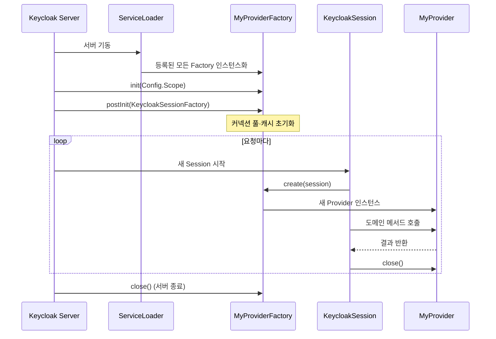
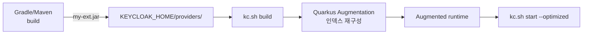

# SPI로 Keycloak 확장

::: info 학습 목표
- Keycloak이 노출하는 SPI(Service Provider Interface)의 구조와 70여 개 확장점 종류를 설명할 수 있다.
- ProviderFactory와 Provider의 생명주기 차이를 이해한다.
- providers/ 디렉토리와 `kc.sh build`를 활용한 Quarkus 재빌드 흐름을 익힌다.
- Quarkus 모듈 격리로 인해 발생하는 클래스로더 충돌을 피하기 위한 의존성 설계 원칙을 파악한다.
:::

---

## 1. SPI 개념

SPI(Service Provider Interface)는 "프레임워크가 특정 기능을 인터페이스로 노출하고, 외부가 그 인터페이스를 구현해서 끼워 넣는" 표준 Java 확장 메커니즘이다. JDK `java.util.ServiceLoader`가 그 뿌리다. Keycloak은 이 패턴을 철저히 적용해 거의 모든 내부 기능을 SPI로 쪼개 두었다.

### 왜 SPI가 중요한가

Keycloak은 "공용 IAM"으로 출발했지만 실무는 언제나 커스터마이즈가 필요하다. 사번·휴대폰 인증, 사내 IdP 연동, 레거시 DB 사용자 불러오기, 이벤트를 Kafka로 보내기 같은 요구는 오픈소스 본체만으로는 불가능하다. SPI는 Keycloak 업그레이드와 커스텀 로직을 분리해 "본체 유지, 확장만 교체"를 가능하게 한다.

### 주요 SPI 카테고리(일부)

| 영역 | 대표 SPI |
|------|---------|
| 인증 | Authenticator, FormAuthenticator, ClientAuthenticator |
| 사용자 저장 | UserStorageProvider, UserFederationProvider |
| 토큰/프로토콜 | ProtocolMapper, LoginProtocol |
| IdP | IdentityProvider, SocialIdentityProvider |
| 정책 | Policy(Authorization), PasswordPolicy |
| 이벤트 | EventListenerProvider |
| UI | Theme, ThemeSelector, ThemeResource |
| REST | RealmResourceProvider |
| 메일 | EmailSenderProvider, EmailTemplateProvider |
| 기타 | KeyProvider, ClusterProvider, StickySessionEncoder |

각 SPI마다 Provider 인터페이스와 이를 생성하는 Factory 인터페이스가 한 쌍이다. 공식 문서 "Server Developer Guide"의 Service Provider Interfaces 섹션에 전체 목록이 있다.

---

## 2. Factory vs Provider — 생명주기

SPI 구현체는 항상 Factory와 Provider 두 개로 나뉜다. 이유는 생명주기가 다르기 때문이다.

| 구분 | Factory | Provider |
|------|---------|----------|
| 개수 | Keycloak 서버당 1개(싱글톤) | 요청(또는 세션)마다 생성 |
| 수명 | 서버 start~stop | 한 번의 `KeycloakSession` |
| 역할 | 설정 파싱, 외부 리소스 초기화(커넥션 풀 등), Provider 인스턴스 공급 | 실제 요청 로직 수행 |
| 주요 메서드 | `init()`, `postInit()`, `create()`, `close()` | 도메인별(`authenticate()`, `getUserByUsername()` 등) |



### Factory 인터페이스 공통 시그니처

```java
public interface ProviderFactory<T extends Provider> {
    T create(KeycloakSession session);
    void init(Config.Scope config);
    void postInit(KeycloakSessionFactory factory);
    void close();
    String getId();
}
```

`init()`은 Factory가 생성된 직후, `postInit()`은 모든 Factory가 생성된 뒤에 호출된다. Factory 간 상호 참조가 필요하다면 `postInit()`에서 `factory.getProviderFactory(...)`로 찾는다.

### Scope와 구성

`Config.Scope`는 `kc.sh build`나 `keycloak.conf`에 설정한 SPI 구성값을 읽는 통로다. 예를 들어 `spi-authenticator-my-auth-api-url=https://api.example.com`로 설정하면 Factory에서 `config.get("api-url")`로 꺼낼 수 있다.

---

## 3. providers/ 디렉토리와 kc.sh build

Keycloak 17부터 런타임이 Quarkus로 전환되면서 확장 배포 방식도 바뀌었다. 과거 Wildfly 시절의 "모듈 등록"이 아니라, 단순히 JAR 파일을 `providers/` 디렉토리에 두고 빌드 명령을 실행하면 끝이다.

### 배포 흐름



### 단계별 설명

1. <strong>빌드</strong>: Gradle/Maven으로 SPI 구현 JAR을 생성한다. 의존성은 뒤의 5절 규칙을 따른다.
2. <strong>배포</strong>: `$KEYCLOAK_HOME/providers/` 디렉토리에 JAR을 복사한다.
3. <strong>재빌드</strong>: `kc.sh build`를 실행하면 Quarkus가 `conf/`와 `providers/`를 스캔해 새로운 인덱스를 만든다. 이 과정을 <strong>Augmentation</strong>이라 부르고, 수십 초 걸린다.
4. <strong>실행</strong>: `kc.sh start --optimized`로 기동하면 이미 Augmented 된 런타임을 그대로 쓴다. `--optimized`를 빼면 매 기동 시 자동 Augmentation이 일어나 시작이 느려진다.

컨테이너 환경에서는 Dockerfile에서 Build 단계와 Run 단계를 분리한다.

```dockerfile
FROM quay.io/keycloak/keycloak:26.0 AS builder
COPY my-ext.jar /opt/keycloak/providers/
RUN /opt/keycloak/bin/kc.sh build

FROM quay.io/keycloak/keycloak:26.0
COPY --from=builder /opt/keycloak/ /opt/keycloak/
ENTRYPOINT ["/opt/keycloak/bin/kc.sh", "start", "--optimized"]
```

멀티 스테이지로 빌드 결과를 캐시하고, 운영 컨테이너는 `--optimized`로 빠르게 기동한다.

---

## 4. META-INF/services — ServiceLoader 등록

JAR 안에 Factory 구현 클래스를 두는 것만으로는 Keycloak이 인식하지 못한다. JDK ServiceLoader 규칙에 따라 `META-INF/services/<ProviderFactory의 FQN>` 파일에 구현 클래스 FQN을 적어야 한다.

### 디렉토리 구조

```
my-ext.jar
├── com/
│   └── example/
│       └── keycloak/
│           ├── MyAuthenticator.class
│           └── MyAuthenticatorFactory.class
└── META-INF/
    └── services/
        └── org.keycloak.authentication.AuthenticatorFactory
```

`META-INF/services/org.keycloak.authentication.AuthenticatorFactory` 파일 내용은 다음과 같이 한 줄에 하나씩 FQN을 적는다.

```
com.example.keycloak.MyAuthenticatorFactory
```

여러 Factory를 한 JAR에 담으려면 SPI별로 파일을 따로 두고 각각 FQN을 나열한다. Gradle에서는 `src/main/resources/META-INF/services/...`에 두면 자동 포함된다.

### 확인 방법

Admin Console → Server Info → Providers 탭에서 등록된 SPI 목록과 Provider ID를 확인할 수 있다. JAR은 드롭했는데 목록에 보이지 않으면 거의 다음 셋 중 하나다.

| 증상 | 원인 |
|------|------|
| Providers 탭에 안 뜸 | `META-INF/services` 파일 누락 혹은 FQN 오타 |
| `kc.sh build` 실패 | Factory 생성자 예외 또는 의존성 충돌 |
| 뜨지만 호출 안 됨 | Factory의 `getId()` 값과 Realm 설정 불일치 |

---

## 5. 클래스로더 이슈 — Quarkus 모듈 격리

Wildfly 시절의 Keycloak은 WAR 기반이라 의존성 전쟁이 흔했지만 느슨한 편이었다. Quarkus로 바뀌면서 오히려 더 엄격해졌다. Keycloak이 이미 포함한 라이브러리(예: Jackson, Hibernate)를 확장 JAR이 중복 포함하면 클래스로더 충돌이 일어난다.

### 원칙: Keycloak 제공 의존성은 compileOnly

Gradle 기준 올바른 의존성 선언은 다음과 같다.

```kotlin
// build.gradle.kts
plugins {
    id("java-library")
}

dependencies {
    // Keycloak이 이미 포함한 것 — 컴파일 시에만 참조
    compileOnly("org.keycloak:keycloak-core:26.0.0")
    compileOnly("org.keycloak:keycloak-server-spi:26.0.0")
    compileOnly("org.keycloak:keycloak-server-spi-private:26.0.0")
    compileOnly("org.keycloak:keycloak-services:26.0.0")
    compileOnly("jakarta.ws.rs:jakarta.ws.rs-api:3.1.0")

    // 확장이 추가로 필요한 라이브러리 — JAR에 포함
    implementation("com.squareup.okhttp3:okhttp:4.12.0")
}
```

Maven에서는 `<scope>provided</scope>`에 해당한다. `implementation`/`runtimeOnly`로 두면 Keycloak 기본 제공 라이브러리가 JAR 안에 중복 패키징되어 `NoSuchMethodError`, `LinkageError`, 심하면 서버 기동 실패를 유발한다.

### Shaded / Fat JAR 주의

외부 라이브러리 버전이 Keycloak 기본 버전과 충돌할 때 Shadow Plugin으로 패키지를 relocate하는 해법이 있다. 그러나 Keycloak이 제공하는 클래스(`org.keycloak.*`, `jakarta.*`)는 절대 Shade에 포함하면 안 된다. Relocation은 외부 전용 라이브러리에만 적용한다.

### Quarkus Dev UI에서 진단

`kc.sh start-dev`로 기동한 뒤 `/q/dev-ui` 엔드포인트를 열면 Quarkus가 인식한 모든 확장과 Bean을 볼 수 있다. Factory가 감지됐는데 호출이 실패하면 Dev UI에서 Bean 주입 오류를 먼저 확인하는 습관을 들이는 게 좋다.

### 최소 Factory 골격

실제 SPI 하나를 비우는 것부터 시작해 보면 구조가 명확해진다. 다음은 "아무것도 하지 않는" EventListener SPI의 최소 구현이다.

```java
package com.example.keycloak.noop;

import org.keycloak.Config;
import org.keycloak.events.Event;
import org.keycloak.events.EventListenerProvider;
import org.keycloak.events.EventListenerProviderFactory;
import org.keycloak.events.admin.AdminEvent;
import org.keycloak.models.KeycloakSession;
import org.keycloak.models.KeycloakSessionFactory;

public class NoopEventListenerFactory implements EventListenerProviderFactory {

    public static final String PROVIDER_ID = "noop-listener";

    @Override public String getId() { return PROVIDER_ID; }
    @Override public void init(Config.Scope config) { }
    @Override public void postInit(KeycloakSessionFactory factory) { }
    @Override public void close() { }

    @Override
    public EventListenerProvider create(KeycloakSession session) {
        return new EventListenerProvider() {
            @Override public void onEvent(Event event) { }
            @Override public void onEvent(AdminEvent event, boolean includeRepresentation) { }
            @Override public void close() { }
        };
    }
}
```

`META-INF/services/org.keycloak.events.EventListenerProviderFactory`에 한 줄 적고 `kc.sh build` 후 Admin Console → Events → Config에서 "noop-listener"를 선택 가능한 리스너 목록에 추가할 수 있다. 이 골격에서 `onEvent()`의 몸통만 채우면 Kafka 전송, Slack 알림 같은 실제 리스너가 된다.

---

## 6. 주요 SPI 카탈로그

뒤따르는 챕터에서 실습할 SPI들을 포함해 실무에서 가장 자주 쓰는 확장점을 정리한다.

| SPI | 인터페이스 | 용도 | 실습 챕터 |
|-----|-----------|------|----------|
| Authenticator | `Authenticator`, `AuthenticatorFactory` | 로그인 플로우에 커스텀 단계 삽입 | [CH17](/study/keycloak/17-custom-authenticator) |
| UserStorage | `UserStorageProviderFactory`, Capability 인터페이스들 | 레거시 DB를 사용자 소스로 | [CH18](/study/keycloak/18-custom-user-storage) |
| ProtocolMapper | `OIDCProtocolMapper`, `SAMLProtocolMapper` | 토큰에 임의 클레임 추가 | — |
| EventListener | `EventListenerProvider` | 로그인/관리자 이벤트를 Kafka·외부 API로 | — |
| Policy | `PolicyProvider` | Authorization Services의 커스텀 정책 | — |
| Theme | `Theme`, `ThemeProvider` | 로그인/메일 템플릿 브랜딩 | [CH19](/study/keycloak/19-theme) |
| RealmResource | `RealmResourceProvider` | Realm 하위 커스텀 REST 엔드포인트 | — |
| IdentityProvider | `IdentityProviderFactory` | 비표준 IdP 통합(독자 프로토콜) | — |

### 어떤 SPI부터 익히면 좋은가

Keycloak을 도입한 팀이 가장 먼저 만나는 SPI는 거의 예외 없이 <strong>Authenticator</strong>와<strong>EventListener</strong>다. 전자는 사내 인증 요건(사번·OTP 외부 발송·동의서 받기)을 붙이는 데, 후자는 "누가 언제 로그인했는가"를 회사 DW/SIEM에 보내는 데 필수다. UserStorage는 레거시 DB가 있을 때만 해당하지만 규모가 크다. ProtocolMapper는 SPI라기보다 Admin Console에서 기본 제공 Mapper로 대부분 해결되고, 정말 커스텀 로직이 필요한 소수만 구현한다.

### SPI 상호 조합 예

하나의 확장 모듈이 여러 SPI를 조합하는 경우도 많다.

| 요구사항 | 조합 |
|---------|------|
| 사번 인증 + 사번 → Role 부여 | Authenticator + ProtocolMapper |
| 외부 DB 사용자 + 로그인 이벤트를 Kafka로 | UserStorage + EventListener |
| 소셜 로그인 + 가입 시 자동 약관 동의 저장 | IdentityProvider Mapper + RequiredAction |
| 기업 테마 + 지사별 다국어 메시지 | Theme + Locale Selector |

한 Gradle 프로젝트에서 여러 Factory를 구현하고 `META-INF/services`에 각 SPI별 파일을 두면 JAR 하나로 묶을 수 있다. 다만 책임이 뚜렷하지 않으면 유지보수 비용이 급격히 올라가므로 "인증 모듈", "이벤트 모듈"처럼 관심사로 쪼개는 게 현실적이다.

### 운영 체크리스트

SPI 확장을 실제 운영에 올릴 때 확인해야 할 항목이다.

- [ ] `kc.sh build` 결과가 컨테이너 이미지에 캐시되어 `start --optimized`로 기동되는가
- [ ] Factory 로그에 초기화 성공/실패가 드러나는가(`Provider <id> initialized`)
- [ ] Provider 인스턴스가 닫힐 때(`close()`) 커넥션 누수가 없는가
- [ ] Keycloak 버전 업그레이드 시 의존성 버전과 SPI API 변경점 확인
- [ ] Admin REST `GET /admin/serverinfo`로 Provider 등록 상태를 자동 점검하는 헬스체크가 있는가

---

::: tip 핵심 정리
- SPI는 Factory(싱글톤)와 Provider(요청 스코프)의 쌍으로 구성되며 `KeycloakSession`이 둘을 이어 준다.
- 배포는 `providers/` 디렉토리에 JAR 드롭 후 `kc.sh build`로 Quarkus Augmentation을 수행하고 `kc.sh start --optimized`로 실행한다.
- `META-INF/services/<Factory FQN>` 파일이 누락되면 ServiceLoader가 구현체를 찾지 못해 Admin Console에도 보이지 않는다.
- Keycloak이 기본 포함한 라이브러리는 `compileOnly`/`provided`로 선언해 JAR에 포함시키지 않아야 클래스로더 충돌을 피할 수 있다.
:::

## 다음 챕터

- 이전 : [Identity Brokering](/study/keycloak/15-identity-brokering)
- 다음 : [커스텀 Authenticator](/study/keycloak/17-custom-authenticator)
