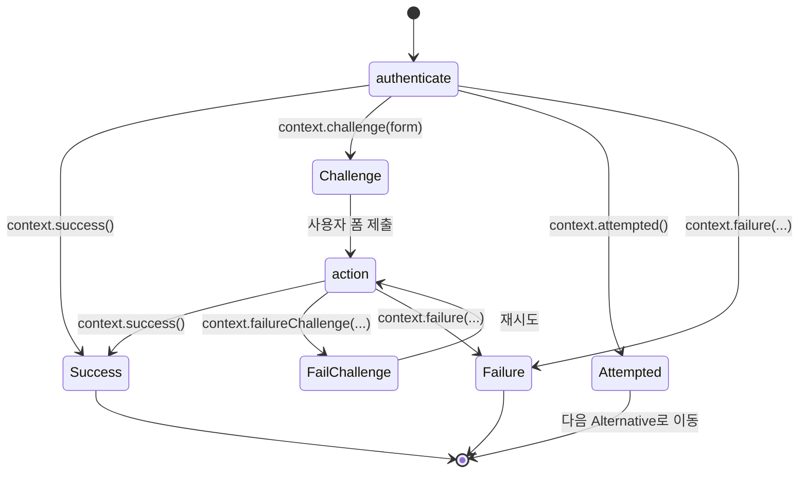
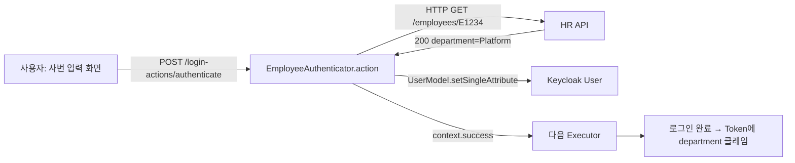

# 커스텀 Authenticator

::: info 학습 목표
- Authenticator와 AuthenticatorFactory 인터페이스의 구조와 책임을 이해한다.
- AuthenticationFlowContext의 success / failureChallenge / attempted 동작을 구분해 올바른 분기 시점을 고른다.
- FreeMarker 템플릿으로 사용자 폼을 렌더링하고 제출 값을 검증하는 방법을 익힌다.
- Authentication Flow에서 커스텀 단계를 Required/Alternative로 배치하는 전략을 설계할 수 있다.
:::

---

## 1. Authenticator와 AuthenticatorFactory

Keycloak의 로그인 플로우는 작은 단위의 <strong>Authenticator</strong>를 순서대로 실행하는 상태 기계다. 기본 제공되는 "Username Password Form", "OTP Form", "Cookie", "Identity Provider Redirector"가 모두 같은 SPI의 구현체다. 커스텀 단계를 추가한다는 것은 곧 Authenticator를 새로 구현한다는 뜻이다.

### 인터페이스 쌍

| 인터페이스 | 책임 |
|-----------|------|
| `AuthenticatorFactory` | Provider ID, 표시 이름, 구성 스키마, 실행 가능한 Requirement 옵션을 선언 |
| `Authenticator` | 실제 인증 로직. `authenticate()`(초기 진입)와 `action()`(폼 제출 후 처리)을 구현 |

Factory는 서버당 싱글톤이므로 외부 API 클라이언트·커넥션 풀·설정 캐시를 보관한다. Authenticator는 요청마다 새로 만들어져 Factory가 초기화해 둔 자원을 쓴다. [CH16](/study/keycloak/16-spi-overview)에서 정리한 Factory/Provider 관계가 그대로 적용된다.

### Requirement 옵션

Factory가 반환하는 `AuthenticationExecutionModel.Requirement[]`는 Admin Console에서 선택 가능한 배치 모드를 제한한다.

| Requirement | 의미 |
|------------|------|
| `REQUIRED` | 반드시 성공해야 함. 실패 시 로그인 전체 실패 |
| `ALTERNATIVE` | 같은 레벨의 다른 Alternative 중 하나만 성공하면 됨 |
| `DISABLED` | 건너뜀 |
| `CONDITIONAL` | 조건 분기 서브플로우 내에서만 사용 |

사번 검증은 "꼭 통과해야 하는 단계"라 `REQUIRED`만 의미 있다. 반면 Passkey와 OTP를 동시에 허용하는 2차 인증이라면 `ALTERNATIVE`가 필요하다.

---

## 2. AuthenticationFlowContext — 분기 시점

Authenticator의 모든 로직은 `AuthenticationFlowContext`를 통해 결과를 보고한다. 어떤 메서드를 호출하느냐에 따라 플로우 실행기가 다음 동작을 결정한다.



### 주요 메서드와 용도

| 메서드 | 의미 | 사용 시점 |
|--------|------|----------|
| `success()` | 이 단계 통과 → 다음 실행기로 | 정상 검증 완료 |
| `challenge(Response)` | 폼이나 리다이렉트 응답을 내려 사용자 입력 대기 | 초기 화면 렌더링 |
| `failureChallenge(error, Response)` | 실패 메시지와 함께 같은 폼 재노출 | 잘못된 사번 입력 등 재시도 허용 |
| `failure(AuthenticationFlowError)` | 치명 실패 → 로그인 종료 | 연속 실패 한도 초과 |
| `attempted()` | "시도했지만 내 책임은 아님" → 같은 레벨 다음 Alternative로 | 조건 미해당으로 패스 |
| `forceChallenge(Response)` | Required여도 재시도 불가능한 단일 Challenge | 약관 동의처럼 무조건 보여주는 화면 |

`attempted()`와 `failure()`의 차이가 초심자가 가장 자주 틀리는 부분이다. 사용자가 커스텀 인증 수단을 "선택하지 않은" 경우는 `attempted()`다. 시도했는데 "잘못된" 경우는 `failureChallenge()`나 `failure()`다.

---

## 3. 폼 렌더링 — FreeMarker 템플릿

사용자에게 입력을 받으려면 HTML 폼을 그려야 한다. Keycloak은 FreeMarker 기반 `LoginFormsProvider`를 제공한다.

### 기본 패턴

```java
@Override
public void authenticate(AuthenticationFlowContext context) {
    Response challenge = context.form()
        .setAttribute("employeeNumber", "")
        .createForm("employee-form.ftl");
    context.challenge(challenge);
}
```

`context.form()`은 `LoginFormsProvider`를 돌려준다. `setAttribute()`로 템플릿 변수를 넣고 `createForm("<파일명>.ftl")`로 렌더링 Response를 만든다. 템플릿은 JAR의 `theme-resources/templates/employee-form.ftl`에 둔다.

```ftl
<#-- employee-form.ftl -->
<#import "template.ftl" as layout>
<@layout.registrationLayout; section>
    <#if section = "header">
        사번을 입력해주세요
    <#elseif section = "form">
        <form action="${url.loginAction}" method="post">
            <label for="employeeNumber">사번</label>
            <input id="employeeNumber" name="employeeNumber"
                   value="${employeeNumber!''}" autofocus/>
            <button type="submit" name="submit">확인</button>
        </form>
    </#if>
</@layout.registrationLayout>
```

- `url.loginAction`은 Keycloak이 자동 주입하는 제출 URL이다. 이 URL로 POST를 보내면 플로우 실행기가 같은 Authenticator의 `action()`을 호출한다.
- `template.ftl`은 [CH19. Theme 커스터마이징](/study/keycloak/19-theme)에서 다룰 공통 레이아웃이다.

### 폼 제출 처리

```java
@Override
public void action(AuthenticationFlowContext context) {
    MultivaluedMap<String, String> form =
        context.getHttpRequest().getDecodedFormParameters();
    String employeeNumber = form.getFirst("employeeNumber");

    if (employeeNumber == null || employeeNumber.isBlank()) {
        Response challenge = context.form()
            .setError("missingEmployeeNumber")
            .createForm("employee-form.ftl");
        context.failureChallenge(AuthenticationFlowError.INVALID_CREDENTIALS, challenge);
        return;
    }

    // 검증 로직은 다음 절에서
}
```

### API 응답(폼 없이)

SPA나 모바일 앱을 위한 직접 API 통신용 Authenticator라면 템플릿 대신 JSON Response를 직접 만든다. `Response.ok().entity(...).type(APPLICATION_JSON).build()`로 구성하고 `context.challenge()`에 넘긴다. 이 경우 클라이언트가 "challenge 후 재호출" 규약을 알아야 하므로 주로 Direct Grant 확장에서 사용된다.

---

## 4. 구성 파라미터 — AuthenticatorConfig

Realm/Flow마다 다른 값을 쓰고 싶을 때가 있다. 예를 들어 "운영 Realm은 production API, QA Realm은 staging API"처럼 Factory 상수는 안 되고 Realm별 동적 구성이 필요하다. 이때 `AuthenticatorConfigModel`을 쓴다.

### Factory에서 스키마 선언

```java
@Override
public List<ProviderConfigProperty> getConfigProperties() {
    ProviderConfigProperty apiUrl = new ProviderConfigProperty();
    apiUrl.setName("apiUrl");
    apiUrl.setLabel("Employee API URL");
    apiUrl.setType(ProviderConfigProperty.STRING_TYPE);
    apiUrl.setHelpText("사번 검증 API 베이스 URL");
    apiUrl.setDefaultValue("https://hr.internal/api");

    ProviderConfigProperty timeout = new ProviderConfigProperty();
    timeout.setName("timeoutMs");
    timeout.setLabel("Timeout (ms)");
    timeout.setType(ProviderConfigProperty.STRING_TYPE);
    timeout.setDefaultValue("3000");

    return List.of(apiUrl, timeout);
}
```

### Authenticator에서 사용

```java
AuthenticatorConfigModel config = context.getAuthenticatorConfig();
Map<String, String> params = config != null ? config.getConfig() : Map.of();
String apiUrl = params.getOrDefault("apiUrl", "https://hr.internal/api");
int timeoutMs = Integer.parseInt(params.getOrDefault("timeoutMs", "3000"));
```

Admin Console에서는 Flow에 이 Authenticator를 추가한 뒤 설정 아이콘을 눌러 Realm/Flow별로 값을 지정한다.

---

## 5. Flow에 배치하기

[CH11. Authentication Flow](/study/keycloak/11-auth-flow)에서 다룬 Flow 구조에 새 Authenticator를 끼워 넣어야 실제로 동작한다.

### 배치 단계

1. Admin Console → Authentication → Flows
2. 기본 "browser" Flow는 수정 불가 → Duplicate로 "browser-with-employee" 생성
3. 복제된 Flow의 원하는 위치(예: Username Password Form 다음)에 Add step → Employee Number Authenticator 선택
4. Requirement를 `REQUIRED`로 설정
5. 상단 Action → Bind flow → Browser flow 지정

### 배치 패턴별 가이드

| 패턴 | 구성 | 적합한 상황 |
|------|------|-----------|
| 기본 로그인 후 사번 추가 검증 | Username Password (R) → Employee Check (R) → OTP (R) | 회사 전체 강제 적용 |
| 일부 사용자만 | Conditional 서브플로우 + User Attribute 조건 → Employee Check (R) | 사업부 단위 적용 |
| Passkey 또는 사번 | Alternative 서브플로우 { WebAuthn / Employee Check } | 선택형 2차 인증 |
| SSO 세션 유지 때 생략 | Cookie (A) / (Forms: UP + Employee Check) (A) | 재로그인 시 건너뛰기 |

### 디버깅 팁

Flow 실행이 꼬이면 `kc.sh start-dev --log-level=org.keycloak.authentication:debug`로 띄워 각 실행기의 결과를 로그로 확인한다. 실패 원인이 Challenge 응답인지 Factory 구성인지 한 번에 드러난다.

---

## 6. 예제 — 사번 검증 후 부서 조회

사내 HR API를 호출해 사번을 검증하고, 응답으로 받은 부서명을 User Attribute로 매핑하는 Authenticator 전체 코드를 정리한다.

### AuthenticatorFactory

```java
package com.example.keycloak.employee;

import org.keycloak.Config;
import org.keycloak.authentication.Authenticator;
import org.keycloak.authentication.AuthenticatorFactory;
import org.keycloak.models.AuthenticationExecutionModel.Requirement;
import org.keycloak.models.KeycloakSession;
import org.keycloak.models.KeycloakSessionFactory;
import org.keycloak.provider.ProviderConfigProperty;

import java.util.List;

public class EmployeeAuthenticatorFactory implements AuthenticatorFactory {

    public static final String PROVIDER_ID = "employee-authenticator";
    private EmployeeApiClient apiClient;

    @Override
    public String getId() { return PROVIDER_ID; }

    @Override
    public String getDisplayType() { return "Employee Number Validator"; }

    @Override
    public String getReferenceCategory() { return "employee"; }

    @Override
    public boolean isConfigurable() { return true; }

    @Override
    public Requirement[] getRequirementChoices() {
        return new Requirement[] { Requirement.REQUIRED, Requirement.DISABLED };
    }

    @Override
    public boolean isUserSetupAllowed() { return false; }

    @Override
    public String getHelpText() { return "사번을 입력받아 HR API로 검증한다."; }

    @Override
    public List<ProviderConfigProperty> getConfigProperties() {
        ProviderConfigProperty url = new ProviderConfigProperty(
            "apiUrl", "Employee API URL",
            "사번 검증 API 베이스 URL", ProviderConfigProperty.STRING_TYPE,
            "https://hr.internal/api");
        return List.of(url);
    }

    @Override
    public void init(Config.Scope config) {
        // Factory 단위 초기화: 공용 API 클라이언트를 만들어 둔다
        this.apiClient = new EmployeeApiClient();
    }

    @Override
    public void postInit(KeycloakSessionFactory factory) { /* no-op */ }

    @Override
    public Authenticator create(KeycloakSession session) {
        return new EmployeeAuthenticator(apiClient);
    }

    @Override
    public void close() {
        if (apiClient != null) apiClient.close();
    }
}
```

### Authenticator

```java
package com.example.keycloak.employee;

import jakarta.ws.rs.core.MultivaluedMap;
import jakarta.ws.rs.core.Response;
import org.keycloak.authentication.AuthenticationFlowContext;
import org.keycloak.authentication.AuthenticationFlowError;
import org.keycloak.authentication.Authenticator;
import org.keycloak.models.*;

public class EmployeeAuthenticator implements Authenticator {

    private final EmployeeApiClient apiClient;

    public EmployeeAuthenticator(EmployeeApiClient apiClient) {
        this.apiClient = apiClient;
    }

    @Override
    public void authenticate(AuthenticationFlowContext context) {
        Response challenge = context.form()
            .setAttribute("employeeNumber", "")
            .createForm("employee-form.ftl");
        context.challenge(challenge);
    }

    @Override
    public void action(AuthenticationFlowContext context) {
        MultivaluedMap<String, String> form =
            context.getHttpRequest().getDecodedFormParameters();
        String employeeNumber = form.getFirst("employeeNumber");

        if (employeeNumber == null || employeeNumber.isBlank()) {
            context.failureChallenge(
                AuthenticationFlowError.INVALID_CREDENTIALS,
                context.form()
                    .setError("missingEmployeeNumber")
                    .createForm("employee-form.ftl"));
            return;
        }

        AuthenticatorConfigModel config = context.getAuthenticatorConfig();
        String apiUrl = config.getConfig().get("apiUrl");

        EmployeeApiClient.Result result = apiClient.verify(apiUrl, employeeNumber);
        if (!result.valid()) {
            context.failureChallenge(
                AuthenticationFlowError.INVALID_CREDENTIALS,
                context.form()
                    .setError("invalidEmployeeNumber")
                    .createForm("employee-form.ftl"));
            return;
        }

        // 부서 정보를 User Attribute로 저장
        UserModel user = context.getUser();
        user.setSingleAttribute("employeeNumber", employeeNumber);
        user.setSingleAttribute("department", result.department());

        context.success();
    }

    @Override
    public boolean requiresUser() { return true; }

    @Override
    public boolean configuredFor(KeycloakSession session, RealmModel realm, UserModel user) {
        return true;
    }

    @Override
    public void setRequiredActions(KeycloakSession session, RealmModel realm, UserModel user) { }

    @Override
    public void close() { }
}
```

### EmployeeApiClient (요약)

```java
package com.example.keycloak.employee;

public class EmployeeApiClient {

    public record Result(boolean valid, String department) { }

    public Result verify(String baseUrl, String employeeNumber) {
        // OkHttp 등으로 GET {baseUrl}/employees/{employeeNumber}
        // 200 + JSON이면 Result(true, department) 반환, 404면 Result(false, null)
        return new Result(true, "Platform");
    }

    public void close() { /* 커넥션 풀 종료 */ }
}
```

### ServiceLoader 등록

`src/main/resources/META-INF/services/org.keycloak.authentication.AuthenticatorFactory`

```
com.example.keycloak.employee.EmployeeAuthenticatorFactory
```

### 배포 후 흐름



Token에 `department`를 내보내려면 ProtocolMapper에서 "User Attribute" 매퍼를 추가해 `department`를 Access Token과 ID Token에 포함하도록 설정한다.

---

::: tip 핵심 정리
- Authenticator는 AuthenticatorFactory(싱글톤)와 Authenticator(요청 스코프) 한 쌍으로 구현하며 Factory가 구성과 공용 자원을 책임진다.
- AuthenticationFlowContext는 success / challenge / failureChallenge / failure / attempted의 분기 시맨틱으로 플로우 다음 단계를 결정한다.
- FreeMarker 템플릿과 `context.form()`으로 사용자 폼을 렌더링하고, `action()`에서 제출 값을 검증해 재시도 또는 통과를 판단한다.
- Flow 배치는 [CH11](/study/keycloak/11-auth-flow)의 Required/Alternative 규칙을 따르며 Conditional 서브플로우로 조건부 적용이 가능하다.
:::

## 다음 챕터

- 이전 : [SPI로 Keycloak 확장](/study/keycloak/16-spi-overview)
- 다음 : [커스텀 User Storage](/study/keycloak/18-custom-user-storage)
