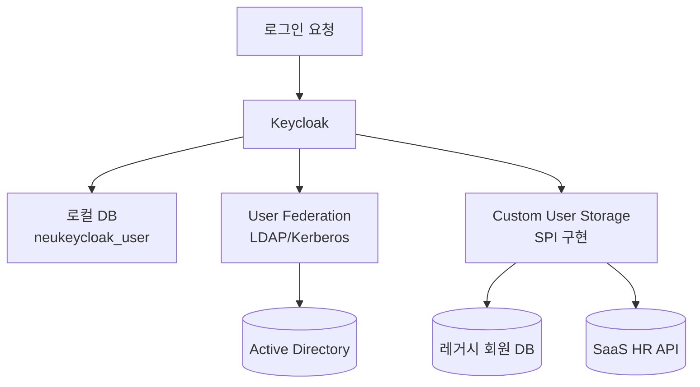
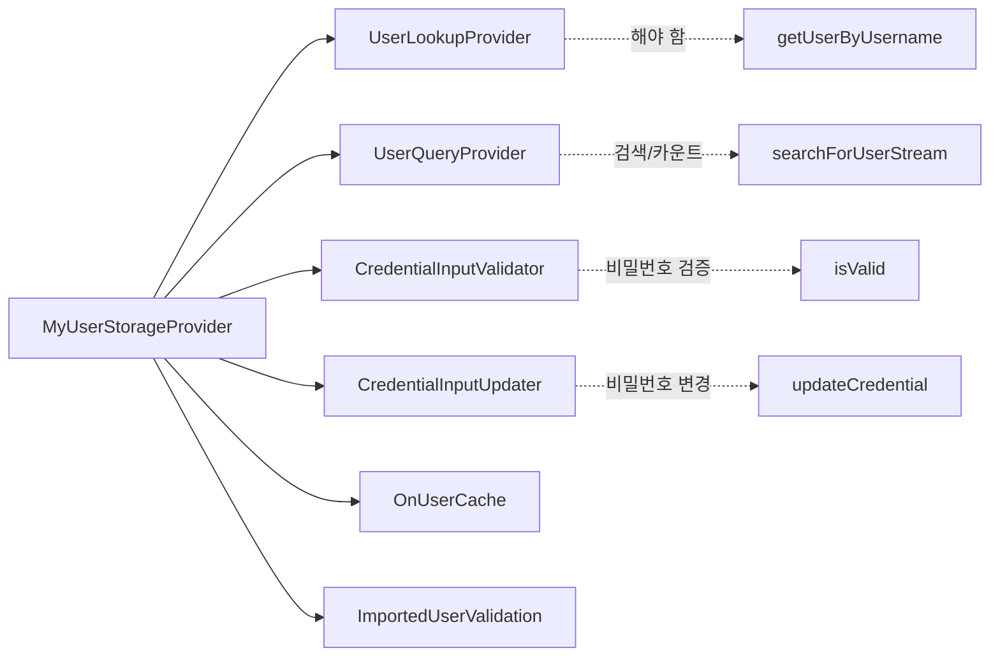
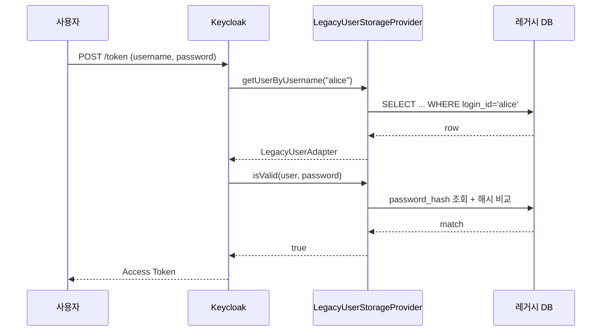
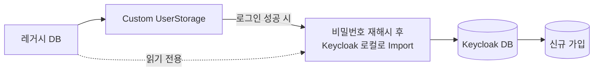

# 커스텀 User Storage

::: info 학습 목표
- User Federation(LDAP)으로 해결되지 않는 케이스를 파악하고 커스텀 User Storage를 선택하는 기준을 세운다.
- UserStorageProvider 생명주기와 Capability 인터페이스 패턴을 이해한다.
- 레거시 DB row를 UserModel 어댑터로 변환하고 Credential 검증을 위임하는 방법을 익힌다.
- Caching 정책(NO_CACHE/EVICT_DAILY/DEFAULT)과 운영 시 주의점을 구분할 수 있다.
:::

---

## 1. 왜 User Federation 대신 커스텀이 필요한가

[CH14. User Federation](/study/keycloak/14-user-federation)에서 다룬 LDAP/Kerberos는 잘 정의된 디렉토리 프로토콜이 있을 때의 표준 답이다. 그러나 현실에서는 다음과 같은 비표준 케이스가 흔하다.

| 상황 | User Federation이 안 되는 이유 |
|------|------------------------------|
| 레거시 회원 DB(MySQL/Oracle 테이블) | LDAP 스키마와 무관, 테이블 구조가 도메인별 |
| SaaS HR 시스템(REST API) | LDAP 미제공, OAuth 인증이 필요한 API |
| 커스텀 비밀번호 해시(PBKDF2 + 프로젝트별 salt 규칙) | 표준 LDAP 바인드가 이 규칙을 모른다 |
| 다중 출처(회원=DB, 직원=AD) 동시 운영 | 하나의 Realm에 두 저장소를 우선순위로 배치 |
| 점진 마이그레이션(신규 가입은 Keycloak, 기존은 DB) | "조회는 DB, 신규 쓰기는 Keycloak" 분기 필요 |

이때 UserStorage SPI를 직접 구현한다. 원리는 간단하다. Keycloak이 사용자를 찾거나 비밀번호를 검증할 때마다 등록된 UserStorageProvider에 위임한다. 내가 그 프로바이더가 되어 레거시 시스템을 호출하고 UserModel을 돌려주면 된다.

### Federation과의 포지셔닝



LDAP도 사실 내부적으로는 UserStorage SPI의 한 구현이다. 즉 커스텀 User Storage는 "내가 직접 구현한 Federation"이다.

---

## 2. UserStorageProviderFactory와 생명주기

핵심 인터페이스 쌍은 다음과 같다.

| 인터페이스 | 역할 |
|-----------|------|
| `UserStorageProviderFactory<T>` | Provider 생성, Realm 단위 구성 스키마 선언 |
| `UserStorageProvider` | 최소 Marker 인터페이스. 실제 기능은 Capability 인터페이스로 확장 |

```java
public interface UserStorageProviderFactory<T extends UserStorageProvider>
        extends ComponentFactory<T, UserStorageProvider> {
    T create(KeycloakSession session, ComponentModel model);
    // 구성 스키마 선언용 메서드들...
}
```

Factory는 [CH16](/study/keycloak/16-spi-overview)에서 설명한 대로 서버 기동 시 싱글톤으로 생성된다. Provider 인스턴스는 요청마다 `create()`로 새로 만들지만, `ComponentModel`에 담긴 Realm 설정(연결 문자열, 스키마명, 타임아웃 등)이 함께 주입된다.

### Provider Model과 Instance의 차이

- <strong>ComponentModel</strong>: Keycloak 자체 DB에 저장된 "이 Realm의 UserStorage 인스턴스 설정". Admin Console에서 User Federation → Add provider로 생성하면 ComponentModel이 한 row 기록된다.
- <strong>UserStorageProvider 인스턴스</strong>: 요청마다 생성되는 런타임 객체. ComponentModel을 읽어 커넥션을 맺고 조회를 수행한다.

### 초기화 시 유의점

레거시 DB와 대화할 DataSource는 요청마다 만들면 성능 재앙이다. Factory의 `init()`에서 HikariCP 같은 커넥션 풀을 Realm별로 캐시한 뒤, `create()`에서 꺼내 Provider에 주입하는 패턴이 일반적이다.

```java
private final Map<String, DataSource> poolByRealm = new ConcurrentHashMap<>();

@Override
public MyProvider create(KeycloakSession session, ComponentModel model) {
    DataSource ds = poolByRealm.computeIfAbsent(model.getId(),
        k -> buildDataSource(model));
    return new MyProvider(session, model, ds);
}
```

---

## 3. Capability 인터페이스 패턴

`UserStorageProvider`만 구현해서는 아무 일도 안 일어난다. Keycloak은 "조회 능력", "비밀번호 검증 능력" 같은 기능별로 <strong>Capability 인터페이스</strong>를 따로 두고, Provider가 어떤 인터페이스를 구현했는지에 따라 위임 여부를 결정한다.



### 주요 Capability

| 인터페이스 | 주요 메서드 | 필요 시점 |
|-----------|------------|----------|
| `UserLookupProvider` | `getUserByUsername`, `getUserByEmail`, `getUserById` | Keycloak이 username으로 사용자 찾을 때(필수) |
| `UserQueryProvider` | `searchForUserStream`, `getUsersCount` | Admin Console에서 "사용자 목록/검색" 지원 |
| `UserQueryProvider.UserQueryMethodsProvider` | 조건부 검색(이메일, 속성 등) | 고급 검색 UI |
| `CredentialInputValidator` | `supportsCredentialType`, `isValid` | 비밀번호/OTP 검증을 외부 소스에 위임 |
| `CredentialInputUpdater` | `updateCredential`, `disableCredentialType` | 사용자가 Keycloak에서 비밀번호 변경 허용 |
| `UserRegistrationProvider` | `addUser`, `removeUser` | Admin Console에서 생성/삭제를 외부 소스에 반영 |
| `OnUserCache` | `onCache` | 캐시 채우기 직전 커스텀 속성 세팅 |
| `ImportedUserValidation` | `validate` | 가져온 UserModel 유효성(삭제·비활성 반영) |

### Lookup vs Query

혼동하기 쉬운 구분이다.

- <strong>Lookup</strong>은 "정확히 이 username/email/id의 사용자가 있는가"를 묻는다. 로그인 플로우의 첫 단계에서 호출된다.
- <strong>Query</strong>는 "이 조건에 맞는 사용자 목록을 달라"는 요청이다. Admin Console 사용자 검색 화면이 호출한다.

외부 시스템이 대량 조회를 허용하지 않거나 부담이 크다면 Query는 구현하지 말고 Lookup만 제공해도 된다. Admin Console에서 목록은 비어 보이지만 로그인은 정상 동작한다.

---

## 4. UserModel 어댑터

외부 DB의 row를 Keycloak이 이해하는 `UserModel`로 바꾸는 어댑터가 필요하다. `AbstractUserAdapterFederatedStorage`를 상속하면 공통 로직을 그대로 쓸 수 있다.

### 어댑터 구현

```java
package com.example.keycloak.userstorage;

import org.keycloak.component.ComponentModel;
import org.keycloak.models.KeycloakSession;
import org.keycloak.models.RealmModel;
import org.keycloak.storage.adapter.AbstractUserAdapterFederatedStorage;

public class LegacyUserAdapter extends AbstractUserAdapterFederatedStorage {

    private final LegacyUser source;

    public LegacyUserAdapter(KeycloakSession session, RealmModel realm,
                             ComponentModel model, LegacyUser source) {
        super(session, realm, model);
        this.source = source;
    }

    @Override
    public String getUsername() { return source.loginId(); }

    @Override
    public void setUsername(String username) {
        // 레거시 ID는 읽기 전용. 변경 요청은 무시하거나 예외
        throw new UnsupportedOperationException("Username is read-only");
    }

    @Override
    public String getEmail() { return source.email(); }

    @Override
    public boolean isEnabled() { return source.status() == LegacyUser.Status.ACTIVE; }

    @Override
    public String getFirstName() { return source.firstName(); }

    @Override
    public String getLastName() { return source.lastName(); }
}
```

- `AbstractUserAdapterFederatedStorage`는 Role/Group 매핑, 속성 저장 같은 "Keycloak 쪽 정보"는 <strong>federated storage</strong>에 자동 저장한다. 즉 외부 DB에 Role 테이블이 없어도 Keycloak이 Role 매핑을 따로 보관해 준다.
- `storageId`는 부모 클래스가 `f:<providerId>:<externalId>` 형태로 자동 생성한다. 이 ID가 토큰의 `sub` 기초가 된다.

### Provider 구현 (Lookup + Credential)

```java
package com.example.keycloak.userstorage;

import org.keycloak.component.ComponentModel;
import org.keycloak.credential.CredentialInput;
import org.keycloak.credential.CredentialInputValidator;
import org.keycloak.models.*;
import org.keycloak.models.credential.PasswordCredentialModel;
import org.keycloak.storage.StorageId;
import org.keycloak.storage.UserStorageProvider;
import org.keycloak.storage.user.UserLookupProvider;

import javax.sql.DataSource;

public class LegacyUserStorageProvider implements
        UserStorageProvider,
        UserLookupProvider,
        CredentialInputValidator {

    private final KeycloakSession session;
    private final ComponentModel model;
    private final LegacyUserRepository repo;

    public LegacyUserStorageProvider(KeycloakSession session, ComponentModel model, DataSource ds) {
        this.session = session;
        this.model = model;
        this.repo = new LegacyUserRepository(ds);
    }

    @Override
    public UserModel getUserByUsername(RealmModel realm, String username) {
        return repo.findByLoginId(username)
            .map(u -> new LegacyUserAdapter(session, realm, model, u))
            .orElse(null);
    }

    @Override
    public UserModel getUserByEmail(RealmModel realm, String email) {
        return repo.findByEmail(email)
            .map(u -> new LegacyUserAdapter(session, realm, model, u))
            .orElse(null);
    }

    @Override
    public UserModel getUserById(RealmModel realm, String id) {
        String externalId = StorageId.externalId(id);
        return repo.findById(externalId)
            .map(u -> new LegacyUserAdapter(session, realm, model, u))
            .orElse(null);
    }

    // --- CredentialInputValidator ---

    @Override
    public boolean supportsCredentialType(String credentialType) {
        return PasswordCredentialModel.TYPE.equals(credentialType);
    }

    @Override
    public boolean isConfiguredFor(RealmModel realm, UserModel user, String credentialType) {
        return supportsCredentialType(credentialType);
    }

    @Override
    public boolean isValid(RealmModel realm, UserModel user, CredentialInput input) {
        if (!supportsCredentialType(input.getType())) return false;
        String loginId = user.getUsername();
        return repo.verifyPassword(loginId, input.getChallengeResponse());
    }

    @Override
    public void close() { /* 커넥션은 Factory 레벨 풀이라 여기서 close 안 함 */ }
}
```

### 로그인 시 Credential 검증 흐름



### Credential 업데이트

`CredentialInputUpdater`를 추가로 구현하면 Account Console에서 비밀번호 변경 요청을 레거시 DB에 반영할 수 있다. 마이그레이션 중 "기존 사용자도 Keycloak에서 비밀번호 바꾸면 레거시 규칙으로 해시 저장"하는 전략에 쓴다.

---

## 5. Caching 정책

외부 시스템을 매 요청마다 조회하면 레거시 DB/API가 죽는다. Keycloak은 UserModel을 Realm 단위로 캐싱하며 정책을 선택할 수 있다.

Admin Console의 User Federation → 내가 만든 Provider → Cache Policy 항목에서 지정한다.

| 정책 | 동작 | 적합 상황 |
|------|------|----------|
| `DEFAULT` | Realm 기본(보통 `EVICT_DAILY` 아님, 무기한 캐시 후 명시적 invalidate) | 변경이 드물 때 |
| `EVICT_DAILY` | 매일 지정 시각(HH/MM) 일괄 무효화 | 일 1회 HR 배치 뒤 반영 |
| `EVICT_WEEKLY` | 주간 요일·시각 | 주간 배치 |
| `MAX_LIFESPAN` | 단위 시간(ms) 경과 시 무효 | 실시간성 중요, TTL 관리 |
| `NO_CACHE` | 캐시 없음, 매번 조회 | 디버깅 또는 외부가 빠르고 변경이 잦을 때 |

### 언제 NO_CACHE를 쓰나

- 외부 시스템이 사용자 상태(enabled/disabled)를 실시간 반영해야 할 때 — 퇴사 즉시 차단 요구
- 개발 단계 디버깅 — 캐시 때문에 바뀐 로직이 반영되지 않아 헷갈릴 때
- 외부가 충분히 빠르고(1ms 급 로컬 DB) 트래픽이 낮을 때

### 선택적 무효화

`OnUserCache`를 구현하면 캐시에 들어가기 직전에 속성을 덧붙일 수 있다. 또 Admin REST API `POST /admin/realms/{realm}/user-storage/{id}/remove-imported-users`를 호출해 외부 삭제 사용자를 일괄 정리할 수도 있다.

---

## 6. 운영 팁

### Fallback 전략

외부 시스템 장애 시 Keycloak 전체 로그인이 막히는 사태를 피해야 한다.

| 전략 | 설명 |
|------|------|
| Timeout 짧게 | HTTP/JDBC 커넥션 타임아웃을 2~3초로 제한 |
| Circuit Breaker | Resilience4j로 연속 실패 시 차단, 로컬 캐시로 대체 |
| 관리자 계정은 로컬 | Realm 로컬 DB에 별도 어드민 계정 유지(복구용) |
| 읽기 전용 Fallback | 업데이트만 막고 캐시된 UserModel로 로그인 허용 |

### 쿼리 성능

UserQueryProvider를 구현할 때 Admin Console은 페이지당 100명 정도를 요청한다. 레거시 쿼리에 인덱스가 없으면 Admin 페이지 전체가 느려진다.

- `searchForUserStream`에서 `firstResult`, `maxResults` 파라미터를 꼭 SQL LIMIT/OFFSET으로 전달
- 백만 건 이상이면 `getUsersCount` 대신 상수 리턴으로 카운트 쿼리 우회 허용

### 이관 전략

레거시 → Keycloak 순차 이관은 다음 패턴이 일반적이다.



- <strong>Just-in-time 마이그레이션</strong>: 로그인 성공 시 해당 사용자를 Keycloak 로컬로 복사하고, 이후엔 Storage를 거치지 않게 한다. 몇 달이면 활성 사용자 대부분이 넘어온다.
- <strong>일괄 Import</strong>: Admin REST `/admin/realms/{realm}/partialImport`로 대량 삽입. 해시 알고리즘이 호환되면 비밀번호도 그대로 넣을 수 있다.

### 모니터링

- EventListener SPI로 `USER_STORAGE_FAILURE` 같은 이벤트를 추려 알람
- DataSource 레벨 JMX로 Hikari 풀 상태 추적
- `org.keycloak.storage` 로거를 DEBUG로 띄워 캐시 히트/미스 확인

---

::: tip 핵심 정리
- LDAP로 해결되지 않는 레거시 DB·SaaS·커스텀 해시 상황에서 UserStorage SPI로 직접 Federation을 구현한다.
- Provider는 Marker 인터페이스만 구현하고, 실제 기능은 UserLookupProvider/UserQueryProvider/CredentialInputValidator 같은 Capability 인터페이스로 조합한다.
- UserModel 어댑터(`AbstractUserAdapterFederatedStorage` 상속)로 외부 row를 Keycloak 모델로 변환하고 Role/Group은 federated storage에 위임한다.
- Caching 정책과 Fallback 전략(타임아웃·Circuit Breaker·관리자 로컬 계정)을 함께 설계해야 외부 장애가 IAM 전체로 번지지 않는다.
:::

## 다음 챕터

- 이전 : [커스텀 Authenticator](/study/keycloak/17-custom-authenticator)
- 다음 : [Theme 커스터마이징](/study/keycloak/19-theme)
