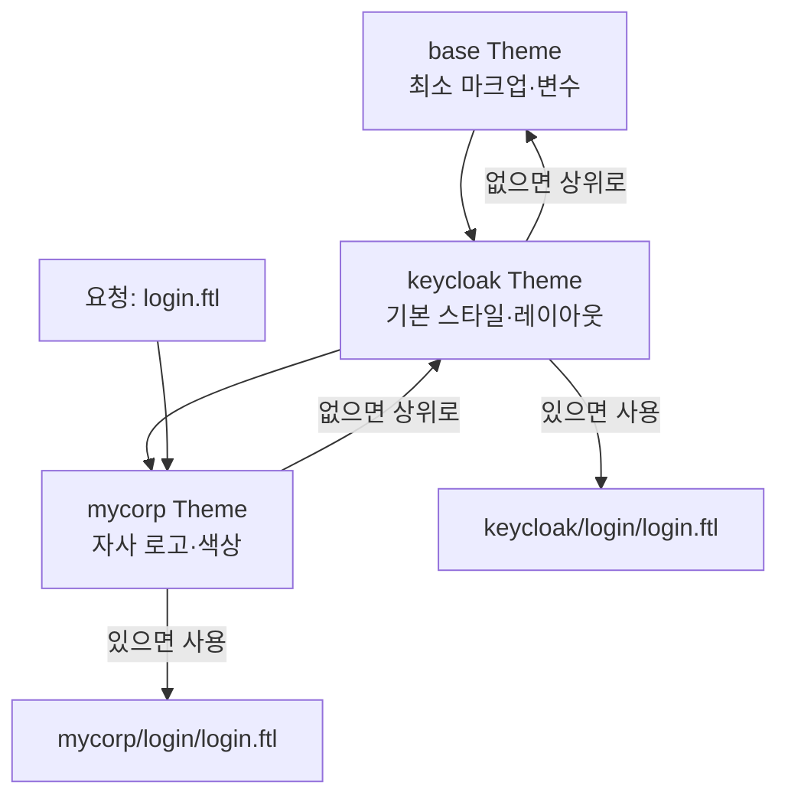
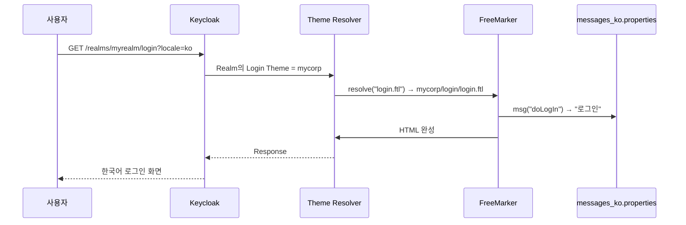

# Theme 커스터마이징

::: info 학습 목표
- Keycloak의 5가지 Theme 타입(Login/Account/Email/Welcome/Admin)과 각각의 사용처를 구분한다.
- themes/ 디렉토리의 파일 구조(theme.properties, templates/, resources/, messages/)를 이해한다.
- FreeMarker 기본 문법으로 템플릿을 오버라이드하고 상속 관계를 활용한다.
- messages 번들로 다국어를 지원하고 Locale Selector로 사용자가 언어를 전환하게 만든다.
:::

---

## 1. Theme 타입

Keycloak이 사용자에게 보여 주는 HTML·메일은 모두 Theme으로 추상화되어 있다. 브랜딩을 바꾸고 싶다면 Keycloak 코드를 건드릴 필요 없이 Theme만 갈아 끼우면 된다. Theme 타입은 5가지다.

| Theme 타입 | 대상 화면 | 오버라이드 빈도 |
|-----------|----------|----------------|
| `login` | 로그인·가입·비밀번호 재설정·IdP 선택·소셜 확인 | 매우 높음 |
| `account` | 사용자 본인 계정 관리 콘솔(프로필/Credentials/세션) | 높음 |
| `email` | 이메일 템플릿(확인 메일, 비밀번호 초기화, 이벤트 알림) | 중간 |
| `welcome` | `kc.sh` 첫 기동 시의 Welcome 페이지 | 낮음(거의 안 함) |
| `admin` | Admin Console 자체의 CSS/로고 | 낮음(구조적 제한 큼) |

Keycloak은 내장 Theme으로 `keycloak`(v2, 기본), `keycloak.v2`(Account v2 SPA), `base`(추상 부모)을 제공한다. 실무에서는 이들을 부모로 상속해 자사 Theme을 만든다.

### Account Console v2와 Theme

Keycloak 19부터 Account Console은 React 기반 SPA(`keycloak.v2`)가 기본이다. HTML 템플릿이 아니라 리소스 번들(CSS/JS/로고)만 교체하는 방식이라 FreeMarker 오버라이드는 주로 login/email 쪽에서 일어난다.

---

## 2. themes/ 디렉토리 구조

Theme은 `$KEYCLOAK_HOME/themes/<theme-name>/<theme-type>/` 경로에 배치한다. 컨테이너 환경이라면 이미지에 COPY하거나 SPI처럼 JAR로 패키징해 `providers/`에 둘 수도 있다.

```
themes/
└── mycorp/
    ├── login/
    │   ├── theme.properties
    │   ├── login.ftl
    │   ├── login-reset-password.ftl
    │   ├── template.ftl
    │   ├── messages/
    │   │   ├── messages_en.properties
    │   │   └── messages_ko.properties
    │   └── resources/
    │       ├── css/
    │       │   └── brand.css
    │       ├── img/
    │       │   └── logo.svg
    │       └── js/
    │           └── brand.js
    ├── account/
    │   ├── theme.properties
    │   └── resources/
    │       └── css/brand.css
    └── email/
        ├── theme.properties
        ├── html/
        │   └── password-reset.ftl
        ├── text/
        │   └── password-reset.ftl
        └── messages/
            └── messages_ko.properties
```

### theme.properties 주요 키

`theme.properties`는 해당 타입의 Theme 메타데이터를 선언한다. 가장 중요한 키는 다음과 같다.

```properties
# themes/mycorp/login/theme.properties
parent=keycloak
import=common/keycloak

# 정적 리소스 경로(템플릿에서 ${url.resourcesPath}로 참조)
styles=css/login.css css/brand.css
scripts=js/brand.js

# 국가 목록(프로필 드롭다운 등)
locales=en,ko,ja

# 기본 공통 속성
kcLoginClass=login-pf-page
```

- <strong>parent</strong>: 상속할 부모 Theme. 지정하지 않으면 최소한의 빈 Theme이라 거의 모든 템플릿이 깨진다.
- <strong>import</strong>: 다른 Theme의 리소스를 포함(공용 CSS 등).
- <strong>styles/scripts</strong>: 페이지에 자동 주입할 리소스 경로.
- <strong>locales</strong>: Realm의 Login 설정에서 이 Theme을 골랐을 때 지원할 언어 목록.

### Realm 적용

Admin Console → Realm Settings → Themes 탭에서 Login/Account/Email Theme을 Realm 단위로 지정한다. 지정 즉시 반영되며 캐시는 개발 중에는 `kc.sh start-dev` 또는 `spi-theme-default-cache-themes=false`로 꺼 둔다.

---

## 3. FreeMarker 기초

Keycloak Theme의 템플릿 엔진은 FreeMarker다. `.ftl` 확장자이며 문법이 단순하다.

### 변수 출력과 기본값

```ftl
${user.username}               <#-- 출력 -->
${user.email!''}               <#-- null이면 빈 문자열 -->
${msg("doLogIn")}              <#-- messages 번들에서 꺼내기 -->
${url.loginAction}             <#-- Keycloak이 제공하는 URL 객체 -->
```

### 제어 흐름

```ftl
<#if realm.password>
    <form action="${url.loginAction}" method="post">
        <!-- 비밀번호 로그인 폼 -->
    </form>
</#if>

<#list social.providers as p>
    <a href="${p.loginUrl}">${p.displayName}</a>
</#list>
```

### 매크로와 공통 레이아웃

Keycloak은 `template.ftl`에 `registrationLayout` 매크로를 정의해 두고 각 화면은 섹션만 채우는 구조다.

```ftl
<#-- login.ftl -->
<#import "template.ftl" as layout>
<@layout.registrationLayout; section>
    <#if section = "header">
        ${msg("loginTitle", realm.displayName)}
    <#elseif section = "form">
        <form id="kc-form-login" action="${url.loginAction}" method="post">
            <label for="username">${msg("usernameOrEmail")}</label>
            <input id="username" name="username" type="text" autofocus/>
            <label for="password">${msg("password")}</label>
            <input id="password" name="password" type="password"/>
            <button type="submit">${msg("doLogIn")}</button>
        </form>
    </#if>
</@layout.registrationLayout>
```

### 사용 가능한 모델 객체

Keycloak이 자동 주입하는 주요 객체들이다.

| 객체 | 설명 |
|------|------|
| `realm` | 현재 Realm(name, displayName, password, registrationAllowed 등) |
| `client` | 로그인 요청 Client(clientId, baseUrl, name) |
| `url` | 각종 액션 URL(`loginAction`, `loginResetCredentialsUrl`, `resourcesPath`) |
| `msg` / `rb` | messages 번들 접근 함수 |
| `social` | 등록된 IdP 목록(브로커 버튼 표시용) |
| `locale` | 현재 언어와 사용 가능한 언어 목록 |
| `auth` | 현재 AuthenticationFlowContext의 상태 |
| `user` | (화면에 따라) 현재 사용자 |

모델 구조는 Keycloak `LoginFormsProvider` 구현체를 보면 정확히 확인할 수 있다.

---

## 4. 부분 오버라이드 — 상속 활용

Theme을 처음부터 다 짜면 Keycloak 업그레이드마다 유지보수 지옥에 빠진다. 원칙은 <strong>"바꿀 파일만 덮어쓰기"</strong>다.

### 상속 메커니즘



Keycloak은 요청마다 템플릿·리소스·메시지를 "자식 → 부모" 순으로 탐색한다. 자식 Theme에 파일이 없으면 자동으로 부모 Theme 파일이 사용된다. 따라서 다음 두 전략이 가능하다.

- <strong>로고·색상만 바꾸기</strong>: `theme.properties`의 `parent=keycloak`만 지정하고 `resources/img/logo.svg` 와 `resources/css/brand.css`만 추가. 템플릿은 건드리지 않는다.
- <strong>특정 화면만 바꾸기</strong>: `login.ftl`만 자식에 복사해 폼 구조를 수정. 다른 화면(비밀번호 재설정 등)은 부모의 것을 그대로 씀.

### 파일 우선순위 확인

개발 중에는 Admin Console → Realm Settings → Themes에서 Theme을 바꿔 적용하고, Keycloak 기동을 `start-dev`로 하면 파일 변경 즉시 반영된다. 어떤 Theme의 어떤 파일이 쓰였는지 HTTP 응답 헤더나 소스보기로 CSS 경로(`resourcesPath`)를 확인하면 쉽게 추적된다.

### 리소스 파일만 교체하는 최소 예

```
themes/mycorp/login/
├── theme.properties
└── resources/
    ├── css/brand.css
    └── img/keycloak-bg.png
```

```properties
# theme.properties
parent=keycloak
styles=css/login.css css/brand.css
```

이것만으로 로그인 페이지 배경 이미지와 색상이 바뀐다. 템플릿을 복사하지 않았기 때문에 Keycloak 버전을 올려도 템플릿은 최신 것을 그대로 쓴다.

---

## 5. 다국어 지원

Keycloak은 표시 문구를 `messages_<locale>.properties` 번들로 관리한다. 한국어 사이트 운영이라면 반드시 직접 다듬어야 한다.

### 디렉토리

```
themes/mycorp/login/messages/
├── messages_en.properties
├── messages_ko.properties
└── messages_ja.properties
```

### 내용 예

```properties
# messages_ko.properties
loginTitle={0} 로그인
usernameOrEmail=아이디 또는 이메일
password=비밀번호
doLogIn=로그인
invalidUserMessage=아이디 또는 비밀번호가 올바르지 않습니다.
rememberMe=로그인 상태 유지
registerTitle=신규 가입
termsText=서비스 이용에 동의합니다.
```

Keycloak이 기본 제공하는 메시지 키는 수백 개다. 전부 덮어쓸 필요 없이 바꿀 문구만 자식 번들에 적으면 된다. 부모 번들에 있는 키는 그대로 상속된다.

### Locale Selector 활성화

Realm Settings → Localization → Internationalization Enabled를 켠 뒤 Supported Locales에 필요한 언어를 추가하면 로그인 화면 상단에 언어 드롭다운이 자동으로 나타난다. `theme.properties`의 `locales` 키와 Realm 설정이 교집합으로 동작한다.

### FreeMarker에서 번들 쓰기

```ftl
<h1>${msg("loginTitle", (realm.displayName)!"")}</h1>
<p>${msg("invalidUserMessage")}</p>
```

`msg()`는 위치 파라미터를 받아 `{0}`, `{1}`을 치환한다. 메시지에 파라미터가 있으면 `MessageFormat` 규칙이 적용되므로 `{`, `}` 이스케이프에 주의한다.

### 이메일 템플릿과 다국어

`email/messages/messages_ko.properties`에 이메일용 문구를 둔다. 이메일 템플릿은 `email/html/<이름>.ftl`과 `email/text/<이름>.ftl` 두 벌을 함께 둔다. HTML 메일 수신을 막은 클라이언트를 위해 텍스트 버전도 반드시 유지한다.



---

::: tip 핵심 정리
- Theme 타입은 Login/Account/Email/Welcome/Admin 다섯이며 실무 커스터마이징은 Login과 Email에 집중된다.
- theme.properties의 `parent` 선언이 상속 트리를 구성하고 자식 Theme은 "바꿀 파일만 덮어쓰기" 전략으로 업그레이드 비용을 낮춘다.
- FreeMarker 템플릿은 `registrationLayout` 매크로의 섹션을 채우는 구조이며 `realm`·`url`·`msg`·`social` 등 Keycloak이 자동 주입하는 모델을 쓴다.
- 다국어는 `messages_<locale>.properties` 번들과 Realm Localization 설정의 교집합으로 지원하고 이메일 Theme은 HTML/Text 두 벌을 함께 유지한다.
:::

## 다음 챕터

- 이전 : [커스텀 User Storage](/study/keycloak/18-custom-user-storage)
- 다음 : [HA 클러스터링](/study/keycloak/20-ha-clustering)
