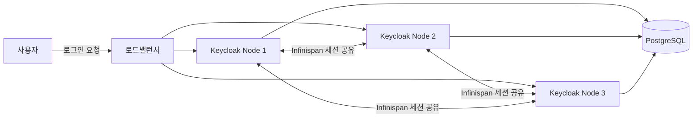
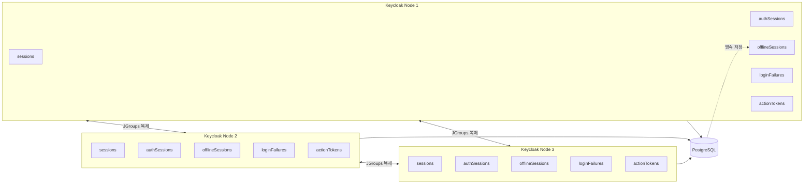
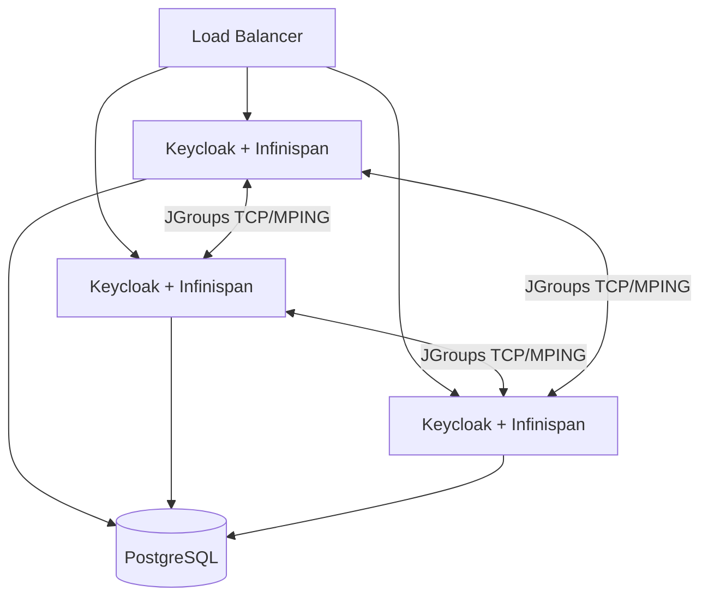
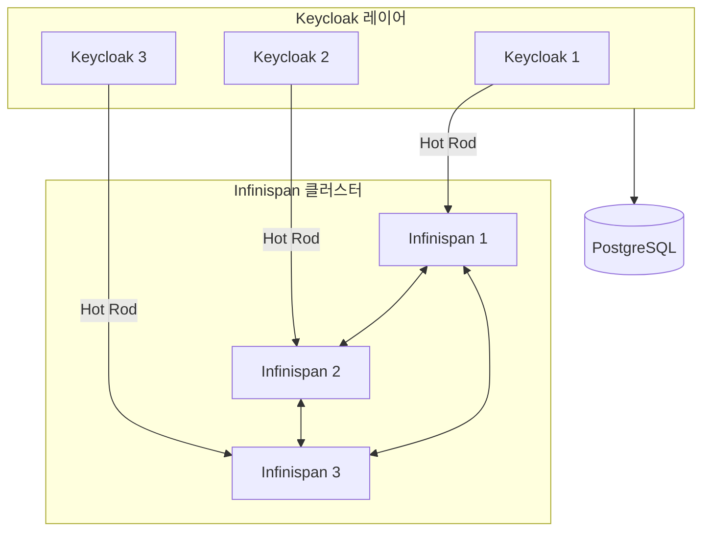
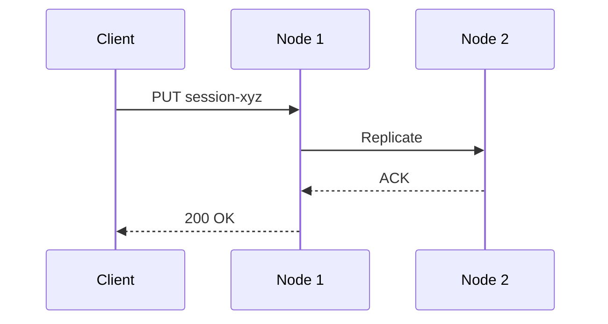
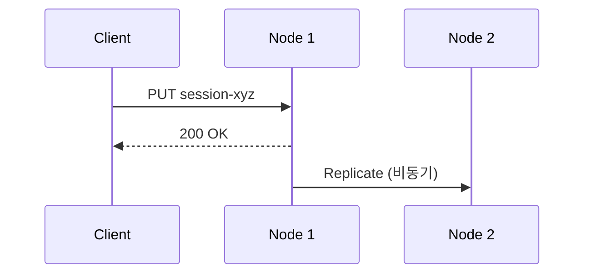
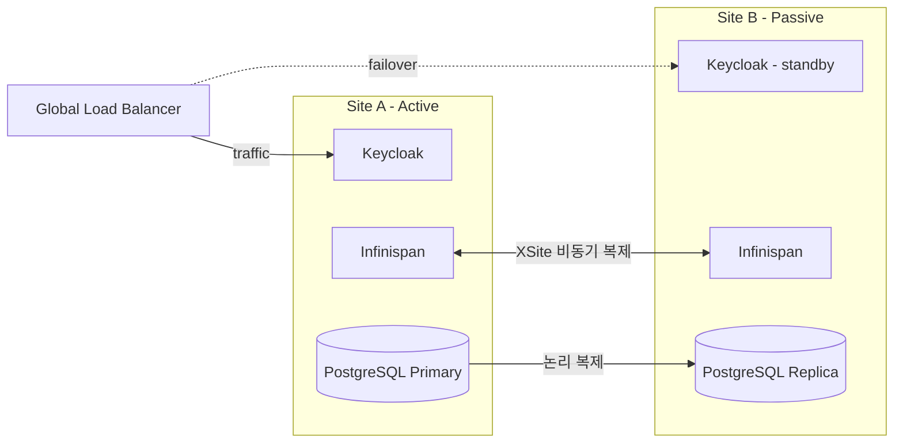
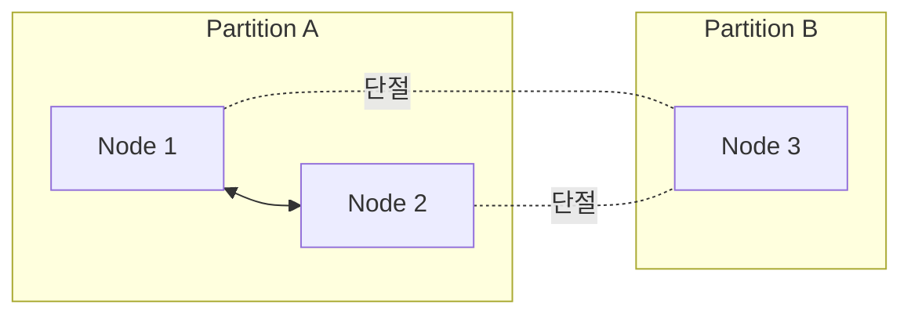

# Infinispan HA 클러스터링

::: info 학습 목표
- Infinispan이 무엇이고 Keycloak이 어디에 어떻게 쓰는지 설명할 수 있다.
- Keycloak이 관리하는 5가지 캐시(sessions, authenticationSessions, offlineSessions, loginFailures, actionTokens)를 구분할 수 있다.
- Embedded Infinispan과 External Infinispan의 차이를 이해하고, v26 이후 권장 구조를 설명할 수 있다.
- SYNC/ASYNC 동기화 모드 선택이 성능과 정합성에 미치는 영향을 판단할 수 있다.
- Multi-site(Active/Passive) 배포 구조와 XSite 복제 개념을 파악한다.
:::

---

## 1. Infinispan이란 무엇인가

<strong>Infinispan</strong>은 Red Hat이 개발·유지보수하는 오픈소스 <strong>인메모리 분산 데이터 그리드(In-Memory Data Grid)</strong>다. 가장 가까운 용도로 보면 "여러 JVM에 걸쳐 공유되는 분산 캐시"지만, 트랜잭션·이벤트 리스너·쿼리·영속화까지 지원해 단순 캐시 이상의 기능을 갖춘다. 대중적인 Redis·Memcached와 달리 Java 위에서 돌며, Keycloak처럼 JVM에 내장(Embedded)할 수도, 별도 서버로 분리(Remote/Server)할 수도 있다.

| 비교 대상 | 포지션 | 언어 | Keycloak과의 관계 |
|---------|------|------|--------|
| Infinispan | In-Memory Data Grid | Java | <strong>Keycloak 내장 기본</strong> |
| Hazelcast | In-Memory Data Grid | Java | 대안 (직접 지원은 아님) |
| Redis | In-Memory KV Store | C | Keycloak이 직접 사용하지 않음 |
| Ehcache | 단일 프로세스 캐시 | Java | 분산 시나리오에 부적합 |

### Keycloak이 Infinispan을 쓰는 이유

Keycloak은 로그인 세션·진행 중인 인증 상태·Brute Force 카운터 같은 자주 바뀌는 데이터를 DB에 매번 쓰지 않는다. 만약 모든 토큰 발급 요청마다 DB 왕복을 하면 발급 TPS가 금방 DB에 병목이 걸린다. Infinispan은 이 데이터를 <strong>메모리</strong>에 두고, 여러 Keycloak 노드가 <strong>같은 뷰</strong>를 공유하도록 한다.



로드밸런서가 어느 노드로 라우팅해도 같은 세션을 볼 수 있는 이유가 여기에 있다. 세션이 없다면 "로그인은 Node 1에서 했는데 다음 요청이 Node 2로 가서 다시 로그인을 요구받는" sticky-session 의존 구조가 된다.

### 단일 노드에서도 Infinispan이 쓰인다

Keycloak 노드가 1개뿐이어도 Infinispan은 항상 동작한다. 이 경우에는 "분산" 기능은 비활성이고 <strong>로컬 메모리 캐시</strong>로만 작동한다. 즉 Infinispan은 Keycloak의 선택적 부가 기능이 아니라 <strong>필수 내부 구성요소</strong>다. 클러스터를 구성할 때만 노드 간 복제(JGroups)가 추가로 켜진다.

### 언제 Infinispan을 의식해야 하는가

평소에는 Keycloak 운영자가 Infinispan 내부를 몰라도 된다. 하지만 다음 상황에서는 반드시 이해가 필요하다.

- <strong>클러스터 확장</strong> — 노드를 2개 이상으로 늘리면 JGroups 디스커버리·복제 모드·동기화 모드 결정이 필요하다.
- <strong>롤링 업그레이드</strong> — 메모리 전용 캐시가 어떤 캐시인지 모르면 재시작 중 전원 로그아웃이 발생할 수 있다.
- <strong>Multi-site 재해 복구</strong> — Site 간 복제(XSite) 설정에서 Infinispan 구조 이해가 전제된다.
- <strong>대규모 세션</strong> — 수백만 세션 환경에서 분산(distributed) 캐시의 `owners` 파라미터 선택이 메모리 비용에 직결된다.

이 챕터 이후부터는 Infinispan을 "Keycloak이 세션 공유에 쓰는 엔진"으로 전제하고 진행한다.

---

## 2. Keycloak 캐시 5종

Keycloak은 로그인 상태와 임시 데이터를 DB가 아닌 메모리(Infinispan)에 보관한다. 모든 토큰 발급 요청마다 DB를 치면 처리량이 금방 한계에 부딪히기 때문이다. 클러스터 구성을 이해하려면 먼저 "Keycloak이 어떤 캐시를 들고 있느냐"부터 정리해야 한다.

| 캐시 이름 | 용도 | 영속성 | TTL |
|----------|------|--------|-----|
| `sessions` | 로그인한 사용자 세션 (SSO 세션) | 메모리 전용 | SSO Session Idle/Max |
| `authenticationSessions` | 로그인 진행 중인 임시 상태 | 메모리 전용 | 5~30분 |
| `offlineSessions` | Refresh Token 기반 오프라인 세션 | DB + 메모리 | Offline Session Idle/Max |
| `loginFailures` | Brute Force 카운터 | 메모리 전용 | 실패 카운터 리셋 주기 |
| `actionTokens` | Email 검증·비밀번호 초기화 토큰 | 메모리 전용 | 토큰 만료 시간 |

핵심은 "오프라인 세션만 DB에 영구 저장된다"는 점이다. 나머지 네 캐시는 모두 메모리 전용이라, Keycloak 노드가 전부 재시작되면 전원 로그아웃된다. 운영 중에 "왜 롤링 업그레이드 한 번에 전체 로그아웃이 됐나" 같은 사고가 터지는 이유가 대부분 이 구분을 몰라서다.



### 분산(distributed) vs 복제(replicated)

Infinispan은 두 가지 캐시 모드를 지원한다.

- <strong>Distributed</strong>: 각 엔트리를 N개 노드에만 복제. 예를 들어 `owners=2`면 3개 노드 중 2곳만 특정 세션을 들고 있다. 메모리 효율이 높지만, 원래 노드가 전부 죽으면 그 세션은 사라진다.
- <strong>Replicated</strong>: 모든 노드가 같은 데이터를 복제. 조회가 항상 로컬에서 끝나지만, 쓰기가 전 노드로 전파되어 부하가 크다.

Keycloak 기본은 대부분 `owners=2`인 분산 캐시다. 세션 수가 수백만 단위로 커지는 환경에서 모든 노드가 전량 복제하면 메모리가 버티지 못한다.

---

## 3. Embedded Infinispan

v25까지(그리고 v26의 기본 설정에서도) Keycloak은 Infinispan을 JVM 내부에 품고 돈다. 이를 <strong>Embedded Infinispan</strong> 모드라고 한다. 별도의 Infinispan 서버를 띄우지 않고, Keycloak 프로세스끼리 JGroups로 직접 클러스터를 이룬다.

### 기동 구조



각 Keycloak 프로세스가 Infinispan을 동시에 호스팅한다. JVM 하나가 애플리케이션 서버와 분산 캐시를 같이 수행하는 구조다.

### JGroups 디스커버리

클러스터에 새 노드가 참여하려면 먼저 "이미 떠 있는 노드가 누구인지"를 찾아야 한다. 이 과정을 디스커버리(discovery)라고 하며, Keycloak은 JGroups의 여러 프로토콜 중 환경에 맞는 것을 고를 수 있다.

| 프로토콜 | 용도 | 전형적인 환경 |
|----------|------|--------------|
| `MPING` | IP 멀티캐스트 | 온프레미스 단일 네트워크 |
| `TCPPING` | 고정된 노드 목록 | 정적 클러스터 |
| `DNS_PING` | DNS SRV/A 레코드 조회 | Kubernetes (Headless Service) |
| `JDBC_PING` | 공유 DB 테이블에 멤버 기록 | 클라우드 |

Kubernetes에서는 `DNS_PING`이 사실상 표준이다. Headless Service가 Pod IP 목록을 DNS A 레코드로 뿌려 주면, JGroups가 그 리스트를 읽어 클러스터를 구성한다.

```conf
# cache-ispn.xml 스니펫 — DNS_PING 예시
<stack name="tcp-dns-ping">
    <TCP bind_addr="${jgroups.bind.address:SITE_LOCAL}" bind_port="${jgroups.bind.port:7800}"/>
    <dns.DNS_PING dns_query="keycloak-discovery.keycloak.svc.cluster.local"/>
    <MERGE3/>
    <FD_SOCK/>
    <FD_ALL/>
    <VERIFY_SUSPECT/>
    <pbcast.NAKACK2/>
    <UNICAST3/>
    <pbcast.STABLE/>
    <pbcast.GMS/>
    <MFC/>
    <FRAG3/>
</stack>
```

### Embedded 모드의 한계

Embedded는 설정이 단순하지만 두 가지 구조적 문제가 있다.

- <strong>스케일링 결합</strong>: Keycloak 인스턴스를 늘리면 Infinispan 노드도 같이 늘어난다. 세션 캐시만 키우고 싶을 때도 Keycloak 전체가 증설된다.
- <strong>롤링 업그레이드 위험</strong>: 모든 노드를 순차 재시작하면 캐시가 재분배되는 중에 부하가 몰린다. 메이저 업그레이드 때 캐시 프로토콜이 바뀌면 아예 호환성 문제가 터진다.

이 한계를 해결하려고 v26부터 External Infinispan을 권장하기 시작했다.

---

## 4. External Infinispan

<strong>External Infinispan</strong>(Infinispan Remote Store)은 Keycloak 외부에 전용 Infinispan 서버 클러스터를 두고, Keycloak은 Hot Rod 프로토콜로 그 서버를 원격 캐시로 사용하는 구조다. v26부터 Multi-site 공식 가이드가 이 구성을 전제로 작성된다.



### Embedded와 비교

| 항목 | Embedded | External |
|------|----------|----------|
| 배포 복잡도 | 낮음 (단일 컴포넌트) | 높음 (Infinispan 별도 운영) |
| 독립 스케일링 | 불가 | 가능 (Keycloak vs Infinispan 분리) |
| 롤링 업그레이드 | 캐시 재분배 발생 | Keycloak만 재기동, 캐시 그대로 |
| Multi-site | 제한적 | XSite 복제 공식 지원 |
| 추천 상황 | 소규모/단일 리전 | 대규모/Multi-site |

External 구성은 운영 컴포넌트가 하나 더 늘어나지만, 그 대가로 Keycloak을 무정지로 재기동할 수 있고 Multi-site 복제를 제대로 설계할 수 있다.

### Keycloak 측 설정

Keycloak이 외부 Infinispan을 원격 캐시로 쓰려면 `cache-remote-*` 옵션을 지정한다.

```conf
# keycloak.conf
cache=ispn
cache-remote-host=infinispan.keycloak.svc.cluster.local
cache-remote-port=11222
cache-remote-username=keycloak
cache-remote-password=<secret>
cache-remote-tls-enabled=true
```

v26의 "Persistent user sessions" 기능과 맞물리면 Keycloak 재기동 시에도 세션이 살아남는다. 이제 세션이 Infinispan 클러스터에 모여 있으므로, Keycloak Pod 하나가 죽어도 사용자는 재로그인할 필요가 없다.

---

## 5. 캐시 동기화 모드

Infinispan 캐시의 쓰기 전파 방식은 <strong>SYNC</strong>와 <strong>ASYNC</strong> 두 가지다. 선택에 따라 처리량과 정합성이 크게 달라진다.

### SYNC 모드



- 쓰기 요청이 다른 노드의 ACK를 받고 나서야 응답한다.
- 모든 노드가 같은 상태를 본다. Read-after-write 정합성 보장.
- 응답 지연이 노드 수에 비례해 늘어난다.

### ASYNC 모드



- 로컬에 쓰고 바로 응답. 복제는 뒤에서 진행.
- 응답이 빠르지만, 복제 전에 노드가 죽으면 데이터 유실 가능.
- 사용자가 Node 1에 로그인하고 다음 요청이 Node 2로 가면 "세션 없음" 에러가 날 수 있다.

### Keycloak 권장 설정

| 캐시 | 권장 모드 | 이유 |
|------|----------|------|
| `sessions` | SYNC | SSO 세션이 누락되면 곧바로 재로그인 |
| `authenticationSessions` | SYNC | 로그인 진행 중 상태가 사라지면 플로우 실패 |
| `offlineSessions` | SYNC | Refresh 토큰 일관성 필요 |
| `loginFailures` | ASYNC | 카운터 약간 부정확해도 무방 |
| `actionTokens` | SYNC | 한 번 쓰고 버리는 토큰, 정확도가 보안 |

로그인 실패 카운터만 ASYNC를 쓰면 약간의 성능 이득이 있지만, 대부분 실무에서는 전부 SYNC로 통일한다. Brute Force 카운터가 노드 간 불일치면 공격자가 노드를 바꿔가며 시도 횟수를 우회할 수 있기 때문이다.

---

## 6. Multi-site 배포

<strong>Multi-site</strong>는 지리적으로 떨어진 두 데이터센터에 Keycloak을 동시에 운영하는 구조다. 단일 DC 장애에도 서비스를 유지하려는 목적이 크다. Keycloak은 v26부터 공식 Multi-site 가이드를 제공하며, 권장 형태는 <strong>Active/Passive</strong>다.

### Active/Passive 구조



- Site A가 트래픽을 받고, Site B는 standby로 대기한다.
- Infinispan은 <strong>XSite Replication</strong>으로 세션을 비동기 복제한다.
- PostgreSQL은 별도의 스트리밍 복제로 DB 상태를 맞춘다.
- Site A 장애 시 Global LB가 Site B로 페일오버한다.

### 왜 Active/Active가 아닌가

Active/Active(양쪽 DC에서 동시에 트래픽을 받는 구조)는 이론적으로는 가능하지만, Keycloak 운영팀이 공식적으로 권장하지 않는다. 이유는 세 가지다.

- <strong>로그인 레이스 컨디션</strong>: 같은 사용자의 인증이 동시에 두 DC에서 시작되면 `authenticationSessions` 상태가 충돌한다.
- <strong>토큰 발급 중복</strong>: Client Credentials Grant가 두 사이트에서 동시에 들어오면 동일한 세션 ID가 생길 수 있다.
- <strong>Sticky 세션 요구</strong>: 한 사용자의 요청은 같은 사이트로 지속적으로 라우팅되어야 하는데, 이는 일반적인 Global LB로는 까다롭다.

대신 Keycloak v26의 XSite 비동기 복제는 RPO(Recovery Point Objective)가 수 초 단위로 좁아져서, Active/Passive도 실질적으로 "거의 무중단"에 가까운 가용성을 제공한다.

### RTO/RPO 목표

| 지표 | 단일 DC + HA | Multi-site Active/Passive |
|------|--------------|---------------------------|
| RTO (복구 시간) | 5~30분 (Pod 재기동) | 1~5분 (DNS 페일오버) |
| RPO (복구 시점) | 0 (같은 DB) | 수 초 (XSite 지연) |
| DC 전체 장애 대응 | 불가능 | 가능 |

---

## 7. 장애 시나리오

클러스터는 평소에는 순탄해도 네트워크 분할이나 DB 장애에서 예상치 못한 동작을 보인다. 대표 사례를 정리한다.

### Split-brain

<strong>Split-brain</strong>은 네트워크 분할로 노드 그룹이 서로를 못 보게 되는 상황이다. Node 1·2는 "Node 3이 죽었다"고 판단하고, Node 3은 "Node 1·2가 죽었다"고 판단한다. 각자 독립적으로 쓰기를 계속하면 데이터가 갈라진다.



Infinispan은 기본적으로 다수파(majority) 파티션만 쓰기를 허용한다. 3노드 중 2:1로 갈라지면 2 노드 쪽만 살아 있고 1 노드 쪽은 DENY_READ_WRITES 상태로 격리된다. 설정으로 이 동작을 바꿀 수 있지만 운영상 기본값이 안전하다.

```conf
# cache-ispn.xml
<distributed-cache name="sessions">
    <partition-handling when-split="DENY_READ_WRITES" merge-policy="PREFERRED_ALWAYS"/>
</distributed-cache>
```

### 노드 완전 소실

전체 Keycloak 노드가 동시에 재시작되면 Embedded 모드에서는 메모리 캐시 4종(sessions/authSessions/loginFailures/actionTokens)이 모두 날아간다.

- 영향: 전체 사용자 재로그인, 로그인 진행 중이던 플로우 실패, Brute Force 카운터 리셋.
- 완화: External Infinispan으로 캐시를 분리하면, Keycloak 전체 재기동에도 세션은 남는다.
- 완화: v26 Persistent user sessions로 DB에 세션을 영속화.

### DB 장애

PostgreSQL이 다운되면 토큰 발급은 멈추지만, 기존 세션 검증은 캐시에 있는 동안 계속 동작할 수 있다. 다만 `offlineSessions`처럼 DB와 싱크되는 캐시는 쓰기 실패로 에러를 던진다.

- 영향: 신규 로그인 차단, Refresh Token 저장 실패.
- 완화: PostgreSQL HA(Patroni, Crunchy) 구성, Connection Pool 재시도 설정.

### 운영 체크리스트

| 항목 | 확인 |
|------|------|
| `cache-remote-*` 설정이 환경변수로 주입되는가 | Secret/ConfigMap 활용 |
| JGroups 디스커버리가 DNS_PING인가 | K8s Headless Service 검증 |
| Partition handling 기본값(DENY_READ_WRITES) 유지 | Split-brain 시 데이터 안전 |
| `sessions`·`actionTokens` 모드가 SYNC인가 | Replicated/Distributed 모드 점검 |
| Multi-site XSite 복제 지연 모니터링 | Infinispan Prometheus 지표 |

---

::: tip 핵심 정리
- Keycloak은 5가지 캐시(sessions/authSessions/offlineSessions/loginFailures/actionTokens)를 Infinispan으로 관리하며, offlineSessions만 DB에 영속된다.
- Embedded는 구성 단순하지만 스케일링 결합 문제가 있다. v26+는 External Infinispan + Persistent sessions 조합을 권장한다.
- SYNC는 정합성, ASYNC는 성능. 대부분의 Keycloak 캐시는 SYNC가 안전한 기본이다.
- Multi-site는 Active/Passive + XSite 비동기 복제가 표준. Active/Active는 로그인 레이스 컨디션으로 권장되지 않는다.
- Split-brain에는 partition-handling DENY_READ_WRITES가 기본이고, 이는 데이터 무결성을 위해 유지한다.
:::

## 다음 챕터

클러스터 기본 구조를 이해했다면 이제 실제 배포 형태를 다룬다. [CH21. Kubernetes + Operator 배포](/study/keycloak/21-k8s-operator)에서 Keycloak Operator로 프로덕션급 Keycloak을 쿠버네티스에 올리는 방법과, Realm을 GitOps로 선언 관리하는 패턴을 살펴본다.

- 이전: [CH19. Theme 커스터마이징](/study/keycloak/19-theme)
- 다음: [CH21. Kubernetes + Operator 배포](/study/keycloak/21-k8s-operator)
