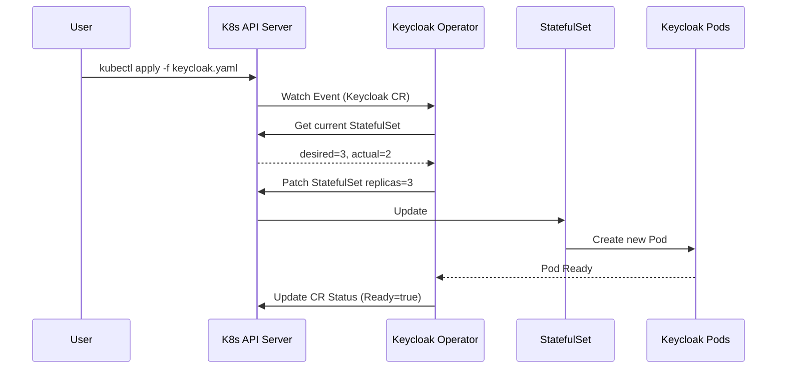
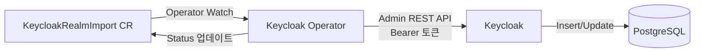
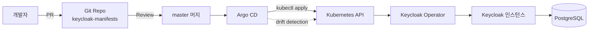

# Kubernetes + Operator 배포

::: info 학습 목표
- Keycloak Operator 설치(OLM vs Manifest)와 Operator 패턴을 이해한다.
- `Keycloak` CR의 주요 필드(instances, db, hostname, ingress)를 읽고 쓸 수 있다.
- `KeycloakRealmImport` CR로 Realm을 선언적으로 관리하는 방법을 익힌다.
- Argo CD/Flux 기반 GitOps에서 Realm 변경을 반영하는 전형적인 워크플로우를 설계한다.
:::

---

## 1. Operator 패턴과 Keycloak Operator

Keycloak을 쿠버네티스에 올리는 방법은 크게 세 가지다.

| 방식 | 배포 구성 | 운영 자동화 | 추천 |
|------|-----------|-------------|------|
| `kubectl apply -f` 직접 | Deployment + Service + Secret | 수동 | 학습용 |
| Helm Chart | values.yaml 템플릿화 | 반자동 | 소규모 |
| <strong>Keycloak Operator</strong> | `Keycloak` CR 선언 | 완전 자동(reconcile) | 프로덕션 |

[CH20. Infinispan HA 클러스터링](/study/keycloak/20-ha-clustering)에서 살펴본 클러스터 구성과 [CH2. 로컬 기동](/study/keycloak/02-quickstart)의 `kc.sh start` 옵션을 전부 자동으로 관리해 주는 것이 Operator다. Operator는 사용자가 선언한 원하는 상태(desired state)와 실제 상태(actual state)를 계속 비교하면서 차이를 메꾼다.

### Operator reconcile 루프



Operator는 이 루프를 초당 여러 번 돈다. 누군가 Pod를 수동으로 지워도, Operator가 다시 만든다. CR을 바꾸는 것만이 유일한 "상태 변경 경로"가 된다.

### 설치 방식

두 가지가 있다.

<strong>OLM(Operator Lifecycle Manager) 설치</strong>. OpenShift나 OperatorHub 환경에서 쓰는 방식. Subscription CR로 버전 업데이트까지 자동화된다.

```yaml
apiVersion: operators.coreos.com/v1alpha1
kind: Subscription
metadata:
  name: keycloak-operator
  namespace: keycloak
spec:
  channel: fast
  name: keycloak-operator
  source: community-operators
  sourceNamespace: olm
  installPlanApproval: Automatic
```

<strong>Manifest 설치</strong>. 순수 Kubernetes에서는 공식 배포 YAML을 직접 적용한다. 설치가 단순해서 대부분 이쪽을 쓴다.

```bash
KC_VERSION=26.0.0
kubectl create namespace keycloak
kubectl apply -n keycloak -f \
  https://raw.githubusercontent.com/keycloak/keycloak-k8s-resources/${KC_VERSION}/kubernetes/kubernetes.yml
```

설치하면 두 종류의 CRD가 등록된다.

- `keycloaks.k8s.keycloak.org` — Keycloak 인스턴스 자체
- `keycloakrealmimports.k8s.keycloak.org` — 선언적 Realm 관리

---

## 2. Keycloak Custom Resource

`Keycloak` CR은 Keycloak 배포의 모든 중요 파라미터를 담는다. 다음은 프로덕션 샘플이다.

```yaml
# keycloak.yaml
apiVersion: k8s.keycloak.org/v2alpha1
kind: Keycloak
metadata:
  name: keycloak-prod
  namespace: keycloak
spec:
  instances: 3
  hostname:
    hostname: auth.example.com
    strict: true
  http:
    tlsSecret: keycloak-tls
  db:
    vendor: postgres
    host: postgres.keycloak.svc.cluster.local
    port: 5432
    database: keycloak
    usernameSecret:
      name: keycloak-db-secret
      key: username
    passwordSecret:
      name: keycloak-db-secret
      key: password
    poolMinSize: 10
    poolInitialSize: 10
    poolMaxSize: 100
  ingress:
    enabled: true
    className: nginx
  resources:
    requests:
      cpu: "500m"
      memory: "1Gi"
    limits:
      cpu: "2000m"
      memory: "2Gi"
  additionalOptions:
    - name: log-level
      value: INFO
    - name: metrics-enabled
      value: "true"
    - name: health-enabled
      value: "true"
    - name: cache
      value: ispn
```

### 주요 필드 해설

| 필드 | 의미 | 비고 |
|------|------|------|
| `instances` | StatefulSet replica 수 | 최소 2, 권장 3 이상 |
| `hostname.hostname` | 외부 노출 도메인 | 토큰 `iss` 클레임 기반 |
| `hostname.strict` | Admin URL 강제 일치 | Host 헤더 스푸핑 방어 |
| `http.tlsSecret` | HTTPS 인증서 시크릿 | tls.crt/tls.key 포함 |
| `db.vendor` | 지원 DB 종류 | postgres/mysql/mariadb 등 |
| `db.poolMaxSize` | Agroal 커넥션 풀 상한 | [CH22](/study/keycloak/22-database-performance) 참조 |
| `ingress.enabled` | 기본 Ingress 생성 여부 | cert-manager와 조합 시 false 가능 |
| `additionalOptions` | `kc.sh start` 추가 플래그 | keycloak.conf 옵션을 그대로 매핑 |

`instances: 3`으로 지정하면 Operator가 [CH20](/study/keycloak/20-ha-clustering)에서 본 Infinispan 기반 클러스터를 자동으로 구성한다. Headless Service가 같이 생성되고, JGroups DNS_PING이 자동으로 설정된다.

### 상태 확인

```bash
kubectl get keycloak keycloak-prod -n keycloak
```

```
NAME            READY   STATUS
keycloak-prod   True    Running
```

`kubectl describe`로 `Status.Conditions`을 보면 "Has the deployment finished rolling out?" 수준의 세부 정보가 표시된다. Operator가 DB 접근 실패 같은 문제를 만나면 이 필드에 이유가 기록된다.

---

## 3. KeycloakRealmImport

Realm을 수동으로 Admin Console에서 만들면 환경이 늘어날수록 관리가 무너진다. Operator는 `KeycloakRealmImport` CR로 Realm을 선언적으로 생성·동기화한다.

```yaml
# keycloakrealmimport.yaml
apiVersion: k8s.keycloak.org/v2alpha1
kind: KeycloakRealmImport
metadata:
  name: realm-acme
  namespace: keycloak
spec:
  keycloakCRName: keycloak-prod
  realm:
    realm: acme
    enabled: true
    registrationAllowed: false
    loginWithEmailAllowed: true
    sslRequired: external
    accessTokenLifespan: 300
    ssoSessionIdleTimeout: 1800
    ssoSessionMaxLifespan: 36000
    clients:
      - clientId: web-app
        enabled: true
        publicClient: true
        redirectUris:
          - https://app.example.com/*
        webOrigins:
          - https://app.example.com
        attributes:
          pkce.code.challenge.method: S256
      - clientId: api-server
        enabled: true
        bearerOnly: true
    roles:
      realm:
        - name: user
        - name: admin
    groups:
      - name: /engineering
        subGroups:
          - name: /engineering/backend
          - name: /engineering/frontend
```

### 동작 방식



Operator는 Admin REST API([CH23](/study/keycloak/23-admin-rest-api) 참조)를 호출해 Realm을 생성한다. 내부적으로 `master` realm의 관리자 자격증명을 자동 생성 Secret에서 읽어 사용한다.

### 주의점

- <strong>부분 업데이트 아님</strong>: `KeycloakRealmImport`는 최초 생성과 덮어쓰기를 처리하지만, 기존 Realm의 사용자를 보존하면서 특정 필드만 바꾸는 용도로는 설계되지 않았다. 운영 중인 Realm의 설정 변경은 Admin REST API나 Terraform을 쓰는 게 안전하다.
- <strong>Secret 주의</strong>: Realm JSON에 Client Secret을 하드코딩하면 Git에 평문이 올라간다. External Secrets Operator나 SealedSecrets로 감싸야 한다.
- <strong>CR 상태</strong>: `.status.conditions`에 Import 결과가 기록된다. 실패 시 Operator 로그와 함께 확인한다.

---

## 4. Ingress와 TLS

Keycloak Operator는 기본 Ingress를 만들어 주지만, 프로덕션에서는 보통 `ingress.enabled: false`로 끄고 커스텀 Ingress를 직접 정의한다. 이유는 TLS 처리 방식 선택 때문이다.

### Passthrough vs Edge

| 모드 | TLS 종단 | Keycloak 포트 | 장단점 |
|------|---------|--------------|--------|
| <strong>Passthrough</strong> | Keycloak Pod가 TLS 종료 | 8443 (HTTPS) | 엔드투엔드 암호화, Ingress 헤더 제한적 |
| <strong>Edge (Re-encrypt)</strong> | Ingress에서 종료 후 재암호화 | 8443 (HTTPS) | 중간 헤더 제어 가능, 인증서 두 벌 필요 |
| <strong>Edge (HTTP)</strong> | Ingress에서 종료, 내부 HTTP | 8080 (HTTP) | 가장 단순, 내부망 신뢰 전제 |

Passthrough는 로드밸런서가 TLS 내용을 못 보기 때문에 세션 스티키니스를 쿠키 기반으로 할 수 없다. 대부분 운영은 Edge(HTTP) 또는 Edge(Re-encrypt)를 쓴다.

### cert-manager 통합

cert-manager와 조합하면 Let's Encrypt 인증서를 자동 발급·갱신할 수 있다.

```yaml
# certificate.yaml
apiVersion: cert-manager.io/v1
kind: Certificate
metadata:
  name: keycloak-tls
  namespace: keycloak
spec:
  secretName: keycloak-tls
  issuerRef:
    name: letsencrypt-prod
    kind: ClusterIssuer
  dnsNames:
    - auth.example.com
  duration: 2160h    # 90일
  renewBefore: 360h  # 15일 전 갱신
```

Keycloak CR의 `http.tlsSecret`가 이 Secret을 참조하도록 두면, Passthrough 구성에서 Pod가 직접 HTTPS를 서빙한다.

### 커스텀 Ingress 예시 (Edge + Re-encrypt)

```yaml
apiVersion: networking.k8s.io/v1
kind: Ingress
metadata:
  name: keycloak-ingress
  namespace: keycloak
  annotations:
    cert-manager.io/cluster-issuer: letsencrypt-prod
    nginx.ingress.kubernetes.io/backend-protocol: "HTTPS"
    nginx.ingress.kubernetes.io/proxy-buffer-size: "128k"
spec:
  ingressClassName: nginx
  tls:
    - hosts:
        - auth.example.com
      secretName: keycloak-ingress-tls
  rules:
    - host: auth.example.com
      http:
        paths:
          - path: /
            pathType: Prefix
            backend:
              service:
                name: keycloak-prod-service
                port:
                  number: 8443
```

`proxy-buffer-size`를 키우는 이유는 Keycloak 로그인 쿠키가 큰 경우(특히 JWT 기반 세션) 기본 4KB 버퍼를 초과하기 때문이다. 이 설정을 빼먹으면 로그인 중간에 502가 뜬다.

---

## 5. GitOps 워크플로우

Realm을 CR로 선언하면 Argo CD/Flux 같은 GitOps 도구가 전체 IAM 상태를 관리할 수 있다. [CH23. Admin REST API](/study/keycloak/23-admin-rest-api)에서 Terraform 접근법을 다루는데, Operator + GitOps는 그 첫 번째 대안이다.

### 전형적인 배포 파이프라인



- Realm 변경은 Git 리포지토리 PR로만 이뤄진다.
- Argo CD가 Git과 클러스터의 차이를 자동으로 감지하고 동기화한다.
- Admin Console에서 수동으로 바꾸면 Argo CD가 "OutOfSync"를 표시하고, `selfHeal` 옵션이 켜져 있으면 다시 원상복구한다.

### 디렉토리 구조 예시

```
keycloak-manifests/
├── base/
│   ├── kustomization.yaml
│   ├── keycloak.yaml
│   └── realm-acme.yaml
└── overlays/
    ├── staging/
    │   ├── kustomization.yaml
    │   └── patches.yaml
    └── prod/
        ├── kustomization.yaml
        └── patches.yaml
```

Kustomize overlay로 환경별 차이(인스턴스 수, 도메인, DB 주소)를 관리하면 Realm 정의는 그대로 공유할 수 있다.

### Argo CD Application 예시

```yaml
apiVersion: argoproj.io/v1alpha1
kind: Application
metadata:
  name: keycloak-prod
  namespace: argocd
spec:
  project: platform
  source:
    repoURL: https://github.com/example/keycloak-manifests
    targetRevision: main
    path: overlays/prod
  destination:
    server: https://kubernetes.default.svc
    namespace: keycloak
  syncPolicy:
    automated:
      prune: true
      selfHeal: true
    syncOptions:
      - CreateNamespace=true
```

`selfHeal: true`가 핵심이다. Admin Console에서 실수로 설정을 바꿔도 Git 상태로 자동 되돌린다. 반대로 말하면, <strong>Admin Console은 읽기 전용에 가까운 도구로 재정의된다</strong>. 설정 변경은 PR로.

---

## 6. 운영 주의사항

Operator가 많은 것을 자동으로 해 주지만, 몇 가지는 여전히 운영자의 판단이 필요하다.

### 롤링 업그레이드

`instances` 수를 늘리거나 이미지 태그를 바꾸면 Operator가 StatefulSet을 롤링 업데이트한다. 주의할 점은 메이저 버전 업그레이드에서 DB 마이그레이션이 동반된다는 것이다([CH25](/study/keycloak/25-monitoring-upgrade) 참조).

- 패치 버전 업그레이드: 롤링만으로 안전.
- 마이너 버전(25→26): 대부분 롤링 가능. Release Notes 확인 필수.
- 메이저 버전(19→26): DB 스키마 변경 가능. Pre-upgrade 백업 후 진행.

### PodDisruptionBudget

롤링 재시작이나 노드 드레인 중 Keycloak이 최소 n개는 살아 있어야 한다. PDB를 별도로 설정한다.

```yaml
apiVersion: policy/v1
kind: PodDisruptionBudget
metadata:
  name: keycloak-pdb
  namespace: keycloak
spec:
  minAvailable: 2
  selector:
    matchLabels:
      app: keycloak
```

`instances: 3`에서 `minAvailable: 2`면 언제나 두 개는 트래픽을 받는다.

### 리소스 튜닝 가이드

| 지표 | 관찰 포인트 | 조치 |
|------|------------|------|
| JVM Heap 사용률 | `container_memory_usage_bytes` | `-Xmx`를 Pod 메모리의 75%로 |
| Infinispan 캐시 엔트리 수 | `vendor_jgrp_total_cache_entries` | 많으면 External Infinispan으로 |
| HTTP Request Latency | `http_server_requests_seconds` | p95 > 500ms면 replicas 증설 |
| DB Pool Active | `agroal_active_count` | 상한 도달 시 `poolMaxSize` 증가 |

### HorizontalPodAutoscaler

Operator CR의 `instances` 필드는 수동 값이라 HPA가 직접 조작하지 못한다. 대신 CR의 `instances`를 그대로 두고, StatefulSet 별도에 HPA를 거는 패턴은 피한다(Operator가 되돌려 놓는다). 필요하면 `instances`를 GitOps 정책에 따라 조정한다.

### 관찰성 체크리스트

- `/metrics` Prometheus 엔드포인트([CH25](/study/keycloak/25-monitoring-upgrade))
- `/health/ready`, `/health/live`로 Liveness/Readiness Probe
- Infinispan XSite 복제 지연은 Grafana 대시보드에서 모니터링
- Operator 자체 로그(`kubectl logs -n keycloak deploy/keycloak-operator`)도 별도 수집

---

::: tip 핵심 정리
- Keycloak Operator는 `Keycloak` CR 하나로 HA 클러스터·DB 연결·Ingress를 선언적으로 관리한다.
- `KeycloakRealmImport`는 최초 생성·덮어쓰기에 강하다. 운영 중인 Realm의 부분 수정은 Terraform/Admin API가 더 적합하다.
- TLS는 Edge 또는 Passthrough 선택이고, 대부분 Edge + cert-manager 조합이 표준이다.
- GitOps + `selfHeal: true`로 Admin Console을 "읽기 전용"에 가깝게 재정의할 수 있다.
- PDB·리소스 한도·Probe·Metrics를 함께 설정해야 Operator의 자동화가 프로덕션 품질이 된다.
:::

## 다음 챕터

Operator와 GitOps로 배포 자체는 선언화됐다. 이제 Keycloak이 기대대로 돌려면 백엔드 DB가 병목이 되지 않아야 한다. [CH22. 데이터베이스와 성능](/study/keycloak/22-database-performance)에서 PostgreSQL 기준 Keycloak 스키마, Connection Pool 튜닝, 오프라인 세션 처리, 느린 쿼리 진단을 다룬다.

- 이전: [CH20. Infinispan HA 클러스터링](/study/keycloak/20-ha-clustering)
- 다음: [CH22. 데이터베이스와 성능](/study/keycloak/22-database-performance)
