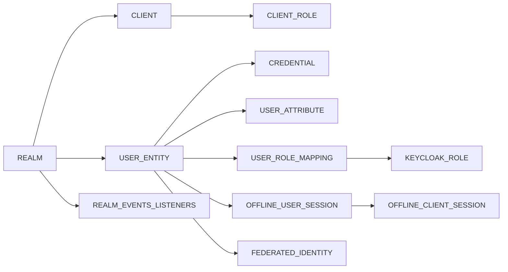
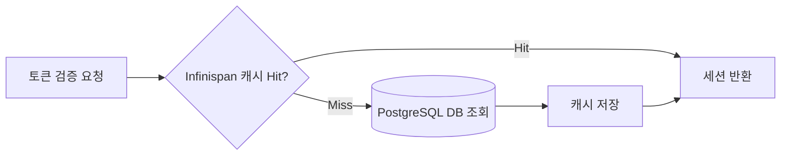
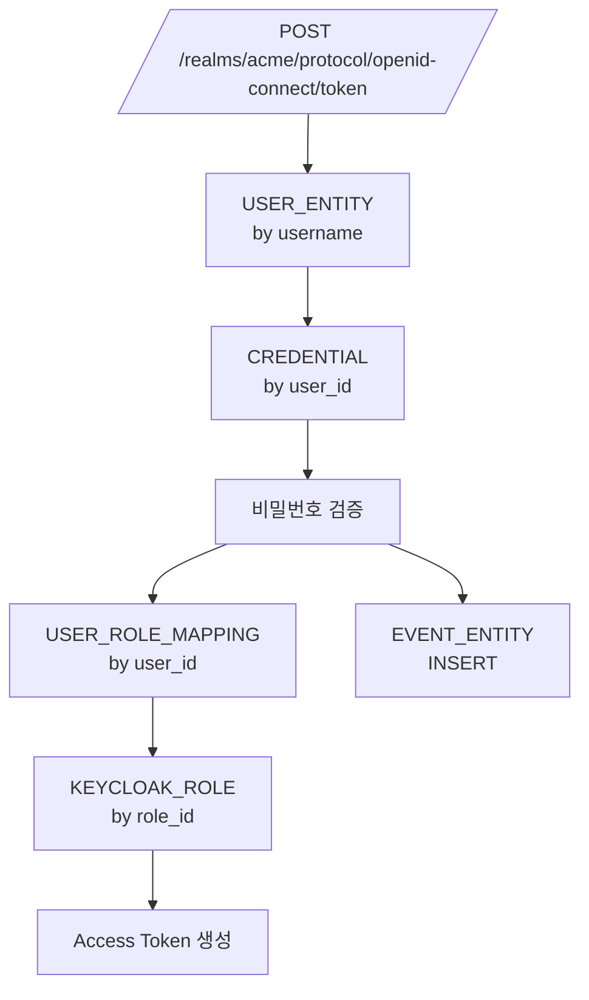

# 데이터베이스와 성능

::: info 학습 목표
- Keycloak이 쓰는 주요 테이블(USER_ENTITY, CLIENT, REALM, USER_ROLE_MAPPING, OFFLINE_USER_SESSION)의 역할을 파악한다.
- Agroal 기반 Connection Pool의 KC_DB_POOL_* 옵션과 병목 진단 방법을 익힌다.
- 오프라인 세션 저장 전략의 변화(v26 이전 preloading → 이후 축소)를 이해한다.
- `pg_stat_statements`와 Keycloak 로그로 느린 쿼리를 찾아내는 절차를 설명할 수 있다.
:::

---

## 1. 주요 테이블

Keycloak 스키마는 100개 가까운 테이블로 이뤄져 있지만, 운영에서 자주 마주치는 핵심은 10개 이하다. [데이터베이스 개념 챕터](/study/database/01-what-is-database)에서 다룬 "테이블·인덱스·외래 키" 개념이 그대로 적용된다.

### 핵심 테이블 지도



각 테이블의 실질적 용도.

| 테이블 | 역할 | 주요 컬럼 | 관련 챕터 |
|--------|------|----------|----------|
| `REALM` | Realm 메타데이터 | ID, NAME, ENABLED | [CH4](/study/keycloak/04-realm-organizations) |
| `CLIENT` | Client 정의 | ID, CLIENT_ID, REALM_ID | [CH5](/study/keycloak/05-client-service-account) |
| `USER_ENTITY` | 사용자 기본 정보 | ID, USERNAME, EMAIL, REALM_ID | [CH6](/study/keycloak/06-user-credentials) |
| `CREDENTIAL` | 비밀번호/OTP/WebAuthn | USER_ID, TYPE, CREDENTIAL_DATA | [CH6](/study/keycloak/06-user-credentials) |
| `USER_ROLE_MAPPING` | 사용자-역할 M:N | USER_ID, ROLE_ID | [CH7](/study/keycloak/07-role-group) |
| `USER_ATTRIBUTE` | 사용자 커스텀 속성 | USER_ID, NAME, VALUE | [CH6](/study/keycloak/06-user-credentials) |
| `KEYCLOAK_ROLE` | 역할(Realm/Client 공용) | ID, NAME, CLIENT_ROLE | [CH7](/study/keycloak/07-role-group) |
| `OFFLINE_USER_SESSION` | 오프라인 세션 저장 | USER_SESSION_ID, USER_ID, DATA | 본 챕터 §3 |
| `OFFLINE_CLIENT_SESSION` | 오프라인 Client 세션 | USER_SESSION_ID, CLIENT_ID | 본 챕터 §3 |
| `FEDERATED_IDENTITY` | 외부 IdP 매핑 | USER_ID, IDENTITY_PROVIDER | [CH15](/study/keycloak/15-identity-brokering) |

### 사용자 한 명이 퍼져 있는 모습

한 사용자를 수정하면 다음 테이블들이 동시에 읽히거나 쓰인다.

- `USER_ENTITY`: 기본 속성(이메일, 이름, 활성화 여부)
- `USER_ATTRIBUTE`: 부서·사번 같은 커스텀 속성
- `CREDENTIAL`: 비밀번호 해시·OTP 시크릿·WebAuthn Public Key
- `USER_ROLE_MAPPING`: 역할 매핑
- `USER_GROUP_MEMBERSHIP`: 그룹 소속
- `FEDERATED_IDENTITY`: Google/GitHub 같은 외부 IdP 연결
- `USER_SESSION` (메모리/Infinispan): 현재 로그인 세션 ([CH20](/study/keycloak/20-ha-clustering))

이 분산 저장 구조 때문에 "사용자 1명 삭제"가 의외로 복잡한 쿼리 묶음이 된다. Keycloak은 대부분을 FK `ON DELETE CASCADE`로 처리하지만, 일부는 애플리케이션 레이어에서 순차 삭제한다.

---

## 2. Connection Pool

Keycloak은 Quarkus의 <strong>Agroal</strong>을 커넥션 풀로 사용한다. DB 튜닝의 첫 단추가 바로 이 풀 크기다.

### 주요 옵션

| 옵션 | 기본값 | 의미 |
|------|--------|------|
| `db-pool-initial-size` | 1 | 기동 시 초기 생성 커넥션 수 |
| `db-pool-min-size` | 대체로 1 | 최소 유지 커넥션 수 |
| `db-pool-max-size` | 100 | 최대 커넥션 수 |

환경변수로는 `KC_DB_POOL_INITIAL_SIZE`, `KC_DB_POOL_MIN_SIZE`, `KC_DB_POOL_MAX_SIZE`다. Operator에서는 [CH21](/study/keycloak/21-k8s-operator)에서 본 `spec.db.poolMaxSize` 필드가 직접 매핑된다.

### 풀 크기 산정

풀이 너무 작으면 요청이 커넥션 대기로 쌓이고, 너무 크면 PostgreSQL 쪽이 커넥션 수로 포화된다.

- PostgreSQL 기본 `max_connections`는 100이다.
- Keycloak 인스턴스 3개 × `db-pool-max-size=100` = 300. 이미 DB 한도 초과.
- 실전 계산: `Keycloak Pod 수 × pool-max-size ≤ PostgreSQL max_connections × 0.8`
- 큰 환경에선 PgBouncer 같은 커넥션 풀러를 PostgreSQL 앞단에 두는 편이 안전하다.

### 커넥션 병목 진단

Agroal은 Prometheus 메트릭을 노출한다([CH25](/study/keycloak/25-monitoring-upgrade)).

```
agroal_active_count{datasource="default"}     # 사용 중
agroal_available_count{datasource="default"}  # 유휴
agroal_awaiting_count{datasource="default"}   # 대기 중 (요청이 큐에 쌓임)
agroal_max_used_count{datasource="default"}   # 역대 최대 동시 사용
```

`agroal_awaiting_count`가 0이 아니면 이미 풀이 부족하다는 신호다. `max_used_count`가 `max-size`에 닿아 있으면 상한을 키우거나 PgBouncer를 도입한다.

```conf
# keycloak.conf
db=postgres
db-url=jdbc:postgresql://pgbouncer.keycloak.svc.cluster.local:6432/keycloak
db-username=keycloak
db-password=${DB_PASSWORD}
db-pool-initial-size=10
db-pool-min-size=10
db-pool-max-size=30
```

`min-size`와 `initial-size`를 같이 잡아 두면 트래픽 스파이크에 커넥션 생성 지연을 줄일 수 있다.

---

## 3. 오프라인 세션 저장

[CH20](/study/keycloak/20-ha-clustering)에서 본 캐시 5종 중 유일하게 DB에 영속되는 것이 <strong>오프라인 세션</strong>이다. Refresh Token이 발급된 사용자 정보가 `OFFLINE_USER_SESSION`에 저장된다.

### 왜 오프라인 세션만 영속인가

| 항목 | 일반 세션 | 오프라인 세션 |
|------|----------|--------------|
| 발급 계기 | 일반 로그인 | `scope=offline_access` 요청 |
| 수명 | 기본 ~10시간 | 기본 30일, 무제한 설정 가능 |
| 종료 조건 | 아이들 타임아웃, 브라우저 닫기 | 명시적 Revoke 전까지 |
| 저장 위치 | Infinispan (메모리) | DB + 메모리 |

일반 세션은 Keycloak 재시작 때 날아가도 사용자 임팩트가 제한적(재로그인)이지만, 오프라인 토큰은 모바일 앱처럼 브라우저 없이 오래 쓰는 자격증명이라 영속이 필수다.

### v25 이전: Preloading의 함정

v25까지 Keycloak은 기동할 때 DB의 오프라인 세션을 메모리로 <strong>전부 로드</strong>하는 "preloading"을 기본 동작으로 가졌다. 오프라인 세션이 수백만 건 쌓인 환경에서는 기동에 10분 이상 걸리는 악명 높은 현상이 있었다.

```
[preloader] Loading offline sessions: 350000 / 8500000
```

옵션으로 끌 수 있었지만 default가 on이었다.

### v26 이후: Persistent Sessions

v26에서 "Persistent user sessions" 기능이 도입되면서 접근 방식이 바뀌었다.

- 오프라인/일반 세션을 <strong>모두 DB에 저장</strong>하되, 메모리 캐시는 "Hot" 데이터만 유지.
- 기동 시 preloading을 하지 않음. 세션 조회는 캐시 미스 시 DB에서 lazy load.
- 결과적으로 기동이 빨라지고, Keycloak Pod 재기동에도 세션 유지.



v26의 Persistent Sessions는 기본 활성화는 아니라 설정으로 켠다.

```conf
# keycloak.conf (v26+)
spi-user-sessions-infinispan-preloadOfflineSessions=false
feature=persistent-user-sessions
```

### 오프라인 세션 정리

오프라인 세션은 자동 정리되지 않는 경우가 있다. Revoke 요청이 들어왔거나, 세션 유효기간이 지나도 `OFFLINE_USER_SESSION` 행이 남아 있을 수 있다. 주기적인 모니터링이 필요하다.

```sql
-- 만료된 오프라인 세션 개수 확인
SELECT count(*) FROM offline_user_session
WHERE last_session_refresh < (extract(epoch from now()) - 30*24*3600) * 1000;
```

다량이 쌓였다면 Keycloak의 관리 작업(`kc.sh` 관리자 API) 또는 직접 SQL로 정리한다. 운영 정책에 따라 백업 후 삭제를 권장한다.

---

## 4. 인덱스 확인

Keycloak은 기본 인덱스를 비교적 잘 걸어 두지만, 몇몇 운영 시나리오에서는 부족하다. 특히 사용자 수가 수십만을 넘어가면 기본 인덱스만으론 검색이 느려진다.

### 주요 기본 인덱스

| 테이블 | 인덱스 | 용도 |
|--------|--------|------|
| `USER_ENTITY` | `IDX_USER_USERNAME`, `IDX_USER_EMAIL` | 로그인 식별자 조회 |
| `USER_ENTITY` | `(REALM_ID, USERNAME)` UNIQUE | Realm 내 사용자명 유일성 |
| `USER_ROLE_MAPPING` | `IDX_USER_ROLE` | 사용자→역할 조회 |
| `USER_ATTRIBUTE` | `IDX_USER_ATTRIBUTE` | 속성 기반 검색 |
| `OFFLINE_USER_SESSION` | PK + `IDX_OFFLINE_USS_BY_LAST_SESSION_REFRESH` | 만료 세션 정리 |

### 운영 중 자주 느려지는 쿼리

1. <strong>커스텀 속성 검색</strong>. `UserQueryProvider.searchByAttribute`는 `USER_ATTRIBUTE` 테이블을 full-scan하는 경우가 있다. 대규모 Realm에서는 `(NAME, VALUE, USER_ID)` 조합 인덱스를 고려.
2. <strong>그룹 멤버십 재귀 조회</strong>. `USER_GROUP_MEMBERSHIP`가 수백만 건이 되면 그룹→사용자 검색이 느려진다.
3. <strong>Event 테이블</strong>. `EVENT_ENTITY`, `ADMIN_EVENT_ENTITY`에 로그가 누적되면 로그인 자체가 느려진다. 보존 정책을 반드시 설정.

### 쿼리 경로 예시



토큰 한 번 발급에 최소 5~6개 테이블이 관여한다. 각 단계의 인덱스가 건강해야 전체 요청 응답시간이 유지된다.

---

## 5. 대규모 사용자 Realm 권고

Realm 사용자 수가 100만을 넘어가면 운영 상의 고려가 단계적으로 늘어난다.

### 스케일 단계별 권고

| 사용자 수 | 권고 |
|----------|------|
| ~1만 | 단일 DB, 기본 설정으로 충분 |
| 1만~10만 | Connection Pool 튜닝, Event 보존 정책 |
| 10만~100만 | PgBouncer 도입, `USER_ATTRIBUTE` 인덱스 확인 |
| 100만~ | DB 하드웨어 증설, v26 Persistent Sessions, 커스텀 UserStorage SPI 검토 |
| 1000만~ | 커스텀 UserStorage SPI로 외부 DB 연동([CH18](/study/keycloak/18-custom-user-storage)) |

### 100만 이상에서 생기는 문제

- <strong>Admin Console 사용자 목록 페이지가 느려진다</strong>. count 쿼리가 비싸진다. `--features=admin-search-api-v2`로 개선된 검색 API를 활성화하거나, count 비활성화 옵션을 검토.
- <strong>대량 사용자 Import가 느리다</strong>. Realm Import로 대량 사용자를 넣으면 한 번에 다 로드된다. 증분 방식으로 REST API 배치 호출이 안전([CH23](/study/keycloak/23-admin-rest-api)).
- <strong>그룹 기반 역할 조회가 무거워진다</strong>. Group을 권한 지급의 주 경로로 쓰면 USER_GROUP_MEMBERSHIP 조인이 자주 발생.

### Realm 분할 전략

단일 Realm에 전체 사용자를 넣지 말고, 조직/지역 기준으로 Realm을 나누는 편이 좋을 때도 있다. [CH4. Realm과 Organizations](/study/keycloak/04-realm-organizations)에서 다룬 멀티테넌시 모델을 참고한다.

- 지역별 Realm: eu, us, apac
- 사업부별 Realm: consumer, enterprise
- 환경별 Realm: dev, staging, prod (일반적)

단, Realm을 나누면 SSO 경계도 나뉜다는 점이 트레이드오프다.

---

## 6. 느린 쿼리 진단

Keycloak이 느려지면 원인이 Keycloak 자체일 수도, DB일 수도 있다. 진단 순서를 정리한다.

### PostgreSQL pg_stat_statements

PostgreSQL의 표준 진단 확장. `postgresql.conf`에 추가 후 재시작.

```conf
shared_preload_libraries = 'pg_stat_statements'
pg_stat_statements.track = all
```

```sql
CREATE EXTENSION IF NOT EXISTS pg_stat_statements;

-- 총 소요 시간 기준 Top 10
SELECT query, calls, total_exec_time, mean_exec_time, rows
FROM pg_stat_statements
ORDER BY total_exec_time DESC
LIMIT 10;
```

Keycloak이 발행하는 쿼리는 JPA/Hibernate 스타일이라 `SELECT user0_.id, user0_.email ...` 같은 모습으로 보인다. 이 중 `mean_exec_time`이 튀는 쿼리를 `EXPLAIN ANALYZE`로 확인한다.

### Keycloak 쿼리 로깅

개발/스테이징에서는 Hibernate SQL 로그를 활성화해서 어떤 쿼리가 나가는지 직접 본다.

```conf
# keycloak.conf (개발용)
log-level=INFO,org.hibernate.SQL:DEBUG,org.hibernate.orm.jdbc.bind:TRACE
```

프로덕션에서는 남발하면 로그 비용이 커지니 단시간만 켠다.

### Slow Query Log

PostgreSQL의 `log_min_duration_statement`를 100ms 수준으로 설정하면 느린 쿼리가 DB 로그에 남는다.

```conf
# postgresql.conf
log_min_duration_statement = 100  # 100ms 이상 로그
```

### 체크리스트

| 증상 | 의심 지점 | 확인 방법 |
|------|----------|----------|
| 토큰 발급이 일정하게 느리다 | 기본 인덱스 누락 | `EXPLAIN` on `USER_ENTITY` 조회 |
| 관리자 UI 사용자 목록이 느리다 | Count 쿼리 비용 | `--features=admin-search-api-v2` |
| 로그인이 간헐적으로 느리다 | Connection Pool 부족 | `agroal_awaiting_count` |
| 기동이 몇 분씩 걸린다 | 오프라인 세션 preloading | v26 Persistent Sessions로 전환 |
| Event 저장이 느리다 | `EVENT_ENTITY` 누적 | Event 보존 정책 + 파티셔닝 |

운영 원칙은 단순하다. Infinispan 메트릭(캐시 hit율) → Agroal 메트릭(풀 활용) → PostgreSQL 지표(느린 쿼리) 순서로 위에서 아래로 내려가며 병목을 찾는다.

---

::: tip 핵심 정리
- Keycloak의 핵심 10개 테이블만 알아도 대부분의 성능 이슈를 해석할 수 있다. 시작은 USER_ENTITY / CREDENTIAL / USER_ROLE_MAPPING.
- Agroal Connection Pool은 `Pod 수 × pool-max-size ≤ max_connections × 0.8` 규칙으로 산정. `awaiting_count`가 0이 아니면 즉시 조치.
- 오프라인 세션은 유일하게 DB 영속 캐시. v26 Persistent Sessions로 기동 preloading 문제를 해결할 수 있다.
- 100만 사용자 이상부터는 PgBouncer, 추가 인덱스, Event 보존 정책이 거의 필수다.
- 진단은 Infinispan → Agroal → PostgreSQL 순으로. `pg_stat_statements`는 Keycloak 운영 필수 확장.
:::

## 다음 챕터

DB와 캐시 튜닝으로 Keycloak을 견고하게 했다면, 이제 그 위에서 수행하는 운영 작업을 자동화할 차례다. [CH23. Admin REST API와 자동화](/study/keycloak/23-admin-rest-api)에서 Admin REST API, Service Account 인증, Terraform Provider로 IAM 상태를 선언적으로 관리하는 방법을 다룬다.

- 이전: [CH21. Kubernetes + Operator 배포](/study/keycloak/21-k8s-operator)
- 다음: [CH23. Admin REST API와 자동화](/study/keycloak/23-admin-rest-api)
