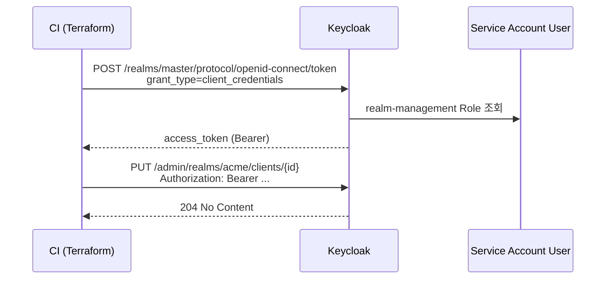
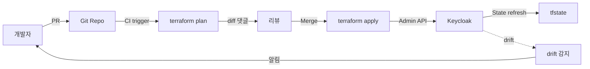

# Admin REST API와 자동화

::: info 학습 목표
- Admin REST API의 URL 구조와 Bearer 인증 방식을 이해한다.
- Service Account에 `realm-management` Role을 부여해 자동화 스크립트용 자격증명을 만들 수 있다.
- Realm/Client/User/Role/Group/Event/Session 주요 엔드포인트를 curl로 호출할 수 있다.
- Terraform `keycloak` Provider로 Realm·Client·Role을 선언적으로 관리하고 CI에서 검증하는 워크플로우를 설계한다.
:::

---

## 1. Admin REST API 개요

Keycloak의 Admin Console은 내부적으로 Admin REST API를 호출하는 얇은 SPA다. 즉, Console에서 할 수 있는 모든 작업은 API로도 가능하다. 이 원칙을 기억하면 자동화 포인트를 잡기 쉽다.

### URL 구조

```
https://auth.example.com/admin/realms/{realm-name}/{resource}
```

- 관리 대상 Realm이 경로에 들어간다. `master` realm 외에 `acme` realm을 관리하려면 `/admin/realms/acme/...`.
- 인증은 Bearer 토큰. Content-Type은 기본 `application/json`.
- Response는 JSON 배열 또는 객체. 일부(생성 API)는 `Location` 헤더로 생성된 리소스의 URL을 돌려준다.

### 참고 문서

- 공식 OpenAPI 스펙: Keycloak 소스 리포의 `services/src/main/java/org/keycloak/admin` 경로에서 자동 생성.
- Swagger UI 플러그인을 별도로 설치하거나, `keycloak-admin-client`(Java) 라이브러리의 인터페이스를 참고.
- `kcadm.sh`는 공식 CLI로, 내부적으로 같은 REST API를 호출한다.

### `kcadm.sh` 빠른 예시

```bash
# 로그인 (토큰 획득)
kcadm.sh config credentials \
  --server https://auth.example.com \
  --realm master \
  --user admin \
  --password <admin-password>

# Realm 목록
kcadm.sh get realms

# Client 생성
kcadm.sh create clients -r acme \
  -s clientId=new-api \
  -s enabled=true \
  -s bearerOnly=true
```

`kcadm.sh`는 탐색과 일회성 작업에 편하지만, 반복 자동화에는 토큰 발급 후 직접 REST 호출이 더 명시적이다.

---

## 2. Service Account 인증

사람 관리자 계정으로 자동화 스크립트를 돌리면 MFA·비밀번호 정책·휴면 정책에 자주 부딪힌다. 자동화 전용 자격증명은 <strong>Service Account + Client Credentials Grant</strong>로 만든다.

### 시나리오

CI에서 Terraform이 Realm 설정을 반영할 때, 사람 대신 `terraform-admin`이라는 Service Account Client가 토큰을 받아 사용한다.



### 설정 절차

1. `master` realm에 `terraform-admin` Client 생성.
2. Access Type: `confidential`. Client Authentication: `on`.
3. Service Account 활성화.
4. Service Account 탭에서 `realm-management` 중 필요한 Role만 부여.

관리하려는 Realm이 `acme`라면, 해당 Realm의 Client `realm-management`가 가진 Role을 Service Account에게 할당한다. 필요한 Role만 골라주는 것이 원칙이다.

| `realm-management` Role | 권한 |
|------------------------|------|
| `realm-admin` | 모든 관리 권한 (슈퍼 유저) |
| `manage-clients` | Client CRUD |
| `manage-users` | 사용자 CRUD |
| `manage-realm` | Realm 설정 수정 |
| `view-clients` | Client 읽기만 |
| `view-users` | 사용자 읽기만 |

Terraform으로 Realm 전체를 관리하면 `realm-admin`이 편하지만, 원칙상으로는 필요한 Role만 분리한다.

### 토큰 발급 예시

```bash
CLIENT_ID=terraform-admin
CLIENT_SECRET=<secret>

TOKEN=$(curl -s -X POST \
  "https://auth.example.com/realms/master/protocol/openid-connect/token" \
  -H "Content-Type: application/x-www-form-urlencoded" \
  -d "grant_type=client_credentials" \
  -d "client_id=${CLIENT_ID}" \
  -d "client_secret=${CLIENT_SECRET}" \
  | jq -r '.access_token')

echo "$TOKEN"
```

토큰 수명은 기본 5분이다. 스크립트가 오래 걸리면 중간에 재발급한다.

---

## 3. 주요 엔드포인트

운영·자동화에서 자주 쓰는 엔드포인트를 목적별로 정리한다. 모두 Base URL은 `/admin/realms/{realm}/...`로 시작한다.

### Realm

| 메서드 | 경로 | 설명 |
|--------|------|------|
| GET | `/admin/realms` | 전체 Realm 목록 |
| POST | `/admin/realms` | Realm 생성 (Body: Realm JSON) |
| GET | `/admin/realms/{realm}` | Realm 상세 |
| PUT | `/admin/realms/{realm}` | Realm 수정 |
| DELETE | `/admin/realms/{realm}` | Realm 삭제 |

### Client

| 메서드 | 경로 | 설명 |
|--------|------|------|
| GET | `/admin/realms/{realm}/clients` | Client 목록 |
| POST | `/admin/realms/{realm}/clients` | Client 생성 |
| GET | `/admin/realms/{realm}/clients/{id}` | Client 상세 (UUID 기준) |
| GET | `/admin/realms/{realm}/clients?clientId={clientId}` | clientId로 검색 |
| POST | `/admin/realms/{realm}/clients/{id}/client-secret` | Client Secret 재발급 |

### User

```bash
# 사용자 검색 (username 부분 일치)
curl -s -H "Authorization: Bearer ${TOKEN}" \
  "https://auth.example.com/admin/realms/acme/users?search=kim&max=20"

# 사용자 생성
curl -s -X POST \
  -H "Authorization: Bearer ${TOKEN}" \
  -H "Content-Type: application/json" \
  "https://auth.example.com/admin/realms/acme/users" \
  -d '{
    "username": "alice",
    "email": "alice@example.com",
    "emailVerified": true,
    "enabled": true,
    "credentials": [
      {"type": "password", "value": "Init1234!", "temporary": true}
    ]
  }'
```

### Role / Group

| 메서드 | 경로 | 설명 |
|--------|------|------|
| GET | `/admin/realms/{realm}/roles` | Realm Role 목록 |
| POST | `/admin/realms/{realm}/roles` | Realm Role 생성 |
| GET | `/admin/realms/{realm}/groups` | Group 트리 |
| POST | `/admin/realms/{realm}/users/{userId}/role-mappings/realm` | 사용자에게 Realm Role 부여 |

### Event / Session

| 메서드 | 경로 | 설명 |
|--------|------|------|
| GET | `/admin/realms/{realm}/events` | Login Event 조회 |
| GET | `/admin/realms/{realm}/admin-events` | Admin Event 조회 |
| GET | `/admin/realms/{realm}/clients/{id}/user-sessions` | Client별 세션 목록 |
| POST | `/admin/realms/{realm}/logout-all` | 전체 로그아웃 |
| DELETE | `/admin/realms/{realm}/sessions/{sessionId}` | 세션 강제 종료 |

Event는 [CH25. 모니터링·감사와 업그레이드](/study/keycloak/25-monitoring-upgrade)에서 자세히 다룬다.

---

## 4. 쿼리와 페이징

대규모 Realm에서는 사용자 목록 하나 가져오는 것도 조심해야 한다. 기본 페이징 파라미터를 반드시 쓴다.

### 표준 파라미터

| 파라미터 | 설명 | 기본 |
|----------|------|------|
| `first` | 시작 오프셋(0부터) | 0 |
| `max` | 최대 반환 수 | 100 |
| `search` | 부분 일치 검색(username/이메일) | 없음 |
| `briefRepresentation` | 간단한 표현만 반환 | false |

### 전체 사용자 페이징 스크립트

```bash
REALM=acme
FIRST=0
MAX=100

while : ; do
  COUNT=$(curl -s -H "Authorization: Bearer ${TOKEN}" \
    "https://auth.example.com/admin/realms/${REALM}/users?first=${FIRST}&max=${MAX}&briefRepresentation=true" \
    | jq 'length')
  if [ "$COUNT" -eq 0 ]; then
    break
  fi
  echo "offset=${FIRST} fetched=${COUNT}"
  FIRST=$((FIRST + MAX))
done
```

주의사항.

- `max`를 너무 크게(예: 10000) 잡으면 DB 쿼리가 무거워진다. 100~500이 현실적.
- `search`는 기본적으로 username prefix 매칭. 이메일·이름 검색이 필요하면 `email`, `firstName` 파라미터 사용.
- `exact=true`를 붙이면 정확 일치.
- count는 별도 엔드포인트(`/users/count`)로 호출([CH22](/study/keycloak/22-database-performance))에서 본 "count가 느려지는" 문제와 연결.

### Rate Limit

Keycloak 자체는 기본 Rate Limit이 없다. 대량 스크립트를 돌릴 때는 Ingress 쪽에 Rate Limit을 걸거나, 스크립트에서 동시성을 조절한다. 초당 수백 요청을 쏘면 Agroal 풀이 금방 고갈된다.

---

## 5. Terraform keycloak Provider

REST API 호출은 명령형이다. 선언적으로 상태를 관리하려면 <strong>Terraform keycloak Provider</strong>가 표준 선택지다. `mrparkers/keycloak` 커뮤니티 Provider가 사실상의 표준으로 자리잡았다.

### 기본 구성

```hcl
terraform {
  required_providers {
    keycloak = {
      source  = "mrparkers/keycloak"
      version = "~> 4.4"
    }
  }
}

provider "keycloak" {
  url           = "https://auth.example.com"
  realm         = "master"
  client_id     = "terraform-admin"
  client_secret = var.keycloak_client_secret
}
```

### Realm·Client·Role 선언

```hcl
resource "keycloak_realm" "acme" {
  realm                       = "acme"
  enabled                     = true
  display_name                = "Acme"
  registration_allowed        = false
  login_with_email_allowed    = true
  ssl_required                = "external"
  access_token_lifespan       = "5m"
  sso_session_idle_timeout    = "30m"
  sso_session_max_lifespan    = "10h"
}

resource "keycloak_openid_client" "web_app" {
  realm_id                     = keycloak_realm.acme.id
  client_id                    = "web-app"
  name                         = "Web App"
  enabled                      = true
  access_type                  = "PUBLIC"
  standard_flow_enabled        = true
  valid_redirect_uris          = ["https://app.example.com/*"]
  web_origins                  = ["https://app.example.com"]
  pkce_code_challenge_method   = "S256"
}

resource "keycloak_role" "admin" {
  realm_id = keycloak_realm.acme.id
  name     = "admin"
}

resource "keycloak_role" "user" {
  realm_id = keycloak_realm.acme.id
  name     = "user"
}
```

### 실행

```bash
terraform init
terraform plan -out=tfplan
terraform apply tfplan
```

`plan`에서 변경 내역이 명시적으로 보인다는 것이 큰 장점이다. Admin Console에서 누가 손댔는지도 diff로 드러난다.

### Operator + Terraform 역할 분리

[CH21](/study/keycloak/21-k8s-operator)에서 본 `KeycloakRealmImport`와 Terraform이 겹쳐 보일 수 있다. 실전에서는 보통 역할을 분리한다.

| 도구 | 적합한 범위 |
|------|------------|
| Keycloak Operator | Keycloak 인프라(인스턴스·DB·Ingress) + 초기 Realm 부트스트랩 |
| Terraform | Realm 내부 구조(Client, Role, Group, IdP, Mapper) 세밀 관리 |

둘을 같이 쓰는 구조가 가장 흔하다. Operator가 Realm을 "만들고", Terraform이 내부 객체를 "채워 넣는다".

---

## 6. 자동화 패턴

API와 Terraform을 어떻게 묶어 쓰느냐가 실제 운영 품질을 좌우한다.

### CI에서 Realm 설정 검증

PR이 올라올 때마다 Terraform plan을 돌려 변경 내용을 리뷰 댓글로 남긴다. 많은 팀이 이 패턴을 쓴다.

```yaml
# .github/workflows/keycloak-plan.yml
name: keycloak-plan
on:
  pull_request:
    paths:
      - 'keycloak-terraform/**'
jobs:
  plan:
    runs-on: ubuntu-latest
    steps:
      - uses: actions/checkout@v4
      - uses: hashicorp/setup-terraform@v3
      - name: Terraform Init
        working-directory: ./keycloak-terraform
        run: terraform init
      - name: Terraform Plan
        working-directory: ./keycloak-terraform
        env:
          TF_VAR_keycloak_client_secret: ${{ secrets.KC_TF_CLIENT_SECRET }}
        run: terraform plan -no-color
```

머지 시에는 별도 `apply` 워크플로우가 수동 승인(Environment protection rule)을 거쳐 실행된다.

### Terraform 워크플로우



### 주기적 Health Check

운영 스크립트에서 Keycloak이 정상인지 확인하는 체크리스트.

```bash
#!/bin/bash
BASE=https://auth.example.com

# 1. Liveness
curl -fsS "${BASE}/health/ready" > /dev/null || exit 1

# 2. 토큰 발급 가능 확인
TOKEN=$(curl -s -X POST "${BASE}/realms/master/protocol/openid-connect/token" \
  -d "grant_type=client_credentials" \
  -d "client_id=${CLIENT_ID}" \
  -d "client_secret=${CLIENT_SECRET}" | jq -r '.access_token')
[ -n "$TOKEN" ] || exit 1

# 3. 기준 Realm 존재 확인
curl -fsS -H "Authorization: Bearer ${TOKEN}" \
  "${BASE}/admin/realms/acme" > /dev/null || exit 1

echo "healthy"
```

### Realm 설정 드리프트 감지

관리자가 Admin Console에서 수동 변경하는 상황을 감지하려면.

- Terraform: `terraform plan`을 주기적(예: 매 시간)으로 실행해 변경이 있으면 알림.
- Argo CD: `selfHeal=false`로 두고 `OutOfSync` 상태를 경고.
- Admin Event: [CH25](/study/keycloak/25-monitoring-upgrade)의 Admin Events를 SIEM으로 전달해 누가·무엇을·언제 바꿨는지 추적.

### 실전 팁

- Terraform State 파일에 Client Secret이 평문 저장된다. Remote Backend(S3 + KMS 암호화, Terraform Cloud)를 반드시 사용.
- Service Account의 Client Secret은 Secret Manager(HashiCorp Vault, AWS Secrets Manager)에 보관.
- Admin API 호출 실패 시 401이 자주 나오면 Service Account Role 부여를 재확인.
- `keycloak_realm.acme`의 소규모 속성을 바꾸는 것만으로 많은 하위 리소스가 재생성되는 경우가 있다. Plan을 꼼꼼히 읽는다.

---

::: tip 핵심 정리
- Admin Console이 하는 모든 일은 Admin REST API로 가능하다. 자동화의 출발점은 이 사실을 인식하는 것.
- 자동화용 자격증명은 Service Account + Client Credentials Grant. `realm-management`에서 필요한 Role만 골라 부여한다.
- 대량 조회는 반드시 `first`/`max` 페이징을 사용. 100~500 단위가 실무 기본.
- Terraform keycloak Provider는 선언적 IAM 관리의 사실상 표준. Operator(인프라)와 Terraform(Realm 내부) 역할 분리가 일반적이다.
- CI plan → 리뷰 → 수동 승인 apply + 주기적 drift 감지 조합이 운영 체감 품질을 결정한다.
:::

## 다음 챕터

자동화로 Realm 상태를 일관되게 관리하는 방법을 배웠다. 이제 그 상태를 안전하게 백업·복구하는 영역으로 넘어간다. [CH24. Backup/Restore와 Realm 이관](/study/keycloak/24-backup-restore)에서 Realm JSON Export/Import와 DB 백업의 차이, 재해 복구 관점의 RTO/RPO 전략을 다룬다.

- 이전: [CH22. 데이터베이스와 성능](/study/keycloak/22-database-performance)
- 다음: [CH24. Backup/Restore와 Realm 이관](/study/keycloak/24-backup-restore)
