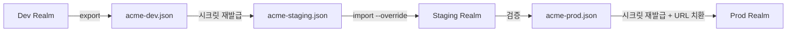
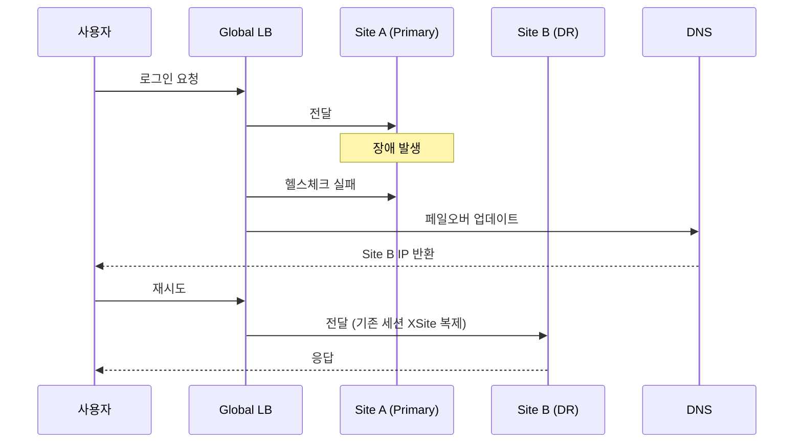
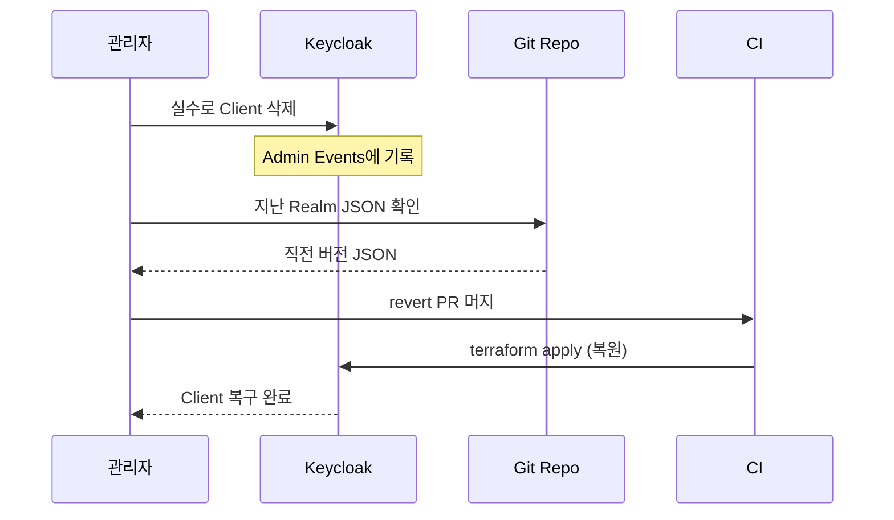

# Backup/Restore와 Realm 이관

::: info 학습 목표
- Keycloak 백업의 두 축(DB 덤프 vs Realm JSON)과 각각의 용도를 구분한다.
- `kc.sh export`와 `kc.sh import`로 Realm 설정을 파일로 주고받는 방법을 익힌다.
- Realm 이관 시나리오(dev → staging → prod)에서 시크릿·외부 URL 재주입 전략을 설계한다.
- RTO/RPO 관점에서 PITR·Multi-site·Realm Export를 조합해 재해 복구 계획을 세운다.
:::

---

## 1. 두 가지 백업 축

Keycloak을 백업할 때 사람들이 자주 헷갈리는 게 "백업하려는 게 뭐냐"다. Keycloak의 상태는 두 축으로 갈린다.

### DB 덤프 vs Realm JSON

| 축 | 대상 | 도구 | 복원 단위 |
|----|------|------|----------|
| <strong>DB 덤프</strong> | Keycloak 전체 상태(모든 Realm·사용자·자격증명·세션 포함) | `pg_dump`, `pg_basebackup` | 인스턴스 전체 |
| <strong>Realm JSON</strong> | 특정 Realm의 설정 + 선택적으로 사용자 | `kc.sh export` | Realm 단위 |

```mermaid
flowchart LR
    subgraph KC[Keycloak 런타임]
        RA[Realm acme]
        RM[Realm master]
        RB[Realm beta]
    end
    subgraph DB[PostgreSQL]
        DB1[(REALM)]
        DB2[(USER_ENTITY)]
        DB3[(CREDENTIAL)]
        DB4[(OFFLINE_USER_SESSION)]
    end
    KC --> DB
    DB -.pg_dump.-> Dump[(전체 DB 덤프)]
    RA -.kc.sh export.-> J1[acme-realm.json]
    RM -.kc.sh export.-> J2[master-realm.json]
```

### 각각의 용도

- DB 덤프는 <strong>재해 복구</strong>가 주 목적이다. "Keycloak이 죽었을 때 동일 상태로 복구"하는 용도. 사용자·자격증명·세션까지 전부 들어 있다.
- Realm JSON은 <strong>환경 간 이관</strong>에 쓴다. "dev에서 설계한 Realm을 staging에 반영"하거나, Realm 구조를 Git으로 버전 관리할 때 적합하다.

둘은 대체재가 아니라 보완재다. 프로덕션 백업 전략은 두 축을 모두 포함한다.

### 무엇이 어디에 저장되나

| 데이터 | DB | Realm JSON |
|--------|----|-----------|
| Realm 설정 | YES | YES |
| Client 정의 | YES | YES |
| Client Secret | YES | YES (경고: 평문) |
| Role/Group | YES | YES |
| 사용자 | YES | 선택적 |
| Credential(해시) | YES | 선택적 (`exportUsers=true`) |
| 세션 (메모리) | NO | NO |
| 오프라인 세션 | YES | NO |
| Event 로그 | YES | NO |

Realm JSON에는 세션·Event가 빠진다. 이건 Realm JSON의 한계이자 용도이기도 하다 — "설정은 재현 가능해야 하지만, 로그인 이력은 이관 대상이 아니다".

---

## 2. kc.sh export

Keycloak v17+(Quarkus)부터는 `kc.sh export` 명령으로 Realm을 파일로 내보낸다. 예전 `-Dkeycloak.migration.*` 시스템 프로퍼티 방식은 사라졌다.

### 기본 사용

Keycloak 컨테이너 내부에서 실행한다.

```bash
# 단일 파일로 내보내기 (Realm + 사용자 한 파일)
/opt/keycloak/bin/kc.sh export \
  --file /tmp/acme-realm.json \
  --realm acme \
  --users realm_file
```

- `--file`: 단일 JSON 파일에 모두 저장.
- `--realm`: 내보낼 Realm(지정하지 않으면 모든 Realm).
- `--users realm_file`: 사용자도 같은 Realm 파일에 포함.

### 대규모 사용자 — `--dir`

사용자가 수십만 이상이면 단일 파일이 기가 단위로 부풀어 오른다. `--dir` 옵션으로 여러 파일로 분할한다.

```bash
/opt/keycloak/bin/kc.sh export \
  --dir /tmp/export-acme \
  --realm acme \
  --users different_files \
  --users-per-file 5000
```

```
export-acme/
├── acme-realm.json
├── acme-users-0.json
├── acme-users-1.json
└── acme-users-2.json
```

사용자 파일이 5000명 단위로 쪼개져서 저장된다. 운영 중인 Keycloak에 import할 때도 같은 형식을 유지한다.

### `--users` 옵션 값

| 값 | 의미 |
|----|------|
| `skip` | 사용자 제외 (기본값) |
| `realm_file` | Realm 파일에 포함 |
| `same_file` | 사용자만 별도 파일 하나로 |
| `different_files` | 청크로 쪼갠 여러 파일 |

### 기동 모드 vs 전용 모드

예전에는 Keycloak을 먼저 멈추고 export하거나, 기동 중에 특정 옵션으로 export해야 했다. v26에서는 운영 중인 인스턴스에서 <strong>같이 실행 가능한 분리 모드</strong>가 됐다. 단, 성능 영향이 있으니 피크 타임은 피한다.

Operator 환경에서는 Admin REST API([CH23](/study/keycloak/23-admin-rest-api))의 Partial Export 엔드포인트로 Realm 상태를 JSON으로 받을 수도 있다.

```bash
curl -s -X POST \
  -H "Authorization: Bearer ${TOKEN}" \
  -H "Content-Type: application/json" \
  "https://auth.example.com/admin/realms/acme/partial-export?exportClients=true&exportGroupsAndRoles=true" \
  > acme-partial.json
```

Partial Export는 기본적으로 사용자를 포함하지 않는다. 사용자를 내보내려면 `kc.sh export`를 쓴다.

---

## 3. kc.sh import

Import는 두 가지 방식이 있다.

### 기동 시 import

`kc.sh start` 시 특정 디렉토리를 자동으로 import한다. 주로 초기 부트스트랩용.

```bash
/opt/keycloak/bin/kc.sh start \
  --import-realm \
  --file /opt/keycloak/data/import/acme-realm.json
```

동일한 Realm이 이미 있으면 기본은 <strong>건너뜀</strong>이다. 의도적인 덮어쓰기는 별도 옵션이 필요하다.

### 명시적 import 명령

```bash
/opt/keycloak/bin/kc.sh import \
  --file /tmp/acme-realm.json \
  --override false
```

- `--override false`(기본): 기존 Realm이 있으면 건너뛴다.
- `--override true`: 기존 Realm을 덮어쓴다(주의: 사용자 포함 덮어쓰기).

### Operator의 KeycloakRealmImport와의 관계

[CH21](/study/keycloak/21-k8s-operator)에서 본 `KeycloakRealmImport` CR은 내부적으로 이 import 메커니즘을 쿠버네티스 방식으로 감싼 것이다.

| 방법 | 장점 | 단점 |
|------|------|------|
| `kc.sh import` | 서버에 직접 파일 전달. 단순. | 바이너리 접근 필요. 수동 느낌. |
| Operator CR | Git으로 관리 가능, 자동 reconcile | Realm JSON을 YAML로 감싸는 래핑 필요 |
| Admin REST API | Partial Export/Import 가능 | 세밀한 설정 제어 필요 |

프로덕션에서는 Operator CR 또는 Terraform([CH23](/study/keycloak/23-admin-rest-api))이 장기 관리에 적합하고, `kc.sh import`는 초기 세팅이나 재해 복구 시 쓴다.

### 대용량 import 팁

수백만 사용자를 import할 때는.

- `--users different_files`로 쪼갠 파일을 순서대로 import.
- import 중 Infinispan 캐시가 부풀어오를 수 있다. 사전에 리소스 증설.
- 진행 상황은 Keycloak 로그에 `User {username} imported` 형태로 나온다.
- 실패 시 트랜잭션 단위를 줄이는 옵션(`--override`)을 실험.

---

## 4. Realm 이관 시나리오

dev → staging → prod로 Realm을 승격시키는 작업은 실무에서 가장 자주 하는 이관이다. 중간에 몇 가지 함정이 있다.

### 흔한 승격 파이프라인



### 반드시 재발급/치환해야 할 값

| 값 | 이유 | 처리 방법 |
|----|------|----------|
| <strong>Client Secret</strong> | 평문 상태로 Export됨. 환경별 분리 필수. | Prod용 시크릿 재생성 |
| <strong>Identity Provider Client Secret</strong> | 외부 IdP(Google/GitHub)의 앱별 시크릿 | 환경별 별도 앱 등록 |
| <strong>SMTP 비밀번호</strong> | 이메일 발송 자격증명 | 환경 변수로 주입 |
| <strong>Redirect URI / Web Origins</strong> | 도메인이 환경마다 다름 | jq/yq로 치환 |
| <strong>Realm Display Name</strong> | "Dev"/"Prod" 구분 표시 | 선택적 |

### Redirect URI 치환 예시

`jq`로 dev → prod 도메인 일괄 치환.

```bash
jq '
  .clients |= map(
    .redirectUris = [.redirectUris[]? | sub("https://dev.example.com"; "https://app.example.com")]
    | .webOrigins = [.webOrigins[]? | sub("https://dev.example.com"; "https://app.example.com")]
  )
' acme-dev.json > acme-prod.json
```

### 시크릿 관리 원칙

Realm JSON은 Git에 올리되 시크릿은 올리지 않는다. 두 가지 방식이 일반적.

- <strong>시크릿 placeholder 전략</strong>: JSON에 `${CLIENT_SECRET_WEBAPP}` 같은 placeholder를 두고, 배포 파이프라인에서 Secret Manager 값으로 치환.
- <strong>Secret 분리 전략</strong>: Realm JSON은 구조만 담고, Secret은 Operator의 Secret 참조나 Terraform Variable로 주입.

### 이관 체크리스트

```
[ ] Realm JSON 의 평문 시크릿 모두 제거/치환됐는가
[ ] Redirect URI / Web Origins 가 대상 환경 도메인인가
[ ] Identity Provider Client Secret 이 환경별로 분리돼 있는가
[ ] SMTP 설정이 대상 환경 것인가
[ ] Event Listener 설정이 대상 환경에 맞는가
[ ] 사용자 포함 여부가 의도적인가 (dev→prod에서는 보통 NO)
[ ] Role 이름/Group 경로가 기존 것과 충돌하지 않는가
```

---

## 5. DB 백업

Realm JSON이 설정 중심이라면, DB 덤프는 "인스턴스 전체의 과거 순간"을 복원하는 축이다. Keycloak이 표준 PostgreSQL 위에서 동작하므로, 백업도 PostgreSQL 관행을 그대로 적용한다.

### 세 가지 수준

| 방식 | 단위 | 복원 시점 | 운영 특징 |
|------|------|----------|----------|
| `pg_dump` | 논리 덤프(SQL) | 덤프 실행 시점 | 작고 이식성 높음 |
| `pg_basebackup` | 물리 백업(파일) | 백업 실행 시점 | 큰 DB도 빠름 |
| <strong>PITR (WAL archive)</strong> | 연속적 | 원하는 시점 | 저장소와 관리 비용 필요 |

### pg_dump

```bash
pg_dump -h pg.example.com -U keycloak -Fc -Z 5 keycloak > keycloak-$(date +%F).dump

# 복원
pg_restore -h pg-new.example.com -U keycloak -d keycloak keycloak-2026-04-17.dump
```

- `-Fc`: custom 포맷(binary, 병렬 복원 지원).
- `-Z 5`: gzip 압축 레벨.
- 야간 배치로 S3에 업로드하는 게 가장 흔한 패턴.

### pg_basebackup

물리 백업. 블록 단위로 데이터 파일을 복사한다.

```bash
pg_basebackup -h pg-primary -U replicator -D /backup/base -Ft -z -P
```

수백 GB 이상 DB에서 `pg_dump`보다 압도적으로 빠르다. 복원은 데이터 디렉토리 교체 방식.

### PITR (Point-in-Time Recovery)

WAL(Write-Ahead Log)을 지속적으로 보관해 두고, 백업 + WAL 재생으로 임의 시점을 재현한다.

- "어제 오후 2시 30분 이전으로 복구"가 필요할 때 유일한 해법.
- WAL archive는 S3/GCS 같은 오브젝트 스토리지가 흔하다.
- 복잡성이 높아 pgBackRest, Barman 같은 도구가 실무 표준.

### 복원 검증

백업은 "복원 가능"이 확인돼야 백업이다. 주기적으로.

- 분기에 한 번, 최근 백업을 스테이징에 복원해 Keycloak을 띄워 본다.
- 관리자 로그인이 되는지, Client 설정이 보이는지 확인.
- 복원 소요 시간(RTO)이 목표치를 맞추는지 측정.

---

## 6. 재해 복구

백업 도구를 조합해서 실제 DR 계획을 세운다. 두 개 지표가 기준이다.

- <strong>RTO(Recovery Time Objective)</strong>: 복구에 허용하는 시간.
- <strong>RPO(Recovery Point Objective)</strong>: 허용하는 데이터 손실 범위.

### 시나리오별 조합

| 사건 | 복구 방법 | 예상 RTO | 예상 RPO |
|------|----------|---------|---------|
| Realm 설정 실수로 손상 | 최근 Realm JSON import | 5~15분 | 마지막 export 시점 |
| DB 테이블 손상 | `pg_restore` 또는 PITR | 30분~수 시간 | 마지막 백업/WAL 시점 |
| DB 서버 장애 | PostgreSQL HA(스트리밍 복제) 페일오버 | 1~5분 | 0에 근접 |
| DC 전체 장애 | Multi-site Active/Passive 페일오버 | 1~5분 | 수 초 |
| 랜섬웨어/논리 삭제 | PITR + 오프사이트 백업 | 수 시간 | 사건 직전 시점 |

### 시나리오 — 데이터센터 장애



- Site B가 [CH20](/study/keycloak/20-ha-clustering)에서 본 XSite 복제를 통해 세션을 이미 가지고 있다.
- DB는 PostgreSQL 스트리밍 복제로 따라오고 있다.
- 사용자 체감: 잠시 지연 후 재로그인 없이 복구.

### 시나리오 — Realm 설정 실수



Terraform + GitOps([CH21](/study/keycloak/21-k8s-operator), [CH23](/study/keycloak/23-admin-rest-api))가 실질적인 Realm 백업 역할을 한다. Git 히스토리가 Realm 변경 히스토리가 된다.

### DR 계획서 예시

조직 내 DR 문서 템플릿.

```
## RTO/RPO
- RTO: 15분
- RPO: 1분

## 백업 주기
- DB pg_basebackup: 매일 03:00
- PostgreSQL WAL archive: 연속 (S3 업로드)
- Realm JSON export: 매일 05:00, Git commit
- 오프사이트: 주간 별도 리전에 복제

## 복구 절차
1. Multi-site 페일오버 (자동)
2. 로그 확인 후 근본 원인 진단
3. 필요 시 PITR로 복원
4. Realm 설정은 Terraform apply로 재반영

## 검증 훈련
- 분기 1회, 스테이징에 복원 훈련
- 훈련 후 RTO/RPO 실측치 기록
```

### 실무 권고

- <strong>백업은 세 계층</strong>: Realm JSON(설정) + DB 덤프(전체) + PITR(시점 복원).
- <strong>복원 훈련 없이는 백업 없다</strong>: 분기 1회 최소.
- <strong>오프사이트 복제</strong>: 같은 리전 장애/랜섬웨어 대비.
- <strong>이관 스크립트는 코드로</strong>: Bash + jq + Terraform 조합을 리포지토리로 관리.

---

::: tip 핵심 정리
- Keycloak 백업은 DB 덤프(전체 상태)와 Realm JSON(설정 중심) 두 축이다. 둘 다 필요하다.
- `kc.sh export --dir --users different_files`는 대규모 사용자 Realm 이관의 기본형. 단일 파일은 중소 Realm에 적합.
- Realm 이관 시 Client Secret, Redirect URI, IdP Secret, SMTP는 반드시 환경별로 분리 관리.
- DB 백업은 pg_dump(간단)/pg_basebackup(빠름)/PITR(시점 복원) 세 단계를 목적에 맞게 조합.
- 재해 복구는 Multi-site + DB 복제 + Realm JSON + PITR을 RTO/RPO 목표에 맞춰 배치. 복원 훈련 없는 계획은 무효.
:::

## 다음 챕터

백업과 복구로 데이터 측면의 안전망이 갖춰졌다. 마지막 챕터에서는 "운영이 정상인지 어떻게 알까"와 "메이저 버전을 어떻게 올리나"를 다룬다. [CH25. 모니터링·감사와 업그레이드](/study/keycloak/25-monitoring-upgrade)에서 Event Listener, Prometheus Metrics, 감사 로그 설계, 그리고 Wildfly→Quarkus 이관까지 포함한 업그레이드 절차를 살펴본다.

- 이전: [CH23. Admin REST API와 자동화](/study/keycloak/23-admin-rest-api)
- 다음: [CH25. 모니터링·감사와 업그레이드](/study/keycloak/25-monitoring-upgrade)
