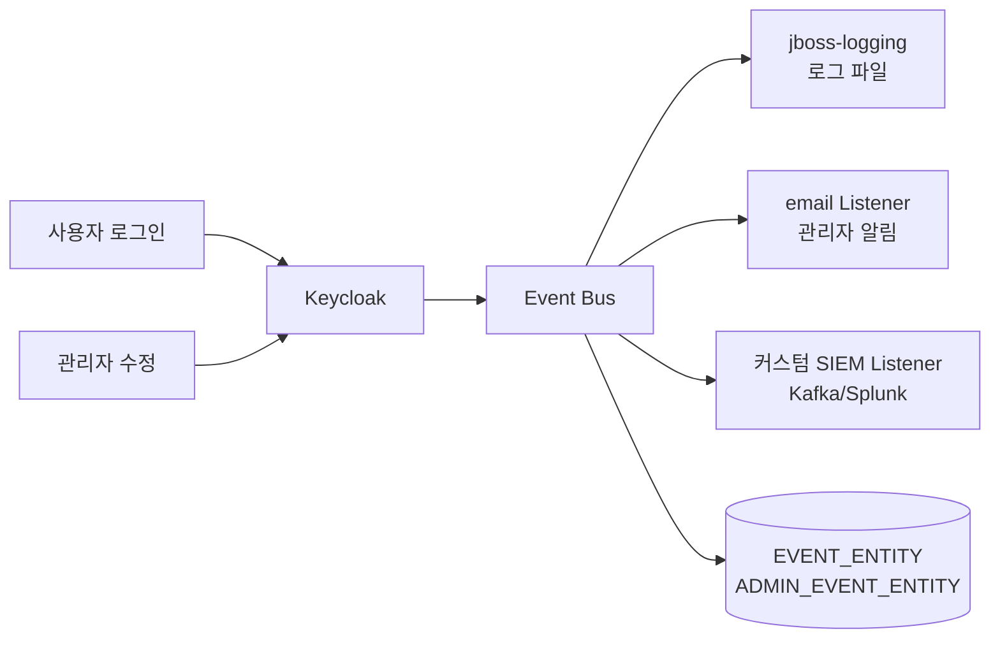
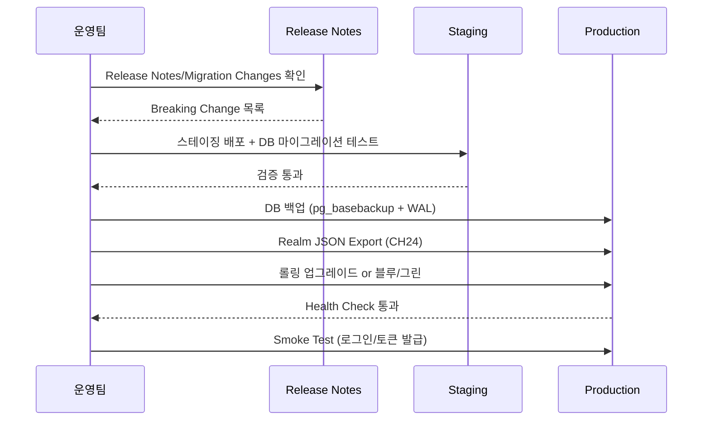
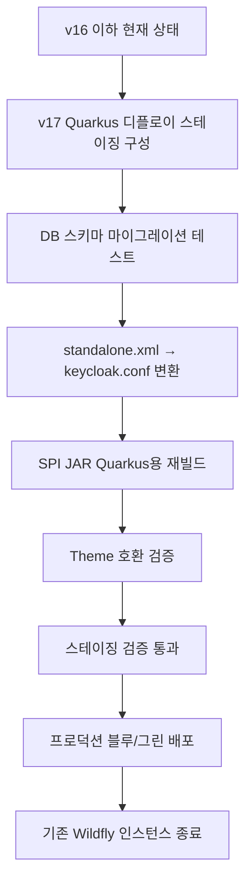

# 모니터링·감사와 업그레이드

::: info 학습 목표
- Keycloak의 Login Events와 Admin Events 차이를 이해하고, Event Listener SPI로 외부 시스템에 전달할 수 있다.
- `/metrics` Prometheus 엔드포인트의 주요 지표(HTTP, JVM, Agroal, Infinispan)를 읽고 대시보드를 구성한다.
- PII 마스킹과 보존 기간을 포함한 감사 로그 설계 원칙을 세운다.
- 메이저 업그레이드의 공통 절차와 Wildfly→Quarkus 이관의 특수성을 구분한다.
:::

OAuth 스터디의 [CH19. 관찰성(Observability)](/study/oauth/19-observability)에서 Authorization Server 일반의 관찰성 원칙을 다뤘다. 본 챕터는 그 원칙을 Keycloak 구체에 적용한다.

---

## 1. Event 종류

Keycloak이 발생시키는 이벤트는 둘로 나뉜다.

### Login Events vs Admin Events

| 축 | Login Events | Admin Events |
|----|--------------|--------------|
| 대상 | 최종 사용자 행위 | 관리자 행위 |
| 예시 | `LOGIN`, `LOGIN_ERROR`, `LOGOUT`, `CODE_TO_TOKEN` | `CREATE`, `UPDATE`, `DELETE` (Realm/Client/User) |
| 기본 활성화 | 해제 (Realm 설정에서 켜야 함) | 해제 |
| 영속 저장 | `EVENT_ENTITY` 테이블 (옵션) | `ADMIN_EVENT_ENTITY` 테이블 (옵션) |
| 감사 용도 | 사용자 인증 감사 | 관리 행위 추적 |
| 관리 UI | Events > Login Events | Events > Admin Events |

두 이벤트를 반드시 같이 켠다. Login Events만 켜면 관리자가 뭔가 수정해도 기록이 안 남는다.

### Realm 설정

Admin Console > Realm Settings > Events 탭에서 활성화한다. 또는 Admin API로.

```bash
curl -X PUT \
  -H "Authorization: Bearer ${TOKEN}" \
  -H "Content-Type: application/json" \
  "https://auth.example.com/admin/realms/acme/events/config" \
  -d '{
    "eventsEnabled": true,
    "eventsListeners": ["jboss-logging"],
    "enabledEventTypes": [
      "LOGIN", "LOGIN_ERROR", "LOGOUT", "LOGOUT_ERROR",
      "CODE_TO_TOKEN", "CODE_TO_TOKEN_ERROR",
      "REFRESH_TOKEN", "REFRESH_TOKEN_ERROR",
      "REGISTER", "REGISTER_ERROR",
      "UPDATE_PASSWORD", "UPDATE_PASSWORD_ERROR"
    ],
    "eventsExpiration": 604800,
    "adminEventsEnabled": true,
    "adminEventsDetailsEnabled": true
  }'
```

- `eventsExpiration`: 604800초(7일). 이 기간 뒤 이벤트는 자동 삭제.
- `adminEventsDetailsEnabled`: 관리자 변경의 Before/After 상세 기록. 감사에는 필수.

### 이벤트 흐름



하나의 이벤트는 여러 Listener에 동시에 전달될 수 있다. DB 저장은 별도 경로로 들어간다.

---

## 2. Event Listener SPI

[CH16. SPI 개요](/study/keycloak/16-spi-overview)에서 본 SPI 중 하나가 `EventListenerProvider`다. 기본 제공되는 Listener는 두 개고, 필요하면 커스텀 Listener를 추가한다.

### 기본 제공 Listener

| ID | 용도 |
|----|------|
| `jboss-logging` | Keycloak 로그 파일로 이벤트 출력 |
| `email` | 지정된 이벤트 타입에 사용자 이메일 발송 |

`email` Listener는 "비밀번호 변경됨"처럼 보안 알림을 사용자에게 보낼 때 쓴다. Realm Settings > Events > Email 탭에서 대상 이벤트 타입을 고른다.

### 커스텀 Listener — SIEM 연동

기업 보안팀이 Splunk/ELK/Datadog 같은 SIEM으로 Keycloak 이벤트를 모으고 싶을 때 커스텀 Listener를 작성한다.

```java
public class SiemEventListenerProvider implements EventListenerProvider {
    private final KafkaProducer<String, String> producer;
    private final String topic;

    public SiemEventListenerProvider(KafkaProducer<String, String> producer, String topic) {
        this.producer = producer;
        this.topic = topic;
    }

    @Override
    public void onEvent(Event event) {
        String payload = toJson(event);
        producer.send(new ProducerRecord<>(topic, event.getUserId(), payload));
    }

    @Override
    public void onEvent(AdminEvent adminEvent, boolean includeRepresentation) {
        String payload = toJson(adminEvent);
        producer.send(new ProducerRecord<>(topic + "-admin", adminEvent.getAuthDetails().getUserId(), payload));
    }

    @Override
    public void close() { }
}
```

ProviderFactory에서 Kafka 클라이언트를 초기화하고, `providers/` 디렉토리에 JAR를 넣어 배포한다([CH16](/study/keycloak/16-spi-overview)).

### Listener 여러 개 연결

Realm 설정에서 여러 Listener를 동시에 등록할 수 있다.

```bash
# Realm에 listener 두 개 등록
"eventsListeners": ["jboss-logging", "siem-kafka"]
```

`jboss-logging`으로 파일에도 남기고, 커스텀 Listener로 외부 SIEM에도 보내는 조합이 일반적이다.

### 비동기 처리 주의

Event Listener는 인증 경로 위에서 <strong>동기적으로</strong> 호출된다. Kafka Send가 블로킹되면 로그인 요청이 지연된다. 커스텀 Listener는 반드시.

- 비동기 전송(Kafka `send()`의 fire-and-forget, 내부 큐)으로 처리.
- 외부 시스템 장애 시 graceful degradation(이벤트 드롭 허용) 설계.
- 내부 큐가 오버플로우 나면 메모리 터짐에 유의.

---

## 3. Metrics

Keycloak v17+는 `--metrics-enabled=true`로 Prometheus 형식 `/metrics` 엔드포인트를 노출한다.

### 엔드포인트 활성화

```conf
# keycloak.conf
metrics-enabled=true
health-enabled=true
```

```bash
curl -s https://auth.example.com/metrics | head -40
```

### 주요 지표 그룹

| 그룹 | 접두어 예시 | 핵심 지표 |
|------|------------|----------|
| JVM | `jvm_` | Heap 사용량, GC pause, Thread 수 |
| HTTP Server | `http_server_requests_seconds_*` | 요청 수, p95/p99 Latency |
| DB(Agroal) | `agroal_*` | active/available/awaiting count |
| Infinispan | `vendor_jgrp_*`, `cache_*` | 캐시 hit/miss, 엔트리 수 |
| Keycloak | `keycloak_*` | Login 성공/실패, 토큰 발급 수 |

### 핵심 대시보드 항목

운영 관점에서 반드시 모니터링하는 지표.

```promql
# 로그인 성공률 (1분 단위)
sum(rate(keycloak_logins_total{provider="keycloak"}[1m]))
  / sum(rate(keycloak_logins_attempts_total{provider="keycloak"}[1m]))

# 토큰 발급 Latency p95
histogram_quantile(0.95,
  sum(rate(http_server_requests_seconds_bucket{uri=~".*token.*"}[5m])) by (le))

# 로그인 실패 Spike
sum(rate(keycloak_failed_login_attempts_total[1m])) by (realm)

# DB 풀 포화도
agroal_active_count / agroal_max_size

# Infinispan 캐시 hit율
sum(rate(cache_hits_total[5m]))
  / (sum(rate(cache_hits_total[5m])) + sum(rate(cache_misses_total[5m])))
```

### 알람 설계

| 알람 | 조건 | 심각도 |
|------|------|--------|
| 로그인 실패 급증 | 1분 간 로그인 실패율 > 10% | Warning |
| DB 풀 고갈 | `agroal_awaiting_count` > 0 지속 5분 | Critical |
| Heap 고사 | JVM Heap 사용 > 90% 지속 5분 | Critical |
| 토큰 Latency 악화 | p95 > 500ms 지속 10분 | Warning |
| Brute Force 탐지 | 특정 IP에서 `LOGIN_ERROR` > 20/min | Critical |

[OAuth CH19](/study/oauth/19-observability)에서 다룬 "로그인 실패율" 원칙이 그대로 Keycloak Metric으로 구현된다.

---

## 4. 감사 로그 설계

Keycloak Events를 그대로 SIEM에 보내면 "감사 로그"라고 부를 수 있을까. 대부분의 경우 추가 설계가 필요하다.

### 감사 로그 요건

규제·컴플라이언스 관점에서 감사 로그는 다음을 만족해야 한다.

- <strong>Who</strong>: 누가(사용자 식별자, 관리자 계정)
- <strong>What</strong>: 무엇을 했나(리소스 + 변경 Before/After)
- <strong>When</strong>: 언제(서버 시간, 가능하면 클라이언트 시간도)
- <strong>Where</strong>: 어디서(IP, User-Agent)
- <strong>Result</strong>: 성공/실패
- <strong>변조 방지</strong>: 해시·서명·쓰기 전용 스토리지

### PII 마스킹

Keycloak Event에는 `username`, `email`, 그리고 `details`에 담긴 IP/User-Agent가 그대로 들어간다. 이를 외부 시스템에 보낼 때는 조직 PII 정책에 맞춰 마스킹하거나, 암호화 필드로 분리한다.

```java
// 커스텀 Listener에서 마스킹
private String maskEmail(String email) {
    if (email == null) return null;
    int at = email.indexOf('@');
    if (at <= 1) return "***";
    return email.substring(0, 1) + "***" + email.substring(at);
}
```

마스킹 정도는 로그 수집 목적에 달렸다.

- 보안 감사용: 최소 마스킹(디버깅 가능성 중요)
- BI/분석용: 해시 또는 가명화

### 보존 기간

[CH22. DB와 성능](/study/keycloak/22-database-performance)에서 경고했듯 `EVENT_ENTITY`는 방치하면 무한정 커진다. Realm 설정의 `eventsExpiration`으로 자동 삭제를 걸고, 장기 보존은 외부 SIEM에 맡긴다.

| 저장소 | 보존 기간 예 | 용도 |
|--------|-------------|------|
| `EVENT_ENTITY` (DB) | 7~30일 | 최근 운영 디버깅, Admin UI 조회 |
| SIEM (Kafka→Splunk/ELK) | 90일~수년 | 감사·보안 분석 |
| 장기 아카이브(S3) | 규제 기준 | 법적 보존 |

일부 규제 산업(금융·의료)은 7년 이상 보존을 요구한다. 이 경우 Keycloak DB는 단기 저장소로 쓰고, 모든 이벤트는 외부 감사 시스템으로 이중화한다.

### 변조 방지

감사 로그는 관리자 권한으로도 수정 불가해야 한다. 실무 방법.

- SIEM 전송은 append-only 큐(Kafka topic with retention).
- S3 아카이브는 Object Lock으로 WORM(Write Once Read Many) 구성.
- 로그 파일 해시를 일별로 외부에 기록.

---

## 5. 메이저 업그레이드 절차

Keycloak 메이저 버전은 대체로 연 1~2회 나온다. 업그레이드의 기본 흐름은 동일하다.

### 업그레이드 파이프라인



### 단계별 체크리스트

1. <strong>Release Notes 확인</strong>. 특히 "Upgrading Guide" 섹션과 Removed/Deprecated 기능.
2. <strong>스테이징에서 DB 마이그레이션 먼저</strong>. 메이저 업그레이드는 스키마 변경을 동반할 수 있다.
3. <strong>백업</strong>: DB 덤프 + Realm JSON Export([CH24](/study/keycloak/24-backup-restore)).
4. <strong>배포 전략 결정</strong>: 롤링 vs 블루/그린 vs 다운타임.
5. <strong>Smoke Test</strong>: 로그인, Refresh Token, Service Account Client Credentials, Admin API.

### 롤링 vs 블루/그린

| 전략 | 장점 | 단점 |
|------|------|------|
| 롤링 업그레이드 | 단일 배포, 리소스 절감 | Infinispan 호환성 이슈 가능 |
| 블루/그린 | 즉시 롤백 가능, 안전 | 2배 리소스 일시적 필요 |
| 다운타임 | 구조 가장 단순 | 서비스 중단 필요 |

v22 이후 롤링은 대부분의 마이너 버전에서 안정적이다. 메이저 점프(v19→v26 같은 경우)는 중간 버전을 경유하거나 블루/그린이 안전하다.

### DB 마이그레이션 주의

- 스키마 변경(DDL)은 기동 시 자동으로 적용된다.
- 대형 테이블(`EVENT_ENTITY`, `USER_ATTRIBUTE`)에 인덱스 생성이 포함되면 시간이 오래 걸릴 수 있다.
- 기동 로그에서 Liquibase 수행 결과를 반드시 확인.

```
2026-04-17 10:12:33 INFO [org.keycloak.connections.jpa.updater.liquibase]
  Initializing database schema. Jdbc driver version: 42.7.3
2026-04-17 10:12:45 INFO [...] Change-set 25.0.0-10000-keycloak-users.xml::25.0.0-10000
```

### 롤백 계획

- 스키마 변경이 들어갔으면 롤백은 DB 복원이 기본.
- PITR이 있다면 업그레이드 직전 시점으로.
- Realm JSON은 설정 롤백용, 사용자 데이터는 덮어쓰기 주의.

---

## 6. Wildfly → Quarkus 이관

아직도 Wildfly 기반 구 Keycloak(v16 이전)이 프로덕션에 남아 있는 조직이 있다. Quarkus 기반 v17+로 이관하는 작업은 "메이저 업그레이드 + 런타임 교체"의 복합이다.

### 차이 요약

| 항목 | Wildfly (v16 이전) | Quarkus (v17+) |
|------|-------------------|----------------|
| 실행 스크립트 | `standalone.sh` | `kc.sh` |
| 설정 | `standalone.xml` (XML) | `keycloak.conf` + CLI 옵션 |
| 빌드 단계 | 없음 | `kc.sh build` 필요 |
| Provider 설치 | `module.xml` + `modules/` | `providers/` 디렉토리 |
| JVM Startup | 10~30초 | 2~5초 |
| 관리 CLI | `jboss-cli.sh` | 대응 없음 (REST/Operator로 대체) |
| 테마 | 동일 구조 | 동일 구조 |
| 이벤트 리스너 SPI | 동일 인터페이스 | 동일 (재빌드 필요) |

### 이관 절차



### standalone.xml → keycloak.conf

대부분의 설정은 CLI 플래그나 `keycloak.conf` 키-값으로 옮겨진다.

```xml
<!-- standalone.xml (구) -->
<datasource jndi-name="java:jboss/datasources/KeycloakDS" pool-name="KeycloakDS">
    <connection-url>jdbc:postgresql://pg:5432/keycloak</connection-url>
    <driver>postgresql</driver>
    <pool>
        <min-pool-size>10</min-pool-size>
        <max-pool-size>100</max-pool-size>
    </pool>
    <security>
        <user-name>keycloak</user-name>
        <password>secret</password>
    </security>
</datasource>
```

```conf
# keycloak.conf (신)
db=postgres
db-url=jdbc:postgresql://pg:5432/keycloak
db-username=keycloak
db-password=secret
db-pool-min-size=10
db-pool-max-size=100
```

XML이 50줄짜리 지옥이었던 게 몇 줄로 끝난다. 대신 빌드 타임에 결정해야 하는 값(예: DB 벤더)은 `kc.sh build` 단계에서 고정된다.

### SPI 재빌드

Wildfly용으로 빌드한 JAR는 Quarkus에서 바로 못 쓴다. 주요 차이.

- Dependency 스코프: Wildfly는 `provided`, Quarkus도 대부분 `provided`지만 Quarkus BOM 기준으로 재컴파일.
- 클래스로더: Quarkus는 모듈 시스템이 아닌 플랫 `providers/` 디렉토리. `module.xml` 제거.
- `META-INF/services/` 표준 방식은 동일.

Maven 기준으로는 `keycloak-core`, `keycloak-services`, `keycloak-server-spi` 의존성을 Quarkus v17+ 버전으로 맞춘 뒤 재빌드하는 정도다.

### 테마·커스텀 Authenticator

[CH17. 커스텀 Authenticator](/study/keycloak/17-custom-authenticator), [CH19. Theme](/study/keycloak/19-theme)에서 본 구조는 Quarkus에서도 크게 바뀌지 않는다. 다만.

- Theme의 `meta-inf/keycloak-themes.json` 경로는 동일.
- FreeMarker 템플릿도 그대로 동작.
- 커스텀 Authenticator의 `AuthenticatorFactory`는 동일 인터페이스.
- 배포 위치만 `providers/` 디렉토리로 단순화.

### 이관 체크리스트

```
[ ] 메이저 버전 2단계 이상 점프 — 중간 버전 경유 검토
[ ] standalone.xml 을 kc.sh 옵션/keycloak.conf 로 전부 매핑
[ ] 커스텀 SPI JAR 모두 Quarkus용 재빌드
[ ] Theme 파일 경로 확인 (대부분 동일)
[ ] DB 마이그레이션 스테이징에서 검증
[ ] 기존 Wildfly 클러스터와 Quarkus 클러스터 동시 가동 불가 — 블루/그린 설계
[ ] 기동 옵션 중 Keycloak Operator 로 이관할 수 있는 항목 정리
[ ] kcadm.sh 자동화 스크립트 문법 변경 확인
```

---

::: tip 핵심 정리
- Login Events와 Admin Events를 반드시 함께 활성화. Admin Events details까지 켜야 감사 요건을 충족한다.
- Event Listener SPI는 동기 호출이므로 외부 전송은 반드시 비동기/큐로 감싼다.
- `/metrics`의 핵심은 HTTP Latency, Agroal 풀, Infinispan 캐시 hit율, Keycloak login 성공률 네 가지.
- 감사 로그는 Who/What/When/Where/Result + 변조 방지. DB는 단기 저장, SIEM에 장기 이중화.
- 메이저 업그레이드는 Release Notes → 스테이징 마이그레이션 → 백업 → 롤링/블루그린 순. Wildfly→Quarkus는 "메이저 업그레이드 + 런타임 교체"로 블루/그린이 사실상 필수.
:::

## 스터디 마무리

이 챕터로 Keycloak 실전 스터디 25개 챕터가 마무리된다. 처음에는 Realm 하나 만들어 로그인 받는 수준에서 출발해, 이제는 Operator로 HA 클러스터를 선언하고 Terraform으로 Realm을 관리하며 메이저 업그레이드까지 계획할 수 있는 지점에 이르렀다. 운영 원칙은 반복해서 강조했듯 단순하다.

- 설정은 코드로(Terraform, Operator CR)
- 백업은 두 축으로(DB + Realm JSON)
- 관찰은 네 기둥으로(Logs, Metrics, Events, Traces)
- 업그레이드는 연습된 절차로

OAuth 스터디와 결합해 쓰면 IAM 전 영역의 한 사이클을 갖춘 셈이다. 새 기능 도입이나 문제 진단에서 이 스터디의 챕터 번호를 북마크로 삼아 빠르게 돌아올 수 있도록 구성했다.

- 이전: [CH24. Backup/Restore와 Realm 이관](/study/keycloak/24-backup-restore)
- 처음으로: [Keycloak 실전 목차](/study/keycloak/)
