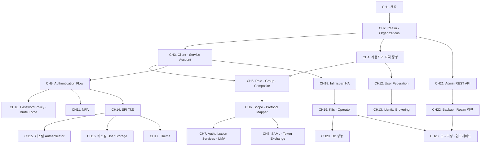

# Keycloak 실전

OAuth 스터디에서 Keycloak을 "Authorization Server로 쓰는 방법"을 다뤘다면, 이 스터디는 Keycloak 그 자체를 깊이 운영·확장하는 관점으로 접근한다. Realm/Client 같은 기본 개념부터 Authorization Services·SPI 커스터마이징·Kubernetes Operator 배포·버전 업그레이드까지, 제공자(Provider)와 운영자(Operator)의 시선에서 체계적으로 학습한다.

::: info 선행 지식
OAuth 2.0과 OpenID Connect의 기본 개념은 [OAuth 스터디](/study/oauth/)에서 전제된다. 특히 [CH17. Keycloak으로 AS 구축](/study/oauth/17-keycloak)은 "소비자 관점"의 요약이고, 이 스터디는 그 내용을 훨씬 깊게 풀어낸다.
:::

## 학습 로드맵

## 목차

### Keycloak
1. [Keycloak 개요](/study/keycloak/01-overview) — IAM 개요, 라이선스, OAuth 스터디와의 관계

### 핵심 객체 모델
2. [Realm과 Organizations](/study/keycloak/02-realm-organizations) — 멀티테넌시 설계, v26+ Organizations
3. [Client와 Service Account](/study/keycloak/03-client-service-account) — Access Type, Client Authenticator, 시크릿 관리
4. [사용자와 자격 증명](/study/keycloak/04-user-credentials) — 해싱(Argon2/PBKDF2), OTP, WebAuthn 등록
5. [Role·Group과 Composite Role](/study/keycloak/05-role-group) — 권한 모델링 패턴

### 토큰·권한·프로토콜
6. [Client Scope와 Protocol Mapper](/study/keycloak/06-protocol-mapper) — 토큰 클레임 커스터마이징, Consent
7. [Authorization Services와 UMA 2.0](/study/keycloak/07-authz-uma) — Fine-grained 리소스 권한
8. [SAML 2.0과 Token Exchange](/study/keycloak/08-saml-token-exchange) — SAML 지원, RFC 8693 임퍼소네이션

### 인증 정책과 플로우
9. [인증 플로우 커스터마이징](/study/keycloak/09-auth-flow) — Browser/Direct Grant/Reset 플로우 편집
10. [Password Policy와 Brute Force](/study/keycloak/10-password-policy) — Required Actions, 계정 잠금
11. [MFA — TOTP / WebAuthn](/study/keycloak/11-mfa) — 2단계 인증과 Recovery Codes

### 페더레이션
12. [User Federation (LDAP/AD + SCIM)](/study/keycloak/12-user-federation) — 기업 내부 사용자 소스 연동
13. [Identity Brokering](/study/keycloak/13-identity-brokering) — Google/GitHub/Kakao 외부 IdP 연결

### 커스터마이징 (SPI)
14. [SPI로 Keycloak 확장](/study/keycloak/14-spi-overview) — providers/ 디렉토리, Quarkus 클래스로더
15. [커스텀 Authenticator](/study/keycloak/15-custom-authenticator) — 사내 사번 검증 같은 추가 단계
16. [커스텀 User Storage](/study/keycloak/16-custom-user-storage) — 레거시 DB를 사용자 소스로
17. [Theme 커스터마이징](/study/keycloak/17-theme) — 로그인 화면 브랜딩

### 운영과 확장
18. [Infinispan HA 클러스터링](/study/keycloak/18-ha-clustering) — 분산 캐시, Multi-site
19. [Kubernetes + Operator 배포](/study/keycloak/19-k8s-operator) — Keycloak Operator, Custom Resource
20. [데이터베이스와 성능](/study/keycloak/20-database-performance) — PostgreSQL 튜닝, 오프라인 세션
21. [Admin REST API와 자동화](/study/keycloak/21-admin-rest-api) — 운영 자동화, GitOps
22. [Backup/Restore와 Realm 이관](/study/keycloak/22-backup-restore) — Realm Import/Export, 재해 복구
23. [모니터링·감사와 업그레이드](/study/keycloak/23-monitoring-upgrade) — Event Listener, Metrics, 메이저 업그레이드

## 관련 자료

::: info 함께 보면 좋은 자료
- [OAuth 2.0 + OpenID Connect 스터디](/study/oauth/) — OAuth/OIDC 개념 선행
- [OAuth 스터디 CH17. Keycloak으로 AS 구축](/study/oauth/17-keycloak) — 소비자 관점 요약
- [Keycloak 개념 및 간단 사용 포스트](/posts/tech/2025-10-01-keycloak) — Docker Compose 실습 레퍼런스
:::
