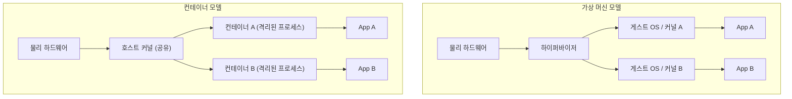
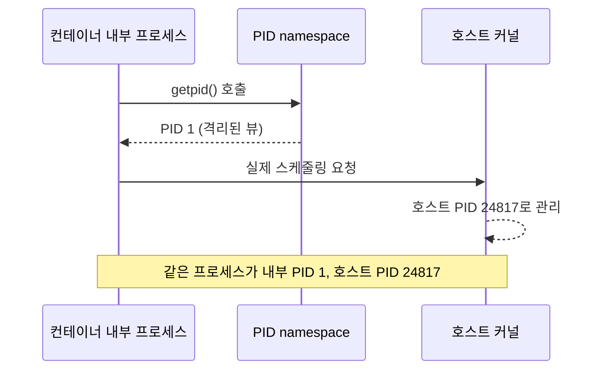
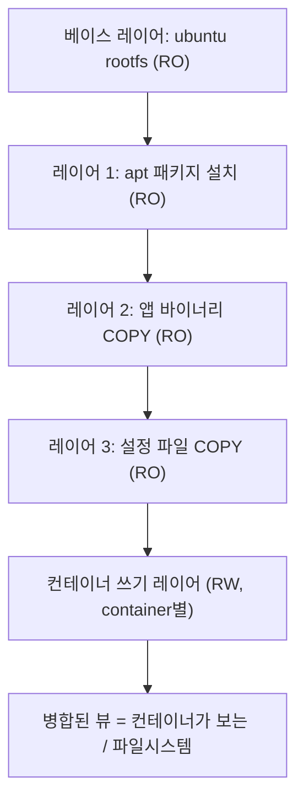

# 컨테이너란 무엇인가

::: info 학습 목표
- 하이퍼바이저 기반 가상 머신과 컨테이너의 구조적 차이를 격리 수준·오버헤드 관점에서 설명할 수 있다.
- 리눅스 namespace(pid/net/mnt/uts/ipc/user)가 무엇을 격리하는지 각각 이해한다.
- cgroup이 CPU·메모리 등 리소스를 어떻게 제한하는지, v1과 v2의 차이를 안다.
- Union 파일시스템(OverlayFS)으로 이미지 레이어와 컨테이너의 쓰기 계층이 어떻게 구성되는지 설명할 수 있다.
- 컨테이너 격리가 VM보다 약한 이유와 그에 따른 보안 관점을 이해한다.
:::

## 1. 가상화 vs 컨테이너 — 무엇을 격리하는가

<strong>컨테이너(container)</strong>는 "별도의 작은 운영체제"가 아니다. 컨테이너는 <strong>호스트 커널을 공유하면서, 프로세스가 마치 독립된 시스템 위에서 도는 것처럼 보이게 만든 격리된 프로세스</strong>다. 이 한 문장이 컨테이너의 본질이며, 이번 장의 모든 설명이 이 문장으로 수렴한다.

전통적인 <strong>하이퍼바이저 기반 가상 머신(VM)</strong>과 비교하면 차이가 분명해진다.

| 구분 | 가상 머신(VM) | 컨테이너 |
|------|--------------|----------|
| 격리 단위 | 가상 하드웨어 + 게스트 OS 전체 | 호스트 커널을 공유하는 프로세스 |
| 커널 | 게스트마다 독립 커널 | 호스트 커널 1개 공유 |
| 부팅 시간 | 수십 초 (OS 부팅) | 수십 ms (프로세스 시작) |
| 이미지 크기 | 수 GB (OS 포함) | 수 MB ~ 수백 MB |
| 오버헤드 | 하이퍼바이저 + 게스트 커널 | 거의 없음 (네이티브 수준) |
| 격리 강도 | 강함 (하드웨어 경계) | 상대적으로 약함 (커널 공유) |

VM은 <strong>하이퍼바이저(hypervisor)</strong>(예: KVM, ESXi, Hyper-V)가 물리 하드웨어를 가상화해 각 게스트에 가상 CPU·메모리·디스크·NIC를 제공한다. 게스트는 자기만의 커널을 부팅하므로 격리가 매우 강하지만, OS를 통째로 들고 다녀야 해 무겁고 느리다.

컨테이너는 게스트 커널을 부팅하지 않는다. 호스트 커널의 기능(namespace, cgroup)만으로 "격리된 것처럼" 보이게 한다. 따라서 가볍고 빠르지만, <strong>커널을 공유하므로 커널 취약점이 곧 컨테이너 탈출(container escape)로 이어질 수 있다</strong>는 약점을 안고 간다.



::: tip VM과 컨테이너는 대립 관계가 아니다
실무에서는 둘을 함께 쓴다. 클라우드의 워커 노드는 대개 VM이고, 그 VM 안에서 컨테이너가 돈다. 멀티테넌시 보안이 중요하면 VM으로 1차 경계를, 배포 단위로는 컨테이너를 쓴다. 뒤에서 다룰 [gVisor·Kata](/study/kubernetes/05-container-runtime) 같은 샌드박스 런타임은 이 둘의 장점을 합치려는 시도다.
:::

## 2. 리눅스 namespace — "독립된 세계"의 착시

컨테이너가 "독립된 시스템처럼" 보이는 핵심 장치가 <strong>namespace</strong>다. namespace는 커널이 관리하는 전역 리소스(프로세스 트리, 네트워크 스택, 마운트 테이블 등)를 <strong>프로세스 그룹별로 분리된 뷰</strong>로 보여준다. 같은 커널이지만, 컨테이너 안에서 보면 "나만의 시스템"처럼 느껴지는 이유다.

주요 namespace는 다음과 같다. 자세한 명세는 [Linux namespaces 매뉴얼](https://man7.org/linux/man-pages/man7/namespaces.7.html)을 참고한다.

| namespace | 격리 대상 | 효과 |
|-----------|-----------|------|
| `pid` | 프로세스 ID 공간 | 컨테이너 내부에서 자기 프로세스만 보이고, 내부 PID 1이 따로 존재 |
| `net` | 네트워크 스택 | 독립된 인터페이스·라우팅 테이블·iptables·포트 공간 |
| `mnt` | 마운트 포인트 | 자기만의 파일시스템 트리(루트 `/`가 분리됨) |
| `uts` | 호스트명·도메인명 | 컨테이너마다 다른 hostname 설정 가능 |
| `ipc` | System V IPC, POSIX 메시지 큐 | 공유 메모리·세마포어를 격리 |
| `user` | UID/GID 매핑 | 컨테이너 내부 root(UID 0)를 호스트의 비특권 UID로 매핑 |

가장 직관적인 것이 `pid` namespace다. 컨테이너 안에서 `ps`를 실행하면 PID 1부터 시작하는 자기 프로세스만 보인다. 하지만 호스트에서 보면 그 프로세스는 전혀 다른 큰 PID를 가진다. 즉 <strong>같은 프로세스가 두 개의 PID를 갖는다</strong> — 컨테이너 내부의 PID와 호스트의 실제 PID.

```bash
# 새 UTS·PID·mount namespace를 만들고 그 안에서 셸을 실행
sudo unshare --uts --pid --mount-proc --fork bash

# 컨테이너처럼 hostname을 바꿔도 호스트에는 영향 없음
hostname mini-container

# 내부에서는 PID가 1부터 시작한다
ps -ef
```

`user` namespace는 보안상 특히 중요하다. 컨테이너 내부에서 root여도, 실제 호스트에서는 비특권 사용자(예: UID 100000)로 매핑하면, 컨테이너가 탈출하더라도 호스트에서 root 권한을 얻지 못한다. 이를 <strong>rootless 컨테이너</strong>의 기반이라 부른다.



## 3. cgroup — 리소스를 제한하는 손잡이

namespace가 "무엇을 볼 수 있는가"를 격리한다면, <strong>cgroup(control group)</strong>은 "얼마나 쓸 수 있는가"를 제한한다. CPU·메모리·디스크 I/O·네트워크 대역폭·PID 개수 등을 그룹 단위로 제한·계량·우선순위 부여한다. cgroup이 없으면 컨테이너 하나가 메모리를 모두 먹어 호스트 전체를 마비시킬 수 있다.

cgroup은 두 가지 버전이 공존한다.

- <strong>cgroup v1</strong>: 리소스 종류(cpu, memory, blkio 등)마다 별도의 계층 트리를 가진다. 컨트롤러가 분산돼 있어 설정이 복잡하다.
- <strong>cgroup v2</strong>: <strong>단일 통합 계층(unified hierarchy)</strong>으로 모든 컨트롤러를 한 트리에서 관리한다. 메모리·CPU 압박 지표(PSI), 더 정교한 제어를 제공한다. 최신 배포판과 쿠버네티스는 v2를 표준으로 권장한다.

```bash
# cgroup v2 환경에서 메모리 200MB로 제한하는 그룹 생성
sudo mkdir /sys/fs/cgroup/demo
echo "200M" | sudo tee /sys/fs/cgroup/demo/memory.max

# 현재 셸을 이 그룹에 넣으면, 이후 프로세스는 200MB를 넘으면 OOM kill 된다
echo $$ | sudo tee /sys/fs/cgroup/demo/cgroup.procs
```

도커는 이 동작을 명령행 플래그로 추상화한다.

```bash
# CPU는 1.5코어, 메모리는 512MB로 제한
docker run --cpus="1.5" --memory="512m" nginx
```

쿠버네티스의 `resources.requests`/`resources.limits`도 결국 노드에서 cgroup으로 변환되어 적용된다. cgroup 명세는 [cgroups 매뉴얼](https://man7.org/linux/man-pages/man7/cgroups.7.html)에서, 도커 적용 방식은 [Runtime resource constraints](https://docs.docker.com/engine/containers/resource_constraints/)에서 확인할 수 있다.

::: warning limit과 OOM
메모리 limit을 넘은 컨테이너는 커널의 OOM killer에 의해 강제 종료된다(`OOMKilled`). limit을 너무 빡빡하게 잡으면 JVM·Node 같은 런타임이 예고 없이 죽는다. 반대로 limit을 안 잡으면 노이지 네이버(noisy neighbor) 문제로 노드 전체가 흔들린다. 적정값 산정은 [리소스 관리] 챕터에서 다룬다.
:::

## 4. Union 파일시스템과 이미지 레이어

컨테이너 이미지가 가볍고 빠르게 공유되는 비밀은 <strong>Union 파일시스템</strong>, 그중에서도 리눅스 표준인 <strong>OverlayFS</strong>에 있다. 이미지는 여러 개의 <strong>읽기 전용 레이어(read-only layer)</strong>가 쌓인 구조이고, 컨테이너를 실행하면 그 위에 <strong>쓰기 가능한 얇은 레이어(writable layer)</strong>가 한 장 올라간다.



OverlayFS는 여러 디렉터리를 겹쳐(union) 하나의 뷰로 보여준다.

- <strong>lowerdir</strong>: 읽기 전용 이미지 레이어들 (아래에서 위로 쌓임)
- <strong>upperdir</strong>: 컨테이너가 쓰는 가변 레이어
- <strong>merged</strong>: 사용자가 실제로 보는 통합된 파일시스템

핵심은 <strong>Copy-on-Write(CoW)</strong>다. 컨테이너가 읽기 전용 레이어의 파일을 <strong>수정</strong>하면, 그 파일이 upperdir로 복사된 뒤 수정된다. 원본 레이어는 그대로 남아 다른 컨테이너와 안전하게 공유된다. 그래서 같은 이미지로 컨테이너 100개를 띄워도 이미지 레이어는 디스크에 한 번만 저장된다.

```bash
# OverlayFS를 수동으로 마운트해 동작을 직접 확인
mkdir -p lower upper work merged
echo "from image" > lower/file.txt

sudo mount -t overlay overlay \
  -o lowerdir=lower,upperdir=upper,workdir=work merged

# merged에서 수정하면 원본(lower)은 그대로, upper에 복사본이 생긴다
echo "modified" >> merged/file.txt
ls upper/   # file.txt (Copy-on-Write 결과)
cat lower/file.txt   # 원본은 "from image" 그대로
```

이 레이어 구조 덕분에 이미지는 <strong>증분(delta)</strong>만 주고받으면 된다. `docker pull` 시 이미 가진 레이어는 건너뛰고 새 레이어만 받는 이유다. 도커의 스토리지 드라이버 동작은 [About storage drivers](https://docs.docker.com/engine/storage/drivers/)에서 자세히 다룬다.

## 5. 컨테이너 격리의 한계와 보안 관점

컨테이너는 강력하지만 <strong>VM 수준의 격리가 아니다</strong>. 모든 컨테이너가 <strong>같은 호스트 커널</strong>을 공유하기 때문에, 다음과 같은 한계가 있다.

- <strong>커널 공유 위험</strong>: 커널에 권한 상승 취약점이 있으면, 한 컨테이너에서 호스트 전체를 장악할 수 있다(container escape). VM이라면 게스트 커널이 뚫려도 하이퍼바이저 경계가 한 겹 더 있다.
- <strong>특권 컨테이너의 위험</strong>: `--privileged`로 실행하면 거의 모든 커널 capability와 디바이스 접근을 얻어, 사실상 호스트와 동급 권한이 된다. 운영 환경에서는 피해야 한다.
- <strong>공유 자원을 통한 누수</strong>: cgroup 설정이 허술하면 사이드 채널·자원 고갈 공격에 노출될 수 있다.

이를 완화하는 표준 방어선들이 있다.

```mermaid
stateDiagram-v2
    [*] --> Default
    Default --> Hardened: 보안 강화 적용
    Hardened --> Sandboxed: 더 강한 격리
    Default: 기본 컨테이너<br>(root, 모든 capability)
    Hardened: 강화 컨테이너<br>non-root + capability drop<br>seccomp + read-only rootfs
    Sandboxed: 샌드박스 런타임<br>gVisor / Kata<br>커널 경계 추가
    Sandboxed --> [*]
```

실무에서 권장되는 최소 방어 조합은 다음과 같다.

- <strong>non-root 실행</strong>: 컨테이너 내부에서도 root를 쓰지 않는다(`USER` 지정, user namespace 활용).
- <strong>capability drop</strong>: `--cap-drop=ALL` 후 꼭 필요한 capability만 추가한다.
- <strong>seccomp 프로파일</strong>: 위험한 시스템 콜을 커널 진입 전에 차단한다.
- <strong>read-only rootfs</strong>: 루트 파일시스템을 읽기 전용으로 마운트해 침해 시 변조를 막는다.

```bash
# 권한을 최소화한 컨테이너 실행 예
docker run \
  --user 1000:1000 \
  --cap-drop=ALL \
  --security-opt=no-new-privileges \
  --read-only \
  nginx
```

이 주제들은 쿠버네티스의 [Pod 보안과 seccomp](/study/kubernetes/35-pod-security) 챕터에서 SecurityContext·Pod Security Standards와 함께 다시 깊이 다룬다.

::: tip 핵심 정리
- 컨테이너는 호스트 커널을 공유하는 <strong>격리된 프로세스</strong>일 뿐, 별도 OS가 아니다. 그래서 가볍지만 격리는 VM보다 약하다.
- <strong>namespace</strong>는 "무엇을 볼 수 있는가"를, <strong>cgroup</strong>은 "얼마나 쓸 수 있는가"를 격리·제한한다. 이 둘이 컨테이너의 양대 기둥이다.
- 이미지는 <strong>OverlayFS</strong> 위에 읽기 전용 레이어를 쌓고, 컨테이너는 그 위에 Copy-on-Write 쓰기 레이어를 얹어 디스크와 네트워크를 절약한다.
- 커널 공유라는 본질적 한계 때문에 non-root·capability drop·seccomp·샌드박스 런타임 같은 다층 방어가 필요하다.
:::

## 다음 챕터

컨테이너의 원리를 이해했으니, 이제 이 원리를 사용 가능한 도구로 묶은 [Docker 기초](/study/kubernetes/02-docker-basics)로 넘어가 이미지·컨테이너·레지스트리와 핵심 명령어를 다룬다.
