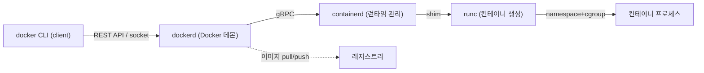
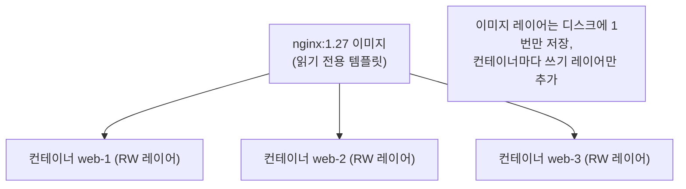
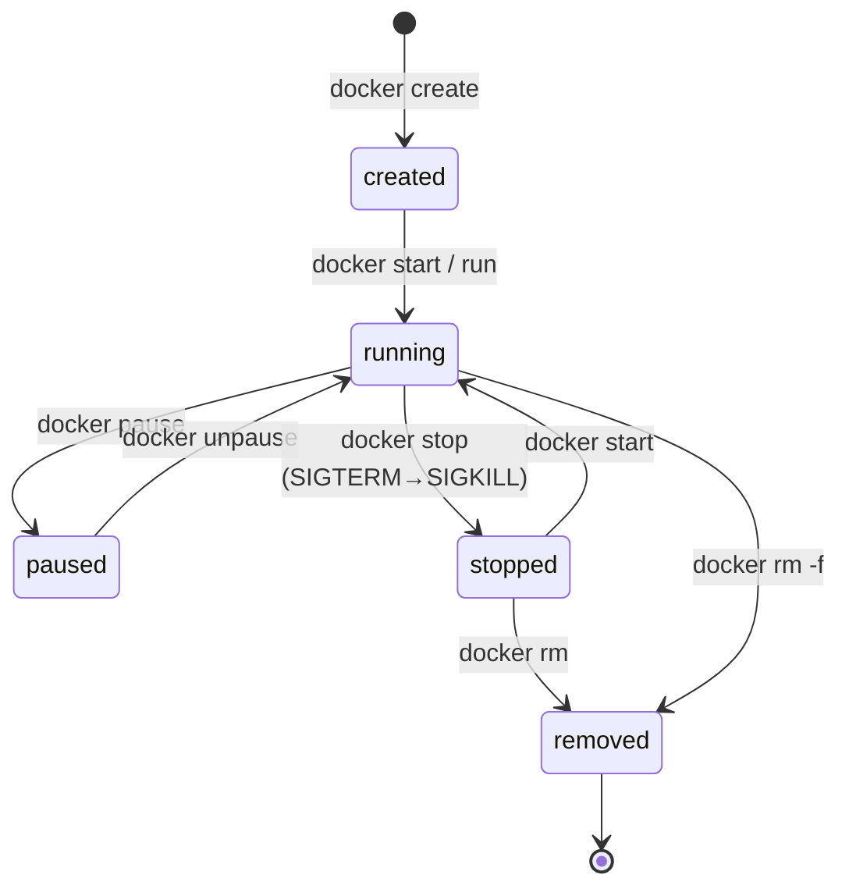

# Docker 기초

::: info 학습 목표
- Docker가 client·dockerd·containerd·runc로 이어지는 계층 구조로 동작함을 이해한다.
- 이미지(image)와 컨테이너(container)의 관계를 클래스와 인스턴스에 빗대 설명할 수 있다.
- 레지스트리(Docker Hub, private registry)의 역할과 이미지 태그·다이제스트의 의미를 안다.
- run·ps·exec·logs·inspect·rm·pull·push 등 핵심 명령어로 컨테이너를 다룰 수 있다.
- 컨테이너의 라이프사이클(created → running → stopped → removed)을 상태 전이로 설명할 수 있다.
:::

## 1. Docker 아키텍처 — client, dockerd, containerd

`docker run`을 한 번 칠 때, 내부에서는 여러 컴포넌트가 협력한다. 도커는 단일 프로그램이 아니라 <strong>클라이언트-서버(데몬) 구조</strong>다. 전체 그림은 [Docker overview](https://docs.docker.com/get-started/docker-overview/)에 정리돼 있다.



각 컴포넌트의 역할은 다음과 같다.

- <strong>docker CLI (client)</strong>: 사용자가 입력하는 명령행 도구. `dockerd`의 REST API(보통 `/var/run/docker.sock` 유닉스 소켓)로 요청을 보낼 뿐, 직접 컨테이너를 만들지 않는다.
- <strong>dockerd (Docker 데몬)</strong>: 이미지·네트워크·볼륨·빌드 등 고수준 기능을 관리하는 서버. 클라이언트 요청을 받아 컨테이너 실행은 containerd에 위임한다.
- <strong>containerd</strong>: 이미지 풀, 스토리지, 컨테이너의 생명주기를 책임지는 <strong>고수준 런타임</strong>. OCI 표준을 따른다. 쿠버네티스도 도커 없이 containerd를 직접 쓴다.
- <strong>runc</strong>: namespace·cgroup을 설정해 실제로 컨테이너 프로세스를 띄우는 <strong>저수준 런타임(OCI runtime)</strong>. 컨테이너를 "만드는" 가장 마지막 손.

이 계층 구조 때문에, 쿠버네티스가 "도커를 deprecate했다"는 말이 도커 이미지를 못 쓴다는 뜻이 아니다. 쿠버네티스는 dockerd 대신 containerd를 직접 호출할 뿐, 이미지 포맷은 그대로다. 이 내용은 [컨테이너 런타임 심화](/study/kubernetes/05-container-runtime)에서 자세히 다룬다.

::: tip docker CLI는 그저 클라이언트다
`docker` 명령은 원격 호스트의 데몬에도 붙을 수 있다(`DOCKER_HOST` 환경변수). 즉 내 노트북의 CLI로 원격 서버의 dockerd를 조종할 수 있다. CLI와 데몬이 분리돼 있다는 사실이 이 유연성의 근거다.
:::

## 2. 이미지와 컨테이너 — 클래스와 인스턴스

도커를 배울 때 가장 먼저 잡아야 할 개념이 <strong>이미지와 컨테이너의 관계</strong>다.

- <strong>이미지(image)</strong>: 애플리케이션과 그 실행에 필요한 파일·라이브러리·메타데이터를 묶은 <strong>읽기 전용 템플릿</strong>. 앞 장에서 본 레이어들의 묶음이다.
- <strong>컨테이너(container)</strong>: 이미지를 실행해 만든 <strong>살아 있는 인스턴스</strong>. 이미지 위에 쓰기 가능한 레이어가 한 장 얹힌 실행 단위다.

객체지향에 빗대면 <strong>이미지는 클래스, 컨테이너는 인스턴스</strong>다. 같은 이미지(클래스)로 컨테이너(인스턴스)를 여러 개 만들 수 있고, 각 컨테이너는 독립된 쓰기 레이어를 가진다.



여기서 중요한 함정: <strong>컨테이너의 쓰기 레이어에 저장한 데이터는 컨테이너를 지우면 사라진다</strong>. 데이터베이스 같은 영속 데이터는 [볼륨](/study/kubernetes/04-container-network-volume)으로 분리해야 한다. 컨테이너는 "언제든 버리고 다시 만들 수 있는(ephemeral)" 것으로 다뤄야 한다.

## 3. 레지스트리 — 이미지를 저장하고 배포하는 곳

이미지를 빌드한 뒤 다른 사람·다른 서버와 공유하려면 <strong>레지스트리(registry)</strong>가 필요하다. 레지스트리는 이미지를 저장·배포하는 서버다.

- <strong>Docker Hub</strong>: 가장 널리 쓰이는 공개 레지스트리. `nginx`, `redis` 같은 공식 이미지를 호스팅한다.
- <strong>private registry</strong>: 사내 이미지를 보관하는 비공개 레지스트리. Harbor, AWS ECR, GCP Artifact Registry, GitHub Container Registry 등이 있다.

이미지는 <strong>레지스트리/리포지터리:태그</strong> 형식으로 식별한다.

```
registry.example.com/team/api-server:v1.4.2
└────────┬────────┘ └───┬───┘ └───┬────┘ └─┬─┘
     레지스트리       네임스페이스  리포지터리  태그
```

태그(`:v1.4.2`, `:latest`)는 사람이 읽기 좋은 별칭이고, 실제 이미지의 불변 식별자는 <strong>다이제스트(digest)</strong>다.

```bash
# 태그는 옮겨갈 수 있지만, 다이제스트는 콘텐츠 해시라 불변이다
nginx:1.27
nginx@sha256:5e2b3f1a...  # 항상 같은 바이트를 가리킨다
```

::: warning :latest를 운영에 쓰지 말 것
`:latest`는 "최신"이라는 약속이 아니라 그냥 기본 태그 이름일 뿐이다. 같은 `:latest`라도 시점에 따라 다른 이미지를 가리킬 수 있어 재현성이 깨진다. 운영 배포에는 명시적 버전 태그나 다이제스트 고정을 쓴다.
:::

## 4. 핵심 명령어 — 컨테이너 다루기

이제 실제 명령어로 컨테이너를 다뤄본다. 전체 레퍼런스는 [docker CLI reference](https://docs.docker.com/reference/cli/docker/)에 있다.

```bash
# 이미지 가져오기
docker pull nginx:1.27

# 컨테이너 실행 (백그라운드 -d, 포트 매핑 -p, 이름 지정 --name)
docker run -d -p 8080:80 --name web nginx:1.27

# 실행 중인 컨테이너 목록 (-a는 멈춘 것까지)
docker ps
docker ps -a

# 실행 중인 컨테이너 안에서 명령 실행 (디버깅의 핵심)
docker exec -it web bash

# 로그 확인 (실시간 추적 -f, 마지막 100줄 --tail)
docker logs -f --tail 100 web

# 컨테이너의 모든 메타데이터를 JSON으로 조회
docker inspect web

# 컨테이너 중지 / 시작 / 재시작
docker stop web
docker start web
docker restart web

# 컨테이너 제거 (-f는 실행 중이어도 강제)
docker rm -f web

# 이미지 레지스트리에 올리기
docker tag myapp:dev registry.example.com/team/myapp:v1.0
docker push registry.example.com/team/myapp:v1.0
```

특히 실무 디버깅에서 자주 쓰는 세 가지를 기억해 둔다.

- `docker exec -it <컨테이너> sh|bash`: 살아 있는 컨테이너 내부에 들어가 상태를 확인한다.
- `docker logs -f <컨테이너>`: 표준 출력/에러를 실시간으로 본다. 컨테이너는 로그를 stdout으로 내보내는 것이 원칙이다.
- `docker inspect <컨테이너>`: IP, 마운트, 환경변수, 네트워크 설정 등 모든 사실을 한 번에 본다.

::: details run에 자주 붙는 옵션 정리
- `-d` (detached): 백그라운드 실행
- `-it`: 인터랙티브 터미널 (셸 진입 시)
- `-p host:container`: 포트 매핑
- `-e KEY=VALUE`: 환경변수 주입
- `-v host:container`: 볼륨/바인드 마운트
- `--rm`: 종료 시 컨테이너 자동 삭제
- `--restart=unless-stopped`: 재시작 정책
- `--network <name>`: 네트워크 지정
:::

## 5. 컨테이너 라이프사이클

컨테이너는 명확한 <strong>상태(state)</strong>를 가지며, 명령에 따라 상태가 전이된다. 이 모델을 이해하면 `docker ps -a`에 찍히는 상태가 한눈에 읽힌다.



- <strong>created</strong>: 컨테이너가 생성됐지만 아직 프로세스가 시작되지 않은 상태(`docker create`).
- <strong>running</strong>: 메인 프로세스가 돌고 있는 상태. `docker run`은 create + start를 한 번에 한다.
- <strong>paused</strong>: cgroup freezer로 모든 프로세스를 일시 정지한 상태.
- <strong>stopped(exited)</strong>: 메인 프로세스가 종료된 상태. 종료 코드(exit code)가 남는다.
- <strong>removed</strong>: 컨테이너와 그 쓰기 레이어가 삭제된 상태.

`docker stop`은 컨테이너의 PID 1에 먼저 <strong>SIGTERM</strong>을 보내 정상 종료(graceful shutdown) 기회를 주고, 유예 시간(기본 10초) 안에 끝나지 않으면 <strong>SIGKILL</strong>로 강제 종료한다. 이 신호 처리 방식은 쿠버네티스의 Pod 종료 절차와도 똑같이 이어지므로 지금 익혀두면 좋다.

```bash
# 종료 코드 확인 — 0이면 정상, 137이면 SIGKILL(128+9), 143이면 SIGTERM(128+15)
docker inspect web --format '{{.State.ExitCode}}'
```

::: tip 핵심 정리
- 도커는 <strong>client → dockerd → containerd → runc</strong>로 이어지는 계층 구조다. CLI는 클라이언트일 뿐 실제 실행은 하위 런타임이 한다.
- <strong>이미지는 클래스, 컨테이너는 인스턴스</strong>다. 컨테이너의 쓰기 레이어 데이터는 컨테이너를 지우면 사라지므로 영속 데이터는 볼륨으로 분리한다.
- 이미지는 <strong>레지스트리/리포지터리:태그</strong>로 식별하되, 운영에는 `:latest` 대신 버전 태그나 불변 다이제스트를 쓴다.
- `run·ps·exec·logs·inspect·rm·pull·push`가 일상 도구이며, 라이프사이클은 created→running→stopped→removed 상태 전이로 이해한다.
:::

## 다음 챕터

이제 이미지를 직접 만들 차례다. [Dockerfile과 이미지 빌드](/study/kubernetes/03-dockerfile-image)에서 Dockerfile 명령어와 레이어 캐시, 멀티스테이지 빌드로 가볍고 안전한 이미지를 만드는 법을 다룬다.
