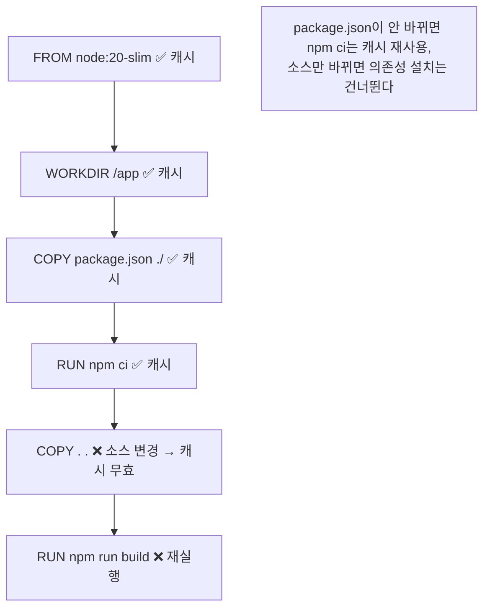
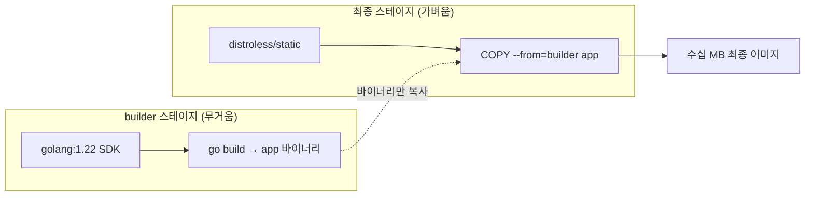
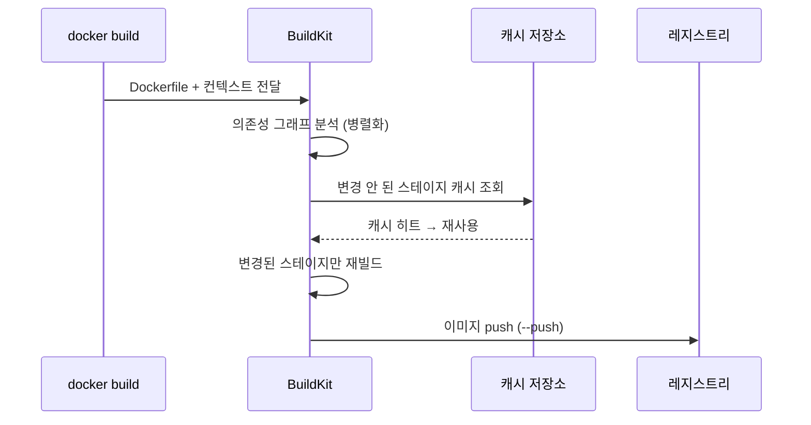

# Dockerfile과 이미지 빌드

::: info 학습 목표
- FROM·RUN·COPY·CMD·ENTRYPOINT·ARG·ENV 등 주요 Dockerfile 명령어의 역할과 차이를 설명할 수 있다.
- 각 명령어가 레이어를 만든다는 사실과, 빌드 캐시가 무효화되는 조건을 이해한다.
- 멀티스테이지 빌드로 빌드 도구를 최종 이미지에서 분리하는 패턴을 익힌다.
- 베이스 이미지 선택·distroless·.dockerignore로 이미지를 작고 안전하게 최적화한다.
- BuildKit이 무엇이고 왜 기본 빌더가 됐는지 안다.
:::

## 1. Dockerfile 명령어 — 이미지의 설계도

<strong>Dockerfile</strong>은 이미지를 어떻게 만들지 한 줄씩 적은 텍스트 파일이다. 각 명령은 위에서 아래로 순서대로 실행된다. 전체 명세는 [Dockerfile reference](https://docs.docker.com/reference/dockerfile/)에 있다. 핵심 명령어를 먼저 정리한다.

| 명령어 | 역할 |
|--------|------|
| `FROM` | 베이스 이미지 지정. 모든 Dockerfile의 시작점 |
| `RUN` | 빌드 시점에 셸 명령 실행 (패키지 설치, 컴파일 등) |
| `COPY` | 호스트의 파일을 이미지로 복사 |
| `ADD` | COPY + URL 다운로드 + tar 자동 해제 (특별한 이유 없으면 COPY 권장) |
| `WORKDIR` | 이후 명령의 작업 디렉터리 설정 |
| `ENV` | 이미지·컨테이너에 영구적으로 남는 환경변수 |
| `ARG` | 빌드 시점에만 쓰는 변수 (이미지에 남지 않음) |
| `EXPOSE` | 문서화 목적의 포트 선언 (실제 매핑은 run의 -p) |
| `USER` | 이후 명령과 컨테이너 실행 사용자 지정 |
| `CMD` | 컨테이너 시작 시 실행할 기본 명령(덮어쓰기 가능) |
| `ENTRYPOINT` | 컨테이너의 고정 실행 진입점 |

가장 헷갈리는 것이 <strong>CMD와 ENTRYPOINT</strong>다.

- `ENTRYPOINT`는 "이 컨테이너는 무슨 프로그램인가"를 고정한다.
- `CMD`는 그 프로그램에 넘길 "기본 인자"를 제공하며, `docker run` 뒤에 인자를 주면 덮어써진다.

```dockerfile
# ENTRYPOINT로 실행 파일을 고정, CMD로 기본 인자를 제공
ENTRYPOINT ["python", "app.py"]
CMD ["--port", "8080"]
# docker run img            → python app.py --port 8080
# docker run img --port 9090 → python app.py --port 9090
```

또한 `ARG`와 `ENV`의 차이도 중요하다. `ARG`는 빌드 중에만 살아 있고 최종 이미지에 흔적이 남지 않는다. `ENV`는 이미지에 박혀 컨테이너 런타임까지 따라간다. 따라서 빌드용 토큰 같은 민감 값은 절대 `ENV`로 넣지 않는다.

```dockerfile
ARG APP_VERSION=1.0.0      # 빌드 시점에만 유효
ENV NODE_ENV=production    # 컨테이너 런타임까지 유지
```

## 2. 레이어와 빌드 캐시 — 빠른 빌드의 핵심

`FROM`, `RUN`, `COPY` 같은 명령어는 <strong>각각 하나의 레이어</strong>를 만든다. 도커는 빌드 시 각 명령의 결과를 캐시해 두고, 다음 빌드에서 <strong>변경되지 않은 명령은 캐시를 재사용</strong>한다. 이 캐시 동작을 이해하는 것이 빌드 속도의 전부다.

핵심 규칙: <strong>한 레이어의 캐시가 깨지면, 그 아래(이후)의 모든 레이어 캐시도 함께 깨진다.</strong>



여기서 <strong>의존성 설치와 소스 복사를 분리</strong>하는 패턴이 나온다. 의존성 정의 파일을 먼저 복사·설치한 뒤, 자주 바뀌는 소스 코드를 나중에 복사하면, 소스만 고쳤을 때 무거운 의존성 설치 단계를 캐시로 건너뛸 수 있다.

```dockerfile
# 나쁜 예: 소스가 한 글자만 바뀌어도 npm ci가 매번 재실행
COPY . .
RUN npm ci

# 좋은 예: 의존성 정의를 먼저 복사해 캐시를 살린다
COPY package.json package-lock.json ./
RUN npm ci
COPY . .
```

또 `RUN`을 무분별하게 나누면 레이어가 늘어난다. 관련 명령은 `&&`로 묶고, 패키지 캐시는 같은 레이어에서 정리한다.

```dockerfile
RUN apt-get update \
 && apt-get install -y --no-install-recommends curl ca-certificates \
 && rm -rf /var/lib/apt/lists/*
```

## 3. 멀티스테이지 빌드 — 빌드 도구를 버리고 결과만 남기기

컴파일 언어나 번들링이 필요한 앱은 빌드에 컴파일러·SDK·node_modules 같은 무거운 도구가 필요하다. 하지만 <strong>실행에는 결과물(바이너리, 정적 파일)만 필요하다</strong>. 이 둘을 분리하는 것이 [멀티스테이지 빌드(multi-stage build)](https://docs.docker.com/build/building/multi-stage/)다.



Go 애플리케이션 예시다. 빌드 스테이지에서 컴파일하고, 최종 스테이지에는 바이너리 하나만 가져온다.

```dockerfile
# 1단계: 빌드 (SDK 포함, 무거움)
FROM golang:1.22 AS builder
WORKDIR /src
COPY go.mod go.sum ./
RUN go mod download
COPY . .
RUN CGO_ENABLED=0 go build -o /app ./cmd/server

# 2단계: 실행 (바이너리만, 매우 가벼움)
FROM gcr.io/distroless/static-debian12
COPY --from=builder /app /app
USER nonroot:nonroot
ENTRYPOINT ["/app"]
```

`COPY --from=builder`가 핵심이다. 앞 스테이지의 산출물만 골라 가져오므로, SDK·소스·캐시는 최종 이미지에 전혀 포함되지 않는다. 수백 MB짜리 빌드 환경이 수십 MB 이하 이미지로 줄어든다.

Node 앱이라면 빌드 스테이지에서 번들하고, 실행 스테이지에서 production 의존성만 설치하는 식으로 응용한다.

```dockerfile
FROM node:20 AS build
WORKDIR /app
COPY package*.json ./
RUN npm ci
COPY . .
RUN npm run build

FROM node:20-slim AS runtime
WORKDIR /app
ENV NODE_ENV=production
COPY package*.json ./
RUN npm ci --omit=dev
COPY --from=build /app/dist ./dist
USER node
CMD ["node", "dist/main.js"]
```

## 4. 이미지 최적화 — 작고 안전하게

이미지를 작게 만들면 <strong>풀 속도·배포 시간·공격 표면(attack surface)</strong>이 모두 좋아진다. 핵심 기법을 정리한다.

<strong>(1) 베이스 이미지 선택</strong>: 같은 런타임이라도 베이스에 따라 크기가 크게 다르다.

| 베이스 | 특징 |
|--------|------|
| `ubuntu` / `debian` | 풀 OS. 디버깅 편하지만 크고 패키지 취약점이 많다 |
| `*-slim` | 불필요한 패키지를 뺀 경량 변형 |
| `alpine` | musl libc 기반, 수 MB대. 단 glibc 호환 이슈 주의 |
| `distroless` | 셸·패키지 매니저조차 없는 최소 런타임. 가장 안전 |

<strong>(2) distroless</strong>: 구글의 [distroless](https://github.com/GoogleContainerTools/distroless) 이미지는 셸, apt, busybox 같은 것 없이 애플리케이션과 런타임 의존성만 담는다. 침입자가 셸을 못 잡으니 공격이 어렵고, 취약점이 들어올 표면이 작다. 대신 `docker exec ... sh`로 들어갈 수 없어 디버깅 방식이 달라진다(임시 디버그 컨테이너 사용).

<strong>(3) .dockerignore</strong>: 빌드 컨텍스트(`docker build`가 데몬에 보내는 파일들)에서 불필요한 것을 제외한다. `.git`, `node_modules`, 빌드 산출물, 비밀 파일을 빼면 컨텍스트 전송이 빨라지고 비밀이 이미지에 새는 사고를 막는다.

```gitignore
# .dockerignore
.git
node_modules
dist
*.log
.env
Dockerfile
**/.DS_Store
```

::: warning 비밀(secret)을 이미지에 굽지 말 것
`COPY .env`나 `ARG`로 받은 토큰은 레이어 히스토리에 남아 `docker history`로 들여다보일 수 있다. 빌드 타임 비밀이 필요하면 BuildKit의 `--secret` 마운트를 써서 레이어에 흔적을 남기지 않는다.
:::

## 5. BuildKit — 현대적 빌드 엔진

<strong>BuildKit</strong>은 현재 도커의 기본 빌드 엔진이다(`docker build`가 내부적으로 사용). 자세한 내용은 [BuildKit 문서](https://docs.docker.com/build/buildkit/)에 있다. 과거 레거시 빌더 대비 다음 장점이 있다.

- <strong>병렬 빌드</strong>: 의존성 그래프를 분석해 독립적인 스테이지를 동시에 빌드한다.
- <strong>효율적 캐시</strong>: 변경된 부분만 정밀하게 다시 빌드하고, 원격 캐시(레지스트리) 공유를 지원한다.
- <strong>빌드 시크릿</strong>: `--secret`으로 비밀을 레이어에 남기지 않고 주입한다.
- <strong>캐시 마운트</strong>: `RUN --mount=type=cache`로 패키지 매니저 캐시를 빌드 간에 재사용한다.

```dockerfile
# syntax=docker/dockerfile:1

# 빌드 시크릿: 레이어에 남지 않게 토큰을 주입
RUN --mount=type=secret,id=npmrc,target=/root/.npmrc \
    npm ci

# 캐시 마운트: pip 다운로드 캐시를 빌드끼리 공유
RUN --mount=type=cache,target=/root/.cache/pip \
    pip install -r requirements.txt
```

```bash
# 시크릿을 전달하며 빌드 (값이 이미지에 남지 않는다)
docker build --secret id=npmrc,src=$HOME/.npmrc -t myapp:1.0 .
```



`docker buildx`를 쓰면 한 번의 빌드로 여러 아키텍처(amd64/arm64) 이미지를 만드는 멀티플랫폼 빌드도 가능하다.

```bash
docker buildx build --platform linux/amd64,linux/arm64 -t myapp:1.0 --push .
```

::: tip 핵심 정리
- Dockerfile의 각 명령은 레이어를 만들고, <strong>한 레이어 캐시가 깨지면 이후 레이어가 모두 깨진다</strong>. 의존성 설치와 소스 복사를 분리해 캐시를 살린다.
- `ENTRYPOINT`는 "무슨 프로그램인가"를 고정하고, `CMD`는 덮어쓸 수 있는 기본 인자를 준다. `ARG`는 빌드용, `ENV`는 런타임까지 남는다.
- <strong>멀티스테이지 빌드</strong>로 빌드 도구를 버리고 산출물만 남겨 이미지를 극적으로 줄인다.
- <strong>distroless·slim·.dockerignore</strong>로 크기와 공격 표면을 줄이고, 비밀은 BuildKit `--secret`으로 레이어에 남기지 않는다.
:::

## 다음 챕터

이미지를 만들었으니 컨테이너끼리, 그리고 바깥세상과 어떻게 연결되는지 볼 차례다. [컨테이너 네트워크와 볼륨](/study/kubernetes/04-container-network-volume)에서 네트워크 드라이버·포트 매핑·볼륨·Docker Compose를 다룬다.
