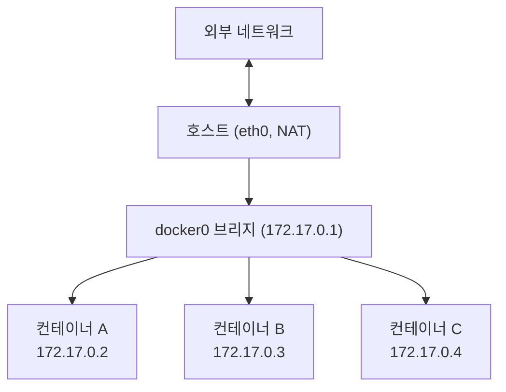
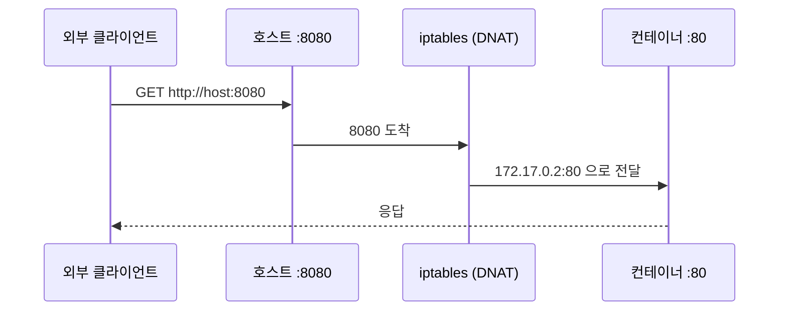
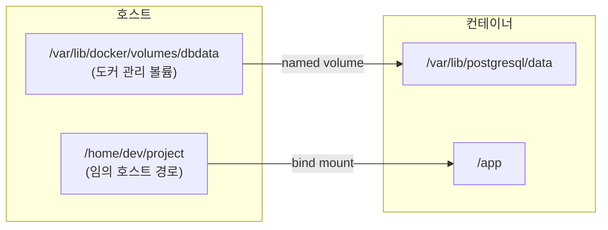
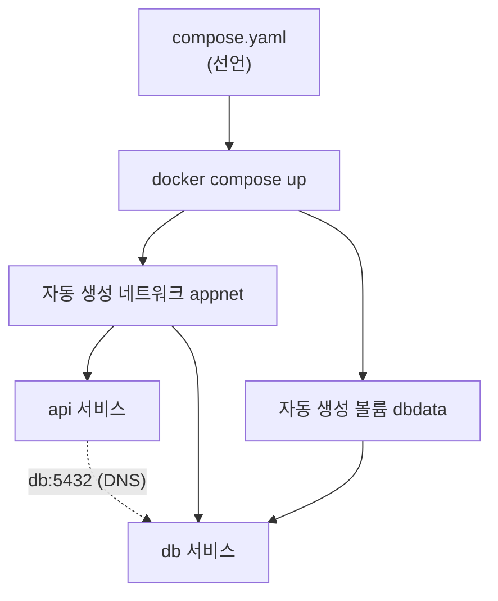

# 컨테이너 네트워크와 볼륨

::: info 학습 목표
- bridge·host·none·overlay 네트워크 드라이버가 각각 어떤 격리·연결 모델인지 설명할 수 있다.
- 포트 매핑(-p)이 호스트와 컨테이너를 어떻게 연결하는지 이해한다.
- 사용자 정의 네트워크에서 컨테이너 이름으로 통신하는 내장 DNS의 동작을 안다.
- 볼륨과 바인드 마운트의 차이, 그리고 컨테이너 데이터 영속성 전략을 익힌다.
- Docker Compose로 여러 컨테이너를 선언적으로 묶어 띄울 수 있다.
:::

## 1. 네트워크 드라이버 — bridge, host, none, overlay

컨테이너는 [네트워크 namespace](/study/kubernetes/01-container-basics) 덕에 자기만의 네트워크 스택을 가진다. 이 스택을 호스트·외부와 어떻게 연결할지 결정하는 것이 <strong>네트워크 드라이버</strong>다. 전체 설명은 [Docker networking](https://docs.docker.com/engine/network/)에 있다.

| 드라이버 | 동작 | 용도 |
|----------|------|------|
| `bridge` | 가상 브리지(docker0)에 연결, NAT로 외부 접속 | 단일 호스트 기본값 |
| `host` | 호스트의 네트워크 스택을 그대로 공유 (격리 없음) | 최고 성능이 필요할 때 |
| `none` | 네트워크 인터페이스 없음 (loopback만) | 완전 격리 |
| `overlay` | 여러 호스트의 컨테이너를 한 가상 네트워크로 연결 | Swarm·멀티 호스트 |

<strong>bridge</strong>가 기본이자 가장 중요하다. 도커는 `docker0`라는 가상 브리지를 만들고, 각 컨테이너에 가상 이더넷 쌍(veth pair)을 꽂아 사설 IP를 준다. 외부로 나갈 때는 호스트가 NAT(masquerade)로 변환한다.



<strong>host</strong> 모드는 NAT·veth를 거치지 않고 호스트 스택을 직접 쓴다. 포트 매핑이 없어 컨테이너가 80번을 열면 호스트 80번이 곧 그것이다. 빠르지만 포트 충돌과 격리 상실이라는 대가가 따른다. <strong>none</strong>은 외부 연결이 전혀 없는 완전 격리 환경이다. <strong>overlay</strong>는 여러 호스트에 걸친 컨테이너를 하나의 L2 네트워크처럼 묶으며, 쿠버네티스의 CNI 오버레이 개념의 선조 격이다.

## 2. 포트 매핑 — 컨테이너를 외부에 노출하기

bridge 네트워크의 컨테이너는 사설 IP를 가지므로 호스트 바깥에서 직접 닿을 수 없다. 외부에서 접속하려면 <strong>포트 매핑(port publishing)</strong>으로 호스트의 포트를 컨테이너 포트에 연결한다.

```bash
# 호스트 8080 → 컨테이너 80 으로 매핑
docker run -d -p 8080:80 nginx

# 특정 인터페이스에만 바인딩 (보안상 권장)
docker run -d -p 127.0.0.1:8080:80 nginx

# 호스트 포트를 자동 할당
docker run -d -P nginx
```

`-p 8080:80`은 "호스트의 8080으로 들어온 트래픽을 컨테이너의 80으로 전달하라"는 뜻이며, 내부적으로 iptables DNAT 규칙으로 구현된다. Dockerfile의 `EXPOSE`는 문서화일 뿐 실제 매핑이 아니라는 점을 다시 확인해 둔다.



## 3. 컨테이너 간 통신과 DNS

같은 호스트의 컨테이너끼리 통신할 때, 기본 bridge 네트워크는 IP로만 통신할 수 있어 불편하다. 반면 <strong>사용자 정의 네트워크(user-defined bridge)</strong>를 만들면 도커의 <strong>내장 DNS</strong>가 동작해 <strong>컨테이너 이름으로 서로를 찾을 수 있다</strong>. 이것이 실무에서 사용자 정의 네트워크를 쓰는 가장 큰 이유다.

```bash
# 사용자 정의 네트워크 생성
docker network create appnet

# 두 컨테이너를 같은 네트워크에 연결
docker run -d --name db --network appnet postgres:16
docker run -d --name api --network appnet myapp:1.0

# api 컨테이너 안에서 "db"라는 이름으로 DB에 접속 가능
docker exec api ping db        # 이름이 IP로 해석된다
```

api 컨테이너의 코드에서 DB 호스트를 `db:5432`로 적으면 된다. IP가 바뀌어도 이름은 그대로이므로 설정이 견고해진다. 이 "이름 기반 서비스 디스커버리"는 쿠버네티스의 [Service·DNS](/study/kubernetes/28-dns-discovery)에서 훨씬 정교하게 확장된다.

::: tip 기본 bridge vs 사용자 정의 bridge
도커가 자동으로 만드는 기본 `bridge` 네트워크는 DNS 이름 해석을 제공하지 않는다(레거시 `--link`만 가능). 컨테이너 간 통신이 필요하면 항상 `docker network create`로 사용자 정의 네트워크를 만들어 쓴다.
:::

## 4. 볼륨과 바인드 마운트 — 데이터 영속성

컨테이너의 쓰기 레이어에 저장한 데이터는 컨테이너를 지우면 사라진다. 데이터베이스·업로드 파일처럼 살아남아야 하는 데이터는 컨테이너 바깥에 저장해야 한다. 도커는 두 가지 방식을 제공한다. 자세한 비교는 [Manage data in Docker](https://docs.docker.com/engine/storage/)에 있다.

- <strong>볼륨(volume)</strong>: 도커가 관리하는 저장소(`/var/lib/docker/volumes/`). 호스트 경로를 신경 쓸 필요 없고, 이식성·백업·드라이버 확장이 좋다. <strong>운영 데이터의 표준</strong>.
- <strong>바인드 마운트(bind mount)</strong>: 호스트의 특정 경로를 컨테이너에 직접 연결. 호스트 파일을 즉시 반영하므로 개발 중 소스 코드 공유에 적합하다.



```bash
# 명명된 볼륨 생성 후 DB 데이터를 영속화
docker volume create dbdata
docker run -d --name db -v dbdata:/var/lib/postgresql/data postgres:16

# 바인드 마운트: 호스트 소스를 컨테이너에 직접 연결 (개발용)
docker run -d -v $(pwd):/app -w /app node:20 npm run dev

# 읽기 전용 마운트
docker run -v dbdata:/data:ro alpine
```

이제 `db` 컨테이너를 삭제했다 다시 만들어도, `dbdata` 볼륨을 같은 경로에 마운트하면 데이터가 그대로 남아 있다. <strong>컨테이너는 일회용, 데이터는 볼륨에</strong> — 이 원칙이 컨테이너 운영의 기본이며 쿠버네티스의 [PV/PVC](/study/kubernetes/30-volume-pv-pvc)로 그대로 이어진다.

::: warning 바인드 마운트의 함정
바인드 마운트는 호스트의 실제 파일을 노출하므로, 컨테이너가 그 경로를 변조할 수 있고 호스트 보안에 영향을 준다. 운영에서 영속 데이터는 볼륨을 쓰고, 바인드 마운트는 개발 환경의 소스 핫리로드 정도로 한정하는 것이 안전하다.
:::

## 5. Docker Compose 기초

실제 애플리케이션은 앱·DB·캐시 등 여러 컨테이너로 구성된다. 이를 매번 `docker run`으로 띄우면 옵션이 길어지고 재현이 어렵다. <strong>Docker Compose</strong>는 여러 컨테이너·네트워크·볼륨을 하나의 YAML 파일로 <strong>선언적으로</strong> 정의하고 한 번에 띄운다. 자세한 내용은 [Compose 문서](https://docs.docker.com/compose/)를 참고한다.

```yaml
# compose.yaml
services:
  api:
    build: .                 # 현재 디렉터리의 Dockerfile로 빌드
    ports:
      - "8080:8080"
    environment:
      DB_HOST: db            # 서비스 이름으로 DB에 접속
      DB_PORT: "5432"
    depends_on:
      - db
    networks:
      - appnet

  db:
    image: postgres:16
    environment:
      POSTGRES_PASSWORD: secret
    volumes:
      - dbdata:/var/lib/postgresql/data   # 명명된 볼륨으로 영속화
    networks:
      - appnet

volumes:
  dbdata:

networks:
  appnet:
```

```bash
# 전체 스택을 백그라운드로 기동
docker compose up -d

# 로그 확인 / 상태 확인
docker compose logs -f
docker compose ps

# 전체 정리 (볼륨까지 지우려면 -v)
docker compose down
docker compose down -v
```

Compose는 정의된 서비스를 위한 네트워크를 자동으로 만들어 주므로, `api`에서 DB 호스트를 그냥 `db`로 적으면 내장 DNS로 해석된다. 별도 `docker network create`가 필요 없다.



Compose의 "여러 컨테이너를 선언적으로 묶는다"는 발상은 쿠버네티스의 매니페스트와 곧장 연결된다. 다만 Compose는 단일 호스트 중심이고, 쿠버네티스는 다중 노드 클러스터에서 스케줄링·자가치유·확장까지 책임진다는 점이 다르다.

::: tip 핵심 정리
- <strong>bridge</strong>가 단일 호스트 기본 네트워크이며 NAT로 외부와 연결된다. host는 격리를 버린 고성능, none은 완전 격리, overlay는 멀티 호스트용이다.
- <strong>포트 매핑(-p)</strong>은 iptables DNAT로 호스트 포트를 컨테이너 포트에 연결한다. EXPOSE는 문서일 뿐 실제 매핑이 아니다.
- <strong>사용자 정의 네트워크</strong>에서는 내장 DNS로 컨테이너 이름 통신이 가능하다. 기본 bridge에는 이 기능이 없다.
- 영속 데이터는 <strong>볼륨</strong>에 둔다(컨테이너는 일회용). 바인드 마운트는 개발용 소스 공유에 한정한다.
- <strong>Docker Compose</strong>는 다중 컨테이너 앱을 YAML로 선언해 한 번에 띄우며, 쿠버네티스 매니페스트의 사고방식으로 이어진다.
:::

## 다음 챕터

도커 위에서 컨테이너를 다뤄봤으니, 이제 그 아래에서 컨테이너를 실제로 실행하는 엔진을 들여다본다. [컨테이너 런타임 심화](/study/kubernetes/05-container-runtime)에서 OCI 표준·runc·containerd·CRI와 샌드박스 런타임을 다룬다.
