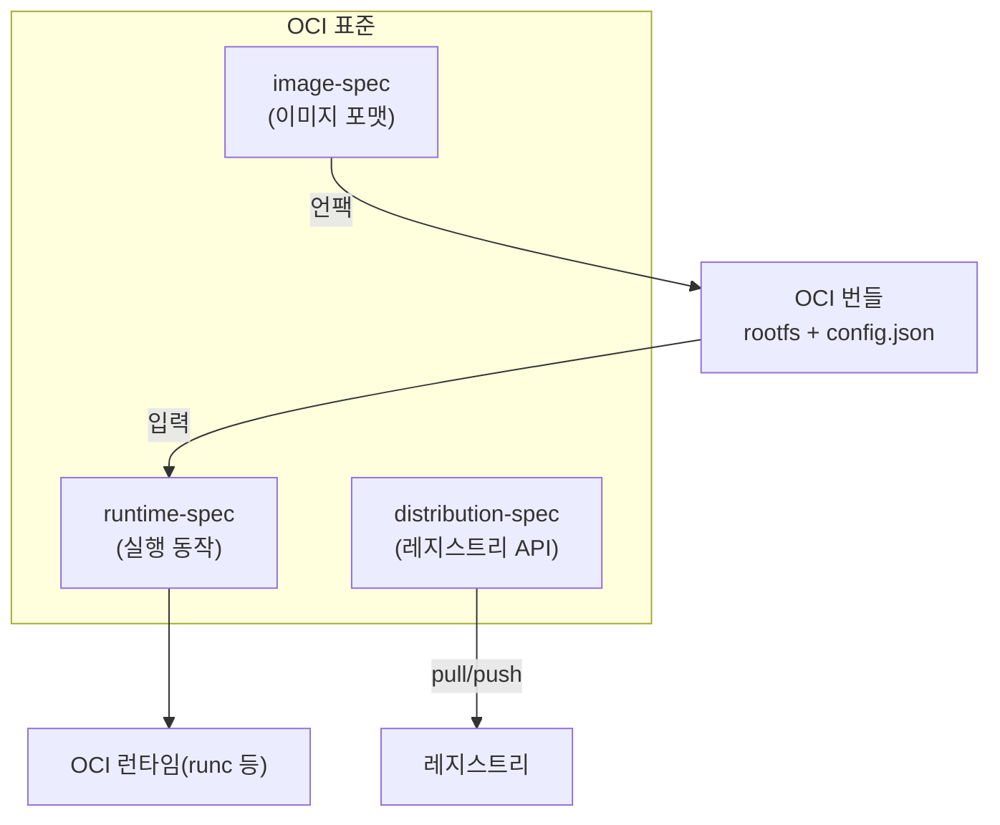
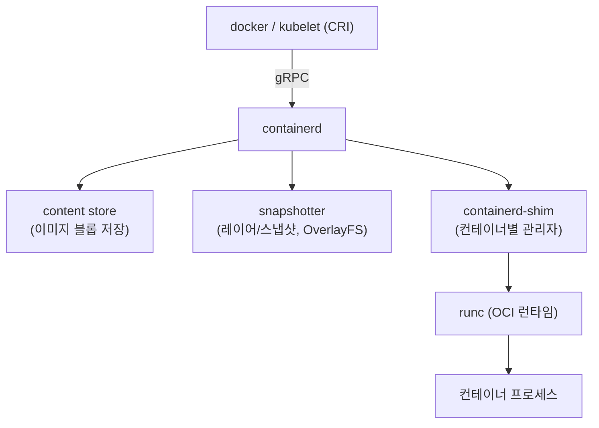
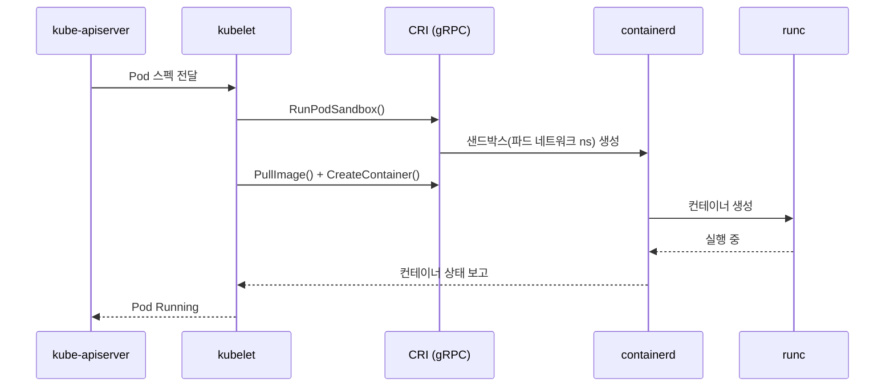
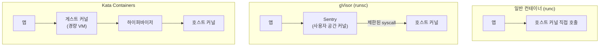

# 컨테이너 런타임 심화

::: info 학습 목표
- OCI 표준의 image-spec과 runtime-spec이 각각 무엇을 규정하는지 이해한다.
- runc 같은 low-level 런타임과 containerd 같은 high-level 런타임의 역할 분담을 설명할 수 있다.
- containerd 아키텍처(content store, snapshotter, shim)의 구성을 안다.
- CRI(Container Runtime Interface)가 무엇이고 쿠버네티스가 런타임과 어떻게 연결되는지 이해한다.
- gVisor·Kata 같은 샌드박스 런타임이 격리를 어떻게 강화하는지 설명할 수 있다.
:::

## 1. OCI 표준 — 컨테이너의 공통 규약

컨테이너 생태계가 도커에 종속되지 않고 발전할 수 있었던 이유는 <strong>OCI(Open Container Initiative)</strong> 표준 덕분이다. OCI는 컨테이너의 "이미지 포맷"과 "실행 방식"을 벤더 중립적으로 규정해, 어느 도구로 만든 이미지든 어느 런타임에서든 돌게 만든다.

OCI는 세 가지 명세로 구성된다.

- <strong>image-spec</strong>: 이미지가 어떤 구조여야 하는지 규정한다. 레이어(tar), 설정(config JSON), 매니페스트, 다이제스트로 이뤄진 포맷이다. `docker build`로 만든 이미지든 buildah로 만든 이미지든 이 규격을 따르므로 서로 호환된다.
- <strong>runtime-spec</strong>: 풀어 놓은 파일시스템(rootfs)과 설정(`config.json`)을 받아 "컨테이너를 어떻게 생성·시작·정지·삭제하는가"의 표준 동작을 규정한다.
- <strong>distribution-spec</strong>: 레지스트리가 이미지를 주고받는 HTTP API를 규정한다.



핵심은 <strong>"이미지"와 "실행"의 분리</strong>다. 이미지 빌드 도구와 런타임이 OCI라는 합의된 인터페이스로 만나므로, 도커가 아니어도 같은 이미지를 쓸 수 있다. 명세 원문은 [OCI 표준 저장소](https://opencontainers.org/)에서 확인할 수 있다.

## 2. runc와 low-level 런타임

<strong>runc</strong>는 OCI runtime-spec의 참조 구현이다. rootfs와 `config.json`이 담긴 <strong>OCI 번들(bundle)</strong>을 받아, [namespace와 cgroup](/study/kubernetes/01-container-basics)을 설정하고 실제 프로세스를 띄운다. runc가 하는 일이 곧 1장에서 본 "격리된 프로세스 만들기"의 실체다.

runc는 한 컨테이너를 만들고 나면 빠진다(자기 역할만 하고 종료). 그래서 <strong>low-level(저수준) 런타임</strong>이라 부른다. 이미지 풀, 네트워크, 여러 컨테이너의 생명주기 관리 같은 상위 작업은 하지 않는다.

```bash
# runc로 컨테이너를 직접 실행해 보기 (도커 없이)
mkdir -p mycontainer/rootfs
# alpine rootfs를 풀어 넣은 뒤
docker export $(docker create alpine) | tar -C mycontainer/rootfs -xf -

cd mycontainer
runc spec                 # 기본 config.json 생성
runc run demo             # OCI 번들로 컨테이너 실행
```

runc 외에도 OCI runtime-spec을 구현한 런타임이 여럿 있고, 이들은 같은 인터페이스(`runtime-spec`)를 따르므로 서로 교체 가능하다.

| low-level 런타임 | 특징 |
|------------------|------|
| `runc` | 표준 참조 구현. 네이티브 격리 |
| `crun` | C로 작성, 더 가볍고 빠름 |
| `runsc` (gVisor) | 사용자 공간 커널로 시스템 콜을 가로채 격리 강화 |
| `kata-runtime` | 경량 VM으로 각 컨테이너를 감쌈 |

## 3. containerd 아키텍처 — high-level 런타임

runc가 컨테이너 하나를 "만드는" 손이라면, <strong>containerd</strong>는 그 위에서 이미지 관리·스토리지·다수 컨테이너의 생명주기를 총괄하는 <strong>high-level(고수준) 런타임</strong>이다. 도커도, 쿠버네티스도 그 아래에 containerd를 둔다.



containerd의 주요 구성 요소는 다음과 같다.

- <strong>content store</strong>: 레지스트리에서 받은 이미지 블롭(레이어, 설정)을 콘텐츠 주소(다이제스트) 기반으로 저장한다.
- <strong>snapshotter</strong>: 레이어로부터 컨테이너의 루트 파일시스템을 구성한다. [OverlayFS](/study/kubernetes/01-container-basics) 같은 스냅샷터로 Copy-on-Write를 구현한다.
- <strong>containerd-shim</strong>: 각 컨테이너마다 하나씩 떠서 runc를 호출하고, 그 컨테이너의 생명주기를 책임진다. shim이 있어 <strong>containerd 데몬을 재시작해도 실행 중인 컨테이너는 죽지 않는다</strong> — 운영상 매우 중요한 설계다.

이 분리 덕분에 containerd는 "무엇을 어떻게 실행할지" 정책만 관리하고, 실제 격리·실행은 runc(또는 다른 OCI 런타임)에 위임한다. 런타임을 바꾸면 같은 containerd 위에서 gVisor·Kata로 격리 수준을 갈아끼울 수 있다.

::: tip 도커 vs containerd, 쿠버네티스의 선택
쿠버네티스 1.24에서 dockershim이 제거됐다. 이는 "도커 이미지를 못 쓴다"가 아니라, kubelet이 도커 데몬을 거치지 않고 <strong>containerd(또는 CRI-O)를 직접</strong> 호출한다는 뜻이다. 이미지는 OCI 표준이라 그대로 동작한다.
:::

## 4. CRI와 쿠버네티스 연계

쿠버네티스의 노드 에이전트인 <strong>kubelet</strong>은 특정 런타임에 종속되지 않도록 <strong>CRI(Container Runtime Interface)</strong>라는 gRPC 인터페이스를 통해 런타임과 대화한다. CRI는 "파드/컨테이너를 만들고, 이미지를 풀고, 상태를 보고하라"는 표준 호출 규약이다. 공식 설명은 [Container Runtimes (CRI)](https://kubernetes.io/docs/concepts/architecture/cri/)에 있다.

CRI를 구현한 런타임이 kubelet에 꽂힌다.

- <strong>containerd</strong>: CRI 플러그인을 내장해 kubelet과 직접 통신한다. 가장 널리 쓰인다.
- <strong>CRI-O</strong>: 쿠버네티스 전용으로 설계된 가벼운 CRI 런타임.



흐름을 한 줄로 요약하면 이렇다. <strong>kube-apiserver → kubelet → CRI → containerd → runc → 컨테이너</strong>. 위로 갈수록 "무엇을 원하는가(선언)"에 가깝고, 아래로 갈수록 "어떻게 만드는가(실행)"에 가깝다. 이 계층 분리가 쿠버네티스가 다양한 런타임을 품을 수 있는 근거다.

CRI에는 "파드 샌드박스(PodSandbox)"라는 개념이 등장하는데, 이는 파드 내 컨테이너들이 공유할 네트워크 namespace 등을 먼저 만드는 단계다. 이 부분은 [클러스터 아키텍처](/study/kubernetes/07-cluster-architecture)와 [Pod](/study/kubernetes/15-pod) 챕터에서 이어진다.

## 5. 샌드박스 런타임 — gVisor와 Kata

1장에서 본 컨테이너의 한계, 즉 <strong>커널 공유로 인한 격리 약화</strong>를 보완하려는 것이 <strong>샌드박스 런타임</strong>이다. 멀티테넌트 환경(신뢰할 수 없는 코드를 같은 노드에서 돌릴 때)에서 특히 중요하다. 둘은 접근이 다르다.



- <strong>gVisor</strong>: 구글이 만든 런타임으로, <strong>Sentry</strong>라는 사용자 공간 커널이 컨테이너의 시스템 콜을 가로채 처리한다. 앱이 호스트 커널을 직접 부르지 못하게 하므로, 커널 공격 표면이 극적으로 줄어든다. OCI 런타임 `runsc`로 동작해 containerd에 꽂을 수 있다. 대신 시스템 콜을 중계하는 오버헤드가 있다.
- <strong>Kata Containers</strong>: 각 컨테이너(또는 파드)를 <strong>경량 VM</strong>으로 감싼다. 게스트 커널과 하이퍼바이저 경계가 한 겹 더 생겨 VM 수준의 격리를 얻는다. 컨테이너의 사용 편의성과 VM의 강한 격리를 절충한 형태다.

쿠버네티스에서는 [RuntimeClass](https://kubernetes.io/docs/concepts/containers/runtime-class/)로 워크로드별 런타임을 선택할 수 있다. 신뢰도가 낮은 워크로드만 gVisor로 돌리는 식이다.

```yaml
apiVersion: node.k8s.io/v1
kind: RuntimeClass
metadata:
  name: gvisor
handler: runsc        # containerd에 등록된 gVisor 핸들러
---
apiVersion: v1
kind: Pod
metadata:
  name: untrusted-app
spec:
  runtimeClassName: gvisor   # 이 파드만 샌드박스 런타임으로 실행
  containers:
    - name: app
      image: untrusted/app:1.0
```

::: warning 격리에는 비용이 따른다
샌드박스 런타임은 안전하지만 시스템 콜 중계(gVisor)나 VM 부팅·메모리(Kata)로 인한 성능·자원 오버헤드가 있다. 모든 워크로드에 적용하기보다, 신뢰할 수 없는 코드나 강한 테넌트 격리가 필요한 곳에 선별 적용하는 것이 실무적이다.
:::

::: tip 핵심 정리
- <strong>OCI</strong>는 image-spec(포맷)·runtime-spec(실행)·distribution-spec(레지스트리)으로 이미지와 실행을 표준화해 벤더 종속을 끊었다.
- <strong>runc</strong>는 OCI 번들을 받아 namespace·cgroup을 설정하는 low-level 런타임이고, <strong>containerd</strong>는 이미지·스토리지·생명주기를 총괄하는 high-level 런타임이다. shim 덕에 containerd 재시작에도 컨테이너는 산다.
- 쿠버네티스는 <strong>CRI</strong>로 런타임과 대화하며 흐름은 kubelet → CRI → containerd → runc → 컨테이너로 이어진다. dockershim 제거는 이미지 호환을 깨지 않는다.
- <strong>gVisor·Kata</strong>는 커널 공유의 한계를 보완하는 샌드박스 런타임이며, RuntimeClass로 워크로드별로 선택 적용한다.
:::

## 다음 챕터

여기까지로 컨테이너의 원리부터 실행 엔진까지 모두 살펴봤다. 이제 이 컨테이너들을 여러 노드에 걸쳐 자동으로 운영하는 오케스트레이터로 넘어간다. [쿠버네티스란](/study/kubernetes/06-what-is-k8s)에서 오케스트레이션의 필요성과 선언적 모델, 등장 배경을 다룬다.
