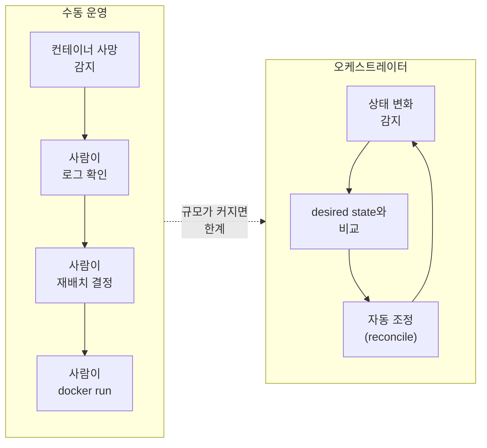
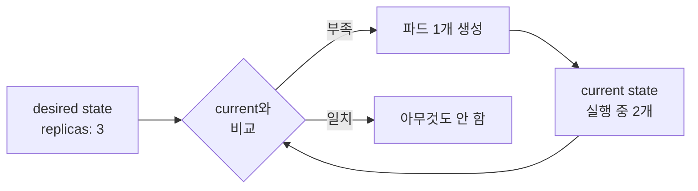
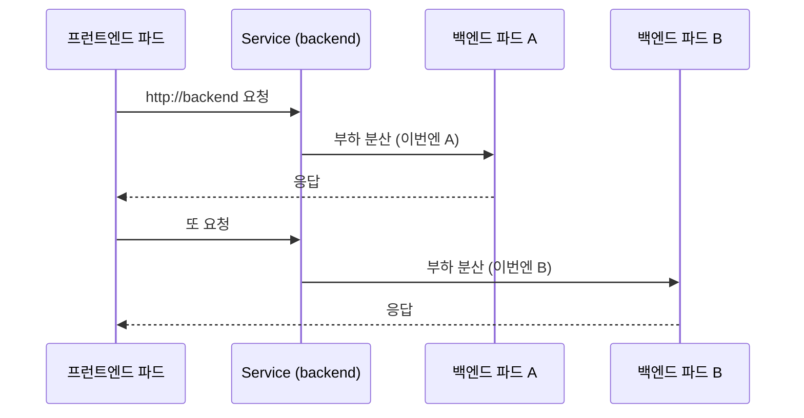

# 쿠버네티스란

::: info 학습 목표
- 단일 호스트의 컨테이너 운영이 어디서 한계를 맞는지, 왜 오케스트레이터가 필요한지 설명할 수 있다.
- 구글 Borg에서 출발한 쿠버네티스의 등장 배경과 설계 철학을 안다.
- 명령형(imperative) 모델과 선언형(declarative) 모델의 차이를 desired state 관점에서 설명할 수 있다.
- 셀프힐링·스케일링·서비스 디스커버리·롤아웃 같은 핵심 기능과, 쿠버네티스를 쓰지 말아야 할 상황을 구분할 수 있다.
:::

## 1. 컨테이너 오케스트레이션이 필요한 이유

앞선 장에서 본 것처럼, 도커 한 대로 컨테이너를 띄우는 일은 어렵지 않다. `docker run` 한 줄이면 프로세스가 격리된 채 실행된다. 문제는 컨테이너가 <strong>한 대의 호스트</strong>를 넘어서는 순간 시작된다.

운영 환경에서 서비스 하나는 보통 수십~수백 개의 컨테이너로 구성되고, 그 컨테이너들은 여러 대의 물리/가상 머신에 흩어져 돌아간다. 이때 사람이 직접 손으로 풀어야 할 문제가 폭발적으로 늘어난다.

- <strong>배치(scheduling)</strong>: 새 컨테이너를 어느 노드에 띄울 것인가? CPU·메모리 여유, 데이터 지역성, 노드 장애 도메인을 모두 고려해야 한다.
- <strong>장애 복구</strong>: 컨테이너가 죽거나 노드가 통째로 다운되면, 그 위에서 돌던 컨테이너를 누가 어디에 다시 띄우는가?
- <strong>확장/축소</strong>: 트래픽이 몰릴 때 인스턴스를 늘리고, 한산할 때 줄이는 일을 어떻게 자동화하는가?
- <strong>서비스 디스커버리</strong>: 컨테이너 IP는 재시작마다 바뀐다. 프런트엔드는 백엔드의 현재 IP를 어떻게 찾는가?
- <strong>무중단 배포</strong>: 새 버전을 내보내면서 기존 버전을 점진적으로 교체하고, 문제가 생기면 되돌리는 일을 어떻게 안전하게 하는가?

이 모든 것을 사람이 수동으로 처리하면 운영 비용이 선형이 아니라 기하급수적으로 늘어난다. <strong>컨테이너 오케스트레이션(container orchestration)</strong>은 바로 이 작업들 — 배치, 복구, 확장, 네트워킹, 배포 — 을 자동화하는 시스템을 가리킨다.



쿠버네티스는 이 영역에서 사실상 표준이 된 오픈소스 오케스트레이터다. 자세한 정의는 [쿠버네티스 개요 문서](https://kubernetes.io/docs/concepts/overview/)에서 확인할 수 있다.

## 2. 쿠버네티스의 등장 배경 — Borg와 Omega

쿠버네티스는 무에서 나온 것이 아니다. 그 뿌리는 구글이 10년 넘게 내부에서 운영한 클러스터 관리 시스템 <strong>Borg</strong>에 있다.

구글은 검색·지메일·맵 같은 서비스를 거대한 컴퓨팅 풀 위에서 돌리기 위해, 개별 머신이 아니라 "작업(job)"을 단위로 자원을 관리하는 시스템을 만들었다. Borg는 수만 대의 머신을 하나의 자원 풀로 추상화하고, 그 위에 작업을 던지면 알아서 배치·복구·확장하는 시스템이었다. 이후 Borg의 한계를 개선하려는 실험적 후속작이 <strong>Omega</strong>였다.

2014년, 구글은 Borg/Omega를 운영하며 얻은 교훈을 오픈소스로 풀어냈다. 그것이 쿠버네티스다. 그래서 쿠버네티스의 여러 설계 결정 — 선언적 desired state, 레이블 기반 그룹핑, 컨트롤러 패턴 — 은 Borg에서 검증된 아이디어를 계승한 것이다.

::: details "Kubernetes"라는 이름의 유래
그리스어로 <strong>키잡이(helmsman)·조타수</strong>를 뜻한다. 컨테이너(화물)를 실은 배를 조종한다는 은유다. 흔히 줄여서 <strong>K8s</strong>라고 쓰는데, K와 s 사이에 글자가 8개(`ubernete`)라서 붙은 약칭이다. 도커의 고래 로고, 쿠버네티스의 조타륜 로고가 모두 해운 테마인 이유가 여기 있다.
:::

쿠버네티스는 현재 <strong>CNCF(Cloud Native Computing Foundation)</strong>가 관리하는 졸업(graduated) 프로젝트이며, 특정 클라우드 벤더에 종속되지 않는 중립적 거버넌스 아래 발전하고 있다. 이 벤더 중립성은 "한 번 작성한 매니페스트를 AWS·GCP·Azure·온프레미스 어디서든 거의 그대로 돌릴 수 있다"는 이식성의 기반이 된다.

## 3. 선언적 모델과 desired state

쿠버네티스를 관통하는 가장 중요한 개념 하나만 꼽으라면 <strong>선언적 모델(declarative model)</strong>이다. 이걸 이해하면 쿠버네티스의 거의 모든 동작이 같은 원리의 반복임을 알게 된다.

<strong>명령형(imperative)</strong> 방식은 "무엇을 어떻게 하라"를 순서대로 지시한다.

```bash
# 명령형 — 단계를 직접 지시한다
docker run -d --name web nginx
docker run -d --name web2 nginx   # 하나 더 띄우고 싶으면 또 명령
# 하나가 죽으면? 사람이 다시 docker run 해야 한다
```

<strong>선언형(declarative)</strong> 방식은 "최종적으로 어떤 상태이길 원하는가"만 기술한다. "어떻게 거기에 도달할지"는 시스템이 알아서 한다.

```yaml
# 선언형 — 원하는 최종 상태만 기술한다
apiVersion: apps/v1
kind: Deployment
metadata:
  name: web
spec:
  replicas: 3          # "웹 파드가 항상 3개이길 원한다"
  selector:
    matchLabels:
      app: web
  template:
    metadata:
      labels:
        app: web
    spec:
      containers:
        - name: nginx
          image: nginx:1.27
```

이 매니페스트가 선언하는 것은 단 하나, "`web` 파드가 항상 3개 떠 있어야 한다"는 <strong>desired state(원하는 상태)</strong>다. 쿠버네티스는 클러스터의 <strong>current state(현재 상태)</strong>를 끊임없이 관찰하면서, 둘이 어긋나면 자동으로 메운다.



파드 하나가 죽어 2개가 되면, 시스템은 desired(3)와 current(2)의 차이를 감지하고 자동으로 하나를 더 띄운다. 이 "관찰 → 비교 → 조정"의 무한 반복을 <strong>reconcile loop</strong>라 하며, 이는 [10장 컨트롤러와 reconcile 루프](/study/kubernetes/10-controllers-reconcile)에서 깊이 다룬다.

선언적 모델의 실용적 이점은 명확하다.

- <strong>멱등성</strong>: 같은 매니페스트를 몇 번을 적용해도 결과는 같다. "이미 있으면 만들지 말고, 없으면 만들라"를 사람이 신경 쓸 필요가 없다.
- <strong>자기 문서화</strong>: 매니페스트 자체가 "이 시스템이 어떤 모습이어야 하는가"의 명세이자 형상 관리 대상이 된다(GitOps의 토대).
- <strong>복구 자동화</strong>: 현재 상태가 원하는 상태에서 벗어나면 시스템이 알아서 되돌린다.

## 4. 핵심 기능 — 셀프힐링·스케일링·디스커버리·롤아웃

선언적 모델 위에서 쿠버네티스가 제공하는 대표 기능들을 본다. 각각이 "desired state로 수렴시킨다"는 같은 원리의 다른 얼굴임에 주목한다.

### 셀프힐링(self-healing)

컨테이너가 크래시하거나, 응답하지 않거나(헬스 체크 실패), 노드가 통째로 죽으면 쿠버네티스는 자동으로 대체 파드를 다른 정상 노드에 띄운다. `replicas: 3`을 선언했다면, 무슨 일이 있어도 클러스터는 3개로 수렴하려 한다.

### 수평 확장/축소(scaling)

부하에 따라 인스턴스 수를 늘리거나 줄인다. 명령형으로 즉시 조정할 수도 있고,

```bash
kubectl scale deployment web --replicas=5
```

[HorizontalPodAutoscaler](https://kubernetes.io/docs/tasks/run-application/horizontal-pod-autoscale/)를 붙여 CPU·메모리·커스텀 메트릭에 따라 자동으로 조절할 수도 있다(23장에서 상세).

### 서비스 디스커버리와 로드 밸런싱

파드 IP는 재시작마다 바뀌므로 직접 참조하면 안 된다. 쿠버네티스는 <strong>Service</strong>라는 안정적인 가상 IP·DNS 이름을 제공하고, 그 뒤의 정상 파드들에게 트래픽을 분산한다. 프런트엔드는 `http://backend`처럼 이름만 알면 된다.



### 자동 롤아웃과 롤백(rollout/rollback)

새 버전 이미지를 선언하면 쿠버네티스가 기존 파드를 점진적으로 새 파드로 교체한다(rolling update). 도중에 문제가 감지되면 이전 버전으로 되돌릴 수 있다.

```bash
kubectl set image deployment/web nginx=nginx:1.28   # 롤아웃 시작
kubectl rollout status deployment/web               # 진행 상황 관찰
kubectl rollout undo deployment/web                 # 문제 시 롤백
```

이 외에도 ConfigMap/Secret을 통한 설정·민감정보 관리, 스토리지 오케스트레이션, 배치 작업 실행 등 광범위한 기능을 제공한다. 전체 목록은 [공식 개요 문서](https://kubernetes.io/docs/concepts/overview/#why-you-need-kubernetes)에 정리돼 있다.

## 5. 쿠버네티스를 쓰지 말아야 할 때

쿠버네티스는 강력하지만 <strong>공짜가 아니다</strong>. 도입과 운영에는 상당한 학습·운영 비용이 따른다. "남들이 쓰니까" 도입했다가 오히려 복잡도에 짓눌리는 경우가 흔하다. 다음 상황이라면 다시 생각해 봐야 한다.

::: warning 쿠버네티스가 과한 경우
- <strong>애플리케이션이 단순하고 작을 때</strong>: 컨테이너 한두 개로 충분한 서비스라면, 단일 VM·도커 컴포즈·관리형 PaaS(예: Cloud Run, App Service)가 훨씬 적은 비용으로 같은 일을 한다.
- <strong>팀에 운영 역량이 없을 때</strong>: 쿠버네티스는 네트워킹·스토리지·보안·업그레이드 등 운영 표면이 넓다. 이를 감당할 인력·지식이 없으면 클러스터 자체가 장애 원인이 된다.
- <strong>상태가 강하게 결합된 레거시</strong>: 컨테이너화·수평 확장이 본질적으로 어려운 모놀리식 시스템을 억지로 올리면 이득보다 고통이 크다.
- <strong>지연·자원에 극도로 민감한 워크로드</strong>: 오케스트레이션 계층이 주는 오버헤드가 허용되지 않는 특수 환경.
:::

또한 "쿠버네티스를 직접(self-managed) 운영"하는 것과 "관리형 쿠버네티스(EKS·GKE·AKS)를 쓰는 것"은 비용 구조가 전혀 다르다. 운영 역량이 부족하다면 control plane을 클라우드에 맡기는 관리형 서비스가 현실적인 출발점이다.

핵심은 <strong>"규모와 복잡도가 오케스트레이션의 가치를 정당화하는가"</strong>다. 여러 서비스, 잦은 배포, 탄력적 확장, 높은 가용성 요구가 있다면 쿠버네티스의 이점이 비용을 압도한다. 그렇지 않다면 더 단순한 도구가 정답일 수 있다.

::: tip 핵심 정리
- 컨테이너가 여러 호스트로 퍼지는 순간 배치·복구·확장·디스커버리·배포가 사람의 손으로 감당 안 되는 문제가 되고, 이를 자동화하는 것이 <strong>컨테이너 오케스트레이션</strong>이다.
- 쿠버네티스는 구글의 <strong>Borg</strong>에서 검증된 아이디어를 오픈소스로 풀어낸 것이며, CNCF 아래 벤더 중립적으로 발전한다.
- 쿠버네티스의 본질은 <strong>선언적 모델</strong>이다. "원하는 최종 상태(desired state)"만 기술하면 시스템이 current state와 비교해 자동으로 메운다.
- 셀프힐링·스케일링·서비스 디스커버리·롤아웃은 모두 "desired state로 수렴시킨다"는 같은 원리의 다른 표현이다.
- 작고 단순하거나 운영 역량이 없는 경우엔 쿠버네티스가 오히려 짐이 된다. 규모·복잡도가 그 비용을 정당화할 때 도입한다.
:::

## 다음 챕터

쿠버네티스가 "무엇이고 왜 필요한가"를 봤으니, 다음은 그 약속들이 실제로 어떤 구조 위에서 동작하는지 들여다본다. [7장 클러스터 아키텍처](/study/kubernetes/07-cluster-architecture)에서 control plane과 node 컴포넌트, 그리고 그것들이 어떻게 협력해 파드 하나를 띄우는지를 추적한다.
