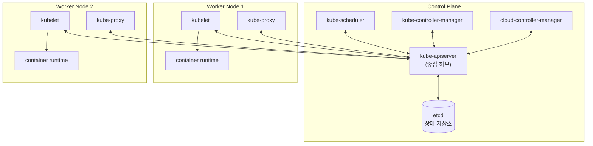
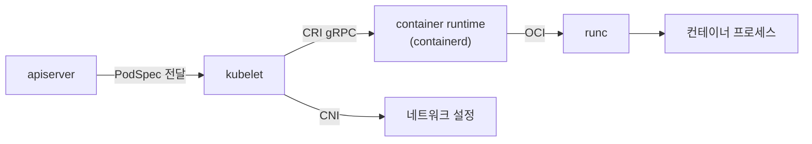
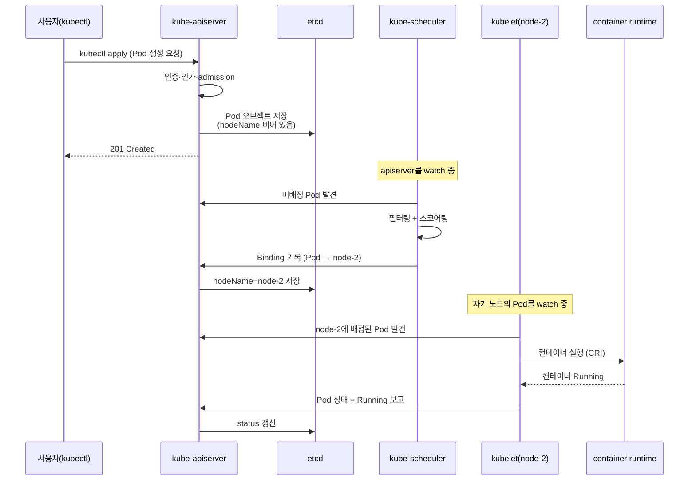

# 클러스터 아키텍처

::: info 학습 목표
- 쿠버네티스 클러스터가 control plane과 worker node로 나뉘는 구조와 각 역할을 설명할 수 있다.
- kube-apiserver·etcd·kube-scheduler·kube-controller-manager·cloud-controller-manager 각 control plane 컴포넌트가 무엇을 하는지 안다.
- kubelet·kube-proxy·container runtime이 노드에서 어떤 책임을 지는지 구분할 수 있다.
- 파드 하나가 생성될 때 컴포넌트들이 주고받는 통신 흐름을 순서대로 따라갈 수 있다.
:::

## 1. 전체 아키텍처 개요

쿠버네티스 클러스터는 두 종류의 머신 집합으로 나뉜다. 클러스터의 "두뇌"인 <strong>control plane</strong>과, 실제 워크로드(파드)가 돌아가는 <strong>worker node</strong>다.

- <strong>Control plane</strong>: 클러스터 전체 상태를 저장하고, "원하는 상태"로 수렴시키는 의사결정을 내린다. API 접수, 데이터 저장, 스케줄링, 컨트롤 루프가 여기서 돈다.
- <strong>Node</strong>: control plane이 내린 결정을 받아 실제로 컨테이너를 실행하고, 네트워크를 연결하고, 상태를 보고한다.

이 둘을 잇는 <strong>유일한 중심축</strong>이 kube-apiserver다. 모든 컴포넌트는 서로 직접 통신하지 않고, 반드시 apiserver를 거친다. apiserver만이 데이터 저장소(etcd)에 접근하고, 나머지는 apiserver의 API를 통해 상태를 읽고 쓴다. 이 "허브-스포크" 구조가 쿠버네티스 아키텍처의 골격이다.

전체 아키텍처의 공식 설명은 [Cluster Architecture 문서](https://kubernetes.io/docs/concepts/architecture/)에서 확인할 수 있다.

## 2. Control plane 컴포넌트

control plane은 보통 여러 컴포넌트가 함께 묶여 동작한다. 하나씩 본다.

### kube-apiserver

[kube-apiserver](https://kubernetes.io/docs/concepts/architecture/#kube-apiserver)는 클러스터의 <strong>프런트엔드</strong>다. 모든 요청 — `kubectl`, 컨트롤러, kubelet, 외부 도구 — 은 REST API 형태로 apiserver를 통과한다. apiserver의 책임은 다음과 같다.

- <strong>인증(authentication)·인가(authorization)</strong>: 누가 요청했고, 그 작업을 할 권한이 있는가.
- <strong>admission control</strong>: 요청을 받아들이기 전 검증·변형(34장에서 상세).
- <strong>유효성 검사·직렬화</strong>: 오브젝트 스키마 검증 후 etcd에 저장.
- 수평 확장이 가능해, 여러 인스턴스를 띄워 부하를 나눌 수 있다(고가용성 구성의 핵심).

### etcd

[etcd](https://kubernetes.io/docs/concepts/architecture/#etcd)는 클러스터의 모든 상태를 담는 <strong>일관성 있는 분산 key-value 저장소</strong>다. 파드·서비스·시크릿·설정 등 "클러스터가 어떤 모습이어야 하는가"의 모든 데이터가 여기 들어간다.

- Raft 합의 알고리즘으로 강한 일관성을 보장한다.
- <strong>오직 apiserver만</strong> etcd에 직접 접근한다. 다른 컴포넌트는 etcd를 알지 못한다.
- etcd가 곧 클러스터의 "진실의 원천(source of truth)"이므로, 백업·복구가 운영의 핵심 과제다(13장에서 상세).

### kube-scheduler

[kube-scheduler](https://kubernetes.io/docs/concepts/architecture/#kube-scheduler)는 아직 노드가 배정되지 않은(`nodeName`이 빈) 파드를 발견하고, <strong>어느 노드에 띄울지 결정</strong>한다. 결정 과정은 두 단계다.

- <strong>Filtering</strong>: 리소스 요구량(requests), nodeSelector, taint/toleration, affinity 등을 만족하지 못하는 노드를 후보에서 제거한다.
- <strong>Scoring</strong>: 남은 후보 노드에 점수를 매겨 가장 적합한 노드를 고른다.

스케줄러는 컨테이너를 직접 실행하지 않는다. 단지 "이 파드는 node-2에 가라"는 결정(바인딩)을 apiserver에 기록할 뿐이다. 실제 실행은 그 노드의 kubelet이 한다.

### kube-controller-manager

[kube-controller-manager](https://kubernetes.io/docs/concepts/architecture/#kube-controller-manager)는 여러 <strong>컨트롤러</strong>를 하나의 프로세스로 묶어 실행한다. 각 컨트롤러는 "특정 리소스의 desired state와 current state를 비교해 메우는" reconcile 루프를 돈다.

대표적인 컨트롤러로 Node controller(노드 다운 감지), ReplicaSet controller(파드 수 유지), Job controller, EndpointSlice controller, ServiceAccount controller 등이 있다. 컨트롤러 패턴의 동작 원리는 [10장](/study/kubernetes/10-controllers-reconcile)에서 깊이 파고든다.

### cloud-controller-manager

[cloud-controller-manager](https://kubernetes.io/docs/concepts/architecture/#cloud-controller-manager)는 클러스터를 <strong>클라우드 제공자의 API와 연결</strong>하는 컴포넌트다. 클라우드에 종속적인 로직만 따로 떼어내, 쿠버네티스 핵심 코드를 벤더 중립적으로 유지하기 위해 분리됐다.

- Node controller: 클라우드에서 삭제된 노드를 클러스터에서 정리.
- Route controller: 클라우드 네트워크에 라우팅 설정.
- Service controller: `type: LoadBalancer` 서비스에 대해 클라우드 로드밸런서 생성.

온프레미스 클러스터에는 이 컴포넌트가 없거나 비어 있다.

## 3. Node 컴포넌트

worker node에서 도는 컴포넌트들은 control plane의 결정을 받아 실제 일을 한다.

### kubelet

[kubelet](https://kubernetes.io/docs/concepts/architecture/#kubelet)은 모든 노드에 떠 있는 에이전트다. apiserver로부터 "이 노드에서 실행해야 할 파드 명세(PodSpec)"를 받아, 그 명세대로 컨테이너가 돌고 있는지 보장한다.

- 할당된 파드의 컨테이너를 런타임에 띄우라고 지시한다.
- 컨테이너 상태·헬스 체크(liveness/readiness probe)를 감시하고 결과를 apiserver에 보고한다.
- 노드 자체의 상태(리소스, 컨디션)를 주기적으로 apiserver에 갱신한다.

중요한 점: kubelet은 <strong>쿠버네티스가 생성한 컨테이너만</strong> 관리한다. 사람이 직접 docker로 띄운 컨테이너는 건드리지 않는다.

### kube-proxy

[kube-proxy](https://kubernetes.io/docs/concepts/architecture/#kube-proxy)는 노드에서 <strong>Service 추상화를 네트워크 규칙으로 구현</strong>하는 컴포넌트다. Service의 가상 IP로 들어온 트래픽이 그 뒤의 정상 파드들에게 분산되도록, iptables 또는 IPVS 규칙을 노드에 깔고 유지한다(26장에서 상세).

일부 네트워크 플러그인(예: eBPF 기반 Cilium)은 kube-proxy를 대체하기도 한다.

### container runtime

[container runtime](https://kubernetes.io/docs/concepts/architecture/#container-runtime)은 실제로 컨테이너를 실행하는 소프트웨어다. 이미지를 받아 풀고, 격리된 컨테이너 프로세스를 띄운다. 쿠버네티스는 <strong>CRI(Container Runtime Interface)</strong>를 구현한 런타임이면 무엇이든 쓸 수 있다 — containerd, CRI-O 등(5장에서 다룸).

## 4. Addon — CoreDNS와 그 외

[Addon](https://kubernetes.io/docs/concepts/cluster-administration/addons/)은 클러스터의 기능을 확장하는, 보통 `kube-system` 네임스페이스에서 파드로 도는 구성요소다. control plane의 일부는 아니지만 실용적인 클러스터에는 거의 필수다.

- <strong>CoreDNS</strong>: 클러스터 내부 DNS. Service에 `backend.default.svc.cluster.local` 같은 도메인 이름을 부여해, 파드가 IP 대신 이름으로 서로를 찾게 한다(28장에서 상세). 서비스 디스커버리의 핵심 인프라다.
- <strong>CNI 플러그인</strong>: 파드 간 네트워크를 구성(24장). Calico, Cilium, Flannel 등.
- <strong>metrics-server</strong>: 노드·파드의 리소스 사용량을 수집해 `kubectl top`과 오토스케일링에 공급(40장).
- <strong>Ingress controller</strong>: 외부 HTTP(S) 트래픽을 클러스터 내부 서비스로 라우팅(27장).

이들은 대부분 일반 파드/Deployment로 배포되므로, 클러스터 자신이 자신의 인프라를 워크로드처럼 관리하는 셈이다.

## 5. 컴포넌트 간 통신 — 파드 생성 흐름

이제 모든 조각을 하나의 시나리오로 엮어 본다. 사용자가 파드(또는 Deployment) 하나를 생성하라고 했을 때, 컴포넌트들이 어떤 순서로 협력하는지를 추적하면 아키텍처가 머릿속에 자리잡는다.

핵심 원칙 두 가지를 기억한다. (1) 모든 통신은 apiserver를 경유한다. (2) 컴포넌트들은 직접 호출하지 않고, apiserver의 상태를 <strong>관찰(watch)하다가 변화에 반응</strong>한다(level-triggered).

흐름을 단계로 정리하면 다음과 같다.

1. 사용자가 `kubectl apply`로 파드 생성을 요청하면, apiserver가 인증·인가·admission을 거쳐 파드 오브젝트를 etcd에 저장한다. 이때 파드는 아직 어느 노드에도 배정되지 않은 상태다.
2. scheduler는 apiserver를 watch하다가 이 미배정 파드를 발견하고, 필터링·스코어링을 거쳐 적합한 노드(예: node-2)를 고른 뒤 그 결정을 apiserver에 기록한다.
3. node-2의 kubelet은 "내 노드에 배정된 파드"를 watch하다가 새 파드를 발견하고, container runtime에 CRI로 컨테이너 실행을 지시한다.
4. 컨테이너가 뜨면 kubelet이 파드 상태를 `Running`으로 apiserver에 보고하고, apiserver는 그 status를 etcd에 갱신한다.

이 모든 과정에서 어떤 컴포넌트도 다른 컴포넌트를 직접 호출하지 않았다는 점이 결정적이다. 각자 apiserver의 상태를 관찰하고, 변화가 생기면 자기 책임 범위의 일을 할 뿐이다. 이 느슨한 결합(decoupling)이 쿠버네티스의 확장성·복원력의 비결이다.

::: tip 핵심 정리
- 클러스터는 의사결정을 내리는 <strong>control plane</strong>과 워크로드를 실행하는 <strong>node</strong>로 나뉘며, 모든 통신의 중심 허브는 <strong>kube-apiserver</strong>다.
- control plane: apiserver(프런트엔드), etcd(진실의 원천), scheduler(노드 배정), controller-manager(reconcile 루프), cloud-controller-manager(클라우드 연동).
- node: kubelet(파드 실행 보장), kube-proxy(Service 네트워크 구현), container runtime(컨테이너 실행).
- CoreDNS·CNI·metrics-server 같은 addon은 control plane은 아니지만 실용적 클러스터에 필수이며, 대개 파드로 배포된다.
- 컴포넌트들은 서로 직접 호출하지 않고 apiserver를 <strong>watch</strong>하며 상태 변화에 반응한다. 이 느슨한 결합이 확장성과 복원력의 기반이다.
:::

## 다음 챕터

컴포넌트들이 주고받는 "오브젝트"가 정확히 무엇인지, apiserver가 노출하는 API가 어떻게 구조화돼 있는지는 아직 추상적이다. [8장 API와 오브젝트 모델](/study/kubernetes/08-api-objects)에서 API 그룹·버전·리소스의 구조, spec과 status, metadata, 그리고 이 오브젝트들이 etcd에 어떻게 저장되는지를 본다.
