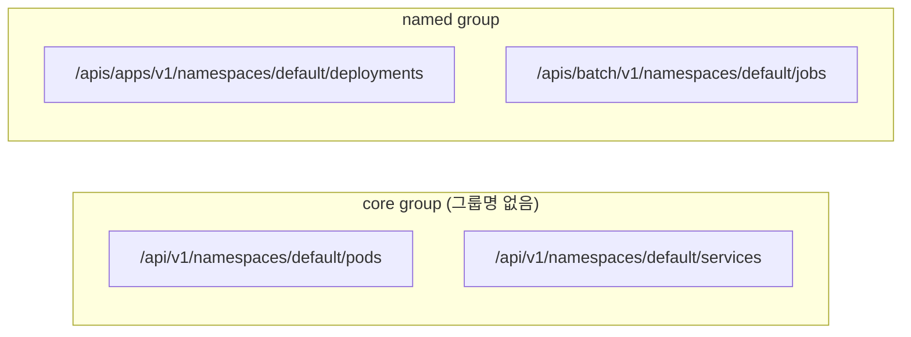
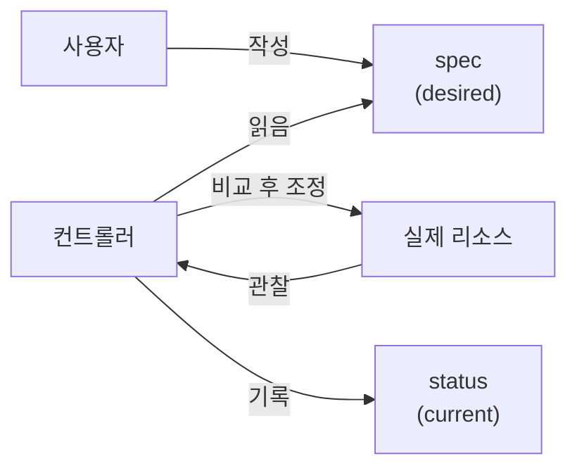
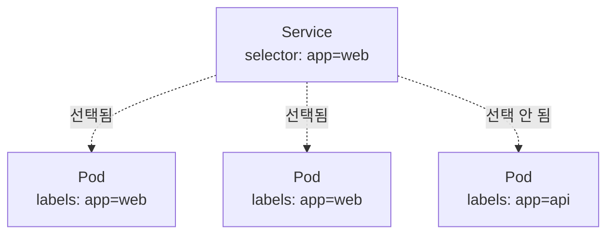
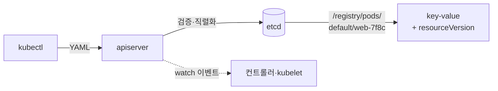
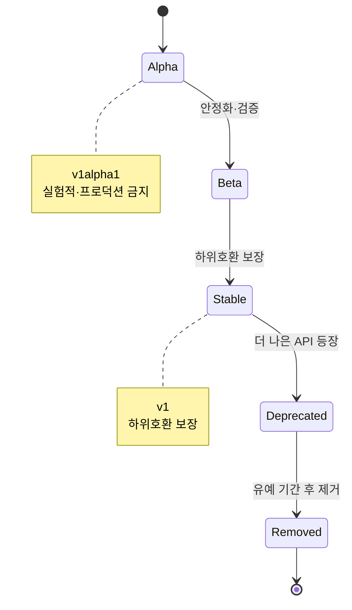

# API와 오브젝트 모델

::: info 학습 목표
- 쿠버네티스 API가 group·version·resource로 구조화되는 방식과 API 경로를 읽을 수 있다.
- 모든 오브젝트가 공유하는 spec·status·metadata의 역할을 구분해 설명할 수 있다.
- name·namespace·labels·annotations 각각의 용도와 차이를 안다.
- alpha/beta/stable API 버전의 의미와 deprecation 정책을 이해한다.
:::

## 1. 쿠버네티스 API의 구조 — group / version / resource

쿠버네티스에서 "무언가를 한다"는 것은 결국 <strong>apiserver의 REST API로 오브젝트를 CRUD하는 것</strong>이다. `kubectl`도, 컨트롤러도, kubelet도 모두 이 API의 클라이언트다. 따라서 API 구조를 이해하면 쿠버네티스 전체가 일관된 패턴으로 보인다.

모든 리소스는 <strong>API group</strong>, <strong>version</strong>, <strong>resource(kind)</strong> 세 좌표로 식별된다. 이를 줄여 <strong>GVR(Group-Version-Resource)</strong> 또는 <strong>GVK(Group-Version-Kind)</strong>라 부른다.

- <strong>Group</strong>: 관련 리소스를 묶는 논리적 묶음이다. `apps`(Deployment 등), `batch`(Job 등), `networking.k8s.io`(Ingress 등) 같은 그룹이 있다. Pod·Service·ConfigMap 같은 가장 오래된 핵심 리소스는 그룹 이름이 비어 있는 <strong>core group</strong>("legacy group")에 속한다.
- <strong>Version</strong>: 같은 리소스의 API 스키마 버전이다. `v1`, `apps/v1`, `batch/v1`처럼 그룹과 버전이 함께 표기된다.
- <strong>Resource</strong>: 실제 다루는 대상이다. 매니페스트에서는 `kind`(Pod, Deployment...)로 쓰고, REST 경로에서는 복수형 소문자(pods, deployments...)로 쓴다.

매니페스트 최상단의 `apiVersion`이 바로 group/version을 담는다.

```yaml
apiVersion: apps/v1        # group=apps, version=v1
kind: Deployment           # resource(kind)
metadata:
  name: web
# ...
---
apiVersion: v1             # group="" (core), version=v1
kind: Pod                  # core group이라 group 표기가 없다
metadata:
  name: standalone
```

이 좌표는 REST 경로로도 그대로 드러난다.



core group은 `/api/v1/...`로, 이름 있는 그룹은 `/apis/<group>/<version>/...`로 시작한다. 클러스터가 어떤 그룹/버전/리소스를 지원하는지는 다음으로 확인할 수 있다.

```bash
kubectl api-resources          # 리소스·short name·그룹·namespaced 여부
kubectl api-versions           # 사용 가능한 group/version 목록
```

오브젝트 모델 전반은 [Working with Kubernetes Objects 문서](https://kubernetes.io/docs/concepts/overview/working-with-objects/)에 정리돼 있다.

## 2. 오브젝트의 spec과 status

거의 모든 쿠버네티스 오브젝트는 두 개의 중첩 필드를 가진다. <strong>spec</strong>과 <strong>status</strong>다. 이 둘의 분리는 6장에서 본 선언적 모델의 직접적 구현이다.

- <strong>spec(desired state)</strong>: 사용자가 작성한다. "이 오브젝트가 어떤 모습이길 원하는가"를 기술한다.
- <strong>status(current state)</strong>: 시스템(컨트롤러)이 채운다. "현재 실제로 어떤 상태인가"를 보고한다. 사용자가 직접 쓰지 않는다.

```yaml
apiVersion: apps/v1
kind: Deployment
metadata:
  name: web
spec:                    # 내가 원하는 상태 — 내가 쓴다
  replicas: 3
  selector:
    matchLabels: { app: web }
  template:
    metadata:
      labels: { app: web }
    spec:
      containers:
        - name: nginx
          image: nginx:1.27
status:                  # 현재 실제 상태 — 시스템이 채운다
  replicas: 3
  readyReplicas: 2       # 아직 2개만 준비됨 → 컨트롤러가 계속 조정
  availableReplicas: 2
```

컨트롤러는 끊임없이 <strong>spec과 status를 비교</strong>하며, 둘이 어긋나면 spec 쪽으로 수렴시킨다(reconcile). 위 예에서 status가 `readyReplicas: 2`라면 컨트롤러는 1개가 모자란 것을 알고 계속 조정한다.



이 spec/status 분리 패턴은 워낙 보편적이어서, CRD로 만드는 커스텀 리소스(37장)에서도 동일하게 권장된다.

## 3. metadata — name·namespace·labels·annotations

`metadata`는 오브젝트의 "정체성과 부가 정보"를 담는다. 주요 필드를 본다.

### name과 namespace

- <strong>name</strong>: 같은 종류·같은 네임스페이스 안에서 오브젝트를 식별하는 유일한 이름이다. 한번 정하면 바꿀 수 없다.
- <strong>namespace</strong>: 클러스터를 가상으로 분할하는 단위다. 같은 이름의 파드라도 네임스페이스가 다르면 별개다. 리소스 격리·권한·쿼터의 경계가 된다. 단, 노드·PersistentVolume처럼 클러스터 전역(cluster-scoped)인 리소스는 네임스페이스에 속하지 않는다.
- <strong>uid</strong>: 시스템이 부여하는 전역 유일 식별자. 같은 이름의 오브젝트를 지웠다 다시 만들어도 uid는 달라진다.

```bash
kubectl get pods --all-namespaces      # 모든 네임스페이스의 파드
kubectl get pods -n kube-system        # 특정 네임스페이스만
```

[Namespace 문서](https://kubernetes.io/docs/concepts/overview/working-with-objects/namespaces/)에서 더 볼 수 있다.

### labels와 annotations

둘 다 key-value 맵이지만 목적이 정반대다.

- <strong>labels</strong>: <strong>식별·선택(selection)</strong>을 위한 메타데이터다. "이 파드는 `app=web`, `tier=frontend`다" 같은 분류 표지를 붙인다. Service나 컨트롤러는 이 레이블로 대상 파드를 <strong>선택</strong>한다. 그래서 selector로 질의 가능하도록 짧고 정형화된 값을 쓴다.
- <strong>annotations</strong>: <strong>선택에 쓰이지 않는 부가 정보</strong>를 담는다. 빌드 정보, 도구 설정, 변경 이력, 큰 비정형 데이터 등. selector로 질의하지 않으므로 길고 자유로운 값이 허용된다.

```yaml
metadata:
  name: web-7f8c
  namespace: production
  labels:                          # 선택에 쓰인다 — 짧고 정형화
    app: web
    tier: frontend
    environment: production
  annotations:                     # 선택에 안 쓰인다 — 길어도 됨
    kubernetes.io/change-cause: "v1.28로 롤아웃"
    prometheus.io/scrape: "true"
```



레이블로 선택하는 동작은 다음처럼 직접 확인할 수 있다.

```bash
kubectl get pods -l app=web              # app=web 레이블을 가진 파드만
kubectl get pods -l 'tier in (frontend,backend)'
kubectl get pods --show-labels           # 각 파드의 레이블 보기
```

[Labels and Selectors 문서](https://kubernetes.io/docs/concepts/overview/working-with-objects/labels/)와 [Annotations 문서](https://kubernetes.io/docs/concepts/overview/working-with-objects/annotations/)에 자세히 나온다.

## 4. 오브젝트가 etcd에 저장되는 방식

`kubectl apply`로 오브젝트를 만들면, 그 데이터는 결국 [etcd](https://kubernetes.io/docs/concepts/architecture/#etcd)에 저장된다. 단, 클라이언트는 etcd를 직접 만지지 않는다 — 7장에서 본 대로 <strong>apiserver만</strong>이 etcd에 접근한다.

저장 흐름은 다음과 같다.

1. 클라이언트가 보낸 YAML/JSON을 apiserver가 받아 인증·인가·admission·스키마 검증을 거친다.
2. 검증을 통과한 오브젝트를 apiserver가 직렬화해 etcd에 key-value로 저장한다. key는 `/registry/<resource>/<namespace>/<name>` 형태의 경로다(예: `/registry/pods/default/web-7f8c`).
3. etcd는 각 키에 <strong>resourceVersion</strong>(변경마다 증가하는 버전)을 부여한다. 이 버전은 낙관적 동시성 제어와 watch의 기준점이 된다.



여기서 핵심 메커니즘 두 가지가 따라온다.

- <strong>resourceVersion 기반 낙관적 동시성</strong>: 누군가 오브젝트를 수정할 때, 자기가 읽은 resourceVersion이 아직 최신인지 확인한다. 그 사이 다른 클라이언트가 먼저 바꿨다면 충돌이 나고 재시도해야 한다. 이 덕에 락 없이도 동시 수정의 안전성이 보장된다.
- <strong>watch</strong>: etcd는 키 변경을 스트림으로 알릴 수 있다. apiserver는 이를 클라이언트에게 watch API로 노출한다. 컨트롤러·kubelet이 "폴링"이 아니라 "변화 알림"으로 동작하는 것(7장 파드 생성 흐름)이 바로 이 watch 위에 서 있다.

::: tip 시크릿은 평문으로 저장될 수 있다
기본 설정에서 Secret 오브젝트는 etcd에 <strong>base64 인코딩</strong>으로만 저장된다. 이는 암호화가 아니라 단순 인코딩이다. 민감 데이터를 진짜로 보호하려면 [etcd 저장 데이터 암호화(encryption at rest)](https://kubernetes.io/docs/tasks/administer-cluster/encrypt-data/)를 별도로 활성화해야 한다(36장에서 상세).
:::

## 5. API 버전(alpha/beta/stable)과 deprecation

같은 리소스라도 API는 진화한다. 쿠버네티스는 그 성숙도를 버전 이름으로 명확히 신호한다. 버전 문자열을 보면 그 API를 얼마나 신뢰할 수 있는지 바로 알 수 있다.

| 단계 | 버전 표기 예 | 의미 |
|------|-------------|------|
| Alpha | `v1alpha1` | 실험적. 기본 비활성. 예고 없이 변경/삭제될 수 있고 데이터 손실 위험. 프로덕션 금지. |
| Beta | `v1beta1` | 잘 테스트됨. 기본 활성(최근 정책상 신규는 opt-in). 큰 틀은 유지되나 세부 변경 가능. |
| Stable | `v1` | 안정. 오랫동안 유지되며 하위 호환을 보장한다. 프로덕션 권장. |

같은 리소스가 여러 버전으로 동시에 노출되기도 한다. 예컨대 어떤 기능이 `v1alpha1` → `v1beta1` → `v1`으로 승격되는 동안, 클러스터는 한동안 두 버전을 함께 제공한다. 내부적으로는 하나의 저장 버전으로 변환되어 etcd에 들어간다.



### deprecation 정책

쿠버네티스는 명시적인 [Deprecation Policy](https://kubernetes.io/docs/reference/using-api/deprecation-policy/)를 둔다. 핵심은 "안정 API는 충분한 유예 없이 사라지지 않는다"는 약속이다. stable(GA) API 요소는 deprecation이 공지된 뒤에도 정해진 릴리스/기간 동안 계속 동작하며, 그동안 사용자는 새 버전으로 옮길 시간을 얻는다.

실무에서 중요한 도구가 [Deprecated API Migration Guide](https://kubernetes.io/docs/reference/using-api/deprecation-guide/)다. 클러스터를 업그레이드하기 전에, 내가 쓰는 매니페스트의 `apiVersion`이 새 버전에서 제거되지 않는지 반드시 확인해야 한다. 예전에 `extensions/v1beta1`로 쓰던 Deployment·Ingress가 `apps/v1`·`networking.k8s.io/v1`로 옮겨간 것이 대표적 사례다.

```bash
kubectl explain deployment            # 리소스 스키마와 필드 설명
kubectl explain deployment.spec.replicas
kubectl explain pod --api-version=v1  # 특정 버전 스키마 확인
```

`kubectl explain`은 클러스터에 실제 등록된 스키마를 보여주므로, 문서를 찾기 전에 가장 빠르게 필드 구조와 버전을 확인하는 방법이다.

::: tip 핵심 정리
- 쿠버네티스 API의 모든 리소스는 <strong>group·version·resource</strong> 좌표로 식별되며, 이것이 매니페스트의 `apiVersion`/`kind`와 REST 경로에 그대로 드러난다. core 리소스는 그룹명이 빈 `/api/v1/...`을 쓴다.
- 거의 모든 오브젝트는 사용자가 쓰는 <strong>spec(desired)</strong>과 시스템이 채우는 <strong>status(current)</strong>로 나뉘며, 컨트롤러가 둘을 비교해 수렴시킨다.
- metadata의 <strong>labels는 선택(selection)용</strong>, <strong>annotations는 선택에 안 쓰이는 부가 정보용</strong>이다. namespace는 격리·권한·쿼터의 경계다.
- 오브젝트는 apiserver를 거쳐 <strong>etcd에 `/registry/...` 키로 저장</strong>되며, resourceVersion 기반 낙관적 동시성과 watch가 그 위에서 동작한다.
- API는 <strong>alpha → beta → stable</strong>로 성숙하며, stable API는 명시적 <strong>deprecation 정책</strong>으로 보호된다. 업그레이드 전 deprecated API migration guide 확인은 필수다.
:::

## 다음 챕터

API와 오브젝트 모델을 알았으니, 이제 그것을 실제로 다루는 도구를 손에 쥘 차례다. [9장 kubectl과 선언형 관리](/study/kubernetes/09-kubectl-declarative)에서 kubectl의 구조와 kubeconfig, 명령형과 선언형의 차이, `kubectl apply`의 3-way merge, 그리고 매니페스트 작성 패턴을 본다.
