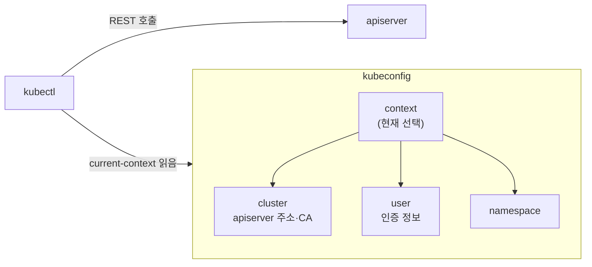
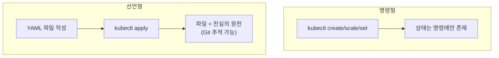
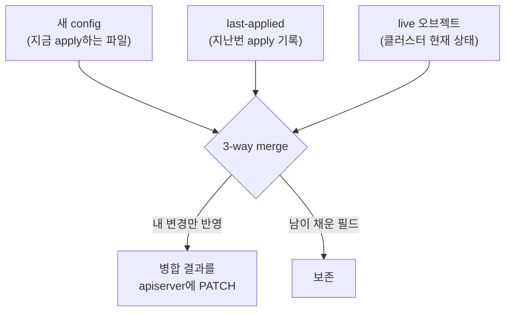

# kubectl과 선언형 관리

::: info 학습 목표
- kubectl이 apiserver의 클라이언트로서 어떻게 동작하는지, kubeconfig가 무엇을 담는지 설명할 수 있다.
- 명령형(create)과 선언형(apply) 관리의 차이를 desired state 관점에서 구분할 수 있다.
- `kubectl apply`의 3-way merge와 last-applied-configuration 메커니즘을 이해한다.
- get·describe·explain·diff 같은 일상 명령을 상황에 맞게 사용할 수 있다.
:::

## 1. kubectl의 구조와 kubeconfig

`kubectl`은 그 자체로 무언가를 하는 도구가 아니다. 8장에서 본 <strong>apiserver의 REST API를 호출하는 클라이언트</strong>일 뿐이다. `kubectl get pods`는 내부적으로 apiserver의 `GET /api/v1/namespaces/default/pods`를 호출하고 그 응답을 사람이 읽기 좋게 출력한다.

그러면 kubectl은 "어느 클러스터에, 누구로, 어떤 네임스페이스에서" 접속할지를 어떻게 아는가? <strong>kubeconfig</strong> 파일에서 읽는다. 기본 위치는 `~/.kube/config`이며, 세 가지 핵심 섹션으로 구성된다.

- <strong>clusters</strong>: 접속할 클러스터(apiserver 주소, CA 인증서).
- <strong>users</strong>: 인증 정보(클라이언트 인증서, 토큰, exec 플러그인 등).
- <strong>contexts</strong>: cluster + user + namespace를 묶은 "접속 조합". 어느 context를 쓸지가 곧 어느 클러스터에 어떤 권한으로 붙는지를 결정한다.



context를 다루는 일상 명령은 다음과 같다.

```bash
kubectl config get-contexts            # 가진 context 목록
kubectl config current-context         # 지금 어느 context인가
kubectl config use-context prod        # context 전환
kubectl config set-context --current --namespace=team-a   # 기본 네임스페이스 변경
```

여러 클러스터를 오가는 실무에서는 "지금 내가 어느 클러스터의 어느 네임스페이스에 있는가"를 늘 의식하는 것이 사고를 막는 핵심이다. kubeconfig 구조의 자세한 설명은 [Organizing Cluster Access 문서](https://kubernetes.io/docs/concepts/configuration/organize-cluster-access-kubeconfig/)에 있다.

## 2. 명령형 vs 선언형 — create와 apply

쿠버네티스 리소스를 관리하는 방식은 크게 두 갈래다. 6장에서 본 명령형/선언형 구분이 여기서 구체적인 명령으로 나타난다. [Managing Resources 문서](https://kubernetes.io/docs/concepts/cluster-administration/manage-deployment/)와 [Object Management 문서](https://kubernetes.io/docs/concepts/overview/working-with-objects/object-management/)가 이 주제를 다룬다.

### 명령형 — "이걸 해라"

명령형은 동작을 직접 지시한다. 빠르고 직관적이라 학습·디버깅에 좋다.

```bash
kubectl create deployment web --image=nginx:1.27   # 만들어라
kubectl scale deployment web --replicas=3          # 3개로 늘려라
kubectl set image deployment/web nginx=nginx:1.28  # 이미지 바꿔라
kubectl delete deployment web                      # 지워라
```

문제는 <strong>상태가 명령 안에만 있고 어디에도 기록되지 않는다</strong>는 점이다. 누가 언제 무엇을 바꿨는지 추적할 수 없고, 같은 환경을 재현하기 어렵다.

### 선언형 — "이 상태이길 원한다"

선언형은 원하는 최종 상태를 파일로 기술하고 `apply`한다.

```bash
kubectl apply -f deployment.yaml       # 파일이 곧 desired state
kubectl apply -f ./manifests/          # 디렉터리 통째로
```

같은 파일을 몇 번을 apply해도 결과는 같고(멱등성), 파일을 수정해 다시 apply하면 차이만큼만 반영된다. 파일이 Git에 들어가면 그 자체가 변경 이력·리뷰·롤백의 단위가 된다(GitOps의 토대, 44장).

::: warning create와 apply를 섞지 말 것
`kubectl create`로 만든 리소스를 나중에 `kubectl apply`로 관리하려 하면, last-applied-configuration이 없어 경고가 나거나 의도치 않은 동작이 생길 수 있다. 처음부터 선언형으로 갈 거라면 <strong>일관되게 apply</strong>를 쓰는 것이 안전하다. 운영 리소스는 선언형으로 통일하는 것이 원칙이다.
:::



## 3. kubectl apply의 3-way merge와 last-applied

`kubectl apply`가 단순히 "파일 내용으로 덮어쓰기"라면 문제가 생긴다. HPA가 `replicas`를 바꿨거나, 다른 컨트롤러가 필드를 추가했을 때, 내 파일로 통째로 덮으면 그 변경이 날아간다. 그래서 apply는 더 똑똑한 <strong>3-way merge(3방향 병합)</strong>를 한다.

apply는 세 가지 상태를 비교한다.

1. <strong>내가 지금 적용하는 파일(new config)</strong> — 내가 원하는 것.
2. <strong>last-applied-configuration</strong> — 내가 지난번에 apply했던 내용. 오브젝트의 annotation(`kubectl.kubernetes.io/last-applied-configuration`)에 저장돼 있다.
3. <strong>클러스터의 현재 live 오브젝트</strong> — apiserver에 실제로 들어 있는 상태.

이 셋을 비교해 다음을 판단한다.

- 내가 새로 추가/변경한 필드 → 적용한다.
- 지난번엔 내가 썼는데 이번 파일에서 뺀 필드 → 내가 제거하려는 의도이므로 삭제한다(last-applied와 비교해서 안다).
- 내가 손댄 적 없는데 클러스터에만 있는 필드(다른 컨트롤러가 채운 것) → 건드리지 않고 보존한다.



last-applied annotation은 직접 확인할 수 있다.

```bash
kubectl apply -f deployment.yaml
kubectl get deployment web -o yaml | grep -A2 last-applied-configuration
```

::: details Server-Side Apply
전통적인 3-way merge는 클라이언트(kubectl)가 병합을 수행한다. 이에는 last-applied annotation이 비대해지고, 여러 주체가 같은 오브젝트를 다룰 때 소유권이 모호하다는 한계가 있었다. 이를 개선한 것이 [Server-Side Apply](https://kubernetes.io/docs/reference/using-api/server-side-apply/)다. apiserver가 각 필드의 "소유자(field manager)"를 추적해 충돌을 명시적으로 감지한다. `kubectl apply --server-side`로 쓸 수 있으며, 컨트롤러·자동화 도구에서 점점 표준이 되고 있다.
:::

## 4. 매니페스트 작성 패턴

선언형으로 가려면 매니페스트를 잘 쓰는 것이 핵심 역량이다. 실무에서 자리잡은 패턴 몇 가지를 본다.

### 한 파일에 여러 리소스 — `---` 구분

`---`(YAML 문서 구분자)로 여러 오브젝트를 한 파일에 담을 수 있다. 함께 배포되는 리소스를 묶을 때 유용하다.

```yaml
apiVersion: v1
kind: Service
metadata:
  name: web
spec:
  selector: { app: web }
  ports:
    - port: 80
      targetPort: 8080
---
apiVersion: apps/v1
kind: Deployment
metadata:
  name: web
spec:
  replicas: 3
  selector:
    matchLabels: { app: web }
  template:
    metadata:
      labels: { app: web }
    spec:
      containers:
        - name: web
          image: myapp:1.0
          ports:
            - containerPort: 8080
```

### 디렉터리 단위 관리

관련 매니페스트를 한 디렉터리에 모으고 통째로 apply하면, 환경 전체를 하나의 단위로 다룰 수 있다.

```bash
kubectl apply -f ./manifests/                  # 디렉터리 안의 모든 파일
kubectl apply -f ./manifests/ -R               # 하위 디렉터리까지 재귀
kubectl diff -f ./manifests/                   # 적용 전 변경 미리보기
```

### 라벨 일관성

모든 리소스에 일관된 레이블(`app`, `app.kubernetes.io/name`, `environment` 등)을 붙이면, selector·조회·정리가 쉬워진다. 쿠버네티스가 권장하는 [공통 레이블 규약](https://kubernetes.io/docs/concepts/overview/working-with-objects/common-labels/)을 따르면 도구 호환성도 좋아진다.

::: tip 매니페스트는 손으로 다 쓰지 않는다
처음부터 빈 파일에 타이핑하기보다, 명령형으로 골격을 뽑고 다듬는 방식이 빠르고 정확하다. `--dry-run=client -o yaml`을 붙이면 실제로 만들지 않고 매니페스트만 출력한다.

```bash
kubectl create deployment web --image=nginx:1.27 \
  --dry-run=client -o yaml > deployment.yaml
```

이렇게 뽑은 뼈대를 편집해 선언형 파일로 발전시키는 것이 실무의 정석이다.
:::

## 5. 자주 쓰는 kubectl 명령 — get·describe·explain·diff

일상 운영에서 손에 붙어야 하는 핵심 명령들이다. 공식 [kubectl 개요](https://kubernetes.io/docs/reference/kubectl/)와 [치트시트](https://kubernetes.io/docs/reference/kubectl/cheatsheet/)도 함께 참고한다.

### get — 무엇이 있는가

```bash
kubectl get pods                       # 파드 목록
kubectl get pods -o wide               # 노드·IP 등 추가 정보
kubectl get pods -o yaml               # 전체 매니페스트(spec+status)
kubectl get pods -l app=web            # 레이블로 필터
kubectl get pods -w                    # watch — 변화를 실시간 스트림
kubectl get all -n team-a              # 주요 리소스 한눈에
```

`-o jsonpath`로 특정 필드만 뽑을 수도 있다.

```bash
kubectl get pods -o jsonpath='{.items[*].metadata.name}'
```

### describe — 왜 이 상태인가

`get`이 "무엇이 있는가"라면, `describe`는 "왜 이 상태인가"를 보여준다. 특히 하단의 <strong>Events</strong>가 디버깅의 출발점이다 — 스케줄 실패, 이미지 풀 에러, probe 실패의 단서가 여기 찍힌다.

```bash
kubectl describe pod web-7f8c          # 상세 + 이벤트
kubectl describe node node-2           # 노드 상태·할당·컨디션
```

### explain — 이 필드가 뭔가

8장에서 봤듯, 매니페스트 필드를 잊었을 때 문서를 뒤지기 전에 클러스터에 직접 물어본다.

```bash
kubectl explain deployment.spec.strategy
kubectl explain pod.spec.containers.resources
```

### diff — 적용하면 뭐가 바뀌는가

apply 전에 "현재 클러스터 상태와 내 파일의 차이"를 미리 보여준다. 운영 환경에서 의도치 않은 변경을 막는 안전장치다.

```bash
kubectl diff -f deployment.yaml        # 적용 시 변경될 내용 미리보기
```


이 흐름 — get으로 현황 파악 → describe로 원인 추적 → explain으로 스키마 확인 → diff로 변경 미리보기 → apply로 적용 — 이 일상 운영의 기본 리듬이다.

::: tip 핵심 정리
- kubectl은 <strong>apiserver의 REST 클라이언트</strong>일 뿐이며, "어느 클러스터에 누구로 어느 네임스페이스에서" 붙을지는 <strong>kubeconfig</strong>의 context가 결정한다.
- <strong>명령형(create/scale/set)</strong>은 빠르지만 상태가 명령에만 존재한다. <strong>선언형(apply)</strong>은 파일을 진실의 원천으로 삼아 멱등·추적·롤백이 가능하다.
- `kubectl apply`는 <strong>3-way merge</strong>(새 파일 / last-applied / live 오브젝트)로, 내 변경만 반영하고 남이 채운 필드는 보존한다. Server-Side Apply는 이를 서버 측 field manager로 발전시킨다.
- 매니페스트는 `---`로 묶고 디렉터리로 관리하며, `--dry-run=client -o yaml`로 골격을 뽑아 다듬는다.
- 운영의 기본 리듬은 <strong>get → describe → explain → diff → apply</strong>다. 특히 describe의 Events가 디버깅의 출발점이다.
:::

## 다음 챕터

선언형으로 "원하는 상태"를 던지면 시스템이 알아서 맞춘다는 것을 여러 번 봤다. 그 "알아서 맞추는" 주체가 바로 컨트롤러다. [10장 컨트롤러와 reconcile 루프](/study/kubernetes/10-controllers-reconcile)에서 컨트롤 루프의 동작 원리, watch·informer·work queue 메커니즘, 그리고 선언형 시스템의 멱등성과 eventual consistency를 깊이 파고든다.
