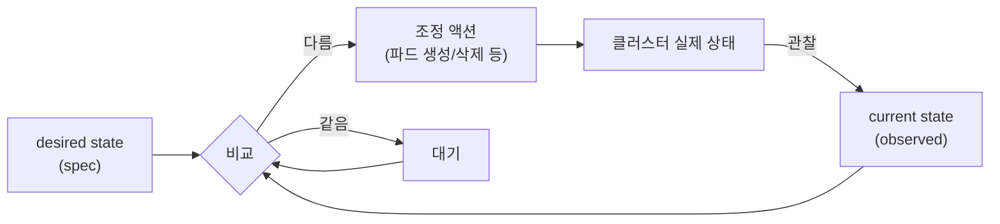
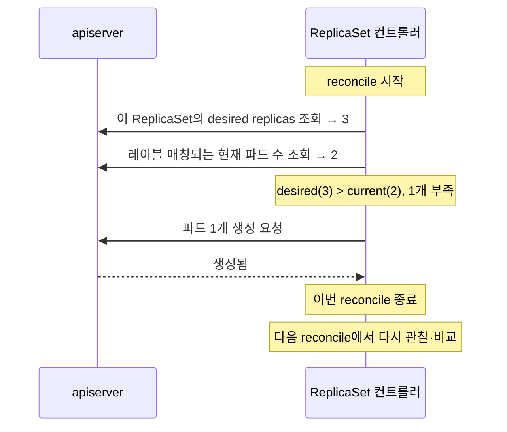
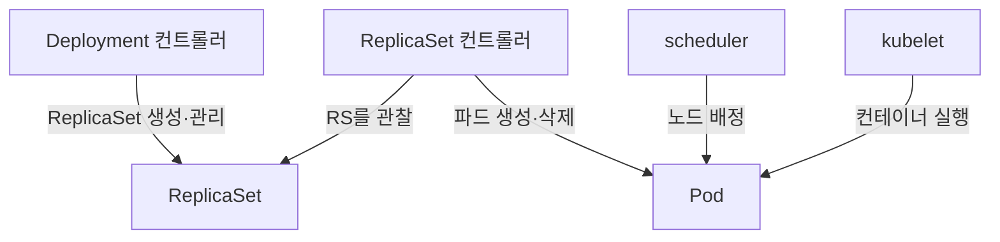
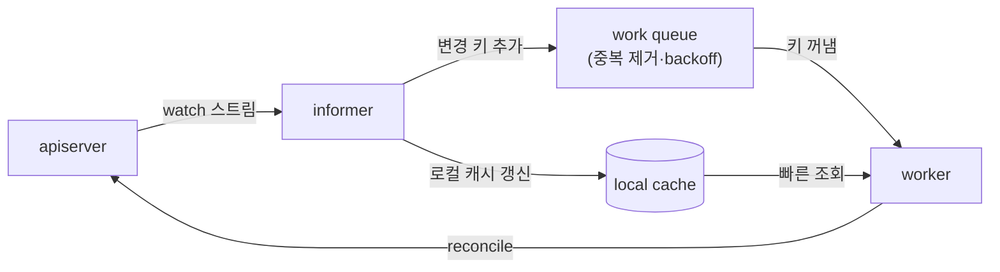
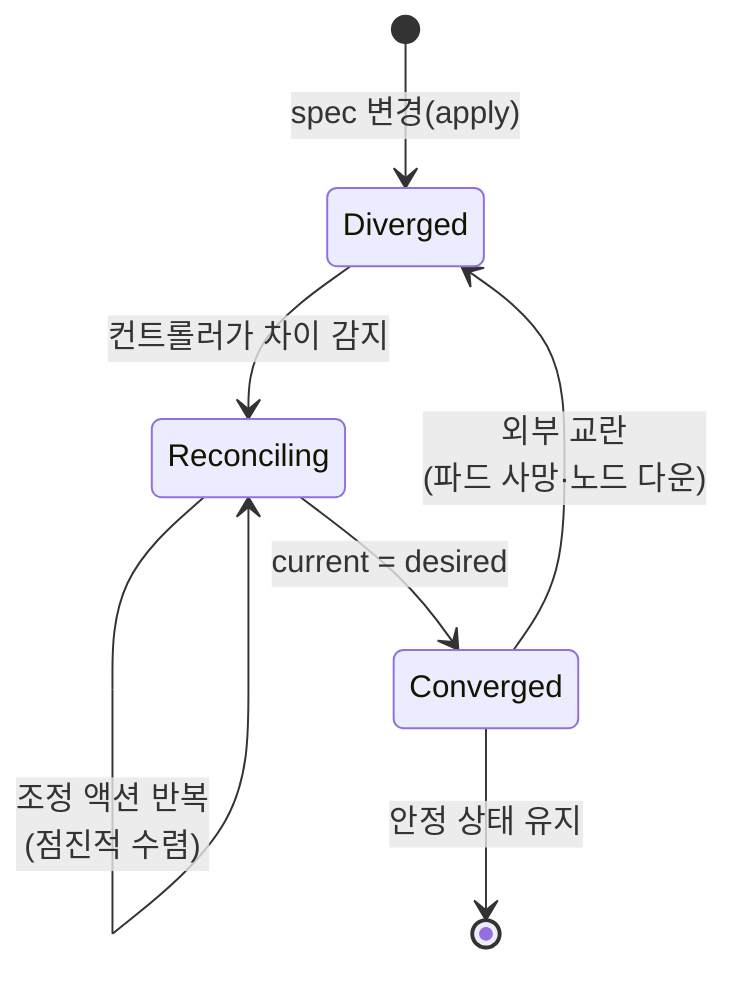

# 컨트롤러와 reconcile 루프

::: info 학습 목표
- 컨트롤 루프(control loop)가 무엇이고, 왜 쿠버네티스의 심장인지 설명할 수 있다.
- desired state와 current state를 조정하는 reconcile의 동작을 단계로 따라갈 수 있다.
- watch·informer·work queue가 컨트롤러를 효율적이고 견고하게 만드는 메커니즘을 이해한다.
- 선언형 시스템의 멱등성(idempotency)과 eventual consistency가 무엇을 뜻하는지 안다.
:::

## 1. 컨트롤 루프 — 쿠버네티스의 심장

6장에서 "desired state만 선언하면 시스템이 알아서 맞춘다"고 했다. 그 "알아서 맞추는" 일을 실제로 하는 주체가 <strong>컨트롤러(controller)</strong>이고, 컨트롤러가 도는 무한 반복이 <strong>컨트롤 루프(control loop)</strong>다. 이 개념 하나가 쿠버네티스 전체를 떠받친다.

컨트롤 루프의 비유로 흔히 <strong>온도 조절기(thermostat)</strong>를 든다. 온도 조절기는 "원하는 온도(desired)"를 설정받고, "현재 온도(current)"를 끊임없이 측정하며, 둘이 다르면 히터/에어컨을 켜서 desired로 수렴시킨다. 목표에 도달하면 멈추고, 다시 벗어나면 또 작동한다. 누가 창문을 열어 온도를 떨어뜨려도 알아서 회복한다.

쿠버네티스 컨트롤러가 하는 일이 정확히 이것이다.

[Controllers 공식 문서](https://kubernetes.io/docs/concepts/architecture/controller/)는 이를 "원하는 상태와 현재 상태의 차이를 줄이려고 시도하는 제어 루프"라고 정의한다. 중요한 특징은 컨트롤러가 <strong>한 번에 모든 것을 끝내려 하지 않는다</strong>는 점이다. 조금씩, 반복적으로 desired에 가까워질 뿐이다. 이 점진성이 견고함의 원천이다.

## 2. reconcile — desired와 current의 조정

컨트롤러가 매 루프에서 수행하는 핵심 동작을 <strong>reconcile(조정)</strong>이라 한다. reconcile은 "현재 상태를 관찰해 desired와 비교하고, 차이를 메우는 액션을 취하는" 한 사이클이다.

ReplicaSet 컨트롤러를 예로 구체화한다. desired가 `replicas: 3`이라 하자.

reconcile 한 사이클을 단계로 정리하면 다음과 같다.

1. <strong>관찰(observe)</strong>: apiserver에서 이 리소스의 desired(spec)와 관련된 현재 상태를 읽는다.
2. <strong>분석(diff)</strong>: desired와 current의 차이를 계산한다. 부족한가, 과한가, 일치하는가.
3. <strong>조정(act)</strong>: 차이를 메우는 액션을 취한다. 부족하면 만들고, 과하면 지운다. 일치하면 아무것도 하지 않는다.

여기서 결정적인 설계 원칙이 <strong>level-triggered</strong>다. 컨트롤러는 "파드가 죽었다"는 <strong>이벤트(edge)</strong>에 반응하는 게 아니라, "지금 몇 개 있는가"라는 <strong>상태(level)</strong>를 본다. 그래서 이벤트를 한두 개 놓쳐도 — 컨트롤러가 잠시 죽었다 살아나도 — 다음 reconcile에서 현재 상태를 다시 관찰해 올바른 결정을 내린다. 이벤트 기반(edge-triggered) 시스템이 알림 유실에 취약한 것과 대조적이다.

::: tip reconcile은 "현재 상태"만 보면 충분하다
좋은 reconcile 함수는 "어떤 이벤트가 있었는지"의 이력에 의존하지 않는다. 오직 "지금 desired는 무엇이고 current는 무엇인가"만 보고 올바른 액션을 결정한다. 그래서 같은 reconcile을 몇 번을 호출해도 안전하다(멱등성, 4절). 이 성질이 컨트롤러를 단순하고 견고하게 만든다.
:::

## 3. controller-manager 안의 여러 컨트롤러

7장에서 본 [kube-controller-manager](https://kubernetes.io/docs/concepts/architecture/#kube-controller-manager)는 단일 프로세스지만, 그 안에서 <strong>수십 개의 독립적인 컨트롤러</strong>가 각자의 reconcile 루프를 돈다. 각 컨트롤러는 특정 리소스 종류 하나를 책임진다.

| 컨트롤러 | 책임 |
|----------|------|
| ReplicaSet controller | 레이블에 맞는 파드 수를 desired replicas로 유지 |
| Deployment controller | ReplicaSet을 생성·관리하며 롤링 업데이트·롤백 수행 |
| Node controller | 노드 헬스 감시, 응답 없는 노드의 파드 정리 |
| Job controller | Job의 파드를 완료까지 실행·재시도 |
| EndpointSlice controller | Service 뒤의 정상 파드 목록(엔드포인트) 갱신 |
| Namespace controller | 삭제된 네임스페이스의 리소스 정리 |

여기서 중요한 패턴이 <strong>컨트롤러의 계층적 협력</strong>이다. Deployment 컨트롤러는 파드를 직접 만들지 않는다. ReplicaSet을 만들고, 실제 파드 생성은 ReplicaSet 컨트롤러에 맡긴다. 각 컨트롤러는 자기 책임 한 가지만 잘하고, 결과를 apiserver에 기록한다. 그러면 다른 컨트롤러가 그 변화를 관찰해 다음 일을 한다.

이렇게 작은 컨트롤러들이 apiserver를 통해 느슨하게 연결되어 협력하는 구조 덕분에, 각 컨트롤러는 독립적으로 개발·테스트·확장될 수 있다. 이것이 7장에서 말한 "느슨한 결합"의 구체적 모습이다.

## 4. watch / informer / work queue

컨트롤러가 매 reconcile마다 apiserver에 "지금 파드 몇 개야?"를 폴링한다면, 수천 개 오브젝트가 있는 클러스터에서 apiserver는 곧 질식한다. 실제 컨트롤러는 훨씬 영리한 메커니즘을 쓴다. <strong>watch → informer → work queue</strong>의 조합이다.

### watch

8장에서 본 대로, apiserver는 etcd의 변경을 <strong>watch 스트림</strong>으로 노출한다. 컨트롤러는 "이 리소스 종류에 변화가 생기면 알려달라"고 watch를 건다. 폴링이 아니라 푸시 알림이다.

### informer

watch를 직접 다루는 것은 번거롭고 위험하다(연결 끊김, 이벤트 유실 등). 그래서 컨트롤러는 보통 <strong>informer</strong>라는 라이브러리 계층을 쓴다. informer는 두 가지를 한다.

- <strong>로컬 캐시(local cache/store)</strong> 유지: 관심 리소스의 현재 상태를 메모리에 들고 있어, 컨트롤러가 apiserver를 두드리지 않고도 빠르게 조회한다.
- <strong>이벤트 핸들러</strong> 호출: 리소스가 추가/수정/삭제되면 등록된 콜백을 부른다.

연결이 끊기면 informer는 <strong>list + watch</strong>로 캐시를 다시 채운다(resync). 즉, watch로 실시간성을 얻고, 주기적 list로 유실을 메운다. 이것이 3절에서 말한 level-triggered 복원력의 구현이다.

### work queue

informer가 "이 오브젝트에 변화가 있다"고 알리면, 컨트롤러는 곧장 reconcile하지 않고 그 오브젝트의 <strong>키(namespace/name)를 work queue에 넣는다</strong>. 별도의 worker가 큐에서 키를 꺼내 reconcile을 수행한다. 이 분리가 주는 이점은 크다.

- <strong>중복 제거</strong>: 짧은 시간에 같은 오브젝트가 여러 번 변해도 큐에는 키 하나만 남는다. 한 번만 reconcile하면 된다.
- <strong>재시도/backoff</strong>: reconcile이 실패하면 키를 다시 큐에 넣어 지수 backoff로 재시도한다.
- <strong>속도 제어(rate limiting)</strong>: 폭주를 막기 위해 처리 속도를 조절한다.

이 구조 — apiserver를 watch하고, informer로 캐시하고, work queue로 일을 직렬화하는 — 가 쿠버네티스의 모든 컨트롤러가 공유하는 공통 골격이다. 그래서 직접 컨트롤러/Operator를 만들 때도 [controller-runtime](https://kubernetes.io/docs/concepts/architecture/controller/) 같은 프레임워크가 이 패턴을 그대로 제공한다(38장에서 상세).

## 5. 멱등성과 eventual consistency

컨트롤러 패턴이 견고한 이유를 두 개념으로 마무리한다. <strong>멱등성</strong>과 <strong>eventual consistency</strong>다.

### 멱등성(idempotency)

reconcile 함수는 <strong>몇 번을 호출해도 결과가 같아야</strong> 한다. "파드를 하나 만들어라"가 아니라 "파드가 desired 개수만큼 있게 하라"이기 때문이다. 이미 3개 있으면 아무것도 안 하고, 2개면 하나 만들고, 4개면 하나 지운다. 그래서 work queue가 같은 키를 두 번 처리해도, 컨트롤러가 죽었다 살아나 같은 일을 다시 해도 안전하다.

멱등성이 없다면 "재시도하면 파드가 자꾸 늘어나는" 재앙이 벌어진다. 선언형 시스템이 재시도·중복에 강한 근본 이유가 바로 이 멱등성이다.

### eventual consistency(최종 일관성)

컨트롤러는 desired에 <strong>즉시</strong>가 아니라 <strong>결국(eventually)</strong> 도달한다. apply한 순간 모든 것이 완성되는 게 아니라, 여러 컨트롤러가 각자의 reconcile을 돌면서 시스템이 점진적으로 목표 상태로 수렴한다.

이 모델의 실무적 함의는 분명하다. `kubectl apply` 직후 곧바로 `kubectl get`을 했을 때 아직 desired에 도달하지 않은 중간 상태가 보이는 것은 <strong>버그가 아니라 정상</strong>이다. 잠시 후 다시 보면 수렴해 있다. 외부 교란(파드 사망, 노드 다운)으로 다시 벗어나도, 컨트롤러가 자동으로 desired로 되돌린다. 이 "벗어나도 결국 돌아온다"는 성질이 셀프힐링의 본질이며, 6장에서 본 선언적 모델의 약속이 실제로 지켜지는 메커니즘이다.

::: tip 핵심 정리
- 쿠버네티스의 심장은 <strong>컨트롤 루프</strong>다. 온도 조절기처럼 desired와 current를 끊임없이 비교해 차이를 메운다.
- <strong>reconcile</strong>은 관찰 → 비교 → 조정의 한 사이클이며, 이벤트가 아니라 현재 상태(level)를 보는 <strong>level-triggered</strong> 방식이라 이벤트 유실·재시작에 강하다.
- controller-manager 안에서 ReplicaSet·Deployment·Node 등 <strong>여러 컨트롤러가 각자의 책임만</strong> 맡아 apiserver를 통해 느슨하게 협력한다.
- 컨트롤러는 <strong>watch → informer(로컬 캐시) → work queue(중복 제거·backoff)</strong>의 공통 골격으로 효율과 복원력을 동시에 얻는다.
- reconcile의 <strong>멱등성</strong> 덕에 재시도·중복이 안전하고, 시스템은 즉시가 아니라 <strong>eventually</strong> desired로 수렴한다. 이것이 셀프힐링의 본질이다.
:::

## 다음 챕터

여기까지가 쿠버네티스의 개념적 토대 — 무엇이고, 어떤 구조이며, 어떤 API로, 어떻게 선언형으로 다루고, 컨트롤러가 어떻게 그것을 실현하는가 — 였다. 이제 실제로 클러스터를 손으로 세울 차례다. [11장 클러스터 설치 (kubeadm)](/study/kubernetes/11-kubeadm-install)에서 kubeadm으로 control plane과 worker를 구성하며, 지금까지 본 컴포넌트들을 실물로 만난다.
