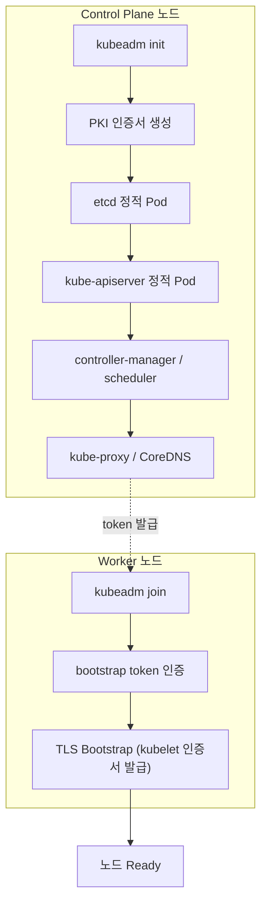
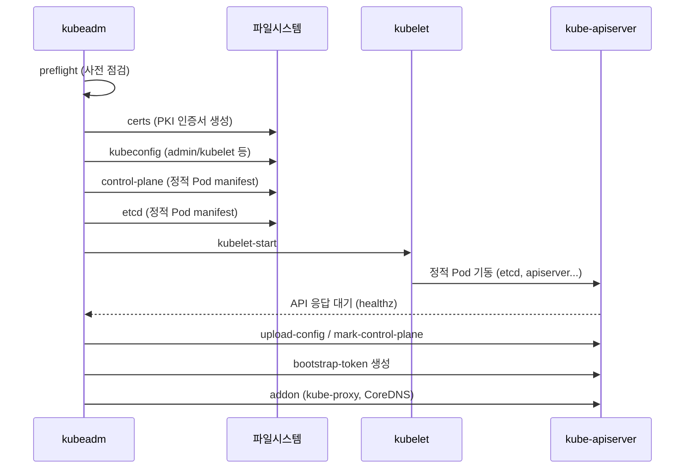
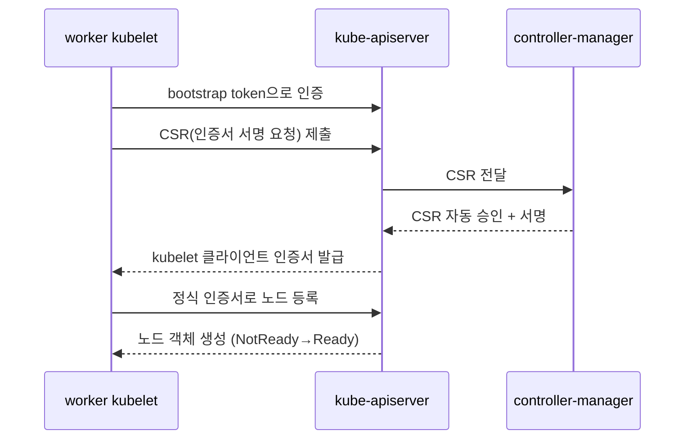

# 클러스터 설치 (kubeadm)

::: info 학습 목표
- 컨테이너 런타임·스왑·커널 모듈·sysctl 등 노드 사전 준비 항목을 빠짐없이 점검한다.
- `kubeadm init`이 control plane을 어떤 단계로 부트스트랩하는지 phase 단위로 이해한다.
- CNI 플러그인을 설치해 파드 네트워크를 활성화하고 노드가 Ready가 되는 과정을 본다.
- worker 노드를 `kubeadm join`으로 합류시키고 설치를 검증한다.
:::

## 1. kubeadm이란 무엇인가

<strong>kubeadm</strong>은 "최소한으로 동작 가능한(minimum viable)" 쿠버네티스 클러스터를 부트스트랩하는 공식 도구다. 클러스터를 처음부터 손으로 구성하려면 인증서를 발급하고, etcd를 띄우고, kube-apiserver·controller-manager·scheduler를 각각 설정하고, kubelet을 연결해야 한다. kubeadm은 이 과정을 `init`/`join` 두 명령으로 묶어 표준화한다.



kubeadm이 책임지는 범위와 책임지지 않는 범위를 구분하는 게 중요하다.

| kubeadm이 하는 일 | kubeadm이 하지 않는 일 |
|------------------|----------------------|
| PKI/kubeconfig 생성, control plane 부트스트랩 | 인프라(VM/네트워크) 프로비저닝 |
| kube-proxy·CoreDNS 애드온 설치 | CNI 플러그인 설치 (사용자 몫) |
| 노드 join, 업그레이드 절차 | 모니터링·로깅·스토리지 구성 |

자세한 내용은 [kubeadm으로 클러스터 만들기](https://kubernetes.io/docs/setup/production-environment/tools/kubeadm/create-cluster-kubeadm/) 공식 문서를 따른다.

## 2. 노드 사전 준비

`init`/`join`을 실행하기 전에 모든 노드(control plane·worker)에서 동일한 사전 준비가 필요하다. 이 단계를 건너뛰면 kubelet이 기동되지 않거나 파드 간 통신이 깨진다.

### 스왑 비활성화

kubelet은 기본적으로 스왑이 켜져 있으면 기동을 거부한다. 메모리 압박 시 스왑이 QoS·OOM 동작을 예측 불가능하게 만들기 때문이다.

```bash
# 즉시 비활성화
sudo swapoff -a
# 재부팅 후에도 유지 — fstab의 swap 라인 주석 처리
sudo sed -i '/ swap / s/^/#/' /etc/fstab
```

### 커널 모듈과 sysctl

파드 네트워크 브리지를 통과하는 트래픽이 iptables 규칙을 거치도록 `br_netfilter` 모듈과 sysctl 파라미터를 설정한다.

```bash
cat <<EOF | sudo tee /etc/modules-load.d/k8s.conf
overlay
br_netfilter
EOF

sudo modprobe overlay
sudo modprobe br_netfilter

cat <<EOF | sudo tee /etc/sysctl.d/k8s.conf
net.bridge.bridge-nf-call-iptables  = 1
net.bridge.bridge-nf-call-ip6tables = 1
net.ipv4.ip_forward                 = 1
EOF

sudo sysctl --system
```

- `overlay`: containerd의 overlayfs 스냅샷터에 필요하다.
- `br_netfilter` + `bridge-nf-call-iptables`: 브리지 트래픽이 iptables(=Service 라우팅)를 타게 한다.
- `ip_forward`: 노드가 파드 간 패킷을 포워딩하도록 한다.

::: warning
`bridge-nf-call-iptables`가 0이면 ClusterIP Service가 간헐적으로 동작하지 않는 난해한 장애가 생긴다. 설치 전에 반드시 1인지 확인한다.
:::

### 컨테이너 런타임 (containerd)

쿠버네티스는 CRI(Container Runtime Interface)를 구현한 런타임을 요구한다. 현재 표준은 [containerd](https://kubernetes.io/docs/setup/production-environment/container-runtimes/)다.

```bash
# containerd 설치 (배포판 패키지 또는 공식 바이너리)
sudo apt-get update && sudo apt-get install -y containerd

# 기본 설정 생성
sudo mkdir -p /etc/containerd
containerd config default | sudo tee /etc/containerd/config.toml >/dev/null
```

가장 흔한 함정은 <strong>cgroup 드라이버 불일치</strong>다. systemd 기반 배포판에서는 kubelet과 containerd 모두 `systemd` cgroup 드라이버를 써야 한다.

```toml
# /etc/containerd/config.toml
[plugins."io.containerd.grpc.v1.cri".containerd.runtimes.runc.options]
  SystemdCgroup = true
```

```bash
sudo systemctl restart containerd
sudo systemctl enable containerd
```

### kubeadm·kubelet·kubectl 설치

세 패키지를 동일 마이너 버전으로 설치한다.

```bash
# 패키지 저장소 추가 (예: v1.31)
sudo apt-get update && sudo apt-get install -y apt-transport-https ca-certificates curl gpg
curl -fsSL https://pkgs.k8s.io/core:/stable:/v1.31/deb/Release.key | \
  sudo gpg --dearmor -o /etc/apt/keyrings/kubernetes-apt-keyring.gpg
echo 'deb [signed-by=/etc/apt/keyrings/kubernetes-apt-keyring.gpg] https://pkgs.k8s.io/core:/stable:/v1.31/deb/ /' | \
  sudo tee /etc/apt/sources.list.d/kubernetes.list

sudo apt-get update
sudo apt-get install -y kubelet kubeadm kubectl
# 자동 업그레이드로 버전이 어긋나지 않도록 고정
sudo apt-mark hold kubelet kubeadm kubectl
```

`apt-mark hold`로 버전을 고정하는 이유는 [CH12](/study/kubernetes/12-upgrade-maintenance)의 버전 스큐 정책 때문이다. 업그레이드는 의도적·단계적으로 해야 한다.

## 3. kubeadm init — control plane 부트스트랩

control plane 노드에서 `kubeadm init`을 실행한다. CNI에 따라 Pod CIDR이 정해지므로 `--pod-network-cidr`를 미리 맞춘다.

```bash
sudo kubeadm init \
  --pod-network-cidr=10.244.0.0/16 \
  --apiserver-advertise-address=10.0.0.10 \
  --control-plane-endpoint=10.0.0.10
```

- `--pod-network-cidr`: 파드에 할당할 네트워크 대역. Flannel은 `10.244.0.0/16`을 기대한다.
- `--control-plane-endpoint`: 멀티 control plane(HA)으로 확장할 가능성이 있으면 처음부터 지정한다. 로드밸런서 DNS를 넣는 게 이상적이다.

### init이 거치는 phase

`kubeadm init`은 내부적으로 여러 phase를 순차 실행한다. 이를 이해하면 실패 지점을 정확히 짚을 수 있다.



특정 phase만 따로 실행할 수도 있다.

```bash
# 사전 점검만 수행
sudo kubeadm init phase preflight
# 인증서만 미리 생성
sudo kubeadm init phase certs all
```

### kubeconfig 설정

`init`이 끝나면 관리자용 kubeconfig가 생성된다. 일반 사용자가 `kubectl`을 쓰도록 복사한다.

```bash
mkdir -p $HOME/.kube
sudo cp -i /etc/kubernetes/admin.conf $HOME/.kube/config
sudo chown $(id -u):$(id -g) $HOME/.kube/config
```

kubeconfig 구조는 [CH14](/study/kubernetes/14-pki-kubeconfig)에서 상세히 다룬다.

## 4. CNI 설치

`init` 직후 노드 상태를 보면 `NotReady`다. 파드 네트워크(CNI)가 없기 때문이다.

```bash
kubectl get nodes
# NAME       STATUS     ROLES           AGE   VERSION
# master-1   NotReady   control-plane   2m    v1.31.0
```

CoreDNS 파드도 `Pending`에 머문다. CNI를 설치해야 비로소 노드가 Ready가 되고 파드가 IP를 받는다.

```bash
# 예: Flannel (init에서 10.244.0.0/16을 지정했을 때)
kubectl apply -f https://github.com/flannel-io/flannel/releases/latest/download/kube-flannel.yml

# 또는 Calico
kubectl apply -f https://raw.githubusercontent.com/projectcalico/calico/v3.28.0/manifests/calico.yaml
```

설치 후 노드가 Ready로 바뀌고 CoreDNS가 Running이 되는지 확인한다.

```bash
kubectl get nodes
# master-1   Ready   control-plane   5m   v1.31.0
kubectl get pods -n kube-system
```

CNI의 내부 동작(네트워크 모델, 플러그인 종류)은 [CH24. 네트워킹 모델과 CNI](/study/kubernetes/24-networking-cni)에서 깊게 다룬다. 여기서는 "CNI 없이는 노드가 Ready가 되지 않는다"는 의존 관계만 기억하면 된다.

## 5. worker 노드 join

`init` 출력 끝에 join 명령이 안내된다. worker 노드에서 그대로 실행한다(2장의 사전 준비가 worker에도 끝나 있어야 한다).

```bash
sudo kubeadm join 10.0.0.10:6443 \
  --token abcdef.0123456789abcdef \
  --discovery-token-ca-cert-hash sha256:1234...cdef
```

- `--token`: control plane이 발급한 bootstrap token. 기본 24시간 후 만료된다.
- `--discovery-token-ca-cert-hash`: 가짜 API 서버에 속지 않도록 CA 인증서를 검증하는 해시.

### 토큰이 만료됐을 때

처음 안내된 명령을 잃어버렸거나 토큰이 만료됐으면 control plane에서 다시 발급한다.

```bash
# 새 토큰 + 전체 join 명령을 한 번에 출력
kubeadm token create --print-join-command

# 토큰 목록 확인
kubeadm token list
```

### TLS Bootstrap 흐름

join은 단순히 클러스터에 "끼워 넣는" 게 아니라, kubelet이 자기 인증서를 안전하게 발급받는 과정이다.



## 6. 설치 검증

클러스터가 정상인지 단계적으로 점검한다.

### 컴포넌트·노드 상태

```bash
# 모든 노드가 Ready인지
kubectl get nodes -o wide

# control plane 컴포넌트 Pod 상태
kubectl get pods -n kube-system

# control plane 헬스
kubectl get --raw='/readyz?verbose'
```

### 실제 워크로드로 검증

리소스가 실제로 스케줄·기동되는지 확인하는 게 가장 확실하다.

```bash
kubectl create deployment nginx --image=nginx --replicas=2
kubectl get pods -o wide   # 파드가 각 노드에 분산·Running 되는지
kubectl expose deployment nginx --port=80
```

### DNS 동작 확인

```bash
kubectl run -it --rm dnstest --image=busybox:1.28 --restart=Never -- \
  nslookup kubernetes.default
```

`kubernetes.default`가 ClusterIP로 해석되면 CoreDNS·Service·CNI가 모두 정상이라는 뜻이다.

### 자주 만나는 문제

| 증상 | 원인 | 점검 |
|------|------|------|
| kubelet이 죽음 | 스왑 미해제 / cgroup 드라이버 불일치 | `journalctl -u kubelet` |
| 노드 NotReady 지속 | CNI 미설치 | `kubectl get pods -n kube-system` |
| Service 불안정 | `bridge-nf-call-iptables=0` | `sysctl net.bridge.bridge-nf-call-iptables` |
| join 실패 | 토큰 만료 / 방화벽(6443) | `kubeadm token list`, 포트 확인 |

::: tip 핵심 정리
- 모든 노드는 동일한 사전 준비가 필요하다: 스왑 해제, `br_netfilter`/sysctl, containerd(systemd cgroup), kubeadm·kubelet·kubectl 동일 버전.
- `kubeadm init`은 preflight→certs→kubeconfig→control-plane→etcd→addon의 phase로 control plane을 부트스트랩한다.
- CNI를 설치하기 전까지 노드는 NotReady다. CNI는 사용자가 직접 설치해야 한다.
- worker는 `kubeadm join`으로 bootstrap token 인증 + TLS Bootstrap을 거쳐 자기 인증서를 발급받고 합류한다.
- 검증은 노드 Ready → kube-system Pod → 실제 Deployment → DNS 순으로 단계적으로 확인한다.
:::

## 다음 챕터

동작하는 클러스터를 손에 넣었다. 하지만 클러스터는 한 번 설치하고 끝이 아니라 계속 업그레이드·유지보수해야 한다. [CH12. 업그레이드와 유지보수](/study/kubernetes/12-upgrade-maintenance)에서 버전 스큐 정책, `kubeadm upgrade` 절차, 노드 drain/cordon, PodDisruptionBudget으로 무중단 운영을 설계하는 방법을 다룬다.

- 이전: [CH10. 컨트롤러와 reconcile 루프](/study/kubernetes/10-controllers-reconcile)
- 다음: [CH12. 업그레이드와 유지보수](/study/kubernetes/12-upgrade-maintenance)
