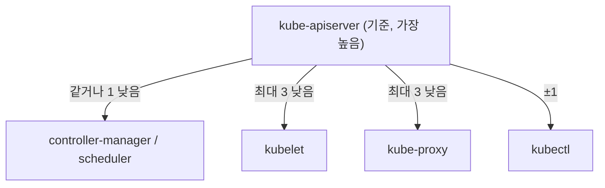
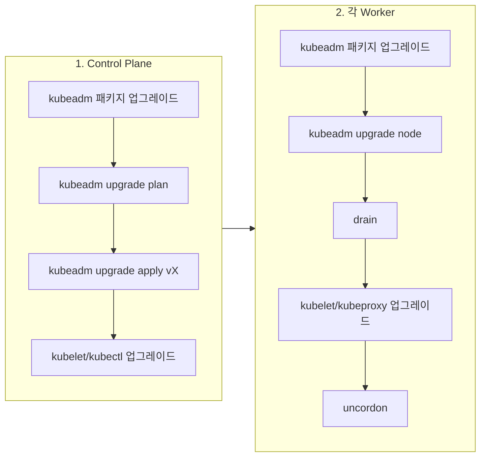
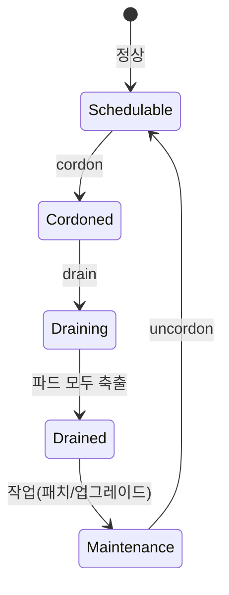
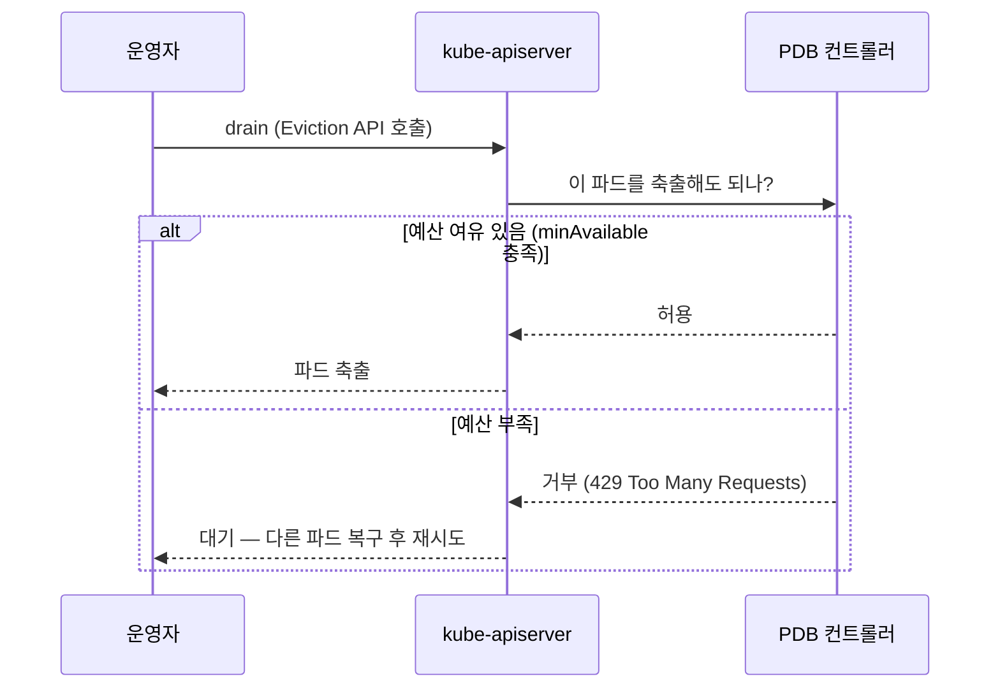

# 업그레이드와 유지보수

::: info 학습 목표
- 컴포넌트 간 버전 스큐 정책을 이해하고 안전한 업그레이드 순서를 도출한다.
- `kubeadm upgrade`로 control plane과 worker를 단계적으로 올리는 절차를 익힌다.
- cordon/drain/uncordon으로 노드를 안전하게 비우고 복귀시키는 워크플로를 숙지한다.
- PodDisruptionBudget으로 자발적 중단(voluntary disruption) 중에도 가용성을 보장한다.
:::

## 1. 버전 스큐 정책

쿠버네티스 컴포넌트는 서로 다른 버전이 공존할 수 있지만, 허용 범위가 정해져 있다. 이를 어기면 API 호환성이 깨진다. 핵심 규칙은 [버전 스큐 정책](https://kubernetes.io/releases/version-skew-policy/) 문서에 정의돼 있다.



핵심 원칙을 정리하면 이렇다.

| 컴포넌트 | apiserver 기준 허용 범위 |
|---------|------------------------|
| kube-apiserver | 기준점(가장 최신) |
| controller-manager / scheduler | 같거나 1 마이너 낮음 |
| kubelet | 최대 3 마이너 낮음(apiserver보다 높을 수 없음) |
| kube-proxy | kubelet과 동일 정책 |
| kubectl | apiserver와 ±1 마이너 |

여기서 두 가지 운영 규칙이 도출된다.

- <strong>control plane을 먼저, worker를 나중에</strong> 올린다. kubelet은 apiserver보다 높을 수 없기 때문이다.
- <strong>마이너 버전을 건너뛰지 않는다</strong>. 1.30 → 1.32로 두 단계 점프하면 kubeadm이 거부한다. 반드시 1.30 → 1.31 → 1.32로 한 단계씩 올린다.

## 2. kubeadm upgrade — 전체 그림

업그레이드는 크게 control plane 단계와 worker 단계로 나뉜다.



상세 절차는 [kubeadm 클러스터 업그레이드](https://kubernetes.io/docs/tasks/administer-cluster/kubeadm/kubeadm-upgrade/) 문서를 기준으로 따른다.

## 3. control plane 업그레이드

control plane 노드(첫 번째)에서 진행한다.

### kubeadm 자체 업그레이드와 계획 확인

```bash
# 1) 패키지 hold 해제 후 kubeadm만 목표 버전으로 올림
sudo apt-mark unhold kubeadm
sudo apt-get update && sudo apt-get install -y kubeadm=1.31.1-1.1
sudo apt-mark hold kubeadm

# 2) 업그레이드 가능 버전과 영향 확인
sudo kubeadm upgrade plan
```

`kubeadm upgrade plan`은 현재 컴포넌트 버전, 업그레이드 가능한 목표 버전, 그리고 어떤 컴포넌트가 갱신되는지를 미리 보여준다. 실제 변경은 없다.

### upgrade apply

```bash
sudo kubeadm upgrade apply v1.31.1
```

이 명령이 control plane 정적 Pod manifest(apiserver/controller-manager/scheduler/etcd)를 새 버전으로 교체한다. kubeadm은 갱신 전에 인증서·설정을 점검하고, 필요 시 인증서를 갱신한다([CH14](/study/kubernetes/14-pki-kubeconfig) 참고).

::: warning
두 번째 이후의 control plane 노드(HA 구성)에서는 `kubeadm upgrade apply`가 아니라 `kubeadm upgrade node`를 쓴다. apply는 첫 control plane 노드에서 한 번만 실행한다.
:::

### 해당 노드의 kubelet/kubectl

control plane도 결국 노드이므로 kubelet을 올려야 한다. 이때는 워크로드를 비운 뒤 진행한다(4장의 drain 사용).

```bash
sudo apt-mark unhold kubelet kubectl
sudo apt-get install -y kubelet=1.31.1-1.1 kubectl=1.31.1-1.1
sudo apt-mark hold kubelet kubectl
sudo systemctl daemon-reload
sudo systemctl restart kubelet
```

## 4. 노드 유지보수 — cordon / drain / uncordon

노드를 업그레이드하거나, 커널 패치·하드웨어 교체를 하려면 그 노드의 파드를 다른 노드로 옮기고 작업해야 한다. 이를 위한 3종 명령이 있다.



### cordon — 신규 스케줄 차단

```bash
kubectl cordon worker-1
```

노드를 `SchedulingDisabled`로 표시한다. <strong>기존 파드는 그대로 두고</strong>, 새 파드만 이 노드에 배치되지 않게 한다.

### drain — 파드 축출

```bash
kubectl drain worker-1 \
  --ignore-daemonsets \
  --delete-emptydir-data \
  --grace-period=120
```

- `--ignore-daemonsets`: DaemonSet 파드는 모든 노드에 있어야 하므로 축출 대상에서 제외(없으면 drain이 멈춤).
- `--delete-emptydir-data`: emptyDir 볼륨을 쓰는 파드가 있으면 데이터 손실을 감수하고 진행한다는 명시적 동의.
- `--grace-period`: 파드가 우아하게 종료할 시간.

drain은 내부적으로 cordon을 먼저 수행한 뒤, Eviction API로 파드를 하나씩 축출한다. 이 과정에서 PodDisruptionBudget(5장)을 존중한다.

### uncordon — 복귀

```bash
# 작업 완료 후 다시 스케줄 가능하게
kubectl uncordon worker-1
```

## 5. PodDisruptionBudget

drain은 파드를 축출하는데, 한 번에 너무 많이 죽이면 서비스가 끊긴다. <strong>PodDisruptionBudget(PDB)</strong>은 자발적 중단(drain, 노드 업그레이드 등) 동안 "동시에 죽어도 되는 파드 수"의 하한/상한을 정한다.

[PDB로 중단 처리하기](https://kubernetes.io/docs/tasks/run-application/configure-pdb/) 문서를 참고한다.

```yaml
apiVersion: policy/v1
kind: PodDisruptionBudget
metadata:
  name: web-pdb
spec:
  minAvailable: 2          # 항상 최소 2개는 살아 있어야 함
  selector:
    matchLabels:
      app: web
```

`minAvailable: 2`라면, replica 3개짜리 Deployment에서 drain은 한 번에 1개만 축출하고 나머지가 살아남도록 기다린다.

### 자발적 vs 비자발적 중단

PDB가 보호하는 것은 <strong>자발적 중단</strong>뿐이다. 이 구분이 핵심이다.

| 구분 | 예시 | PDB 보호 |
|------|------|---------|
| 자발적(voluntary) | drain, 노드 업그레이드, `kubectl delete pod` | 보호함 |
| 비자발적(involuntary) | 노드 하드웨어 고장, 커널 패닉, OOM kill | 보호 못함 |



`maxUnavailable`로도 표현할 수 있다(둘 중 하나만 지정).

```yaml
spec:
  maxUnavailable: 1   # 동시에 최대 1개까지만 사용 불가 허용
```

## 6. worker 업그레이드와 무중단 운영

control plane을 올린 뒤, worker를 한 노드씩 순차 업그레이드한다.

### worker 업그레이드 절차

```bash
# (각 worker 노드에서) kubeadm 업그레이드
sudo apt-mark unhold kubeadm
sudo apt-get install -y kubeadm=1.31.1-1.1
sudo apt-mark hold kubeadm
sudo kubeadm upgrade node

# (control plane에서) 노드 drain
kubectl drain worker-1 --ignore-daemonsets --delete-emptydir-data

# (worker 노드에서) kubelet/kube-proxy 업그레이드
sudo apt-mark unhold kubelet kubectl
sudo apt-get install -y kubelet=1.31.1-1.1 kubectl=1.31.1-1.1
sudo apt-mark hold kubelet kubectl
sudo systemctl daemon-reload && sudo systemctl restart kubelet

# (control plane에서) 복귀
kubectl uncordon worker-1
```

`kubeadm upgrade node`는 worker에서 kubelet 설정을 갱신하는 명령이다(control plane의 apply와 다르다).

### 무중단을 위한 종합 체크리스트

업그레이드가 곧 가용성 사고가 되지 않으려면 여러 장치가 맞물려야 한다.

- <strong>replica 여유</strong>: 단일 replica 워크로드는 drain 시 반드시 중단된다. 최소 2 이상으로 둔다.
- <strong>PDB 설정</strong>: 핵심 서비스에 PDB를 걸어 동시 축출을 제한한다.
- <strong>readiness probe</strong>: 새 노드로 옮겨간 파드가 준비되기 전에 트래픽을 받지 않게 한다([CH15](/study/kubernetes/15-pod)).
- <strong>안티 어피니티</strong>: 같은 서비스 파드가 한 노드에 몰려 있으면 그 노드 drain 시 전부 빠진다. topology spread로 분산한다([CH21](/study/kubernetes/21-advanced-scheduling)).
- <strong>graceful shutdown</strong>: `terminationGracePeriodSeconds`와 preStop 훅으로 연결을 정리한다.
- <strong>한 노드씩</strong>: 여러 노드를 동시에 drain하지 않는다.

### 업그레이드 검증

```bash
# 모든 노드가 목표 버전으로 올라왔는지
kubectl get nodes
# control plane 컴포넌트 정상인지
kubectl get pods -n kube-system
# 워크로드가 모두 Running인지
kubectl get pods -A | grep -v Running
```

::: tip 핵심 정리
- 버전 스큐 정책상 kubelet은 apiserver보다 높을 수 없다. 그래서 항상 control plane → worker 순으로, 마이너 한 단계씩 올린다.
- control plane은 첫 노드에서 `kubeadm upgrade apply`, 나머지 control plane·worker는 `kubeadm upgrade node`를 쓴다.
- 노드 유지보수는 cordon(신규 차단) → drain(파드 축출) → 작업 → uncordon(복귀) 흐름이다.
- PodDisruptionBudget은 drain 같은 자발적 중단 동안 가용성을 지킨다. 하드웨어 고장 같은 비자발적 중단은 보호하지 못한다.
- 무중단 운영은 replica 여유·PDB·readiness probe·토폴로지 분산·한 노드씩 진행이 함께 맞물려야 성립한다.
:::

## 다음 챕터

업그레이드와 유지보수로 클러스터를 살아 있게 유지하는 법을 봤다. 하지만 클러스터의 모든 상태는 etcd에 들어 있고, etcd가 손상되면 클러스터 전체가 무너진다. [CH13. etcd 백업과 복구](/study/kubernetes/13-etcd-backup)에서 etcdctl 스냅샷과 복구 절차, 재해 복구 시나리오를 다룬다.

- 이전: [CH11. 클러스터 설치 (kubeadm)](/study/kubernetes/11-kubeadm-install)
- 다음: [CH13. etcd 백업과 복구](/study/kubernetes/13-etcd-backup)
