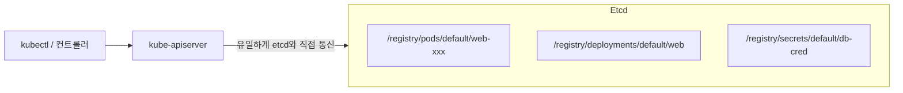
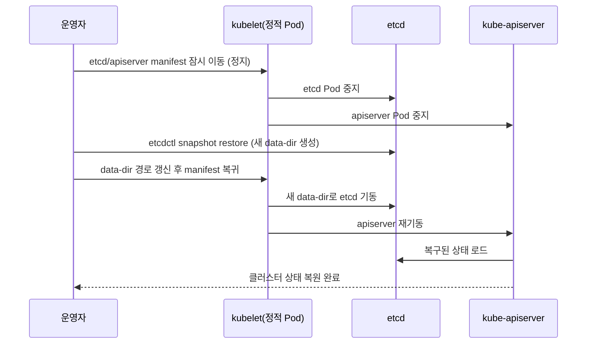
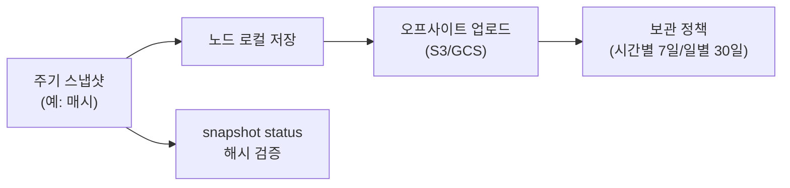

# etcd 백업과 복구

::: info 학습 목표
- etcd가 클러스터에서 맡는 역할과 키-값 데이터 구조를 이해한다.
- `etcdctl snapshot save`로 일관된 스냅샷을 만드는 방법을 익힌다.
- `etcdctl snapshot restore`로 스냅샷에서 클러스터 상태를 복구하는 절차를 숙지한다.
- 백업 주기·보관·검증을 포함한 운영 전략과 재해 복구 시나리오를 설계한다.
:::

## 1. etcd의 역할과 데이터 구조

<strong>etcd</strong>는 쿠버네티스의 모든 클러스터 상태를 저장하는 분산 키-값 저장소다. Pod·Deployment·Service·Secret·ConfigMap 등 우리가 `kubectl`로 만드는 모든 오브젝트는 결국 etcd에 기록된다. <strong>etcd가 클러스터의 유일한 진실 공급원(single source of truth)</strong>이며, etcd를 잃으면 클러스터 상태 전체를 잃는다.



핵심 특징을 정리하면 이렇다.

| 특징 | 설명 |
|------|------|
| 접근 경로 | <strong>오직 kube-apiserver만</strong> etcd와 직접 통신한다. 다른 컴포넌트는 apiserver를 거친다. |
| 데이터 모델 | `/registry/<resource>/<namespace>/<name>` 형태의 키에 직렬화된 오브젝트 저장 |
| 합의 알고리즘 | Raft. 다수결(quorum) 기반 강한 일관성 |
| 권장 멤버 수 | 홀수(3, 5). quorum = (N/2)+1 |

### etcd 안을 직접 들여다보기

apiserver를 거치지 않고 etcd에 직접 질의할 수도 있다(디버깅/검증 용도).

```bash
ETCDCTL_API=3 etcdctl \
  --endpoints=https://127.0.0.1:2379 \
  --cacert=/etc/kubernetes/pki/etcd/ca.crt \
  --cert=/etc/kubernetes/pki/etcd/server.crt \
  --key=/etc/kubernetes/pki/etcd/server.key \
  get /registry/ --prefix --keys-only | head
```

kubeadm으로 설치한 클러스터에서 etcd는 control plane 노드의 정적 Pod로 떠 있고, 인증서는 `/etc/kubernetes/pki/etcd/`에 있다. 상세 설정·운영은 [etcd 클러스터 운영](https://kubernetes.io/docs/tasks/administer-cluster/configure-upgrade-etcd/) 문서를 참고한다.

## 2. etcdctl로 백업 준비

백업의 핵심 도구는 etcd에 포함된 `etcdctl`이다. API 버전 3을 명시하고, TLS 인증서로 인증한다.

### 인증 정보 환경변수화

매번 긴 플래그를 쓰지 않도록 환경변수로 묶는다.

```bash
export ETCDCTL_API=3
export ETCDCTL_ENDPOINTS=https://127.0.0.1:2379
export ETCDCTL_CACERT=/etc/kubernetes/pki/etcd/ca.crt
export ETCDCTL_CERT=/etc/kubernetes/pki/etcd/server.crt
export ETCDCTL_KEY=/etc/kubernetes/pki/etcd/server.key
```

### 멤버·상태 확인

백업 전에 etcd가 건강한지(리더가 있고 멤버가 정상인지) 확인한다.

```bash
etcdctl endpoint health
etcdctl endpoint status --write-out=table
etcdctl member list -w table
```

`endpoint status`의 `DB SIZE`로 데이터 양을 가늠하고, `IS LEADER`로 리더를 확인한다.

## 3. etcdctl snapshot save

```bash
etcdctl snapshot save /backup/etcd-snapshot-$(date +%F-%H%M).db
```

이 명령은 etcd의 현재 상태를 일관된 단일 파일(`.db`)로 떠낸다. etcd는 MVCC 기반이라 스냅샷을 뜨는 동안에도 쓰기가 가능하며, 스냅샷은 명령 실행 시점의 일관된 스냅숏이다.

### 스냅샷 검증

스냅샷이 손상되지 않았는지 해시·리비전을 확인한다.

```bash
etcdctl snapshot status /backup/etcd-snapshot-2026-06-15-0300.db -w table
# +----------+----------+------------+------------+
# |   HASH   | REVISION | TOTAL KEYS | TOTAL SIZE |
# +----------+----------+------------+------------+
# | a1b2c3d4 |   123456 |      48210 |     45 MB  |
# +----------+----------+------------+------------+
```

::: warning
정적 Pod manifest나 데이터 디렉토리 파일을 그냥 `cp`로 복사하는 것은 일관성을 보장하지 못한다. 반드시 `etcdctl snapshot save`로 만든 스냅샷을 백업으로 사용한다.
:::

### 자동화 예시

cron으로 주기 백업을 돌린다.

```bash
# /etc/cron.d/etcd-backup — 매시 정각
0 * * * * root /usr/local/bin/etcd-backup.sh && \
  find /backup -name 'etcd-snapshot-*.db' -mtime +7 -delete
```

스냅샷을 노드 로컬에만 두면 노드가 죽을 때 같이 사라진다. 만든 즉시 오브젝트 스토리지(S3 등) 오프사이트로 업로드한다.

## 4. snapshot restore — 복구

복구는 "스냅샷에서 새 etcd 데이터 디렉토리를 만든 뒤, apiserver가 그 디렉토리를 보게 하는" 작업이다.



### 복구 절차

```bash
# 1) control plane 정지 — 정적 Pod manifest를 잠시 빼낸다
sudo mkdir -p /etc/kubernetes/manifests-backup
sudo mv /etc/kubernetes/manifests/etcd.yaml \
        /etc/kubernetes/manifests/kube-apiserver.yaml \
        /etc/kubernetes/manifests-backup/

# 2) 스냅샷에서 새 데이터 디렉토리 복원
sudo ETCDCTL_API=3 etcdctl snapshot restore \
  /backup/etcd-snapshot-2026-06-15-0300.db \
  --data-dir=/var/lib/etcd-restored

# 3) etcd manifest의 hostPath(volume) 경로를 /var/lib/etcd-restored로 수정
#    (etcd.yaml의 etcd-data volume hostPath)

# 4) manifest 복귀 — kubelet이 감지해 etcd/apiserver 재기동
sudo mv /etc/kubernetes/manifests-backup/etcd.yaml \
        /etc/kubernetes/manifests-backup/kube-apiserver.yaml \
        /etc/kubernetes/manifests/
```

멀티 멤버 etcd를 복구할 때는 `--initial-cluster`, `--initial-advertise-peer-urls`, `--name` 같은 플래그로 새 클러스터 토폴로지를 함께 지정해야 한다. 단일 노드 control plane이면 위 절차로 충분하다.

### 복구 후 검증

```bash
# etcd가 새 data-dir로 떴는지
sudo crictl ps | grep etcd
# 클러스터 상태가 스냅샷 시점으로 돌아왔는지
kubectl get nodes
kubectl get pods -A
```

스냅샷 이후 생성된 오브젝트는 사라지고, 스냅샷 시점 상태로 되돌아간다. 이것이 RPO(허용 데이터 손실)가 백업 주기에 직접 묶이는 이유다.

## 5. 백업 운영 전략

스냅샷을 "한 번 떠본 적 있다"와 "운영 전략이 있다"는 다르다. 다음 항목을 정책으로 못 박는다.

### 주기와 보관



| 항목 | 권장 |
|------|------|
| 주기 | 변경 빈도에 맞춰 매시~수 시간. RPO가 빡빡하면 더 자주 |
| 보관 | 시간별 7일 + 일별 30일 같은 계층 보관 |
| 위치 | 노드 로컬 + 오프사이트(리전 분리) 이중화 |
| 검증 | 만든 직후 `snapshot status`로 해시 확인 |
| 암호화 | 스냅샷에 Secret 평문이 들어 있으므로 전송·저장 모두 암호화 |

::: warning
etcd 스냅샷에는 모든 Secret이 들어 있다. 저장 시 etcd 자체를 암호화(EncryptionConfiguration)하거나, 스냅샷 파일을 암호화해 보관한다. 자세한 내용은 [CH36. 공급망·런타임 보안](/study/kubernetes/36-supplychain-runtime-security)에서 다룬다.
:::

### 복구 훈련

"복구해 본 적 없는 백업"은 백업이 아니다.

- 주기적으로 격리 환경에 스냅샷을 복구해 본다.
- 복구 소요 시간(RTO)을 실측해 목표치와 비교한다.
- 절차서를 그대로 따라 했을 때 막히는 지점을 문서에 반영한다.

## 6. 재해 복구 시나리오

상황별로 무엇을 복구 수단으로 쓰는지 정리한다.

| 사건 | 복구 방법 | 예상 RTO | 예상 RPO |
|------|----------|---------|---------|
| 실수로 리소스 대량 삭제 | 최근 스냅샷 restore | 10~30분 | 마지막 스냅샷 시점 |
| etcd 데이터 손상 | 스냅샷 restore | 30분~수 시간 | 마지막 스냅샷 시점 |
| control plane 노드 소실(단일) | 노드 재구성 + 스냅샷 restore | 수 시간 | 마지막 스냅샷 시점 |
| etcd 멤버 1개 장애(3노드) | 멤버 교체(복구 불필요) | 수 분 | 0(quorum 유지) |
| 전체 etcd 클러스터 소실 | 스냅샷에서 새 클러스터 재구성 | 수 시간 | 마지막 스냅샷 시점 |

### 멀티 멤버 etcd의 회복력

3노드 etcd는 1노드가 죽어도 quorum(2/3)이 유지되어 클러스터가 계속 동작한다. 이 경우는 복구가 아니라 멤버 교체로 처리한다.

```bash
# 죽은 멤버 제거
etcdctl member remove <member-id>
# 새 멤버 추가
etcdctl member add etcd-new --peer-urls=https://10.0.0.13:2380
```

스냅샷 복구는 quorum이 깨졌거나(과반 멤버 동시 소실) 데이터 자체가 손상됐을 때의 최후 수단이다. 그래서 운영 권고는 두 겹이다 — <strong>평소엔 홀수 멤버로 회복력을 확보하고, 그래도 무너졌을 때를 위해 스냅샷을 둔다</strong>.

### 복구 절차서 예시

```
## 사전 정보
- 스냅샷 위치: s3://backups/etcd/ (시간별)
- etcd 인증서: /etc/kubernetes/pki/etcd/

## RTO/RPO 목표
- RTO: 1시간
- RPO: 1시간 (매시 스냅샷)

## 절차
1. 최신 스냅샷 다운로드 + snapshot status로 무결성 확인
2. control plane manifest 이동(etcd/apiserver 정지)
3. etcdctl snapshot restore --data-dir
4. etcd manifest hostPath 갱신 후 manifest 복귀
5. kubectl get nodes / get pods -A 로 검증

## 검증 훈련
- 분기 1회 격리 환경 복구, RTO 실측 기록
```

::: tip 핵심 정리
- etcd는 클러스터의 유일한 진실 공급원이며, 오직 kube-apiserver만 직접 통신한다. etcd를 잃으면 클러스터 상태 전체를 잃는다.
- 백업은 반드시 `etcdctl snapshot save`로 일관된 스냅샷을 만든다. 파일 복사는 일관성을 보장하지 못한다.
- 복구는 control plane 정지 → `snapshot restore`로 새 data-dir 생성 → etcd manifest 경로 갱신 → 재기동 순서다.
- 스냅샷에는 모든 Secret이 들어 있으므로 암호화·오프사이트 보관·복구 훈련을 운영 정책으로 못 박는다.
- 홀수 멤버(3/5)로 회복력을 확보하면 1노드 장애는 멤버 교체로 처리되고, 스냅샷 복구는 quorum이 깨진 최후의 수단으로 남는다.
:::

## 다음 챕터

etcd 백업으로 데이터 측면의 안전망을 갖췄다. 그런데 etcd·apiserver·kubelet은 모두 인증서로 서로를 신뢰한다. 이 인증서가 어떻게 구성되고 만료되며 갱신되는지 모르면 어느 날 클러스터가 통째로 멈출 수 있다. [CH14. 인증서·PKI·kubeconfig](/study/kubernetes/14-pki-kubeconfig)에서 클러스터 PKI 구조, 인증서 갱신, kubeconfig 구조를 다룬다.

- 이전: [CH12. 업그레이드와 유지보수](/study/kubernetes/12-upgrade-maintenance)
- 다음: [CH14. 인증서·PKI·kubeconfig](/study/kubernetes/14-pki-kubeconfig)
