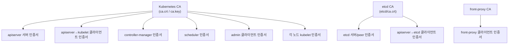
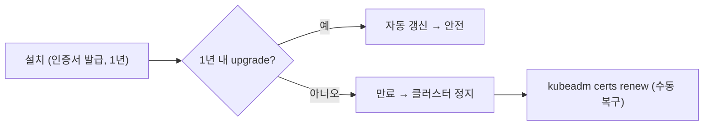
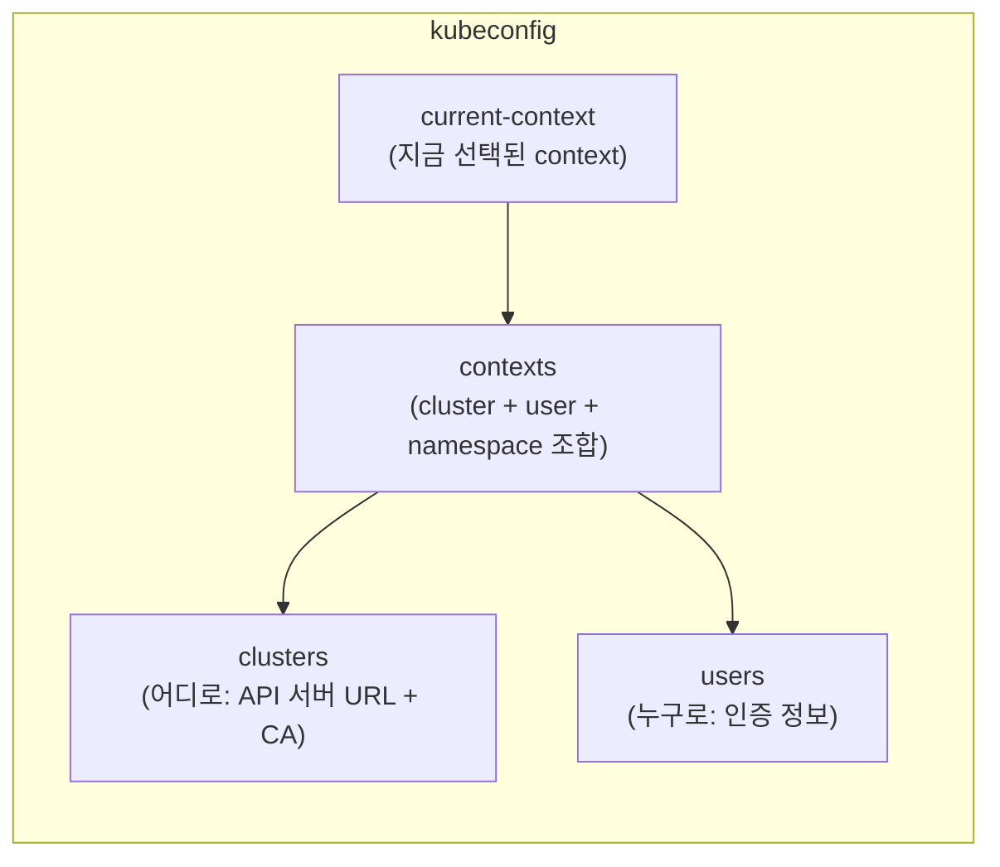
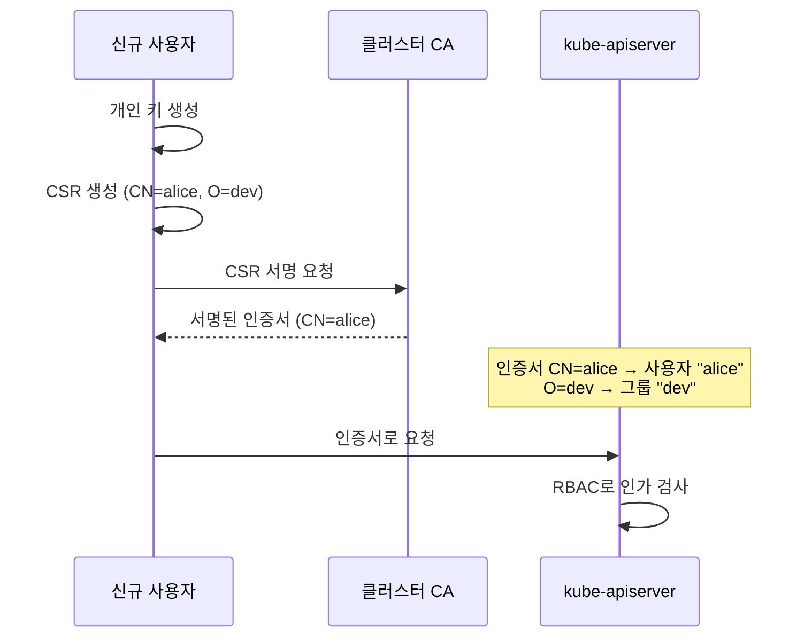

# 인증서·PKI·kubeconfig

::: info 학습 목표
- 클러스터 PKI의 신뢰 체계(CA → 각 컴포넌트 인증서)를 구조적으로 이해한다.
- 인증서 만료를 점검하고 `kubeadm certs renew`로 갱신하는 절차를 익힌다.
- kubeconfig의 clusters/users/contexts 3요소와 동작 방식을 해부한다.
- 인증서 기반으로 새 사용자를 만들고 RBAC와 연결하는 흐름을 실습한다.
:::

## 1. 클러스터 PKI 구조

쿠버네티스 control plane 컴포넌트는 서로 mTLS로 통신한다. 이 신뢰의 뿌리에 <strong>CA(Certificate Authority)</strong>가 있다. 모든 컴포넌트 인증서는 CA가 서명하며, 상대방의 인증서가 같은 CA로 서명됐는지 검증해 신뢰한다.



kubeadm 클러스터에서 인증서는 control plane 노드의 `/etc/kubernetes/pki/`에 있다.

```
/etc/kubernetes/pki/
├── ca.crt / ca.key                  # 메인 CA
├── apiserver.crt / apiserver.key    # apiserver 서버 인증서
├── apiserver-kubelet-client.crt     # apiserver→kubelet
├── front-proxy-ca.crt / .key        # aggregation layer용 CA
├── front-proxy-client.crt
├── sa.key / sa.pub                  # ServiceAccount 토큰 서명 키
└── etcd/
    ├── ca.crt / ca.key              # etcd 전용 CA
    ├── server.crt / peer.crt
    └── ...
```

PKI 구조의 전체 설명은 [PKI 인증서와 요구사항](https://kubernetes.io/docs/setup/best-practices/certificates/) 문서에 정리돼 있다. 세 가지 CA가 분리돼 있다는 점이 핵심이다.

| CA | 용도 |
|----|------|
| Kubernetes CA(`ca.crt`) | apiserver·kubelet·관리자 등 대부분의 클라이언트/서버 인증서 서명 |
| etcd CA(`etcd/ca.crt`) | etcd 서버/peer 및 apiserver→etcd 클라이언트 인증서 서명 |
| front-proxy CA | Aggregation Layer([CH39](/study/kubernetes/39-api-extension)) 신뢰 체인 |

::: warning
`ca.key`와 `sa.key`는 클러스터의 마스터 키나 다름없다. 이 키가 유출되면 누구든 admin 인증서를 위조할 수 있다. etcd 스냅샷([CH13](/study/kubernetes/13-etcd-backup))과 함께 PKI 디렉토리도 안전하게 백업·보관한다.
:::

## 2. 인증서 만료와 점검

kubeadm이 발급하는 컴포넌트 인증서는 기본 <strong>1년</strong> 유효기간을 갖는다(CA는 10년). 즉 클러스터를 1년 넘게 방치하면 인증서가 만료되어 apiserver가 컴포넌트를 거부하고 클러스터가 멈춘다.

### 만료일 확인

```bash
sudo kubeadm certs check-expiration
```

```
CERTIFICATE                EXPIRES                  RESIDUAL TIME   EXTERNALLY MANAGED
admin.conf                 Jun 15, 2027 03:00 UTC   364d            no
apiserver                  Jun 15, 2027 03:00 UTC   364d            no
apiserver-kubelet-client   Jun 15, 2027 03:00 UTC   364d            no
controller-manager.conf    Jun 15, 2027 03:00 UTC   364d            no
...
```

### 만료가 자동 갱신되는 경우

`kubeadm upgrade`([CH12](/study/kubernetes/12-upgrade-maintenance))를 실행하면 인증서가 자동으로 갱신된다. 그래서 클러스터를 주기적으로 업그레이드하면 인증서 만료를 거의 신경 쓰지 않게 된다. 문제는 "오래 업그레이드 없이 돌아간 클러스터"다.



::: tip
kubelet의 클라이언트 인증서는 별도다. kubelet은 `rotateCertificates: true` 설정으로 자기 인증서를 자동 갱신할 수 있다(설치 시 기본 활성인 경우가 많다). 컴포넌트 인증서와 별개로 동작한다.
:::

## 3. kubeadm certs renew

만료가 임박했거나 만료됐다면 수동으로 갱신한다.

```bash
# 모든 인증서를 한 번에 갱신
sudo kubeadm certs renew all

# 또는 특정 인증서만
sudo kubeadm certs renew apiserver
```

갱신은 디스크의 인증서 파일을 새로 발급된 것으로 교체한다. 하지만 control plane 정적 Pod는 이미 메모리에 인증서를 로드한 상태라, <strong>재시작해야</strong> 새 인증서를 읽는다.

```bash
# 정적 Pod manifest를 잠깐 빼냈다 넣어 재시작 유도
cd /etc/kubernetes/manifests
sudo mv kube-apiserver.yaml kube-controller-manager.yaml kube-scheduler.yaml etcd.yaml /tmp/
# kubelet이 Pod 종료를 감지할 시간을 준 뒤
sudo mv /tmp/kube-apiserver.yaml /tmp/kube-controller-manager.yaml \
        /tmp/kube-scheduler.yaml /tmp/etcd.yaml .
```

갱신 후 `admin.conf`의 인증서도 새로 발급되므로, `$HOME/.kube/config`를 다시 복사해야 할 수 있다.

```bash
sudo cp /etc/kubernetes/admin.conf $HOME/.kube/config
sudo chown $(id -u):$(id -g) $HOME/.kube/config
```

검증.

```bash
sudo kubeadm certs check-expiration   # 만료일이 미래로 갱신됐는지
kubectl get nodes                     # 정상 통신 확인
```

## 4. kubeconfig 구조

`kubectl`이 "어느 클러스터에, 누구로 접속할지"를 아는 것은 <strong>kubeconfig</strong> 덕분이다. 기본 위치는 `~/.kube/config`다. kubeconfig는 세 종류의 목록과 하나의 현재 선택으로 구성된다.



### 실제 파일

```yaml
apiVersion: v1
kind: Config
clusters:
- name: prod-cluster
  cluster:
    server: https://10.0.0.10:6443
    certificate-authority-data: <base64 CA>
users:
- name: admin
  user:
    client-certificate-data: <base64 인증서>
    client-key-data: <base64 키>
contexts:
- name: admin@prod-cluster
  context:
    cluster: prod-cluster
    user: admin
    namespace: default
current-context: admin@prod-cluster
```

- <strong>clusters</strong>: 접속 대상. API 서버 주소와, 그 서버를 신뢰할 CA.
- <strong>users</strong>: 인증 수단. 클라이언트 인증서, 토큰, exec 플러그인 등.
- <strong>contexts</strong>: cluster + user + namespace를 묶은 "작업 환경" 단위.
- <strong>current-context</strong>: 지금 활성화된 context.

### context 다루기

```bash
# 현재 설정 보기
kubectl config view --minify

# context 목록
kubectl config get-contexts

# context 전환 (다른 클러스터/사용자로)
kubectl config use-context admin@prod-cluster

# 현재 context의 기본 namespace 변경
kubectl config set-context --current --namespace=team-a
```

여러 클러스터를 오갈 때는 `KUBECONFIG` 환경변수로 여러 파일을 병합할 수도 있다.

```bash
export KUBECONFIG=~/.kube/config:~/.kube/dev-config
kubectl config get-contexts
```

kubeconfig 작성 규칙은 [멀티 클러스터 접근 구성](https://kubernetes.io/docs/tasks/access-application-cluster/configure-access-multiple-clusters/) 문서에 정리돼 있다.

## 5. 인증서 기반 사용자 추가

쿠버네티스에는 "사용자 오브젝트"가 없다. 대신 <strong>CA가 서명한 클라이언트 인증서의 Subject</strong>가 곧 사용자 신원이 된다. `CN`(Common Name)이 사용자 이름, `O`(Organization)가 그룹이 된다.



### 인증서 발급

```bash
# 1) 개인 키 + CSR 생성 (CN=사용자명, O=그룹명)
openssl genrsa -out alice.key 2048
openssl req -new -key alice.key -out alice.csr -subj "/CN=alice/O=dev"

# 2) CSR을 클러스터 CertificateSigningRequest로 제출하거나,
#    클러스터 CA로 직접 서명
openssl x509 -req -in alice.csr \
  -CA /etc/kubernetes/pki/ca.crt -CAkey /etc/kubernetes/pki/ca.key \
  -CAcreateserial -out alice.crt -days 365
```

운영에서는 직접 CA 서명보다 클러스터의 [CertificateSigningRequest API](https://kubernetes.io/docs/reference/access-authn-authz/certificate-signing-requests/)를 통한 발급이 권장된다(승인 흐름을 남길 수 있다).

### kubeconfig에 사용자 등록

```bash
kubectl config set-credentials alice \
  --client-certificate=alice.crt --client-key=alice.key --embed-certs=true

kubectl config set-context alice@prod-cluster \
  --cluster=prod-cluster --user=alice --namespace=team-a

kubectl config use-context alice@prod-cluster
```

### RBAC로 권한 부여

인증서로 신원이 확인돼도 권한이 없으면 아무것도 못 한다. RBAC로 `dev` 그룹(또는 `alice` 사용자)에 역할을 바인딩한다.

```yaml
apiVersion: rbac.authorization.k8s.io/v1
kind: RoleBinding
metadata:
  name: dev-edit
  namespace: team-a
subjects:
- kind: Group           # 인증서의 O=dev
  name: dev
  apiGroup: rbac.authorization.k8s.io
roleRef:
  kind: ClusterRole
  name: edit            # 내장 ClusterRole
  apiGroup: rbac.authorization.k8s.io
```

```bash
# alice가 무엇을 할 수 있는지 확인
kubectl auth can-i create pods --namespace=team-a --as=alice
```

인증·인가의 전체 그림(RBAC, ServiceAccount, 인증 방식)은 [CH33. 인증과 인가 (RBAC)](/study/kubernetes/33-authn-authz-rbac)에서 깊게 다룬다. 여기서는 "인증서 Subject가 신원이 되고, RBAC가 권한을 준다"는 두 단계 분리를 이해하면 된다.

## 6. 운영 시 주의점

- <strong>인증서 만료는 조용히 다가온다</strong>: 모니터링에 `kubeadm certs check-expiration`을 주기 점검으로 넣거나, 정기 업그레이드로 자동 갱신을 유도한다.
- <strong>CA 키 보호가 최우선</strong>: `ca.key`·`sa.key`는 클러스터 신뢰의 뿌리다. 접근을 제한하고 안전하게 백업한다.
- <strong>사용자 인증서에도 만료를 둔다</strong>: 사람용 인증서는 짧은 유효기간(예: 365일 이하)으로 발급하고, 퇴사·권한 회수 시 RBAC 바인딩을 제거한다(인증서 자체 폐기는 까다롭다).
- <strong>kubeconfig를 함부로 공유하지 않는다</strong>: admin.conf는 사실상 cluster-admin 권한이다. 사람마다 별도 인증서·최소 권한 RBAC를 발급한다.

::: tip 핵심 정리
- 클러스터 PKI는 CA를 뿌리로 하는 mTLS 신뢰 체계다. Kubernetes CA·etcd CA·front-proxy CA 세 갈래로 나뉜다.
- kubeadm 컴포넌트 인증서는 기본 1년 만료다. `kubeadm upgrade`가 자동 갱신하므로 정기 업그레이드가 곧 인증서 관리다.
- 만료 시 `kubeadm certs renew all` 후 control plane 정적 Pod를 재시작하고 admin.conf를 다시 배포한다.
- kubeconfig는 clusters(어디로)·users(누구로)·contexts(조합) + current-context로 구성된다.
- 쿠버네티스에 사용자 오브젝트는 없다. CA가 서명한 인증서의 CN/O가 사용자/그룹 신원이 되고, RBAC가 권한을 부여한다.
:::

## 다음 챕터

클러스터 구축·운영(설치·업그레이드·etcd·PKI)을 마쳤다. 이제 그 위에서 실제로 애플리케이션을 돌리는 워크로드의 세계로 들어간다. [CH15. Pod](/study/kubernetes/15-pod)에서 쿠버네티스 실행의 최소 단위인 Pod의 라이프사이클, multi-container, init container, probe를 다룬다.

- 이전: [CH13. etcd 백업과 복구](/study/kubernetes/13-etcd-backup)
- 다음: [CH15. Pod](/study/kubernetes/15-pod)
