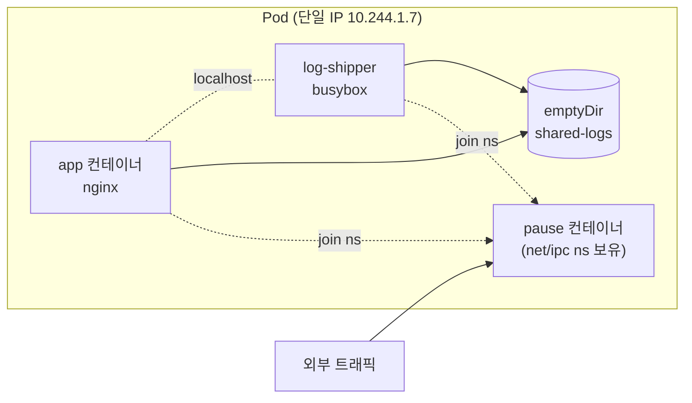
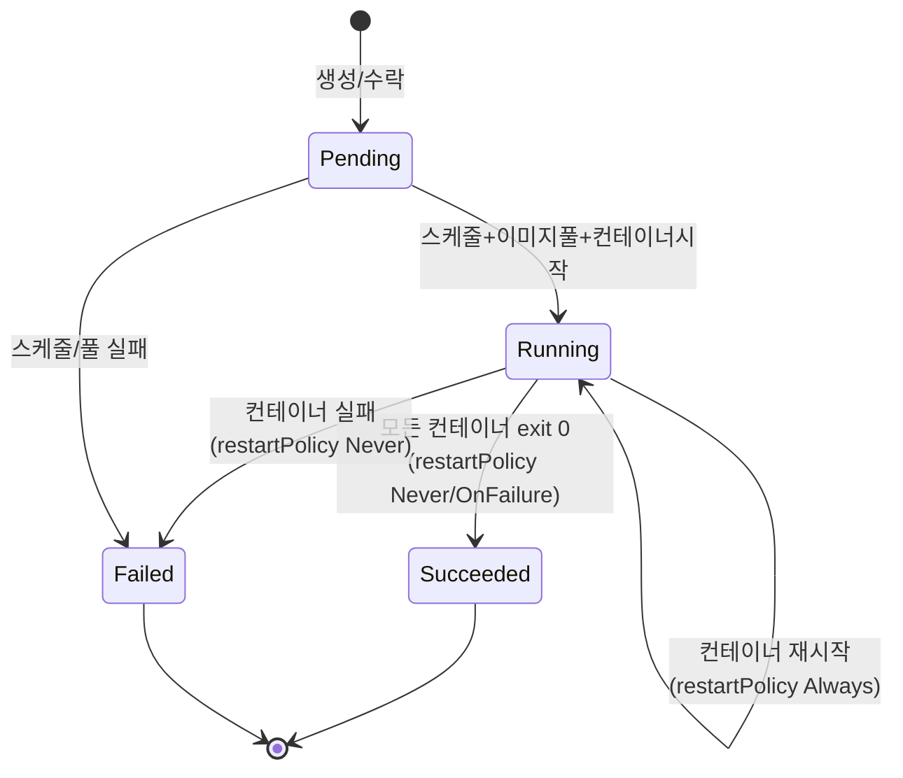

# Pod

::: info 학습 목표
- Pod가 왜 컨테이너가 아니라 쿠버네티스 워크로드의 최소 단위인지 이해한다.
- 단일 컨테이너 Pod와 멀티 컨테이너 Pod의 구성·통신 방식을 익힌다.
- Pod의 라이프사이클(phase·condition)과 컨테이너 상태 전이를 정확히 읽는다.
- init 컨테이너와 세 가지 probe(liveness/readiness/startup), 리스타트 정책을 실전 매니페스트로 다룬다.
- 사이드카 패턴과 네이티브 사이드카(restartPolicy: Always init container)의 동작을 구분한다.
:::

## 1. Pod란 무엇인가

<strong>Pod</strong>는 쿠버네티스에서 생성·관리할 수 있는 가장 작은 배포 단위다. 컨테이너가 아니라 Pod가 최소 단위라는 점이 핵심이다. 하나의 Pod는 하나 이상의 컨테이너를 묶어 하나의 논리적 호스트처럼 동작시킨다.

같은 Pod 안의 컨테이너들은 다음 자원을 공유한다.

- <strong>네트워크 네임스페이스</strong>: 같은 IP, 같은 포트 공간. 컨테이너끼리 `localhost`로 통신한다.
- <strong>IPC 네임스페이스</strong>: 같은 System V IPC / POSIX 메시지 큐를 쓸 수 있다.
- <strong>볼륨</strong>: Pod에 정의된 볼륨을 여러 컨테이너가 마운트해 파일을 주고받는다.
- 선택적으로 <strong>PID 네임스페이스</strong>(`shareProcessNamespace: true`)도 공유할 수 있다.

이 공유를 가능하게 하는 것이 `pause` 컨테이너(infra container)다. 네트워크·IPC 네임스페이스를 잡아 두는 껍데기 컨테이너로, 다른 컨테이너들이 여기에 join 한다. 이 덕분에 애플리케이션 컨테이너 하나가 죽고 살아나도 Pod의 IP는 유지된다.

가장 단순한 Pod 매니페스트다.

```yaml
apiVersion: v1
kind: Pod
metadata:
  name: nginx
  labels:
    app: web
spec:
  containers:
  - name: nginx
    image: nginx:1.27
    ports:
    - containerPort: 80
```

```bash
kubectl apply -f nginx-pod.yaml
kubectl get pod nginx -o wide
kubectl describe pod nginx
```

실무에서 Pod를 직접 만드는 경우는 드물다. 보통 Deployment·StatefulSet·Job 같은 컨트롤러가 Pod 템플릿을 통해 Pod를 생성·관리한다. 그래도 Pod의 동작을 정확히 이해해야 상위 워크로드를 다룰 수 있다.

자세한 설명은 [Pods 공식 문서](https://kubernetes.io/docs/concepts/workloads/pods/)를 참고한다.

## 2. 단일 컨테이너 Pod와 멀티 컨테이너 Pod

가장 흔한 형태는 컨테이너 하나만 가진 Pod다. 쿠버네티스가 컨테이너를 직접 다루지 않고 Pod로 감싸기 때문에, "한 컨테이너 = 한 Pod"가 기본 패턴이다.

멀티 컨테이너 Pod는 <strong>밀접하게 결합된</strong> 컨테이너들을 함께 배치할 때 쓴다. 같은 라이프사이클을 공유해야 하고, 같은 노드에 반드시 함께 떠야 하며, 로컬 파일·localhost로 긴밀히 통신하는 경우다.

```yaml
apiVersion: v1
kind: Pod
metadata:
  name: web-with-logger
spec:
  volumes:
  - name: shared-logs
    emptyDir: {}
  containers:
  - name: app
    image: nginx:1.27
    volumeMounts:
    - name: shared-logs
      mountPath: /var/log/nginx
  - name: log-shipper
    image: busybox:1.36
    command: ["sh", "-c", "tail -F /logs/access.log"]
    volumeMounts:
    - name: shared-logs
      mountPath: /logs
```

`app`이 `/var/log/nginx`에 쓰는 로그를 `log-shipper`가 `/logs`에서 읽는다. `emptyDir` 볼륨을 공유하므로 같은 디스크 영역을 본다. 두 컨테이너는 같은 네트워크 네임스페이스라 `localhost`로도 통신할 수 있다.



특정 컨테이너 로그만 보거나 exec 할 때는 `-c`로 컨테이너를 지정한다.

```bash
kubectl logs web-with-logger -c log-shipper
kubectl exec -it web-with-logger -c app -- sh
```

## 3. Pod 라이프사이클과 phase

Pod는 `status.phase` 필드로 생애 주기의 큰 단계를 나타낸다. 다섯 가지 값이 있다.

| phase | 의미 |
|-------|------|
| Pending | Pod가 수락됐지만 아직 컨테이너가 실행되지 않음(스케줄링 대기, 이미지 풀 중) |
| Running | Pod가 노드에 바인딩되고 최소 한 개 컨테이너가 실행 중 |
| Succeeded | 모든 컨테이너가 성공(exit 0)으로 종료, 재시작 안 함 |
| Failed | 모든 컨테이너가 종료됐고 최소 하나가 실패 |
| Unknown | 노드와 통신 불가 등으로 상태를 알 수 없음 |

phase는 큰 단계만 표현하므로, 세밀한 상태는 `status.conditions`로 본다. 대표적으로 `PodScheduled`, `Initialized`, `ContainersReady`, `Ready`가 있다. 이 중 `Ready`가 true여야 Service의 엔드포인트로 등록된다.



각 컨테이너는 별도로 `state`(Waiting / Running / Terminated)를 가진다. `kubectl describe pod`의 `State`, `Last State`, `Reason`, `Exit Code`를 보면 컨테이너 단위 전이를 추적할 수 있다. `CrashLoopBackOff`는 컨테이너가 반복 실패해 재시작 간격이 지수적으로 늘어난 상태를 가리키는 reason이다.

```bash
kubectl get pod nginx -o jsonpath='{.status.phase}'
kubectl get pod nginx -o jsonpath='{.status.conditions}'
```

라이프사이클 전반은 [Pod Lifecycle 문서](https://kubernetes.io/docs/concepts/workloads/pods/pod-lifecycle/)에 정리돼 있다.

## 4. init 컨테이너

<strong>init 컨테이너</strong>는 앱 컨테이너가 시작되기 전에 순차적으로 실행되는 준비용 컨테이너다. 각 init 컨테이너는 반드시 성공(exit 0)해야 다음 init 컨테이너가 실행되고, 모두 끝나야 앱 컨테이너가 시작된다.

쓰임새는 다음과 같다.

- 의존 서비스(DB, API)가 뜰 때까지 대기
- 설정 파일·시크릿을 받아 공유 볼륨에 미리 배치
- 스키마 마이그레이션 등 1회성 사전 작업

```yaml
apiVersion: v1
kind: Pod
metadata:
  name: app-with-init
spec:
  initContainers:
  - name: wait-for-db
    image: busybox:1.36
    command:
    - sh
    - -c
    - |
      until nc -z postgres 5432; do
        echo "waiting for db..."; sleep 2;
      done
  containers:
  - name: app
    image: myapp:1.0
    env:
    - name: DB_HOST
      value: postgres
```

init 컨테이너가 실행되는 동안 Pod의 condition은 `Initialized=false`이고, phase는 `Pending`이다. init이 모두 끝나면 `Initialized=true`로 바뀐다. init 컨테이너가 실패하면 Pod의 `restartPolicy`에 따라 재시도하거나 Pod를 Failed로 만든다(`Never`인 경우).

init 컨테이너는 앱 컨테이너와 자원을 공유하지만 동시에 실행되지 않으므로, 리소스 요청 계산 시 별도 규칙이 적용된다. 자세한 내용은 [Init Containers 문서](https://kubernetes.io/docs/concepts/workloads/pods/init-containers/)를 참고한다.

## 5. Probe — liveness, readiness, startup

kubelet은 <strong>probe</strong>로 컨테이너의 건강 상태를 주기적으로 점검한다. 세 종류가 있고 목적이 다르다.

| probe | 실패 시 동작 | 목적 |
|-------|-------------|------|
| livenessProbe | 컨테이너 재시작 | 데드락·행 상태를 감지해 복구 |
| readinessProbe | 엔드포인트에서 제외(트래픽 차단) | 트래픽 받을 준비가 됐는지 판단 |
| startupProbe | 컨테이너 재시작 | 느린 시작 앱 보호. 성공 전까지 liveness/readiness 비활성화 |

probe는 세 가지 방식으로 검사한다. `httpGet`(HTTP 상태 코드 2xx/3xx), `tcpSocket`(포트 연결), `exec`(명령 exit 0), 그리고 gRPC 앱을 위한 `grpc`도 있다.

```yaml
apiVersion: v1
kind: Pod
metadata:
  name: app-with-probes
spec:
  containers:
  - name: app
    image: myapp:1.0
    ports:
    - containerPort: 8080
    startupProbe:
      httpGet:
        path: /healthz
        port: 8080
      failureThreshold: 30
      periodSeconds: 10
    livenessProbe:
      httpGet:
        path: /healthz
        port: 8080
      initialDelaySeconds: 0
      periodSeconds: 10
      timeoutSeconds: 1
      failureThreshold: 3
    readinessProbe:
      httpGet:
        path: /ready
        port: 8080
      periodSeconds: 5
      failureThreshold: 2
```

주요 튜닝 파라미터다.

- `initialDelaySeconds`: 첫 검사 전 대기 시간
- `periodSeconds`: 검사 주기
- `timeoutSeconds`: 검사 타임아웃
- `successThreshold` / `failureThreshold`: 성공/실패로 판정하기까지의 연속 횟수

startupProbe를 두면 위 예시에서 최대 `30 × 10초 = 300초` 동안 앱이 부팅될 시간을 보장하고, 그 사이 liveness가 앱을 죽이지 못하게 막는다. liveness와 readiness를 혼동하면 안 된다. 일시적으로 바쁜 앱에 liveness만 잘못 걸면 정상 컨테이너를 계속 재시작하는 재앙이 생긴다. 상세는 [Liveness/Readiness/Startup Probes 문서](https://kubernetes.io/docs/tasks/configure-pod-container/configure-liveness-readiness-startup-probes/)에 있다.

## 6. 리스타트 정책과 종료

Pod의 `spec.restartPolicy`는 컨테이너가 종료됐을 때 kubelet이 어떻게 행동할지 정한다. Pod 단위 설정이며 모든 컨테이너에 적용된다.

| 값 | 동작 |
|----|------|
| Always | (기본값) 어떤 이유로든 종료되면 재시작. Deployment 등 상시 서비스용 |
| OnFailure | 실패(exit ≠ 0) 시에만 재시작. Job용 |
| Never | 재시작하지 않음 |

재시작은 같은 Pod 안에서 컨테이너를 다시 띄우는 것이지 Pod를 새로 만드는 게 아니다. 반복 실패하면 지수 백오프(`CrashLoopBackOff`)가 적용돼 최대 5분 간격까지 늘어난다.

종료 시 흐름은 다음과 같다. Pod 삭제 요청이 오면 컨테이너에 `SIGTERM`이 전달되고, `terminationGracePeriodSeconds`(기본 30초) 동안 graceful shutdown을 기다린 뒤 시간이 지나면 `SIGKILL`로 강제 종료한다. `preStop` 훅으로 종료 직전 정리 작업을 실행할 수 있다.

```yaml
spec:
  terminationGracePeriodSeconds: 60
  containers:
  - name: app
    image: myapp:1.0
    lifecycle:
      preStop:
        exec:
          command: ["sh", "-c", "sleep 5 && nginx -s quit"]
```

## 7. 사이드카 패턴

<strong>사이드카</strong>는 메인 컨테이너의 기능을 보조하는 컨테이너를 같은 Pod에 함께 두는 패턴이다. 로그 수집기, 프록시(서비스 메시의 envoy), 설정 리로더, 메트릭 익스포터가 전형적인 사이드카다.

과거에는 사이드카를 일반 멀티 컨테이너로 구현했는데, 라이프사이클 제어가 부족했다. 예를 들어 Job에서 메인 컨테이너가 끝나도 사이드카가 계속 살아 있어 Pod가 완료되지 않는 문제가 있었다.

이를 해결하려고 <strong>네이티브 사이드카</strong>가 도입됐다. `initContainers`에 `restartPolicy: Always`를 지정하면, 그 컨테이너는 init 단계에서 시작되지만 앱 컨테이너가 도는 내내 살아 있고, Pod 종료 시 앱 컨테이너보다 늦게 종료된다.

```yaml
apiVersion: v1
kind: Pod
metadata:
  name: app-with-native-sidecar
spec:
  initContainers:
  - name: log-shipper
    image: fluent-bit:3.0
    restartPolicy: Always       # 네이티브 사이드카
    volumeMounts:
    - name: shared-logs
      mountPath: /logs
  containers:
  - name: app
    image: myapp:1.0
    volumeMounts:
    - name: shared-logs
      mountPath: /var/log/app
  volumes:
  - name: shared-logs
    emptyDir: {}
```

네이티브 사이드카는 앱 컨테이너보다 먼저 시작(startup 보장)되고 나중에 종료(graceful 종료 보장)되므로, 로그 유실이나 프록시 조기 종료 문제를 깔끔하게 해결한다. 자세한 내용은 [Sidecar Containers 문서](https://kubernetes.io/docs/concepts/workloads/pods/sidecar-containers/)를 참고한다.

::: tip 핵심 정리
- Pod는 컨테이너가 아니라 쿠버네티스의 최소 배포 단위이며, 같은 Pod의 컨테이너는 네트워크·IPC·볼륨을 공유한다.
- phase(Pending/Running/Succeeded/Failed/Unknown)는 큰 단계, condition(특히 Ready)은 세밀한 상태를 표현한다.
- init 컨테이너는 앱 시작 전 순차 실행되는 준비 작업이고, 모두 성공해야 앱이 뜬다.
- liveness는 재시작, readiness는 트래픽 차단, startup은 느린 부팅 보호를 담당한다 — 혼동하면 정상 앱을 죽인다.
- restartPolicy는 Always/OnFailure/Never이며, 네이티브 사이드카는 `initContainers`의 `restartPolicy: Always`로 라이프사이클을 보장한다.
:::

## 다음 챕터

Pod 하나만으로는 장애 복구·스케일·무중단 배포를 할 수 없다. 다음 챕터 [ReplicaSet과 Deployment](/study/kubernetes/16-deployment)에서는 Pod를 여러 개 복제·관리하고 선언적으로 업데이트하는 컨트롤러를 다룬다.
