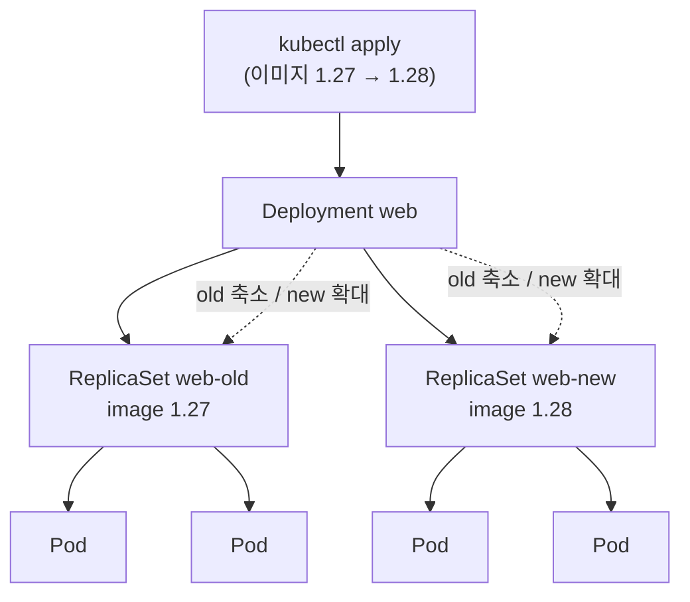
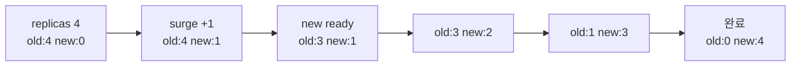
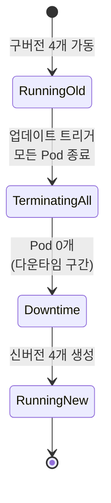

# ReplicaSet과 Deployment

::: info 학습 목표
- ReplicaSet이 셀렉터와 Pod 템플릿으로 어떻게 원하는 복제 수를 유지하는지 이해한다.
- Deployment가 ReplicaSet 위에서 선언적 업데이트를 어떻게 조율하는지 익힌다.
- 롤링 업데이트의 maxSurge·maxUnavailable 동작을 그림으로 따라간다.
- 롤백·리비전·Recreate 전략을 rollout 명령과 함께 실전으로 다룬다.
:::

## 1. ReplicaSet과 셀렉터

<strong>ReplicaSet</strong>은 지정한 개수의 동일한 Pod가 항상 실행되도록 보장하는 컨트롤러다. 컨트롤 루프가 현재 Pod 수(current)와 원하는 수(`spec.replicas`, desired)를 비교해, 모자라면 Pod 템플릿으로 새로 만들고 남으면 지운다.

ReplicaSet이 어떤 Pod를 자기 소유로 볼지는 `spec.selector`로 결정한다. 셀렉터에 매칭되는 라벨을 가진 Pod를 관리 대상으로 삼는다. 이때 `spec.template.metadata.labels`는 반드시 셀렉터와 일치해야 한다.

```yaml
apiVersion: apps/v1
kind: ReplicaSet
metadata:
  name: web-rs
spec:
  replicas: 3
  selector:
    matchLabels:
      app: web
  template:
    metadata:
      labels:
        app: web
    spec:
      containers:
      - name: nginx
        image: nginx:1.27
```

```bash
kubectl get rs web-rs
kubectl scale rs web-rs --replicas=5
```

ReplicaSet은 라벨만 보고 소유권을 판단하므로, 같은 라벨을 가진 Pod를 따로 만들면 ReplicaSet이 그것까지 관리 대상으로 흡수하거나, 초과분이라 판단해 지울 수 있다. 그래서 셀렉터는 충분히 구체적이어야 한다. ReplicaSet은 소유한 Pod의 `metadata.ownerReferences`에 자신을 기록해 가비지 컬렉션의 기준으로 삼는다.

실무에서 ReplicaSet을 직접 만드는 일은 거의 없다. 업데이트·롤백 기능이 없기 때문이다. 거의 항상 Deployment를 통해 간접적으로 쓴다. 자세한 내용은 [ReplicaSet 문서](https://kubernetes.io/docs/concepts/workloads/controllers/replicaset/)를 참고한다.

## 2. Deployment와 선언적 업데이트

<strong>Deployment</strong>는 ReplicaSet 위에 한 단계를 더 얹은 컨트롤러다. Pod 템플릿을 바꿔 `kubectl apply` 하면, Deployment가 새 ReplicaSet을 만들고 기존 ReplicaSet의 Pod를 점진적으로 줄이면서 새 Pod로 교체한다. 사용자는 "원하는 최종 상태"만 선언하고, 교체 과정은 Deployment가 알아서 조율한다.

```yaml
apiVersion: apps/v1
kind: Deployment
metadata:
  name: web
spec:
  replicas: 4
  selector:
    matchLabels:
      app: web
  template:
    metadata:
      labels:
        app: web
    spec:
      containers:
      - name: nginx
        image: nginx:1.27
        ports:
        - containerPort: 80
```



Deployment는 템플릿이 바뀔 때마다 새 ReplicaSet을 만들고 이전 ReplicaSet은 `replicas: 0`으로 남겨 둔다. 이 이전 ReplicaSet들이 곧 롤백용 리비전 히스토리다.

```bash
kubectl get deploy web
kubectl get rs -l app=web        # 새/구 ReplicaSet 모두 보임
kubectl rollout status deploy/web
```

상세는 [Deployment 문서](https://kubernetes.io/docs/concepts/workloads/controllers/deployment/)에 정리돼 있다.

## 3. 롤링 업데이트 전략 — maxSurge와 maxUnavailable

Deployment의 기본 전략은 `RollingUpdate`다. 기존 Pod를 한 번에 다 내리지 않고 조금씩 교체해 무중단 배포를 만든다. 교체 속도는 두 파라미터로 제어한다.

- <strong>maxSurge</strong>: 원하는 replicas를 초과해 추가로 만들 수 있는 Pod 수(또는 비율). 새 Pod를 얼마나 앞서 띄울지.
- <strong>maxUnavailable</strong>: 업데이트 중 사용 불가 상태가 허용되는 Pod 수(또는 비율). 기존 Pod를 얼마나 먼저 내릴지.

```yaml
spec:
  replicas: 4
  strategy:
    type: RollingUpdate
    rollingUpdate:
      maxSurge: 1
      maxUnavailable: 1
```

`replicas: 4`, `maxSurge: 1`, `maxUnavailable: 1`이면 업데이트 도중 동시 실행 Pod는 최대 5개(4+1), 가용 Pod는 최소 3개(4-1)를 유지한다. Deployment는 새 readiness probe가 통과한 Pod만 가용으로 세므로, 준비 안 된 Pod로 트래픽이 새지 않는다.



값을 0으로 둘 때 주의할 점이 있다. `maxUnavailable: 0`이면 가용성을 절대 떨어뜨리지 않지만 surge 여유가 있어야 진행되고, `maxSurge: 0`이면 추가 Pod 없이 기존을 내린 자리만 채우므로 일시적으로 용량이 줄어든다. 두 값을 동시에 0으로 두면 진행이 막힌다.

```bash
kubectl set image deploy/web nginx=nginx:1.28
kubectl rollout status deploy/web
kubectl rollout pause deploy/web    # 카나리아처럼 잠깐 멈춤
kubectl rollout resume deploy/web
```

## 4. 롤백과 리비전

Deployment는 이전 ReplicaSet들을 히스토리로 보관하므로, 문제가 생기면 이전 리비전으로 즉시 되돌릴 수 있다. 보관할 리비전 개수는 `spec.revisionHistoryLimit`(기본 10)로 조절한다.

```bash
kubectl rollout history deploy/web
kubectl rollout history deploy/web --revision=3   # 특정 리비전 상세
kubectl rollout undo deploy/web                   # 직전 리비전으로
kubectl rollout undo deploy/web --to-revision=2   # 특정 리비전으로
```

리비전의 변경 사유를 히스토리에 남기려면 `kubernetes.io/change-cause` 어노테이션을 쓴다.

```bash
kubectl annotate deploy/web kubernetes.io/change-cause="image to nginx:1.28"
```

롤백은 새 배포와 같은 메커니즘으로 동작한다. 되돌릴 리비전의 ReplicaSet을 다시 확대하고 현재 것을 축소한다. 즉 롤백도 롤링 방식으로 무중단으로 진행된다. progress가 `progressDeadlineSeconds`(기본 600초) 안에 끝나지 않으면 Deployment condition이 `Progressing=False, reason=ProgressDeadlineExceeded`로 바뀌어 멈춘 배포를 감지할 수 있다.

```bash
kubectl get deploy web -o jsonpath='{.status.conditions}'
```

## 5. Recreate 전략

`RollingUpdate`가 항상 옳은 건 아니다. 구버전과 신버전이 동시에 떠 있으면 안 되는 경우 — 예를 들어 DB 스키마가 호환되지 않거나, 단일 라이터만 허용하는 애플리케이션 — 에는 <strong>Recreate</strong> 전략을 쓴다.

```yaml
spec:
  strategy:
    type: Recreate
```

Recreate는 기존 Pod를 모두 종료한 뒤에 새 Pod를 생성한다. 그 사이 다운타임이 발생하지만, 두 버전이 절대 공존하지 않음을 보장한다.



전략 선택 기준을 정리하면 다음과 같다.

| 상황 | 권장 전략 |
|------|-----------|
| 무중단이 중요하고 두 버전 공존 가능 | RollingUpdate |
| 두 버전 동시 실행 불가(스키마/락) | Recreate |
| 트래픽을 점진적으로 옮기는 정교한 배포 | 별도 도구(Argo Rollouts 등)로 카나리아/블루그린 |

쿠버네티스 기본 Deployment는 카나리아·블루그린을 1급 기능으로 제공하지 않는다. 라벨과 Service 셀렉터를 조합하거나 Argo Rollouts·Flagger 같은 도구를 쓴다. 기본 전략의 동작은 [Deployment Strategy 문서](https://kubernetes.io/docs/concepts/workloads/controllers/deployment/#strategy)에서 확인할 수 있다.

::: tip 핵심 정리
- ReplicaSet은 셀렉터로 소유 Pod를 식별하고 desired replicas를 유지하지만, 업데이트·롤백 기능은 없다.
- Deployment는 템플릿이 바뀔 때마다 새 ReplicaSet을 만들어 점진적으로 교체하며, 이전 ReplicaSet이 곧 리비전 히스토리다.
- maxSurge는 초과 생성 한도, maxUnavailable은 동시 불가 한도이며, readiness를 통과한 Pod만 가용으로 센다.
- 롤백은 `kubectl rollout undo`로 이전 ReplicaSet을 다시 확대하는 무중단 작업이다.
- 두 버전이 공존하면 안 될 때는 Recreate를 쓰되 다운타임을 감수해야 한다.
:::

## 다음 챕터

Deployment는 상태가 없는(stateless) 워크로드에 적합하다. 다음 챕터 [DaemonSet과 StatefulSet](/study/kubernetes/17-daemonset-statefulset)에서는 모든 노드에 Pod를 하나씩 띄우는 DaemonSet과, 안정적인 식별자·순서·스토리지가 필요한 StatefulSet을 다룬다.
