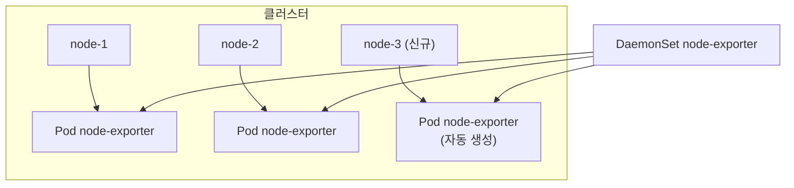
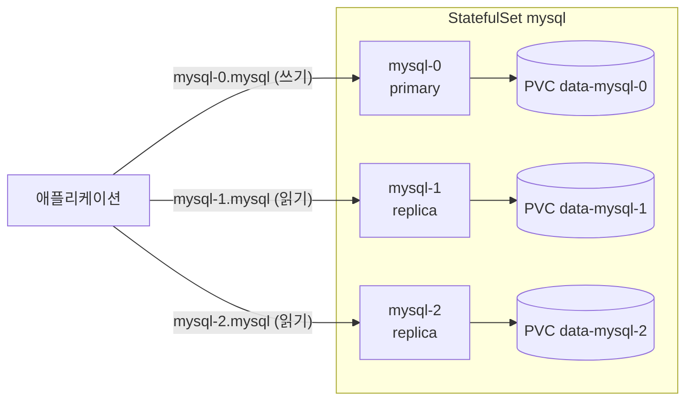

# DaemonSet과 StatefulSet

::: info 학습 목표
- DaemonSet이 노드마다 Pod를 하나씩 배치하는 원리와 로그·모니터링 에이전트 사용 패턴을 익힌다.
- StatefulSet이 안정적 네트워크 ID와 순서 보장을 어떻게 제공하는지 이해한다.
- headless service와 안정적 DNS 레코드가 StatefulSet에서 왜 필요한지 본다.
- volumeClaimTemplates로 Pod별 영속 볼륨을 자동 생성하는 방식을 다룬다.
- DaemonSet과 StatefulSet의 업데이트 전략을 비교한다.
:::

## 1. DaemonSet — 노드마다 하나의 Pod

<strong>DaemonSet</strong>은 클러스터의 모든(또는 일부) 노드에 Pod를 정확히 하나씩 배치하는 컨트롤러다. 새 노드가 클러스터에 추가되면 DaemonSet이 그 노드에도 자동으로 Pod를 띄우고, 노드가 빠지면 해당 Pod는 가비지 컬렉션된다.

replicas 개념이 없다는 점이 Deployment와 다르다. 복제 수는 노드 수에 의해 결정된다. "각 노드에서 한 번씩 돌아야 하는" 인프라 성격의 워크로드에 쓴다.

- 로그 수집 에이전트(Fluent Bit, Fluentd)
- 노드 메트릭 수집기(node-exporter)
- 네트워크 플러그인(CNI 데몬), kube-proxy
- 스토리지 데몬, 보안 모니터링(Falco)

```yaml
apiVersion: apps/v1
kind: DaemonSet
metadata:
  name: node-exporter
  namespace: monitoring
spec:
  selector:
    matchLabels:
      app: node-exporter
  template:
    metadata:
      labels:
        app: node-exporter
    spec:
      tolerations:
      - operator: Exists      # control plane 노드 등 taint 무시
      hostNetwork: true
      containers:
      - name: node-exporter
        image: prom/node-exporter:v1.8.0
        ports:
        - containerPort: 9100
          hostPort: 9100
```

```bash
kubectl get ds -n monitoring
kubectl get pods -n monitoring -o wide   # 노드당 1개씩 분포 확인
```

특정 노드에만 배치하려면 `spec.template.spec.nodeSelector`나 affinity를 쓴다. control plane 노드처럼 taint가 걸린 노드까지 커버하려면 toleration이 필요하다. DaemonSet은 스케줄러가 아니라 노드 affinity와 taint/toleration 메커니즘을 통해 노드를 선택한다. 자세한 내용은 [DaemonSet 문서](https://kubernetes.io/docs/concepts/workloads/controllers/daemonset/)를 참고한다.



## 2. DaemonSet 업데이트 전략

DaemonSet은 두 가지 업데이트 전략을 지원한다.

- <strong>RollingUpdate</strong>(기본): 노드별로 Pod를 하나씩 교체한다. `maxUnavailable`(기본 1), `maxSurge`로 동시 교체·초과 생성 정도를 조절한다.
- <strong>OnDelete</strong>: 자동 교체하지 않는다. 운영자가 Pod를 수동으로 삭제할 때만 새 버전으로 다시 생성된다. 민감한 인프라 데몬을 통제된 시점에 교체할 때 쓴다.

```yaml
spec:
  updateStrategy:
    type: RollingUpdate
    rollingUpdate:
      maxUnavailable: 1
```

```bash
kubectl set image ds/node-exporter node-exporter=prom/node-exporter:v1.8.1 -n monitoring
kubectl rollout status ds/node-exporter -n monitoring
```

## 3. StatefulSet — 안정적 식별자와 순서 보장

<strong>StatefulSet</strong>은 상태를 가진(stateful) 애플리케이션을 위한 컨트롤러다. Deployment의 Pod들은 서로 교체 가능한 무명 복제본이지만, StatefulSet의 Pod는 각자 고유한 정체성을 가진다.

StatefulSet이 보장하는 세 가지다.

1. <strong>안정적이고 고유한 네트워크 ID</strong>: Pod 이름이 `<statefulset-name>-<ordinal>` 형식으로 고정된다(`mysql-0`, `mysql-1`, `mysql-2`). Pod가 재생성돼도 이름과 DNS가 유지된다.
2. <strong>안정적인 영속 스토리지</strong>: 각 Pod는 자기 전용 PersistentVolume을 가지며, Pod가 재스케줄돼도 같은 볼륨을 다시 마운트한다.
3. <strong>순서가 보장된 배포·스케일·삭제</strong>: 0번부터 순서대로 생성하고, 역순으로 종료한다.

```yaml
apiVersion: apps/v1
kind: StatefulSet
metadata:
  name: mysql
spec:
  serviceName: mysql          # headless service 이름
  replicas: 3
  selector:
    matchLabels:
      app: mysql
  template:
    metadata:
      labels:
        app: mysql
    spec:
      containers:
      - name: mysql
        image: mysql:8.0
        ports:
        - containerPort: 3306
          name: mysql
        volumeMounts:
        - name: data
          mountPath: /var/lib/mysql
  volumeClaimTemplates:
  - metadata:
      name: data
    spec:
      accessModes: ["ReadWriteOnce"]
      storageClassName: standard
      resources:
        requests:
          storage: 10Gi
```

자세한 내용은 [StatefulSet 문서](https://kubernetes.io/docs/concepts/workloads/controllers/statefulset/)를 참고한다.

## 4. headless service와 안정적 DNS

StatefulSet의 안정적 네트워크 ID는 <strong>headless service</strong>(`clusterIP: None`)와 짝을 이룬다. 일반 Service는 가상 ClusterIP 하나로 트래픽을 로드밸런싱하지만, headless service는 ClusterIP 없이 각 Pod에 직접 도달하는 DNS 레코드를 만든다.

```yaml
apiVersion: v1
kind: Service
metadata:
  name: mysql
spec:
  clusterIP: None     # headless
  selector:
    app: mysql
  ports:
  - port: 3306
    name: mysql
```

이 service가 있으면 각 Pod는 다음과 같은 안정적 DNS 이름을 갖는다.

```
mysql-0.mysql.default.svc.cluster.local
mysql-1.mysql.default.svc.cluster.local
mysql-2.mysql.default.svc.cluster.local
```

형식은 `<pod-name>.<service-name>.<namespace>.svc.cluster.local`이다. 클라이언트는 `mysql-0`을 primary로, 나머지를 replica로 지정하는 식으로 특정 Pod를 직접 가리킬 수 있다. Pod가 재생성돼도 이 이름은 그대로라서 복제 토폴로지를 안정적으로 유지한다.



## 5. volumeClaimTemplates와 데이터 영속성

StatefulSet의 핵심 차별점이 <strong>volumeClaimTemplates</strong>다. 이 템플릿을 두면 각 Pod마다 PersistentVolumeClaim이 자동으로 생성된다. PVC 이름은 `<template-name>-<statefulset-name>-<ordinal>` 형식이다.

```bash
kubectl get pvc
# data-mysql-0   Bound   pvc-...   10Gi
# data-mysql-1   Bound   pvc-...   10Gi
# data-mysql-2   Bound   pvc-...   10Gi
```

가장 중요한 동작은 <strong>볼륨이 Pod에 종속되지 않고 ordinal에 종속된다</strong>는 점이다. `mysql-1` Pod가 죽어 다른 노드에서 재생성돼도, 같은 `data-mysql-1` PVC를 다시 바인딩하므로 데이터가 그대로 따라온다.

또 하나 주의할 점은 StatefulSet을 삭제해도 PVC는 기본적으로 남는다는 것이다. 데이터 보호를 위한 설계지만, 정리할 때는 PVC를 직접 지워야 한다. 쿠버네티스 1.27+에서는 `persistentVolumeClaimRetentionPolicy`로 삭제·스케일 시 PVC 처리 방식을 제어할 수 있다.

```yaml
spec:
  persistentVolumeClaimRetentionPolicy:
    whenDeleted: Retain     # StatefulSet 삭제 시 PVC 유지
    whenScaled: Delete      # 스케일 다운 시 해당 PVC 삭제
```

volumeClaimTemplates의 동작은 [StatefulSet Storage 문서](https://kubernetes.io/docs/concepts/workloads/controllers/statefulset/#stable-storage)에 정리돼 있다.

## 6. StatefulSet 업데이트 전략과 두 컨트롤러 비교

StatefulSet도 `RollingUpdate`(기본)와 `OnDelete`를 지원하지만, 동작 방식이 Deployment와 다르다. 가장 큰 ordinal부터 역순으로(`mysql-2 → mysql-1 → mysql-0`) 하나씩 교체하며, 이전 Pod가 Ready가 돼야 다음으로 넘어간다. 데이터 일관성을 위해 순서를 보장하는 것이다.

`partition`을 지정하면 그 ordinal 이상만 업데이트하는 단계적(카나리아) 롤아웃도 가능하다.

```yaml
spec:
  updateStrategy:
    type: RollingUpdate
    rollingUpdate:
      partition: 2     # ordinal >= 2 인 Pod만 새 버전으로
```

두 컨트롤러와 Deployment를 정리하면 다음과 같다.

| 항목 | Deployment | DaemonSet | StatefulSet |
|------|-----------|-----------|-------------|
| 복제 수 결정 | replicas | 노드 수 | replicas |
| Pod 정체성 | 무명(교체 가능) | 노드별 1개 | 고정 ordinal·이름 |
| 안정적 DNS | 없음 | 없음 | headless service로 보장 |
| 전용 스토리지 | 공유/없음 | 보통 hostPath | volumeClaimTemplates(Pod별) |
| 생성/종료 순서 | 임의 병렬 | 노드별 독립 | 순서 보장(0→N / N→0) |
| 대표 용도 | stateless 서비스 | 노드 에이전트 | DB·메시지큐·분산 저장소 |

::: tip 핵심 정리
- DaemonSet은 노드마다 Pod를 하나씩 배치하며, 새 노드가 붙으면 자동으로 Pod를 추가한다 — 로그·모니터링 에이전트의 표준 패턴이다.
- StatefulSet은 고정 ordinal 이름, 안정적 DNS, Pod별 영속 볼륨, 순서 보장을 제공한다.
- headless service(`clusterIP: None`)가 각 Pod에 직접 도달하는 안정적 DNS 레코드를 만든다.
- volumeClaimTemplates는 Pod별 PVC를 자동 생성하고, 볼륨은 ordinal에 종속돼 Pod가 재생성돼도 데이터가 따라온다.
- StatefulSet 업데이트는 역순으로 하나씩 진행하며, partition으로 단계적 롤아웃이 가능하다.
:::

## 다음 챕터

지금까지는 상시 실행되는 워크로드였다. 다음 챕터 [Job과 CronJob](/study/kubernetes/18-job-cronjob)에서는 한 번 실행하고 끝나는 배치 작업(Job)과, 이를 주기적으로 스케줄링하는 CronJob을 다룬다.
