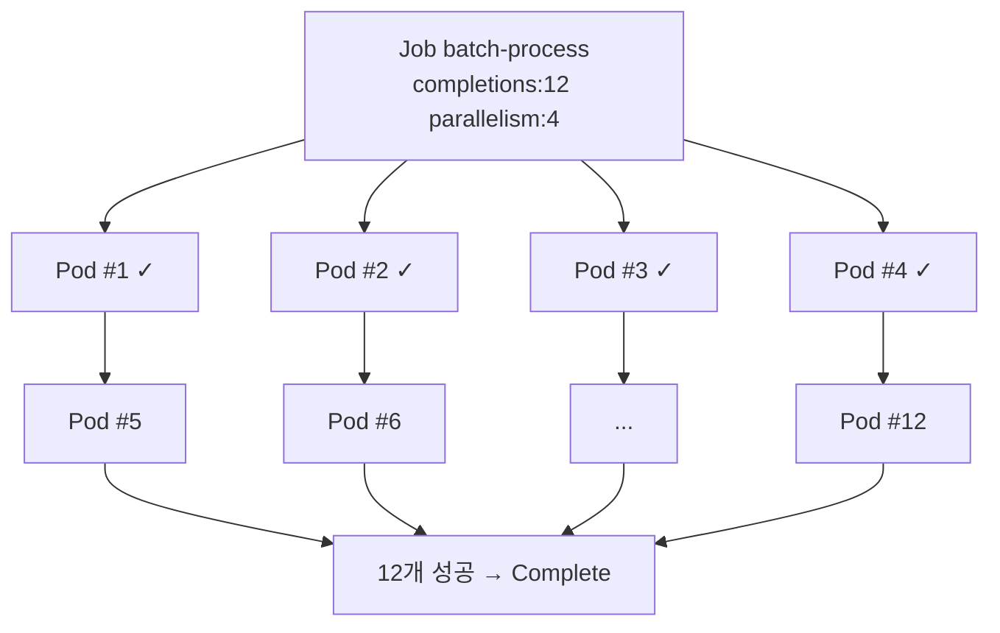
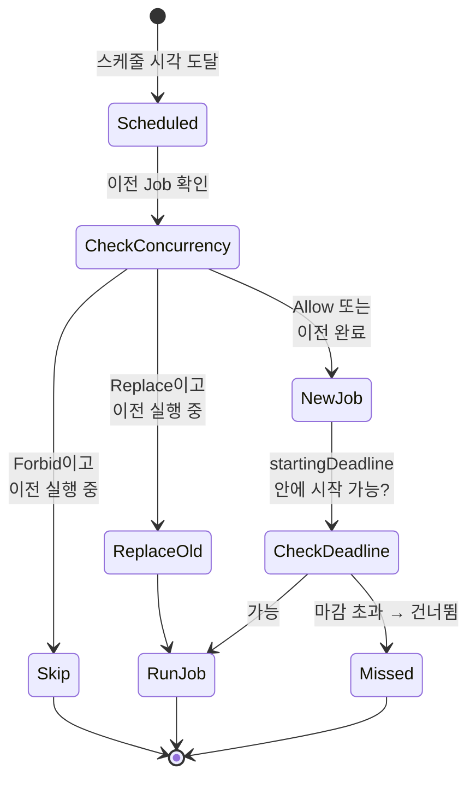

# Job과 CronJob

::: info 학습 목표
- Job이 상시 워크로드와 어떻게 다른지, completion과 parallelism으로 배치 작업을 어떻게 모델링하는지 이해한다.
- backoffLimit과 실패 처리, restartPolicy의 관계를 익힌다.
- CronJob의 cron 표현식, concurrencyPolicy, startingDeadlineSeconds를 다룬다.
- 큐 워커·팬아웃 같은 대표적인 배치 작업 패턴을 매니페스트로 본다.
:::

## 1. Job — 완료를 목표로 하는 워크로드

Deployment·StatefulSet은 Pod가 계속 살아 있길 원한다. 반면 <strong>Job</strong>은 Pod가 작업을 끝내고 <strong>성공적으로 종료</strong>하는 것을 목표로 한다. 데이터 마이그레이션, 배치 계산, 백업, 리포트 생성처럼 "한 번 돌고 끝나는" 작업에 쓴다.

Job은 지정한 수의 Pod가 성공(exit 0)할 때까지 Pod를 생성·재시도한다. 모든 완료 조건이 충족되면 Job은 `Complete` 상태가 되고 더 이상 Pod를 만들지 않는다.

```yaml
apiVersion: batch/v1
kind: Job
metadata:
  name: pi
spec:
  template:
    spec:
      containers:
      - name: pi
        image: perl:5.34
        command: ["perl", "-Mbignum=bpi", "-wle", "print bpi(2000)"]
      restartPolicy: Never
  backoffLimit: 4
```

```bash
kubectl apply -f pi-job.yaml
kubectl get job pi
kubectl logs job/pi
```

Job 템플릿의 `restartPolicy`는 `Never` 또는 `OnFailure`만 허용된다(`Always`는 Job 개념과 모순이라 불가). Job이 끝난 뒤 Pod는 자동 삭제되지 않으므로 로그를 확인할 수 있고, `ttlSecondsAfterFinished`로 일정 시간 뒤 자동 정리하게 할 수 있다. 자세한 내용은 [Job 문서](https://kubernetes.io/docs/concepts/workloads/controllers/job/)를 참고한다.

## 2. completion과 parallelism

Job은 두 필드로 실행 방식을 제어한다.

- <strong>completions</strong>: 성공해야 하는 Pod 총 개수. Job이 끝나는 기준.
- <strong>parallelism</strong>: 동시에 실행할 수 있는 Pod 수.

이 둘의 조합으로 세 가지 패턴이 나온다.

| 패턴 | 설정 | 설명 |
|------|------|------|
| 비병렬 단일 작업 | completions 미지정(1), parallelism 1 | Pod 하나가 성공하면 끝 |
| 고정 완료 수 병렬 | completions: N, parallelism: M | N번 성공할 때까지 최대 M개 동시 실행 |
| 워크 큐 병렬 | completions 미지정, parallelism: M | 워커들이 외부 큐를 비우고 모두 종료 |

```yaml
apiVersion: batch/v1
kind: Job
metadata:
  name: batch-process
spec:
  completions: 12
  parallelism: 4
  template:
    spec:
      containers:
      - name: worker
        image: myworker:1.0
      restartPolicy: OnFailure
```

위 예시는 12개의 작업을 최대 4개씩 병렬로 처리한다.



인덱스가 필요한 작업에는 `completionMode: Indexed`를 쓴다. 각 Pod에 `0..completions-1`의 고유 인덱스가 `JOB_COMPLETION_INDEX` 환경변수로 주입돼, 입력 데이터를 인덱스별로 분할 처리할 수 있다. 자세한 내용은 [Indexed Job 문서](https://kubernetes.io/docs/concepts/workloads/controllers/job/#completion-mode)를 참고한다.

## 3. 재시도(backoffLimit)와 실패 처리

작업은 실패할 수 있다. Job은 실패한 Pod를 다시 만들어 재시도하되, 무한히 반복하지 않도록 <strong>backoffLimit</strong>로 상한을 둔다(기본 6). 재시도 간 대기는 10초에서 시작해 지수적으로 늘어나며 최대 6분까지 증가한다.

backoffLimit을 초과하면 Job은 `Failed` 상태가 되고 더 이상 Pod를 만들지 않는다.

restartPolicy에 따라 재시도 단위가 다르다.

- `restartPolicy: OnFailure`: 같은 Pod 안에서 컨테이너를 재시작한다. Pod 수가 늘지 않는다.
- `restartPolicy: Never`: 실패한 Pod를 종료 상태로 남기고 새 Pod를 만든다. 실패 Pod가 쌓여 로그를 보기 좋다.

```yaml
spec:
  backoffLimit: 4
  activeDeadlineSeconds: 600    # 전체 실행 시간 상한(이 시간 넘으면 강제 종료)
  template:
    spec:
      restartPolicy: Never
```

`activeDeadlineSeconds`는 Job 전체가 도는 최대 시간이며, 초과하면 backoffLimit과 무관하게 Job을 종료시킨다. 쿠버네티스 1.25+의 `podFailurePolicy`를 쓰면 특정 exit code나 컨테이너 종료 사유에 따라 "재시도하지 말고 즉시 실패" 또는 "이 실패는 카운트하지 않음" 같은 세밀한 규칙을 정의할 수 있다.

```yaml
spec:
  podFailurePolicy:
    rules:
    - action: FailJob
      onExitCodes:
        containerName: worker
        operator: In
        values: [42]        # exit 42면 즉시 Job 실패
```

## 4. CronJob과 cron 표현식

<strong>CronJob</strong>은 Job을 정해진 일정에 반복 생성하는 컨트롤러다. cron 표현식 스케줄에 따라 매번 새 Job 오브젝트를 만든다. 백업, 리포트, 정리 작업 같은 주기적 배치에 쓴다.

```yaml
apiVersion: batch/v1
kind: CronJob
metadata:
  name: db-backup
spec:
  schedule: "0 3 * * *"          # 매일 03:00
  timeZone: "Asia/Seoul"
  jobTemplate:
    spec:
      template:
        spec:
          containers:
          - name: backup
            image: mybackup:1.0
            command: ["sh", "-c", "pg_dump ... > /backup/$(date +%F).sql"]
          restartPolicy: OnFailure
```

cron 표현식은 다섯 자리다.

```
 ┌───────── 분 (0 - 59)
 │ ┌─────── 시 (0 - 23)
 │ │ ┌───── 일 (1 - 31)
 │ │ │ ┌─── 월 (1 - 12)
 │ │ │ │ ┌─ 요일 (0 - 6, 0=일요일)
 │ │ │ │ │
 * * * * *
```

| 표현식 | 의미 |
|--------|------|
| `*/5 * * * *` | 5분마다 |
| `0 * * * *` | 매시 정각 |
| `0 0 * * *` | 매일 자정 |
| `0 9 * * 1-5` | 평일 오전 9시 |
| `0 0 1 * *` | 매월 1일 자정 |

`timeZone`을 지정하지 않으면 kube-controller-manager의 시간대를 따르므로, 의도한 시각에 돌게 하려면 명시하는 것이 안전하다. CronJob 동작은 [CronJob 문서](https://kubernetes.io/docs/concepts/workloads/controllers/cron-jobs/)에 정리돼 있다.

## 5. concurrencyPolicy와 startingDeadlineSeconds

CronJob의 이전 실행이 아직 끝나지 않았는데 다음 스케줄 시각이 오면 어떻게 할지를 <strong>concurrencyPolicy</strong>로 정한다.

| 값 | 동작 |
|----|------|
| Allow | (기본) 동시 실행 허용. 이전 Job이 돌아도 새 Job 시작 |
| Forbid | 이전 Job이 안 끝났으면 이번 스케줄 건너뜀 |
| Replace | 진행 중인 Job을 취소하고 새 Job으로 교체 |

```yaml
spec:
  schedule: "*/1 * * * *"
  concurrencyPolicy: Forbid
  startingDeadlineSeconds: 30
  successfulJobsHistoryLimit: 3
  failedJobsHistoryLimit: 1
```

<strong>startingDeadlineSeconds</strong>는 스케줄 시각을 놓쳤을 때 그 안에 시작하면 늦게라도 실행하고, 넘기면 그 회차를 포기하는 마감 시간이다. 컨트롤러가 잠시 다운됐다 복구된 경우 이 값이 없으면 누락된 실행이 한꺼번에 몰릴 수 있다.



`successfulJobsHistoryLimit`·`failedJobsHistoryLimit`로 완료된 Job을 몇 개 보관할지 정한다. 이 값을 적절히 두지 않으면 완료된 Job과 Pod가 계속 쌓인다. CronJob을 `suspend: true`로 두면 스케줄을 일시 중지할 수 있다.

## 6. 배치 작업 패턴

대표적인 배치 패턴 두 가지를 정리한다.

<strong>워크 큐(work queue) 패턴.</strong> 외부 큐(Redis, RabbitMQ, SQS)에 작업 항목을 넣고, 여러 워커 Pod가 큐에서 항목을 꺼내 처리한다. Job은 `completions`를 비우고 `parallelism`만 지정한다. 워커는 큐가 비면 종료하고, 모든 워커가 성공 종료하면 Job이 완료된다.

```yaml
apiVersion: batch/v1
kind: Job
metadata:
  name: queue-workers
spec:
  parallelism: 5          # completions 미지정 → 워크 큐 모드
  template:
    spec:
      containers:
      - name: worker
        image: myworker:1.0
        env:
        - name: QUEUE_URL
          value: redis://redis:6379
      restartPolicy: OnFailure
```

<strong>팬아웃(fan-out)/Indexed 패턴.</strong> 입력을 N개로 분할하고 각 인덱스를 한 Pod가 처리한다. `completionMode: Indexed`와 `completions: N`을 쓰며, 각 Pod는 `JOB_COMPLETION_INDEX`로 자기 몫을 안다. 외부 큐 없이 정적으로 작업을 나눌 때 적합하다.

```yaml
spec:
  completions: 10
  parallelism: 3
  completionMode: Indexed
```

이런 패턴들은 [Job 패턴 문서](https://kubernetes.io/docs/concepts/workloads/controllers/job/#job-patterns)에서 더 다룬다.

::: tip 핵심 정리
- Job은 Pod가 성공적으로 완료되는 것을 목표로 하며, restartPolicy는 Never 또는 OnFailure만 허용한다.
- completions는 성공해야 할 Pod 수, parallelism은 동시 실행 수이며 이 조합으로 단일·고정완료·워크큐 패턴을 만든다.
- backoffLimit으로 재시도 상한을, activeDeadlineSeconds로 전체 실행 시간을, podFailurePolicy로 세밀한 실패 규칙을 정한다.
- CronJob은 cron 표현식으로 Job을 반복 생성하며, timeZone을 명시하는 것이 안전하다.
- concurrencyPolicy(Allow/Forbid/Replace)와 startingDeadlineSeconds로 겹치는 실행과 놓친 스케줄을 제어한다.
:::

## 다음 챕터

배치 작업도 설정값과 비밀 정보가 필요하다. 다음 챕터 [ConfigMap과 Secret](/study/kubernetes/19-configmap-secret)에서는 설정을 코드에서 분리하고, 환경변수·볼륨으로 주입하는 방법을 다룬다.
