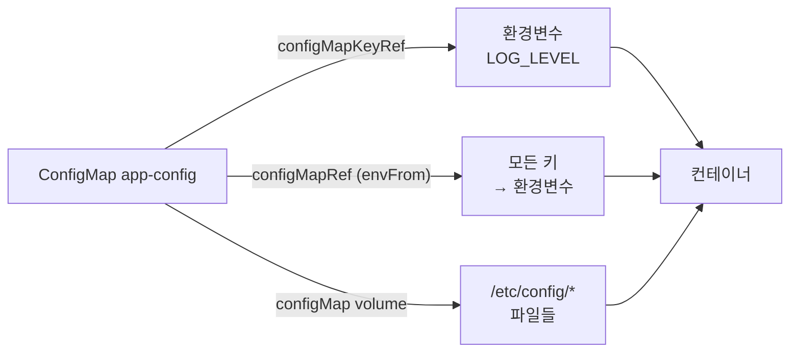
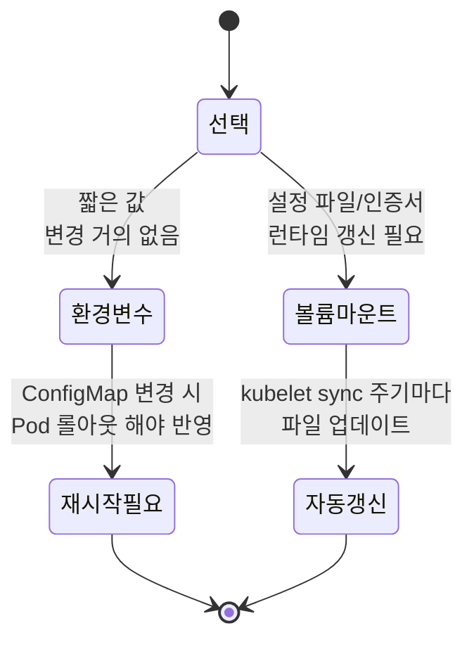

# ConfigMap과 Secret

::: info 학습 목표
- ConfigMap을 만들고 env·envFrom·볼륨 마운트로 주입하는 세 가지 방식을 익힌다.
- Secret의 종류와 base64 인코딩이 암호화가 아님을, 그리고 실질적 보안 한계를 이해한다.
- 환경변수 주입과 볼륨 마운트의 차이와 선택 기준을 안다.
- ConfigMap/Secret 변경이 언제 어떻게 Pod에 반영되는지, immutable 설정의 효과를 다룬다.
:::

## 1. ConfigMap이란

<strong>ConfigMap</strong>은 비밀이 아닌 설정 데이터를 키-값 쌍으로 저장하는 오브젝트다. 설정을 컨테이너 이미지에서 분리해, 같은 이미지를 환경(dev/stage/prod)별로 다른 설정과 함께 배포할 수 있게 한다. 이것이 [Twelve-Factor App](https://12factor.net/config)의 "설정을 환경에 저장하라" 원칙을 쿠버네티스에서 구현하는 방법이다.

ConfigMap은 작은 설정값(URL, 포트, 플래그)부터 통째 설정 파일까지 담을 수 있다. 단, 하나의 ConfigMap은 1MiB를 넘을 수 없다.

```yaml
apiVersion: v1
kind: ConfigMap
metadata:
  name: app-config
data:
  LOG_LEVEL: "info"
  MAX_CONNECTIONS: "100"
  app.properties: |
    server.port=8080
    feature.x.enabled=true
```

명령형으로도 만들 수 있다.

```bash
kubectl create configmap app-config \
  --from-literal=LOG_LEVEL=info \
  --from-file=app.properties

kubectl get configmap app-config -o yaml
```

`data`는 UTF-8 텍스트를, 바이너리는 `binaryData`(base64)를 쓴다. 전반적인 개념은 [Configuration 문서](https://kubernetes.io/docs/concepts/configuration/)와 [ConfigMap 문서](https://kubernetes.io/docs/concepts/configuration/configmap/)에 정리돼 있다.

## 2. ConfigMap 주입 — env, envFrom, 볼륨 마운트

ConfigMap을 컨테이너에 넣는 방법은 세 가지다.

<strong>방법 1: env로 개별 키 주입.</strong> 특정 키 하나를 환경변수로 매핑한다.

```yaml
spec:
  containers:
  - name: app
    image: myapp:1.0
    env:
    - name: LOG_LEVEL
      valueFrom:
        configMapKeyRef:
          name: app-config
          key: LOG_LEVEL
```

<strong>방법 2: envFrom으로 전체 주입.</strong> ConfigMap의 모든 키를 한꺼번에 환경변수로 만든다.

```yaml
spec:
  containers:
  - name: app
    image: myapp:1.0
    envFrom:
    - configMapRef:
        name: app-config
      prefix: APP_      # 선택: 모든 키 앞에 접두사
```

<strong>방법 3: 볼륨으로 마운트.</strong> ConfigMap을 디렉터리로 마운트하면 각 키가 파일로 나타난다.

```yaml
spec:
  containers:
  - name: app
    image: myapp:1.0
    volumeMounts:
    - name: config-vol
      mountPath: /etc/config
      readOnly: true
  volumes:
  - name: config-vol
    configMap:
      name: app-config
      items:                    # 선택: 특정 키만, 다른 이름으로
      - key: app.properties
        path: application.properties
```

이러면 `/etc/config/app.properties` 같은 파일이 만들어진다. 설정 파일을 통째로 넘길 때 자연스러운 방식이다.



## 3. Secret의 종류와 base64의 한계

<strong>Secret</strong>은 비밀번호, 토큰, 키, 인증서 같은 민감 데이터를 담는 오브젝트다. 구조는 ConfigMap과 비슷하지만 몇 가지 차이가 있다. 값은 base64로 인코딩되고, 노드에서는 가능하면 메모리(tmpfs)에 저장되며, 별도의 RBAC로 접근을 더 엄격히 통제할 수 있다.

Secret에는 `type`이 있고, 타입마다 기대하는 키 구조가 정해져 있다.

| type | 용도 |
|------|------|
| Opaque | (기본) 임의의 사용자 정의 데이터 |
| kubernetes.io/dockerconfigjson | 프라이빗 레지스트리 인증(imagePullSecrets) |
| kubernetes.io/tls | TLS 인증서·키(`tls.crt`, `tls.key`) |
| kubernetes.io/basic-auth | username/password |
| kubernetes.io/service-account-token | ServiceAccount 토큰 |

```yaml
apiVersion: v1
kind: Secret
metadata:
  name: db-secret
type: Opaque
data:
  username: YWRtaW4=          # "admin"의 base64
  password: czNjcjN0UHdk      # "s3cr3tPwd"의 base64
```

`stringData`를 쓰면 평문으로 작성하고 쿠버네티스가 자동 인코딩한다.

```yaml
stringData:
  username: admin
  password: s3cr3tPwd
```

::: warning base64는 암호화가 아니다
base64는 인코딩일 뿐 누구나 디코딩할 수 있다. `echo czNjcjN0UHdk | base64 -d`면 평문이 나온다. Secret이 ConfigMap보다 안전한 이유는 base64 때문이 아니라 RBAC·tmpfs·etcd 암호화 같은 부가 장치 덕분이다.
:::

기본 설정에서는 Secret이 etcd에 평문(base64)으로 저장된다. 실제 보호를 위해서는 다음이 필요하다.

- <strong>etcd 저장 데이터 암호화</strong>(EncryptionConfiguration)
- Secret 접근에 대한 <strong>최소 권한 RBAC</strong>
- 운영 환경에서는 외부 비밀 관리 연동(External Secrets Operator, Vault, 클라우드 KMS)

Secret 관리는 [Secret 문서](https://kubernetes.io/docs/concepts/configuration/secret/)를 참고한다. Secret 주입 방식은 ConfigMap과 동일하다(`secretKeyRef`, `envFrom.secretRef`, `secret` 볼륨).

```yaml
    env:
    - name: DB_PASSWORD
      valueFrom:
        secretKeyRef:
          name: db-secret
          key: password
```

## 4. 환경변수 vs 볼륨 마운트

같은 데이터를 환경변수로 줄지 파일로 줄지는 동작 차이가 분명하므로 의식적으로 선택해야 한다.

| 기준 | 환경변수(env/envFrom) | 볼륨 마운트 |
|------|----------------------|-------------|
| 변경 자동 반영 | 안 됨(Pod 재시작 필요) | 됨(잠시 뒤 파일 갱신) |
| 노출 위험 | `/proc/<pid>/environ`, 로그·크래시 덤프에 노출 가능 | 파일 권한으로 제한 가능 |
| 적합한 데이터 | 짧은 스칼라 값 | 설정 파일, 인증서, 큰 값 |
| 키 이름 제약 | 환경변수 명명 규칙을 따라야 함 | 자유로운 파일명 |

비밀 정보, 특히 인증서나 큰 키는 볼륨 마운트가 권장된다. 환경변수는 자식 프로세스로 상속되고 여러 곳에 흘러나가기 쉽다. 반대로 단순한 플래그 한두 개는 환경변수가 간편하다.



## 5. 업데이트 반영과 immutable ConfigMap

ConfigMap·Secret을 수정했을 때 Pod에 어떻게 반영되는지가 실무에서 자주 헷갈린다.

- <strong>볼륨 마운트</strong>: kubelet이 주기적으로 동기화하므로 잠시(보통 1분 내) 뒤 마운트된 파일이 갱신된다. 단, `subPath`로 마운트한 파일은 갱신되지 않는다. 또 애플리케이션이 파일 변경을 감지해 리로드하지 않으면 값만 바뀌고 동작은 그대로다.
- <strong>환경변수(env/envFrom)</strong>: 컨테이너 시작 시점에 한 번 주입되므로 ConfigMap을 바꿔도 반영되지 않는다. Pod를 재시작해야 한다.

env 기반 설정을 안전하게 갱신하려면, ConfigMap 내용 해시를 Pod 템플릿 어노테이션에 넣어 변경 시 Deployment 롤아웃이 자동으로 일어나게 하는 패턴을 쓴다(예: Helm의 `checksum/config` 어노테이션).

```yaml
spec:
  template:
    metadata:
      annotations:
        checksum/config: "9f86d08...c8a7"   # ConfigMap 해시
```

<strong>immutable ConfigMap/Secret.</strong> `immutable: true`로 만들면 그 오브젝트는 수정할 수 없게 된다(삭제 후 재생성만 가능). 두 가지 이점이 있다.

- 실수로 인한 설정 변경을 차단해 안정성을 높인다.
- kubelet이 변경을 감시(watch)하지 않아도 되므로 대규모 클러스터에서 apiserver 부하가 줄어 성능이 좋아진다.

```yaml
apiVersion: v1
kind: ConfigMap
metadata:
  name: app-config-v2
data:
  LOG_LEVEL: "warn"
immutable: true
```

immutable을 쓸 때는 ConfigMap 이름에 버전을 붙여(`app-config-v1`, `app-config-v2`) 새 버전을 만들고 Deployment가 새 이름을 참조하도록 롤아웃하는 패턴이 자연스럽다. 자세한 내용은 [Immutable ConfigMaps 문서](https://kubernetes.io/docs/concepts/configuration/configmap/#configmap-immutable)를 참고한다.

::: tip 핵심 정리
- ConfigMap은 비밀이 아닌 설정을, Secret은 민감 데이터를 담아 이미지에서 설정을 분리한다.
- 주입 방식은 env(개별)·envFrom(전체)·볼륨 마운트(파일) 세 가지이며 Secret도 동일하다.
- Secret의 base64는 암호화가 아니다 — 실질 보안은 etcd 암호화·RBAC·외부 비밀 관리에서 나온다.
- 환경변수는 변경이 자동 반영되지 않고 노출 위험이 크며, 볼륨 마운트는 자동 갱신되고 인증서·설정 파일에 적합하다.
- immutable ConfigMap/Secret은 실수 차단과 apiserver 부하 감소 효과가 있으며, 보통 이름에 버전을 붙여 운용한다.
:::

## 다음 챕터

지금까지 워크로드와 설정을 다뤘다. 이제 이 Pod들이 어느 노드에 배치되는지를 결정하는 메커니즘을 볼 차례다. 다음 챕터 [스케줄러와 배치](/study/kubernetes/20-scheduler)에서는 nodeSelector·affinity·taint/toleration으로 스케줄링을 제어하는 방법을 다룬다.
