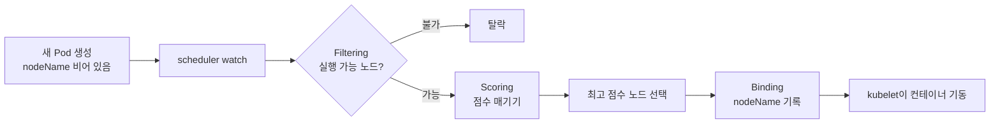
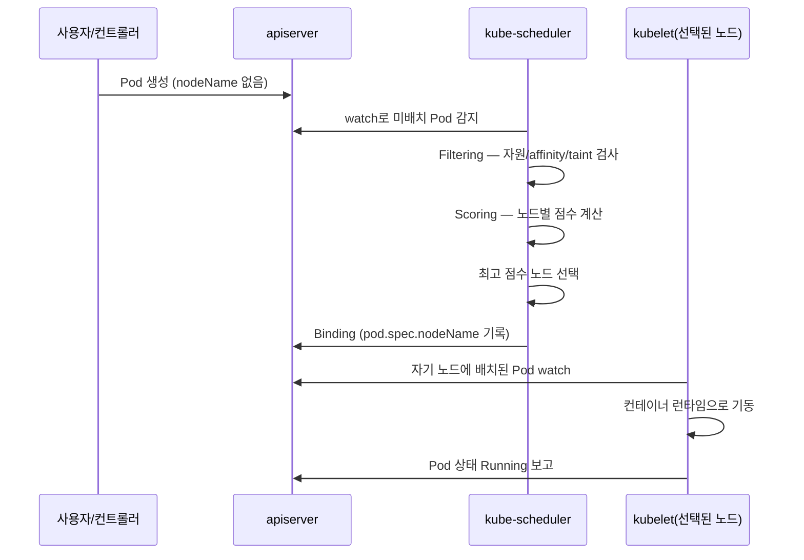
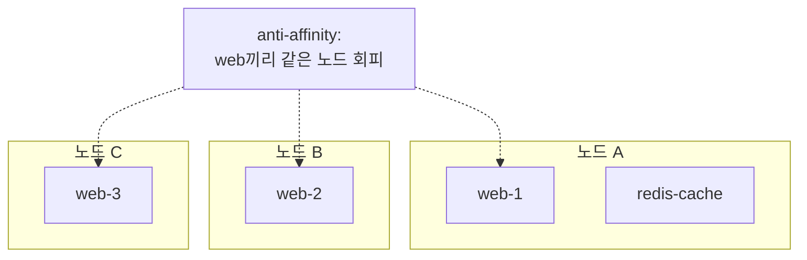
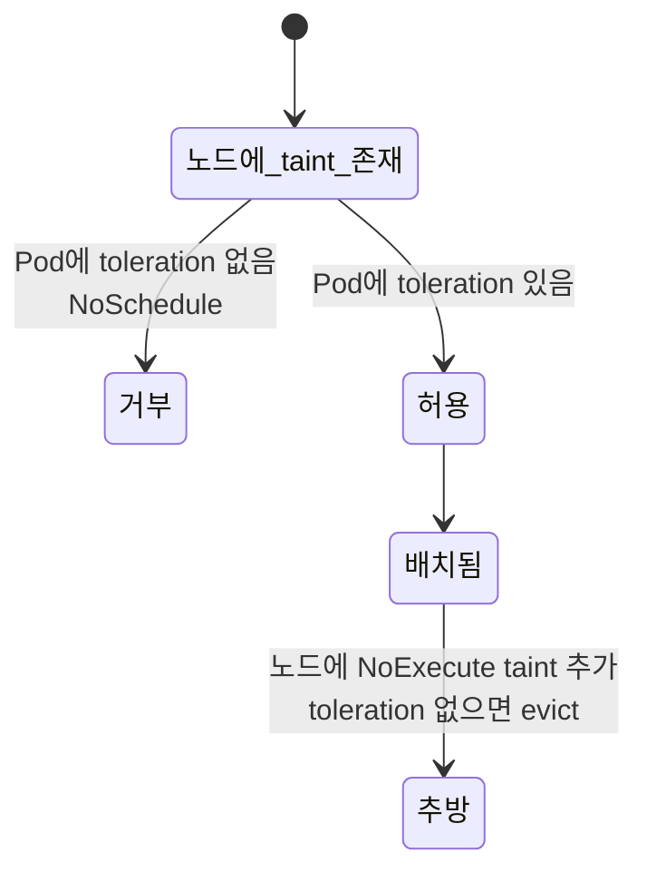

# 스케줄러와 배치

::: info 학습 목표
- kube-scheduler가 Pod를 노드에 배치하는 흐름을 filtering·scoring 두 단계로 이해한다.
- nodeSelector와 node affinity로 노드를 고르는 방법, 그리고 둘의 표현력 차이를 안다.
- pod affinity/anti-affinity로 Pod끼리의 상대 배치를 제어하는 방법을 익힌다.
- taint와 toleration으로 노드가 Pod를 거부·허용하는 메커니즘과 nodeName 직접 지정을 다룬다.
:::

## 1. kube-scheduler란

<strong>kube-scheduler</strong>는 컨트롤 플레인 컴포넌트로, `nodeName`이 아직 비어 있는(아직 배치되지 않은) Pod를 발견해 적절한 노드를 선택하고 그 결정을 apiserver에 기록하는 역할을 한다. 스케줄러는 Pod를 노드에 직접 "실행"하지 않는다. 단지 어느 노드에 둘지를 결정해 `pod.spec.nodeName`을 채워 넣을 뿐이고, 실제 컨테이너 기동은 해당 노드의 kubelet이 맡는다.

스케줄링은 본질적으로 최적화 문제다. 후보 노드들 중에서 Pod의 요구(리소스 요청, affinity 규칙, taint 등)를 만족하면서 가장 좋은 노드를 골라야 한다. 쿠버네티스는 이를 두 단계로 나눈다.

- <strong>Filtering(필터링)</strong>: Pod를 실행할 수 없는 노드를 걸러낸다. 결과는 "실행 가능한 노드(feasible nodes)" 집합이다.
- <strong>Scoring(점수화)</strong>: 남은 노드 각각에 점수를 매기고 가장 높은 점수의 노드를 선택한다.

전반적인 개념은 [Scheduling, Preemption and Eviction 문서](https://kubernetes.io/docs/concepts/scheduling-eviction/)와 [kube-scheduler 문서](https://kubernetes.io/docs/concepts/scheduling-eviction/kube-scheduler/)에 정리돼 있다.



## 2. 스케줄링 흐름 — filtering과 scoring

스케줄러는 매 사이클마다 스케줄 큐에서 Pod 하나를 꺼내 다음 흐름을 거친다. 실제 동작은 [스케줄링 프레임워크](https://kubernetes.io/docs/concepts/scheduling-eviction/scheduling-framework/)의 여러 확장 지점(plugin)으로 구현되지만, 큰 그림은 filtering과 scoring 두 페이즈로 이해하면 된다.



<strong>Filtering 단계</strong>에서는 다음 같은 검사가 이뤄진다.

- <strong>NodeResourcesFit</strong>: 노드의 남은 CPU·메모리가 Pod의 `requests`를 수용할 수 있는가.
- <strong>NodeAffinity</strong>: Pod의 node affinity `required` 규칙을 노드가 만족하는가.
- <strong>TaintToleration</strong>: 노드의 taint를 Pod의 toleration이 견딜 수 있는가.
- <strong>NodeName / NodeUnschedulable</strong>: `nodeName`이 지정됐거나 노드가 `unschedulable`(cordon) 상태인가.
- <strong>PodTopologySpread, InterPodAffinity</strong>: topology spread와 pod affinity 제약을 만족하는가.

여기서 살아남은 노드가 하나도 없으면 Pod는 `Pending` 상태로 남고, 이벤트에 `0/N nodes are available` 메시지가 찍힌다.

<strong>Scoring 단계</strong>에서는 남은 노드마다 여러 plugin이 0~100점을 매기고 가중치를 곱해 합산한다. 대표적인 점수 plugin은 다음과 같다.

- <strong>NodeResourcesBalancedAllocation</strong>: CPU와 메모리 사용률이 균형 잡힌 노드를 선호한다.
- <strong>ImageLocality</strong>: Pod가 쓸 이미지를 이미 가진 노드에 가산점을 준다(pull 시간 절약).
- <strong>InterPodAffinity, NodeAffinity</strong>: `preferred` 규칙을 점수로 반영한다.

```bash
# Pod가 어느 노드에 배치됐는지, 왜 Pending인지 이벤트로 확인
kubectl get pod my-app -o wide
kubectl describe pod my-app | sed -n '/Events/,$p'
```

::: tip
점수가 동률이면 스케줄러는 그중 하나를 무작위에 가깝게 고른다. 따라서 "정확히 이 노드"를 보장하려면 점수가 아니라 filtering 단계에서 작동하는 `required` 규칙이나 nodeSelector를 써야 한다.
:::

## 3. nodeSelector와 node affinity

<strong>nodeSelector</strong>는 가장 단순한 노드 선택 방법이다. Pod에 라벨 셀렉터를 적으면 그 라벨을 모두 가진 노드에만 배치된다.

```bash
# 노드에 라벨을 붙인다
kubectl label nodes worker-1 disktype=ssd
```

```yaml
apiVersion: v1
kind: Pod
metadata:
  name: ssd-pod
spec:
  nodeSelector:
    disktype: ssd
  containers:
  - name: app
    image: nginx
```

nodeSelector는 "AND 조건의 정확 일치"만 표현할 수 있어 표현력이 제한적이다. 더 풍부한 규칙이 필요할 때 <strong>node affinity</strong>를 쓴다. node affinity에는 두 종류가 있다.

- <strong>requiredDuringSchedulingIgnoredDuringExecution</strong>: 반드시 만족해야 하는 hard 규칙. filtering에서 작동한다.
- <strong>preferredDuringSchedulingIgnoredDuringExecution</strong>: 가급적 만족하면 좋은 soft 규칙. scoring에서 가중치로 반영된다.

이름 뒷부분 `IgnoredDuringExecution`은 "이미 실행 중인 Pod는 노드 라벨이 바뀌어도 쫓아내지 않는다"는 뜻이다.

```yaml
apiVersion: v1
kind: Pod
metadata:
  name: affinity-pod
spec:
  affinity:
    nodeAffinity:
      requiredDuringSchedulingIgnoredDuringExecution:
        nodeSelectorTerms:
        - matchExpressions:
          - key: topology.kubernetes.io/zone
            operator: In
            values: ["ap-northeast-2a", "ap-northeast-2c"]
      preferredDuringSchedulingIgnoredDuringExecution:
      - weight: 50
        preference:
          matchExpressions:
          - key: disktype
            operator: In
            values: ["ssd"]
  containers:
  - name: app
    image: nginx
```

`operator`로 `In`, `NotIn`, `Exists`, `DoesNotExist`, `Gt`, `Lt`를 쓸 수 있어 nodeSelector보다 훨씬 유연하다. 자세한 규칙은 [Assigning Pods to Nodes 문서](https://kubernetes.io/docs/concepts/scheduling-eviction/assign-pod-node/)를 참고한다.

## 4. pod affinity와 anti-affinity

node affinity가 "Pod와 노드"의 관계라면, <strong>pod affinity/anti-affinity</strong>는 "Pod와 다른 Pod"의 관계를 다룬다. "이 Pod는 캐시 Pod와 같은 노드에 두고 싶다"(affinity)거나 "같은 역할 Pod끼리는 서로 다른 노드에 흩어 놓고 싶다"(anti-affinity) 같은 요구를 표현한다.

핵심 필드는 `topologyKey`다. 이는 "같은/다른"을 판단하는 토폴로지 단위(노드, 존, 리전 등)를 정하는 노드 라벨 키다. 예를 들어 `topologyKey: kubernetes.io/hostname`이면 "같은 노드" 기준이고, `topology.kubernetes.io/zone`이면 "같은 존" 기준이 된다.

```yaml
apiVersion: apps/v1
kind: Deployment
metadata:
  name: web
spec:
  replicas: 3
  selector:
    matchLabels:
      app: web
  template:
    metadata:
      labels:
        app: web
    spec:
      affinity:
        # 같은 노드에 web Pod가 이미 있으면 피한다 (노드당 1개씩 분산)
        podAntiAffinity:
          requiredDuringSchedulingIgnoredDuringExecution:
          - labelSelector:
              matchLabels:
                app: web
            topologyKey: kubernetes.io/hostname
        # 캐시 Pod가 있는 노드를 선호한다
        podAffinity:
          preferredDuringSchedulingIgnoredDuringExecution:
          - weight: 100
            podAffinityTerm:
              labelSelector:
                matchLabels:
                  app: redis-cache
              topologyKey: kubernetes.io/hostname
      containers:
      - name: web
        image: nginx
```



::: warning
pod affinity/anti-affinity는 노드 수와 Pod 수가 많아지면 계산 비용이 크다. `requiredDuringScheduling`을 대규모 클러스터에서 남발하면 스케줄링이 느려질 수 있다. 단순 분산이 목적이라면 다음 챕터에서 다루는 <strong>topology spread constraints</strong>가 더 가볍고 권장되는 대안이다.
:::

## 5. taint와 toleration

affinity가 "Pod가 노드를 고르는" 끌어당김이라면, <strong>taint와 toleration</strong>은 "노드가 Pod를 밀어내는" 메커니즘이다. 노드에 taint를 걸면 그 taint를 견디는(tolerate) toleration을 가진 Pod만 그 노드에 배치될 수 있다. 전용 노드(GPU 노드, 마스터 노드)를 특정 워크로드만 쓰게 격리할 때 핵심적으로 쓰인다.

taint는 `key=value:effect` 형태이고 effect는 세 가지다.

- <strong>NoSchedule</strong>: toleration이 없는 새 Pod를 스케줄하지 않는다(이미 실행 중인 건 그대로 둠).
- <strong>PreferNoSchedule</strong>: 가급적 스케줄하지 않으려 하지만 강제는 아니다(soft).
- <strong>NoExecute</strong>: toleration이 없는 Pod를 스케줄하지 않을 뿐 아니라 이미 실행 중인 것도 쫓아낸다(evict).

```bash
# GPU 노드를 전용으로 격리
kubectl taint nodes gpu-1 dedicated=gpu:NoSchedule

# taint 제거 (끝에 - 붙임)
kubectl taint nodes gpu-1 dedicated=gpu:NoSchedule-
```

```yaml
apiVersion: v1
kind: Pod
metadata:
  name: gpu-job
spec:
  tolerations:
  - key: "dedicated"
    operator: "Equal"
    value: "gpu"
    effect: "NoSchedule"
  containers:
  - name: train
    image: cuda-trainer:1.0
```



쿠버네티스는 노드 상태가 나빠지면 자동으로 taint를 건다. `node.kubernetes.io/not-ready`, `node.kubernetes.io/unreachable` 같은 `NoExecute` taint가 그것이고, 이때 `tolerationSeconds`로 "몇 초까지 버틸지"를 정할 수 있다. 자세한 내용은 [Taints and Tolerations 문서](https://kubernetes.io/docs/concepts/scheduling-eviction/taint-and-toleration/)를 참고한다.

::: details taint/toleration과 affinity를 함께 쓰는 이유
taint만으로는 "이 Pod를 반드시 GPU 노드에 보내라"를 보장하지 못한다. toleration은 "GPU 노드에 갈 수 있는 자격"일 뿐, GPU 노드를 선택하라는 강제가 아니기 때문이다. 그래서 보통 GPU 노드에 taint를 걸어 다른 Pod를 막고, GPU Pod에는 toleration과 함께 node affinity(또는 nodeSelector)를 같이 줘서 GPU 노드로 끌어당긴다. "밀어내기 + 끌어당기기"를 조합하는 것이다.
:::

## 6. nodeName 직접 지정과 스케줄러 우회

`pod.spec.nodeName`을 직접 채우면 스케줄러를 완전히 우회한다. 이때 스케줄러는 그 Pod를 건드리지 않고, kubelet이 곧장 해당 노드에서 Pod를 띄우려 시도한다.

```yaml
apiVersion: v1
kind: Pod
metadata:
  name: pinned-pod
spec:
  nodeName: worker-2
  containers:
  - name: app
    image: nginx
```

nodeName 직접 지정에는 분명한 한계가 있다.

- 지정한 노드가 존재하지 않거나 리소스가 부족해도 스케줄러의 filtering을 거치지 않으므로, Pod가 그 노드에서 그냥 실패한다.
- 노드 이름을 manifest에 박아 넣어야 해서 이식성이 떨어진다.

따라서 실무에서 `nodeName`을 손으로 쓰는 일은 드물고, 디버깅이나 특수 상황에 한정된다. 단, DaemonSet이 만드는 Pod는 내부적으로 각 노드에 nodeName을 지정하는 방식과 유사하게 동작한다는 점을 기억하면 좋다.

스케줄러 자체를 일시 정지시키지 않고 특정 노드만 배제하려면 `kubectl cordon`(스케줄 금지)과 `kubectl drain`(기존 Pod 비우기)을 쓴다. cordon된 노드는 filtering에서 `unschedulable`로 탈락한다.

```bash
kubectl cordon worker-3     # 새 Pod 배치 금지
kubectl drain worker-3 --ignore-daemonsets   # 기존 Pod 안전하게 비우기
kubectl uncordon worker-3   # 다시 스케줄 허용
```

::: tip 핵심 정리
- kube-scheduler는 미배치 Pod를 골라 filtering(실행 가능 노드 선별)과 scoring(최고 점수 선택)을 거쳐 nodeName을 기록하고, 실제 기동은 kubelet이 한다.
- nodeSelector는 단순 라벨 일치만, node affinity는 required/preferred와 풍부한 operator로 더 유연하게 노드를 고른다.
- pod affinity/anti-affinity는 topologyKey 기준으로 Pod끼리의 상대 배치(같이/따로)를 제어하며, 대규모에서는 비용이 크다.
- taint는 노드가 Pod를 밀어내는 장치(NoSchedule/PreferNoSchedule/NoExecute)이고, toleration이 있어야 그 노드에 갈 수 있다.
- nodeName 직접 지정은 스케줄러를 우회하지만 filtering을 건너뛰어 위험하므로 특수 상황에만 쓴다.
:::

## 다음 챕터

기본 스케줄링 제어를 익혔다. 다음 챕터 [고급 스케줄링](/study/kubernetes/21-advanced-scheduling)에서는 PriorityClass와 preemption, topology spread constraints, descheduler, 멀티 스케줄러, eviction까지 운영 규모에서 마주치는 고급 주제를 다룬다.
