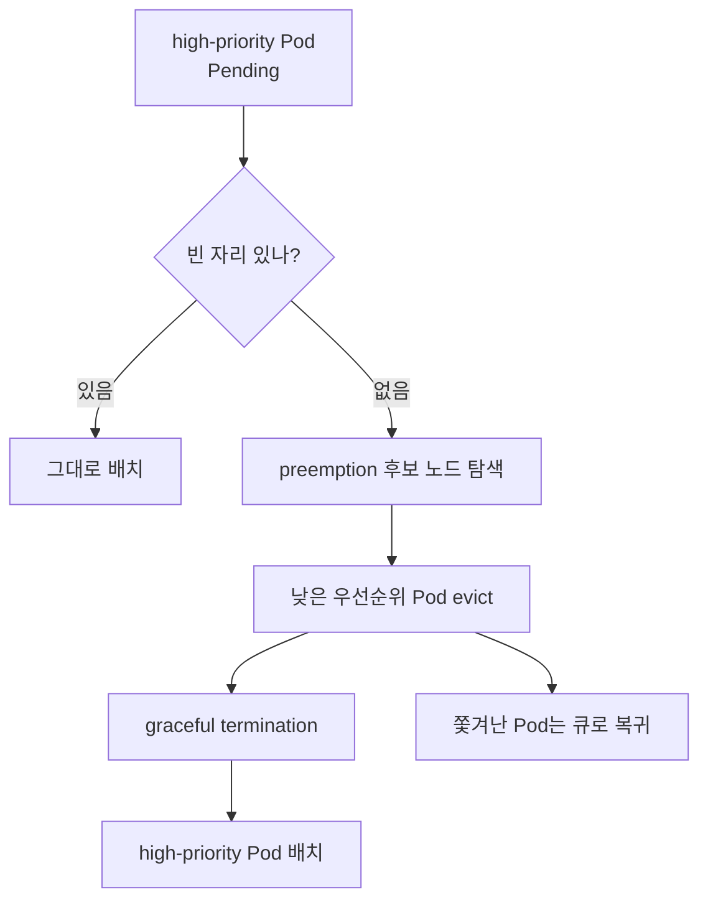
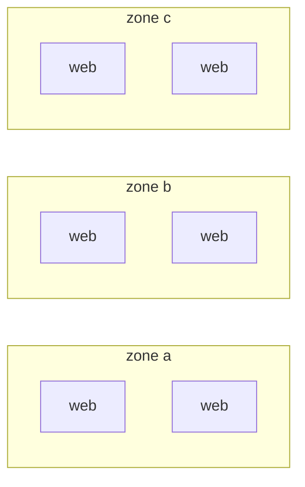
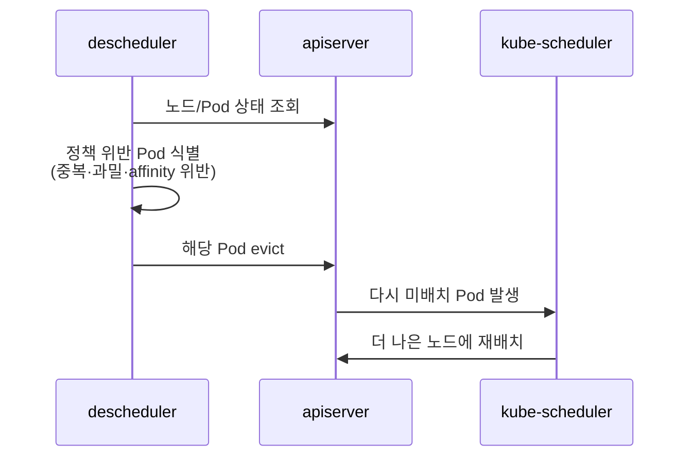
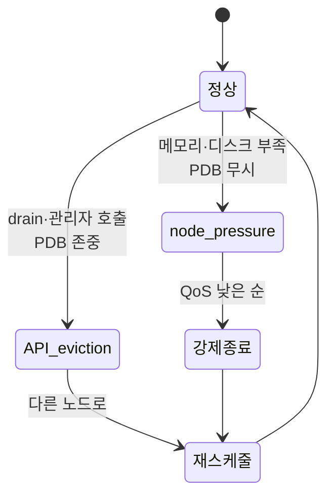

# 고급 스케줄링

::: info 학습 목표
- PriorityClass로 Pod 우선순위를 정의하고 preemption이 어떻게 낮은 우선순위 Pod를 밀어내는지 이해한다.
- topology spread constraints로 존·노드에 Pod를 균등 분산하는 방법을 익힌다.
- descheduler의 역할과 멀티 스케줄러로 워크로드별 정책을 적용하는 방법을 안다.
- eviction의 두 종류(API-initiated, node-pressure)와 동작 차이를 구분한다.
:::

## 1. PriorityClass와 preemption

클러스터 리소스가 가득 차면 모든 Pod를 동시에 띄울 수 없다. 이때 "어떤 Pod가 더 중요한가"를 정하는 것이 <strong>PriorityClass</strong>다. PriorityClass는 정수 우선순위 값을 가진 클러스터 범위 오브젝트이고, Pod는 `priorityClassName`으로 이를 참조한다. 값이 클수록 우선순위가 높다.

```yaml
apiVersion: scheduling.k8s.io/v1
kind: PriorityClass
metadata:
  name: high-priority
value: 1000000
globalDefault: false
description: "결제·인증 같은 핵심 워크로드용"
---
apiVersion: v1
kind: Pod
metadata:
  name: payment
spec:
  priorityClassName: high-priority
  containers:
  - name: app
    image: payment:1.0
```

높은 우선순위 Pod가 `Pending`인데 배치할 자리가 없으면, 스케줄러는 <strong>preemption(선점)</strong>을 시도한다. 같은 노드에서 더 낮은 우선순위 Pod들을 evict해 자리를 만들고, 그 자리에 높은 우선순위 Pod를 넣는 것이다. 쫓겨난 Pod는 graceful termination 후 다시 스케줄 큐로 돌아간다.



::: warning
preemption을 피해야 하는 Pod에는 `preemptionPolicy: Never`를 줄 수 있다. 이 경우 그 Pod는 자기보다 낮은 Pod를 쫓아내지 않고 자기 차례를 기다린다. 또한 우선순위가 너무 높은 PriorityClass(예: `system-cluster-critical`)는 시스템 컴포넌트 전용이므로 일반 워크로드에 함부로 쓰면 안 된다.
:::

자세한 동작은 [Pod Priority and Preemption 문서](https://kubernetes.io/docs/concepts/scheduling-eviction/pod-priority-preemption/)를 참고한다.

## 2. topology spread constraints

이전 챕터의 pod anti-affinity는 "같은 노드 회피"는 잘하지만, "각 존에 정확히 균등하게" 같은 분산 정도(degree)를 표현하기 어렵고 계산 비용도 크다. <strong>topology spread constraints</strong>는 이 문제를 정조준한다. "토폴로지 도메인(존·노드 등) 사이에 Pod 개수 차이가 N을 넘지 않게 퍼뜨려라"를 선언적으로 표현한다.

핵심 필드는 다음과 같다.

- <strong>maxSkew</strong>: 도메인 간 Pod 개수 차이의 허용 최대치. 작을수록 더 빡빡하게 균등.
- <strong>topologyKey</strong>: 분산 기준이 되는 노드 라벨(존, 호스트 등).
- <strong>whenUnsatisfiable</strong>: 제약을 못 지킬 때 `DoNotSchedule`(hard) 또는 `ScheduleAnyway`(soft).
- <strong>labelSelector</strong>: 개수를 셀 대상 Pod 집합.

```yaml
apiVersion: apps/v1
kind: Deployment
metadata:
  name: web
spec:
  replicas: 6
  selector:
    matchLabels:
      app: web
  template:
    metadata:
      labels:
        app: web
    spec:
      topologySpreadConstraints:
      - maxSkew: 1
        topologyKey: topology.kubernetes.io/zone
        whenUnsatisfiable: DoNotSchedule
        labelSelector:
          matchLabels:
            app: web
      - maxSkew: 1
        topologyKey: kubernetes.io/hostname
        whenUnsatisfiable: ScheduleAnyway
        labelSelector:
          matchLabels:
            app: web
      containers:
      - name: web
        image: nginx
```

위 예는 "존 사이 차이는 최대 1까지(hard), 노드 사이 차이도 최대 1까지(soft)"를 의미한다. replica 6개라면 존이 3개일 때 2-2-2로 고르게 퍼진다.



::: tip
대부분의 클러스터에는 클러스터 수준 기본 topology spread가 설정돼 있어, 아무 제약을 안 줘도 어느 정도 분산된다. 그래도 가용성이 중요한 워크로드라면 Deployment에 명시적으로 존 단위 spread를 거는 것이 안전하다. 자세한 내용은 [Pod Topology Spread Constraints 문서](https://kubernetes.io/docs/concepts/scheduling-eviction/topology-spread-constraints/)에 있다.
:::

## 3. descheduler

스케줄러는 "배치 시점"의 상태만 보고 결정한다. 시간이 지나면 노드 추가, taint 변경, Pod 종료 등으로 처음의 좋은 배치가 점점 나빠질 수 있다. 예를 들어 새 노드를 추가해도 기존 Pod는 옮겨가지 않아 한쪽 노드만 붐비는 상황이 생긴다. <strong>descheduler</strong>는 이렇게 어긋난 배치를 찾아내 Pod를 evict하고, 다시 스케줄러가 더 나은 곳에 배치하게 유도하는 컴포넌트다.

descheduler는 쿠버네티스 코어가 아니라 별도 프로젝트([kubernetes-sigs/descheduler](https://github.com/kubernetes-sigs/descheduler))이며, 보통 CronJob이나 Deployment로 주기적으로 돈다. 대표 정책(strategy)은 다음과 같다.

- <strong>RemoveDuplicates</strong>: 같은 노드에 동일 워크로드 Pod가 중복되면 일부를 분산시킨다.
- <strong>LowNodeUtilization</strong>: 사용률이 낮은 노드와 높은 노드를 비교해, 붐비는 노드에서 Pod를 빼낸다.
- <strong>RemovePodsViolatingTopologySpreadConstraint</strong>: 나중에 어긋난 topology spread를 교정한다.
- <strong>RemovePodsViolatingNodeAffinity / Taints</strong>: 라벨·taint 변경으로 더 이상 규칙을 만족하지 않는 Pod를 정리한다.



::: warning
descheduler가 evict한 Pod는 PodDisruptionBudget(PDB)을 존중하므로 가용성이 갑자기 깨지진 않지만, 그래도 Pod가 재시작되며 잠깐의 중단이 생긴다. 무한 evict/재배치 루프를 막으려면 정책 임계값과 실행 주기를 보수적으로 잡아야 한다.
:::

## 4. 멀티 스케줄러

쿠버네티스는 하나의 클러스터에서 <strong>여러 스케줄러를 동시에</strong> 운영할 수 있다. 기본 스케줄러(`default-scheduler`) 외에 커스텀 스케줄러를 Pod로 띄우고, Pod의 `schedulerName`으로 어느 스케줄러가 그 Pod를 처리할지 지정한다. 배치 잡 전용 빈패킹 스케줄러, GPU 토폴로지 인지 스케줄러처럼 워크로드별 다른 정책을 적용할 때 쓴다.

```yaml
apiVersion: v1
kind: Pod
metadata:
  name: batch-job
spec:
  schedulerName: my-custom-scheduler
  containers:
  - name: app
    image: batch:1.0
```

각 스케줄러는 자기 이름이 붙은 Pod만 집어 든다. 같은 노드를 여러 스케줄러가 동시에 보므로, 둘이 같은 빈 자리를 두고 경쟁하면 한쪽 binding이 실패(conflict)하고 재시도된다. 코어를 건드리지 않고 정책만 바꾸고 싶다면 새 스케줄러 바이너리 대신 [스케줄링 프로파일](https://kubernetes.io/docs/reference/scheduling/config/)로 plugin 가중치를 조정하는 편이 더 쉽다. 자세한 절차는 [멀티 스케줄러 구성 문서](https://kubernetes.io/docs/tasks/extend-kubernetes/configure-multiple-schedulers/)를 참고한다.

## 5. eviction — 종류와 동작

<strong>eviction(추방)</strong>은 실행 중인 Pod를 노드에서 내보내는 동작이다. 종류가 둘이고 동작이 다르므로 구분이 중요하다.

<strong>API-initiated eviction</strong>은 Eviction API를 호출해 의도적으로 Pod를 내보내는 것이다. `kubectl drain`이 내부적으로 이걸 쓴다. 이 방식은 <strong>PodDisruptionBudget(PDB)</strong>을 존중한다. PDB는 "동시에 내려갈 수 있는 Pod 수의 하한/상한"을 정의해, 노드 정비 같은 자발적 중단(voluntary disruption) 중에도 최소 가용성을 보장한다.

```yaml
apiVersion: policy/v1
kind: PodDisruptionBudget
metadata:
  name: web-pdb
spec:
  minAvailable: 2     # web Pod는 최소 2개 살아 있어야 함
  selector:
    matchLabels:
      app: web
```

```bash
# drain은 API-initiated eviction을 발생시키며 PDB를 지킨다
kubectl drain worker-1 --ignore-daemonsets --delete-emptydir-data
```

<strong>node-pressure eviction</strong>은 kubelet이 노드 자원(메모리, 디스크, inode 등)이 임계값 아래로 떨어졌을 때 노드를 살리기 위해 Pod를 강제로 죽이는 것이다. 이건 <strong>PDB를 존중하지 않는다</strong>. 노드가 죽으면 모두가 죽으므로, kubelet은 QoS 클래스(다음 챕터 주제)와 우선순위를 기준으로 희생할 Pod를 고른다. 보통 BestEffort → Burstable → Guaranteed 순으로 먼저 쫓겨난다.



::: details preemption과 eviction은 무엇이 다른가
preemption은 <strong>스케줄러</strong>가 높은 우선순위 Pod를 배치하려고 낮은 Pod를 내보내는 것이고, node-pressure eviction은 <strong>kubelet</strong>이 노드 자원을 지키려고 Pod를 내보내는 것이다. 둘 다 Pod를 쫓아내지만 주체와 트리거가 다르다. API-initiated eviction은 또 별개로, 관리자/컨트롤러가 Eviction API로 의도적으로 내보내는 경우다. 자세한 내용은 [API-initiated Eviction 문서](https://kubernetes.io/docs/concepts/scheduling-eviction/api-eviction/)와 [Node-pressure Eviction 문서](https://kubernetes.io/docs/concepts/scheduling-eviction/node-pressure-eviction/)에 정리돼 있다.
:::

::: tip 핵심 정리
- PriorityClass는 Pod 우선순위를 정하고, 자리가 없으면 preemption으로 낮은 우선순위 Pod를 evict해 자리를 만든다.
- topology spread constraints는 maxSkew로 존·노드 간 균등 분산 정도를 선언적으로 제어하며, anti-affinity보다 가볍다.
- descheduler는 시간이 지나며 어긋난 배치를 evict해 재배치를 유도하는 별도 컴포넌트로, PDB를 존중한다.
- 멀티 스케줄러는 schedulerName으로 워크로드별 다른 정책을 적용할 수 있으나, 정책만 바꿀 땐 스케줄링 프로파일이 더 쉽다.
- eviction은 API-initiated(PDB 존중)와 node-pressure(PDB 무시, QoS 낮은 순) 두 종류로 동작이 다르다.
:::

## 다음 챕터

스케줄링은 결국 노드 자원을 어떻게 나눠 쓰느냐의 문제다. 다음 챕터 [리소스 관리와 QoS](/study/kubernetes/22-resource-qos)에서는 requests/limits, CPU와 메모리의 동작 차이(throttle vs OOMKill), QoS 클래스, LimitRange와 ResourceQuota를 다룬다.
