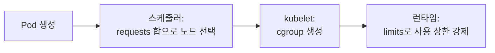
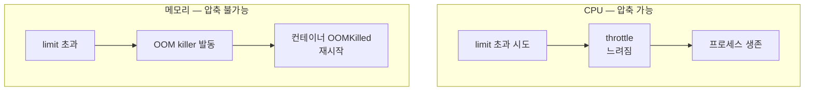
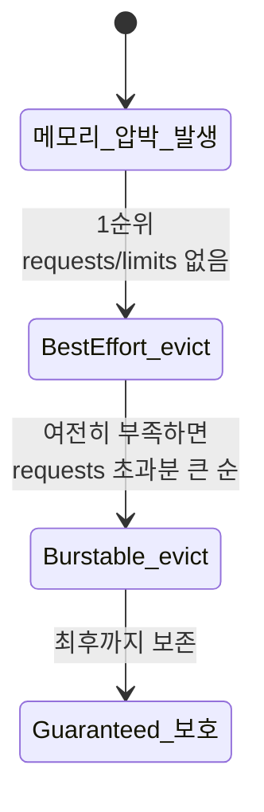
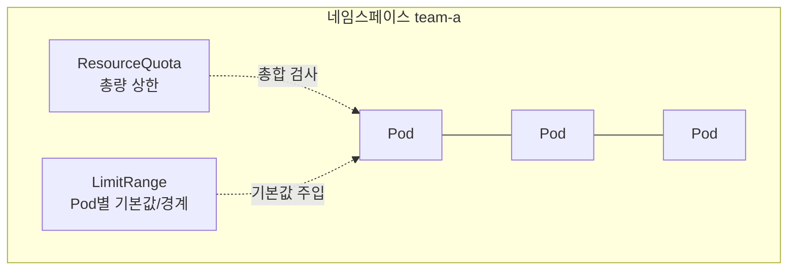

# 리소스 관리와 QoS

::: info 학습 목표
- requests와 limits가 스케줄링 시점과 런타임 시점에 각각 무엇을 의미하는지 구분한다.
- CPU와 메모리가 limits 초과 시 다르게 동작하는 이유(throttle vs OOMKill)를 이해한다.
- QoS 클래스가 requests/limits 조합으로 어떻게 결정되고 eviction 순서에 영향을 주는지 안다.
- LimitRange와 ResourceQuota로 네임스페이스 단위 자원을 통제하는 방법을 익힌다.
:::

## 1. requests와 limits

컨테이너는 두 가지 자원 수치를 선언할 수 있다.

- <strong>requests</strong>: 이 컨테이너가 보장받기를 원하는 최소 자원량. <strong>스케줄링</strong>에 쓰인다. 스케줄러는 노드의 "할당 가능(allocatable)" 자원에서 이미 예약된 requests 합을 빼고, 새 Pod의 requests가 들어갈 자리가 있는지로 배치를 결정한다.
- <strong>limits</strong>: 이 컨테이너가 쓸 수 있는 최대 자원량. <strong>런타임</strong>에 컨테이너 런타임(cgroup)이 강제한다.

중요한 오해 하나를 먼저 정리하자. 스케줄러는 노드의 <strong>실제 사용량</strong>이 아니라 <strong>예약된 requests의 합</strong>으로 자리를 계산한다. 즉 requests를 0으로 두면 노드가 이미 꽉 차 있어도 스케줄러는 자리가 있다고 판단해 Pod를 욱여넣을 수 있다.

```yaml
apiVersion: v1
kind: Pod
metadata:
  name: app
spec:
  containers:
  - name: app
    image: myapp:1.0
    resources:
      requests:
        cpu: "250m"        # 0.25 코어 보장 요청
        memory: "256Mi"
      limits:
        cpu: "500m"        # 최대 0.5 코어
        memory: "512Mi"    # 최대 512Mi
```

CPU 단위 `m`은 milli-core로 `1000m = 1코어`다. 메모리는 `Mi`(2진, 1024 기반)와 `M`(10진, 1000 기반)이 다르므로 보통 `Mi`/`Gi`를 쓴다. 전반적인 내용은 [Resource Management for Pods and Containers 문서](https://kubernetes.io/docs/concepts/configuration/manage-resources-containers/)에 정리돼 있다.



## 2. CPU와 메모리의 동작 차이 — throttle vs OOMKill

핵심 차이는 이것이다. <strong>CPU는 압축 가능(compressible) 자원</strong>이고 <strong>메모리는 압축 불가능(incompressible) 자원</strong>이다.

<strong>CPU가 limits를 초과하려 하면 throttle(쓰로틀링)</strong>된다. 즉 더 빨리 처리하고 싶어도 CPU 시간을 강제로 깎여 느려질 뿐, 컨테이너가 죽지는 않는다. CPU limit은 cgroup의 CFS quota로 구현돼, 일정 주기(기본 100ms) 동안 쓸 수 있는 CPU 시간을 제한한다.

<strong>메모리가 limits를 초과하면 OOMKill</strong>된다. 메모리는 "조금만 쓰게 깎는" 식으로 줄일 수 없다. 이미 할당한 메모리를 회수할 방법이 없으므로, 커널의 OOM killer가 컨테이너 프로세스를 죽이고 kubelet이 `OOMKilled` 상태로 재시작한다.



```bash
# OOMKill 여부 확인
kubectl describe pod app | grep -i -A2 "Last State"
# Last State:  Terminated  Reason: OOMKilled  Exit Code: 137
```

::: warning
이 차이 때문에 실무 권장이 갈린다. <strong>메모리는 requests와 limits를 같게</strong> 잡는 편이 안전하다(예측 가능, OOM 방지). <strong>CPU limit은 신중히</strong> 다뤄야 한다. CPU limit을 너무 낮게 잡으면 평소 한가할 때조차 throttle돼 응답 지연(latency)이 튄다. 그래서 지연에 민감한 워크로드는 CPU limit을 빼거나 넉넉히 주고, requests로만 보장하는 전략을 쓰기도 한다.
:::

## 3. QoS 클래스 — Guaranteed, Burstable, BestEffort

쿠버네티스는 Pod의 requests/limits 설정을 보고 자동으로 <strong>QoS(Quality of Service) 클래스</strong>를 부여한다. 이 클래스는 노드에 메모리 압박이 왔을 때 <strong>어떤 Pod를 먼저 쫓아낼지(eviction 순서)</strong>를 결정한다.

| QoS 클래스 | 조건 | eviction 우선순위 |
|---|---|---|
| <strong>Guaranteed</strong> | 모든 컨테이너가 CPU·메모리 requests = limits | 가장 나중에 쫓겨남(보호) |
| <strong>Burstable</strong> | requests는 있으나 limits와 다르거나 일부만 설정 | 중간 |
| <strong>BestEffort</strong> | requests·limits 둘 다 전혀 없음 | 가장 먼저 쫓겨남 |

```yaml
# Guaranteed: requests == limits (CPU도 메모리도)
apiVersion: v1
kind: Pod
metadata:
  name: guaranteed-pod
spec:
  containers:
  - name: app
    image: nginx
    resources:
      requests:
        cpu: "500m"
        memory: "512Mi"
      limits:
        cpu: "500m"
        memory: "512Mi"
```

```bash
# 부여된 QoS 클래스 확인
kubectl get pod guaranteed-pod -o jsonpath='{.status.qosClass}'
# Guaranteed
```



::: tip
핵심 워크로드(결제·DB)는 Guaranteed로 만들어 노드 압박에서 끝까지 보호하고, 배치성·캐시 워크로드는 Burstable이나 BestEffort로 둬 먼저 양보하게 설계한다. node-pressure eviction은 이전 챕터에서 봤듯 PDB를 무시하므로, QoS 설계가 곧 가용성 설계의 일부다. 자세한 내용은 [Pod Quality of Service Classes 문서](https://kubernetes.io/docs/concepts/workloads/pods/pod-qos/)를 참고한다.
:::

## 4. LimitRange — 네임스페이스의 기본값과 경계

개별 Pod에 requests/limits를 빼먹으면 BestEffort가 돼 위험하다. <strong>LimitRange</strong>는 네임스페이스 단위로 컨테이너·Pod의 기본값과 최소/최대 경계를 강제한다.

- <strong>default / defaultRequest</strong>: 명시하지 않은 컨테이너에 자동으로 채워 넣을 limits/requests.
- <strong>min / max</strong>: 허용되는 최소·최대 값. 벗어나면 Pod 생성이 거부된다.
- <strong>maxLimitRequestRatio</strong>: limits/requests 비율의 상한(과도한 오버커밋 방지).

```yaml
apiVersion: v1
kind: LimitRange
metadata:
  name: defaults
  namespace: team-a
spec:
  limits:
  - type: Container
    default:            # limits 기본값
      cpu: "500m"
      memory: "512Mi"
    defaultRequest:     # requests 기본값
      cpu: "100m"
      memory: "128Mi"
    min:
      cpu: "50m"
      memory: "64Mi"
    max:
      cpu: "2"
      memory: "2Gi"
```

LimitRange가 있는 네임스페이스에 requests/limits 없이 Pod를 만들면, admission 단계에서 위 기본값이 자동 주입돼 BestEffort 사고를 막는다. 자세한 내용은 [Limit Ranges 문서](https://kubernetes.io/docs/concepts/policy/limit-range/)에 있다.

## 5. ResourceQuota — 네임스페이스 총량 통제

LimitRange가 "Pod 하나"의 경계라면, <strong>ResourceQuota</strong>는 "네임스페이스 전체"의 총량을 통제한다. 멀티 테넌트 클러스터에서 한 팀이 자원을 독식하지 못하게 막는 핵심 장치다.

```yaml
apiVersion: v1
kind: ResourceQuota
metadata:
  name: team-a-quota
  namespace: team-a
spec:
  hard:
    requests.cpu: "10"          # 네임스페이스 requests CPU 합 ≤ 10코어
    requests.memory: "20Gi"
    limits.cpu: "20"            # limits CPU 합 ≤ 20코어
    limits.memory: "40Gi"
    pods: "50"                  # Pod 개수 ≤ 50
    persistentvolumeclaims: "10"
    services.loadbalancers: "2"
```



ResourceQuota가 설정된 네임스페이스에서는 <strong>모든 컨테이너가 quota에 걸린 자원의 requests/limits를 반드시 명시</strong>해야 한다. 안 그러면 총합을 계산할 수 없어 Pod 생성이 거부된다. 그래서 ResourceQuota와 LimitRange는 보통 함께 쓴다 — LimitRange가 기본값을 채워 줘야 quota 검사가 통과되기 때문이다.

```bash
# 현재 quota 사용량 확인
kubectl get resourcequota team-a-quota -n team-a -o yaml
kubectl describe resourcequota team-a-quota -n team-a
```

::: details requests 합 vs 실제 사용량 — 오버커밋
ResourceQuota와 스케줄러는 모두 <strong>requests의 합</strong>으로 자원을 회계한다. 실제 사용량과는 별개다. 그래서 limits를 requests보다 크게 잡으면(오버커밋) 평소엔 자원을 효율적으로 나눠 쓰다가, 동시에 모두가 limits까지 치솟으면 노드가 압박을 받아 node-pressure eviction이 발생할 수 있다. 효율과 안정성의 트레이드오프이며, 클러스터 운영자는 이 오버커밋 비율을 의식적으로 관리해야 한다. 자세한 내용은 [Resource Quotas 문서](https://kubernetes.io/docs/concepts/policy/resource-quotas/)를 참고한다.
:::

::: tip 핵심 정리
- requests는 스케줄링(자리 예약)에, limits는 런타임(사용 상한 강제)에 쓰이며, 스케줄러는 실제 사용량이 아닌 requests 합으로 배치한다.
- CPU는 압축 가능해 limit 초과 시 throttle(생존)되고, 메모리는 압축 불가능해 limit 초과 시 OOMKill된다.
- QoS 클래스(Guaranteed/Burstable/BestEffort)는 requests/limits 조합으로 정해지며 메모리 압박 시 eviction 순서를 결정한다.
- LimitRange는 네임스페이스 내 Pod별 기본값·최소/최대 경계를 강제해 BestEffort 사고를 막는다.
- ResourceQuota는 네임스페이스 전체 자원 총량을 통제하며, 보통 LimitRange와 함께 써야 검사가 통과된다.
:::

## 다음 챕터

자원의 정적인 할당과 경계를 익혔다. 다음 챕터 [오토스케일링](/study/kubernetes/23-autoscaling)에서는 부하에 따라 Pod 수와 자원을 동적으로 늘리고 줄이는 HPA·VPA·Cluster Autoscaler·KEDA를 다룬다.
