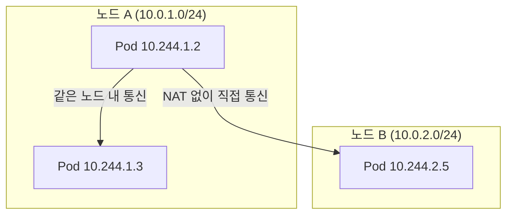
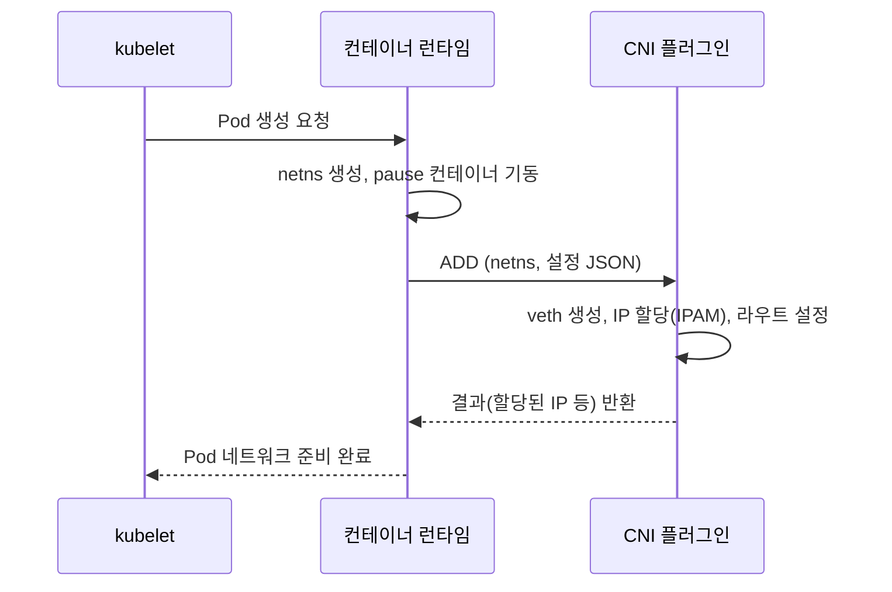
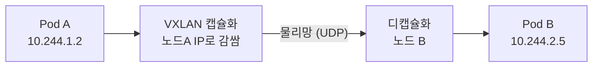
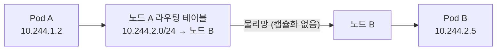

# 네트워킹 모델과 CNI

::: info 학습 목표
- 쿠버네티스 네트워크 모델의 4가지 핵심 원칙과 그 의미를 이해한다.
- IP-per-Pod 모델이 무엇이며 왜 이런 설계를 택했는지 안다.
- CNI 스펙의 동작 방식과 Calico·Flannel·Cilium의 접근 차이를 비교한다.
- 노드 간 파드 통신이 오버레이(VXLAN)와 라우팅(BGP)으로 어떻게 구현되는지 파악한다.
:::

## 1. 쿠버네티스 네트워크 모델의 4원칙

쿠버네티스는 네트워킹 구현을 직접 제공하지 않는다. 대신 모든 구현이 반드시 만족해야 하는 <strong>네트워크 모델</strong>을 정의하고, 실제 구현은 플러그인에 맡긴다. 이 모델은 다음 4가지 원칙으로 요약된다.

1. <strong>모든 Pod는 NAT 없이 다른 모든 Pod와 통신할 수 있다.</strong> 노드가 다르더라도 마찬가지다.
2. <strong>모든 노드(의 에이전트, 예: kubelet)는 NAT 없이 모든 Pod와 통신할 수 있다.</strong>
3. <strong>Pod가 자신을 보는 IP와 다른 Pod가 그 Pod를 보는 IP가 같다.</strong> 즉 Pod 내부에서 `ip addr`로 보는 주소와 외부에서 접근하는 주소가 일치한다.
4. (호스트 네트워크를 쓰지 않는 한) Pod는 자신만의 독립된 네트워크 네임스페이스를 가진다.

이 원칙의 핵심은 <strong>"NAT 없는 평평한(flat) 네트워크"</strong>다. 전통적인 가상 머신 환경에서는 NAT와 포트 매핑이 흔하지만, 쿠버네티스는 이를 의도적으로 배제했다. 그래야 애플리케이션이 포트 충돌이나 주소 변환을 신경 쓰지 않고, 마치 물리 호스트 위에서 도는 것처럼 단순한 가정 아래 동작할 수 있기 때문이다.

전체 개념은 [Cluster Networking 문서](https://kubernetes.io/docs/concepts/cluster-administration/networking/)에 정리돼 있다.



## 2. Pod 네트워크와 IP-per-Pod

쿠버네티스는 <strong>IP-per-Pod</strong> 모델을 채택한다. 컨테이너 단위가 아니라 <strong>Pod 단위</strong>로 고유한 IP가 부여된다. 한 Pod 안의 여러 컨테이너는 같은 네트워크 네임스페이스를 공유하므로, 서로를 `localhost`로 보고 같은 포트 공간을 나눠 쓴다.

이를 가능하게 하는 것이 <strong>pause 컨테이너(infra 컨테이너)</strong>다. Pod가 생성될 때 가장 먼저 뜨는 pause 컨테이너가 네트워크 네임스페이스를 잡고, 애플리케이션 컨테이너들은 그 네임스페이스에 합류(join)한다. 따라서 애플리케이션 컨테이너가 재시작돼도 IP는 유지된다.

```bash
# Pod의 IP 확인
kubectl get pod nginx -o wide
# NAME    READY   STATUS    IP            NODE
# nginx   1/1     Running   10.244.1.7    node-1

# Pod 내부에서 본 IP가 동일함을 확인
kubectl exec nginx -- ip addr show eth0
```

IP-per-Pod의 장점은 다음과 같다.

- 포트 충돌이 없다. 두 애플리케이션이 모두 8080을 쓰더라도 서로 다른 Pod IP를 가지므로 충돌하지 않는다.
- 서비스 디스커버리가 단순해진다. Pod를 IP:Port로 직접 가리킬 수 있다.
- 기존 애플리케이션 이식이 쉽다. VM에서 돌던 앱이 "내 IP 하나"라는 가정을 그대로 유지한다.

각 노드에는 Pod에 할당할 IP 대역(<strong>PodCIDR</strong>)이 배정된다. 예를 들어 클러스터 전체가 `10.244.0.0/16`이면 노드마다 `10.244.1.0/24`, `10.244.2.0/24` 식으로 쪼개 받는다. 노드 내부에서는 보통 리눅스 브리지나 가상 이더넷 페어(veth pair)로 Pod들을 연결한다.

## 3. CNI 스펙과 동작 방식

<strong>CNI(Container Network Interface)</strong>는 컨테이너 런타임과 네트워크 플러그인 사이의 표준 인터페이스다. CNCF가 관리하는 [CNI 스펙](https://github.com/containernetworking/cni/blob/main/SPEC.md)은 매우 단순하다. 컨테이너 런타임이 Pod의 네트워크 네임스페이스를 만든 뒤, CNI 플러그인 바이너리를 호출하며 `ADD`/`DEL` 같은 명령과 설정을 넘긴다. 플러그인은 그 네임스페이스에 인터페이스를 만들고 IP를 할당한 뒤 결과를 반환한다.



CNI 설정은 보통 노드의 `/etc/cni/net.d/`에 JSON으로 놓이고, 플러그인 바이너리는 `/opt/cni/bin/`에 위치한다. 주요 플러그인의 접근 방식은 다음과 같이 다르다.

| 플러그인 | 데이터플레인 | 노드 간 통신 | 특징 |
|----------|-------------|-------------|------|
| Flannel | VXLAN(기본) | 오버레이 | 단순함, 설정 최소, NetworkPolicy 미지원 |
| Calico | 리눅스 라우팅(L3) | BGP 또는 VXLAN/IPIP | NetworkPolicy 강력, 대규모에 적합 |
| Cilium | eBPF | 라우팅 또는 VXLAN | eBPF 기반 고성능, 관측성·보안 풍부 |

::: tip 플러그인 선택의 출발점
단순한 학습·실습 클러스터라면 Flannel이 가볍다. NetworkPolicy가 필요하고 운영 규모가 크면 Calico가 표준에 가깝다. eBPF 기반의 고성능·고관측성을 원하고 kube-proxy 대체까지 고려한다면 Cilium이 강력하다.
:::

## 4. Calico, Flannel, Cilium 비교

<strong>Flannel</strong>은 가장 단순한 오버레이 네트워크다. 기본 백엔드인 VXLAN을 쓰면, 각 노드의 `flanneld`가 노드 간에 캡슐화된 터널을 만들어 Pod 트래픽을 실어 나른다. 설정이 거의 없고 어디서나 동작하지만, NetworkPolicy를 자체적으로 지원하지 않는다.

<strong>Calico</strong>는 오버레이 없이 순수 L3 라우팅을 지향한다. 각 노드를 하나의 라우터처럼 다루고, <strong>BGP</strong>로 Pod CIDR 경로를 노드 간에 광고(advertise)한다. 캡슐화가 없으므로 오버헤드가 작고 성능이 좋다. 단, 노드 간 L2 연결이 불가능한 환경(예: 클라우드의 서로 다른 서브넷)에서는 IPIP나 VXLAN 캡슐화 모드를 선택적으로 쓴다. Calico의 강점은 풍부한 [NetworkPolicy](https://kubernetes.io/docs/concepts/services-networking/network-policies/) 구현이다.

<strong>Cilium</strong>은 리눅스 커널의 <strong>eBPF</strong>를 데이터플레인으로 사용한다. iptables 룰 체인을 거치지 않고 커널 내에서 직접 패킷을 처리하므로, 룰이 많아져도 성능이 잘 유지된다. NetworkPolicy를 L3/L4뿐 아니라 L7(HTTP, gRPC, Kafka)까지 확장하고, Hubble로 흐름을 시각화하는 등 관측성과 보안 기능이 풍부하다. 또한 kube-proxy를 완전히 대체할 수 있다(다음 챕터에서 다룬다).

```bash
# 현재 클러스터에 설치된 CNI 확인 (DaemonSet 형태로 도는 경우가 많다)
kubectl get pods -n kube-system -o wide | grep -E 'calico|flannel|cilium'

# 노드의 CNI 설정 확인
cat /etc/cni/net.d/*.conflist
```

## 5. 노드 간 파드 통신 — 오버레이 vs 라우팅

같은 노드 안의 Pod끼리는 브리지나 veth로 바로 연결되니 간단하다. 까다로운 것은 <strong>다른 노드의 Pod로 가는 트래픽</strong>이다. 크게 두 방식이 있다.

<strong>오버레이(Overlay) 방식.</strong> Pod 패킷을 노드의 IP를 출발/도착지로 하는 외부 패킷 안에 <strong>캡슐화</strong>해 보낸다. 대표적으로 VXLAN은 원래 패킷을 UDP 안에 감싼다. 도착 노드에서 디캡슐화해 원래 Pod 패킷을 꺼낸다. 물리 네트워크가 Pod CIDR을 전혀 몰라도 동작하는 것이 장점이지만, 캡슐화 헤더만큼 오버헤드(MTU 감소, CPU 사용)가 생긴다.



<strong>라우팅(Routing) 방식.</strong> 캡슐화 없이 물리 네트워크가 직접 Pod CIDR로 가는 경로를 알게 한다. Calico는 BGP로 "이 Pod 대역은 이 노드를 통해 갈 수 있다"는 경로를 노드와 네트워크 장비에 광고한다. 캡슐화 오버헤드가 없어 빠르지만, 네트워크가 Pod 라우트를 받아들일 수 있어야 한다(같은 L2이거나 BGP를 받는 장비 필요).



::: warning MTU에 주의
오버레이는 캡슐화 헤더만큼 페이로드 가용 공간이 줄어든다. VXLAN은 보통 50바이트가량을 쓰므로, 물리 MTU가 1500이면 Pod MTU는 1450 정도로 맞춰야 한다. 이를 잘못 설정하면 큰 패킷에서만 간헐적으로 끊기는 진단하기 까다로운 장애가 생긴다.
:::

::: tip 핵심 정리
- 쿠버네티스 네트워크 모델은 NAT 없는 평평한 네트워크를 4원칙으로 규정하고, 구현은 플러그인에 위임한다.
- IP-per-Pod 모델은 Pod 단위로 고유 IP를 주며, pause 컨테이너가 네트워크 네임스페이스를 유지한다.
- CNI는 런타임과 플러그인 사이의 단순한 표준 인터페이스로, ADD/DEL 호출로 Pod 네트워크를 구성한다.
- Flannel은 단순 오버레이, Calico는 BGP 라우팅과 강력한 정책, Cilium은 eBPF 기반 고성능을 제공한다.
- 노드 간 통신은 오버레이(캡슐화, 어디서나 동작하나 오버헤드)와 라우팅(캡슐화 없음, 빠르나 네트워크 요건)으로 나뉜다.
:::

## 다음 챕터

지금까지 Pod 사이를 잇는 저수준 네트워크를 다뤘다. 하지만 Pod는 수시로 생성·삭제되며 IP가 바뀐다. 이 불안정한 IP를 안정적인 접근점으로 추상화하는 것이 다음 주제다. 다음 챕터 [Service](/study/kubernetes/25-service)에서는 ClusterIP·NodePort·LoadBalancer와 EndpointSlice를 깊게 다룬다.
