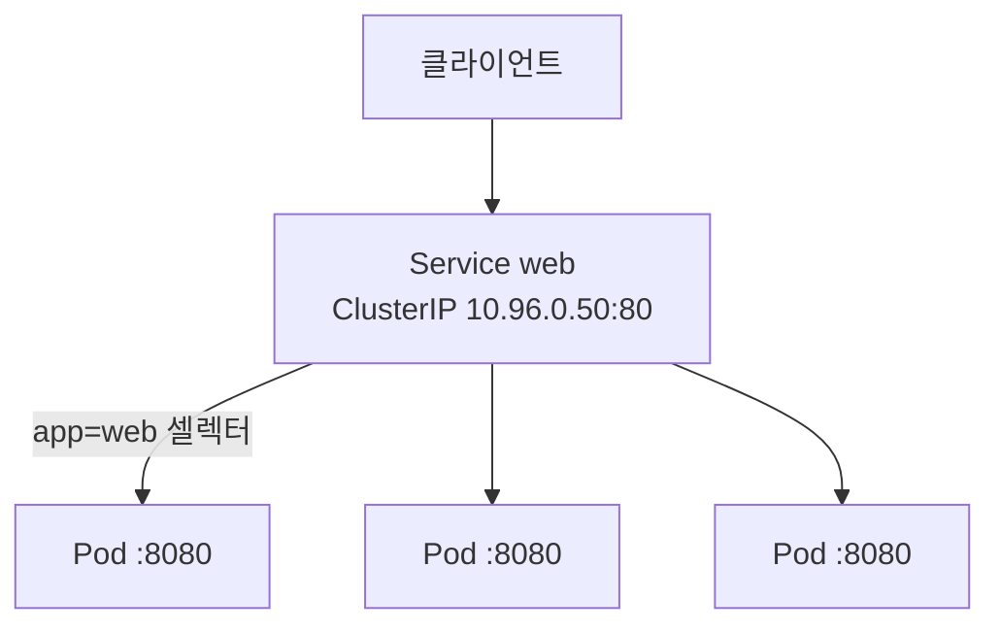
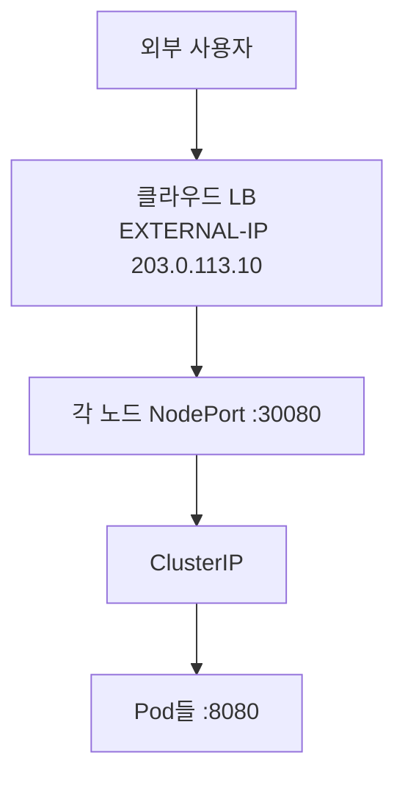
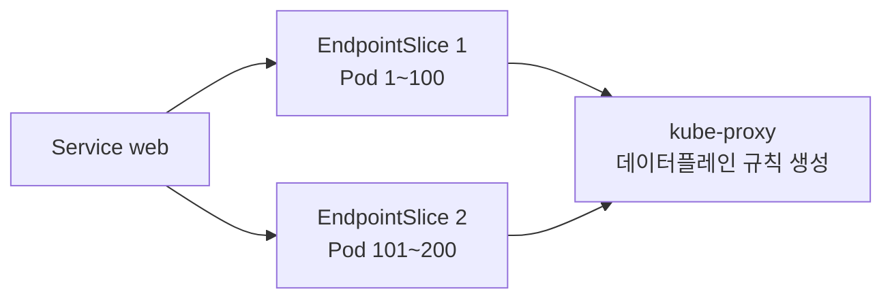

# Service

::: info 학습 목표
- Service가 왜 필요한지, 셀렉터로 Pod 집합을 어떻게 묶는지 이해한다.
- ClusterIP·NodePort·LoadBalancer·ExternalName 4가지 타입의 차이와 용도를 안다.
- headless service가 무엇이고 언제 쓰는지 파악한다.
- EndpointSlice의 역할과 세션 어피니티 설정을 익힌다.
:::

## 1. Service가 필요한 이유와 셀렉터

Pod는 일시적(ephemeral)이다. 배포·스케일·노드 장애로 끊임없이 생성·삭제되고, 그때마다 IP가 바뀐다. 클라이언트가 매번 바뀌는 Pod IP를 직접 추적하는 것은 불가능하다. <strong>Service</strong>는 이 문제를 풀기 위해, 변하지 않는 가상 IP와 DNS 이름을 제공하고 그 뒤의 Pod 집합으로 트래픽을 분산한다.

Service가 어떤 Pod들을 대상으로 할지는 <strong>셀렉터(selector)</strong>로 정한다. 셀렉터의 레이블과 일치하는 Pod들이 자동으로 백엔드(엔드포인트)가 된다.

```yaml
apiVersion: v1
kind: Service
metadata:
  name: web
spec:
  selector:
    app: web          # app=web 레이블을 가진 Pod들을 대상으로 한다
  ports:
  - name: http
    port: 80          # Service가 노출하는 포트
    targetPort: 8080  # Pod 컨테이너의 실제 포트
```

이 Service는 `app=web` 레이블을 가진 모든 Pod로 80 포트 트래픽을 8080으로 전달한다. Pod가 늘거나 줄어도 셀렉터가 자동으로 따라가므로 클라이언트는 변화에 무관하게 `web:80`만 바라보면 된다. 전체 개념은 [Service 문서](https://kubernetes.io/docs/concepts/services-networking/service/)에 정리돼 있다.



## 2. ClusterIP — 클러스터 내부 통신

<strong>ClusterIP</strong>는 기본 타입이다. 클러스터 내부에서만 접근 가능한 가상 IP를 할당한다. 마이크로서비스 간 내부 호출의 표준 방식이다.

```yaml
apiVersion: v1
kind: Service
metadata:
  name: backend
spec:
  type: ClusterIP    # 생략 시 기본값
  selector:
    app: backend
  ports:
  - port: 8080
    targetPort: 8080
```

ClusterIP는 실제 네트워크 인터페이스에 붙은 주소가 아니라, 노드마다 kube-proxy가 만든 규칙으로 구현되는 <strong>가상 IP(VIP)</strong>다. 클러스터 내부에서는 `backend.<namespace>.svc.cluster.local`이라는 DNS 이름으로도 접근할 수 있다(DNS는 28장에서 자세히 다룬다).

```bash
kubectl get svc backend
# NAME      TYPE        CLUSTER-IP     PORT(S)
# backend   ClusterIP   10.96.0.42     8080/TCP

# 다른 Pod에서 접근
kubectl exec -it some-pod -- curl http://backend:8080
```

## 3. NodePort와 LoadBalancer — 외부 노출

<strong>NodePort</strong>는 모든 노드의 특정 포트(기본 30000~32767)를 열어, 외부에서 `<노드IP>:<NodePort>`로 접근하게 한다. 어느 노드로 들어와도 Service로 라우팅된다.

```yaml
apiVersion: v1
kind: Service
metadata:
  name: web-nodeport
spec:
  type: NodePort
  selector:
    app: web
  ports:
  - port: 80
    targetPort: 8080
    nodePort: 30080    # 생략하면 범위 내에서 자동 할당
```

<strong>LoadBalancer</strong>는 클라우드 제공자의 외부 로드밸런서를 프로비저닝한다. 클라우드 컨트롤러가 실제 L4 로드밸런서를 만들고 외부 IP를 Service에 연결한다. 내부적으로는 NodePort를 포함한다.

```yaml
apiVersion: v1
kind: Service
metadata:
  name: web-lb
spec:
  type: LoadBalancer
  selector:
    app: web
  ports:
  - port: 80
    targetPort: 8080
```



::: tip 타입은 포함 관계다
LoadBalancer는 NodePort를 포함하고, NodePort는 ClusterIP를 포함한다. 즉 LoadBalancer Service를 만들면 ClusterIP와 NodePort도 함께 존재한다. 외부 노출이 필요 없으면 ClusterIP로 충분하고, HTTP 라우팅이 필요하면 Service 대신 Ingress/Gateway(27장)를 고려한다.
:::

## 4. ExternalName과 headless service

<strong>ExternalName</strong>은 셀렉터 없이, Service 이름을 외부 DNS 이름의 CNAME으로 매핑한다. 클러스터 안의 코드가 외부 서비스를 내부 이름처럼 부르게 할 때 쓴다.

```yaml
apiVersion: v1
kind: Service
metadata:
  name: external-db
spec:
  type: ExternalName
  externalName: db.prod.example.com   # 이 이름으로 CNAME 매핑
```

이러면 `external-db`를 조회한 Pod는 `db.prod.example.com`으로 리졸브된다. 가상 IP도 프록시도 없이 순수 DNS 차원의 별칭이다.

<strong>headless service</strong>는 `clusterIP: None`으로 설정한 Service다. 가상 IP를 할당하지 않고, DNS 조회 시 <strong>개별 Pod IP들을 직접 반환</strong>한다. StatefulSet처럼 각 Pod를 개별적으로 지칭해야 하거나, 클라이언트가 직접 로드밸런싱하려는 경우에 쓴다.

```yaml
apiVersion: v1
kind: Service
metadata:
  name: db-headless
spec:
  clusterIP: None      # headless
  selector:
    app: db
  ports:
  - port: 5432
```

```bash
# headless service는 A 레코드로 각 Pod IP를 반환한다
kubectl exec -it some-pod -- nslookup db-headless
# Address: 10.244.1.5
# Address: 10.244.2.8
# (Pod 개수만큼)
```

StatefulSet과 함께 쓰면 `db-0.db-headless.<ns>.svc.cluster.local` 같은 안정적인 Pod별 DNS 이름을 얻는다.

## 5. EndpointSlice와 세션 어피니티

Service가 어떤 Pod들로 트래픽을 보낼지는 <strong>EndpointSlice</strong> 오브젝트에 기록된다. 과거에는 하나의 Endpoints 오브젝트에 모든 백엔드를 담았는데, 백엔드가 수천 개가 되면 하나의 오브젝트가 거대해져 업데이트 때마다 큰 부하가 생겼다. EndpointSlice는 이를 여러 조각(기본 100개씩)으로 나눠 확장성을 개선한다.

```bash
kubectl get endpointslices -l kubernetes.io/service-name=web
# NAME        ADDRESSTYPE   PORTS   ENDPOINTS
# web-abc12   IPv4          8080    10.244.1.7,10.244.2.3,...

kubectl describe endpointslice web-abc12
```



각 엔드포인트에는 준비 상태(`ready`)와 토폴로지 정보(노드·존)가 담겨, kube-proxy가 정상 Pod로만 또는 같은 존의 Pod로 우선 라우팅하는 등의 결정을 내린다. 자세한 내용은 [EndpointSlice 문서](https://kubernetes.io/docs/concepts/services-networking/endpoint-slices/)를 참고한다.

<strong>세션 어피니티(session affinity).</strong> 기본적으로 Service는 요청마다 백엔드를 임의로 고른다. 같은 클라이언트를 항상 같은 Pod로 보내고 싶으면 `sessionAffinity: ClientIP`를 설정한다.

```yaml
spec:
  sessionAffinity: ClientIP
  sessionAffinityConfig:
    clientIP:
      timeoutSeconds: 10800   # 3시간
```

이는 클라이언트 IP 기반의 단순한 고정(stickiness)이며, NAT 뒤의 여러 클라이언트가 같은 IP로 보이면 한 Pod로 몰릴 수 있다는 한계가 있다. HTTP 쿠키 기반의 정교한 세션 고정이 필요하면 Service가 아니라 Ingress/Gateway 계층에서 처리한다.

::: tip 핵심 정리
- Service는 변하지 않는 가상 IP와 DNS로 일시적인 Pod 집합을 추상화하고, 셀렉터로 백엔드를 묶는다.
- ClusterIP는 내부 전용, NodePort는 노드 포트로 외부 노출, LoadBalancer는 클라우드 LB를 프로비저닝하며 타입은 포함 관계다.
- ExternalName은 DNS CNAME 별칭이고, headless service는 가상 IP 없이 개별 Pod IP를 직접 반환한다.
- EndpointSlice는 백엔드 목록을 조각내어 대규모 확장성을 제공하고, 준비 상태·토폴로지 정보를 담는다.
- 세션 어피니티 ClientIP로 같은 클라이언트를 같은 Pod로 고정할 수 있으나 NAT 환경의 한계가 있다.
:::

## 다음 챕터

Service는 추상화일 뿐이고, 실제로 가상 IP로 온 패킷을 Pod로 전달하는 일은 데이터플레인이 한다. 다음 챕터 [kube-proxy와 데이터플레인](/study/kubernetes/26-kube-proxy)에서는 iptables·IPVS·eBPF가 이 라우팅을 어떻게 구현하는지 패킷 흐름과 함께 깊게 다룬다.
