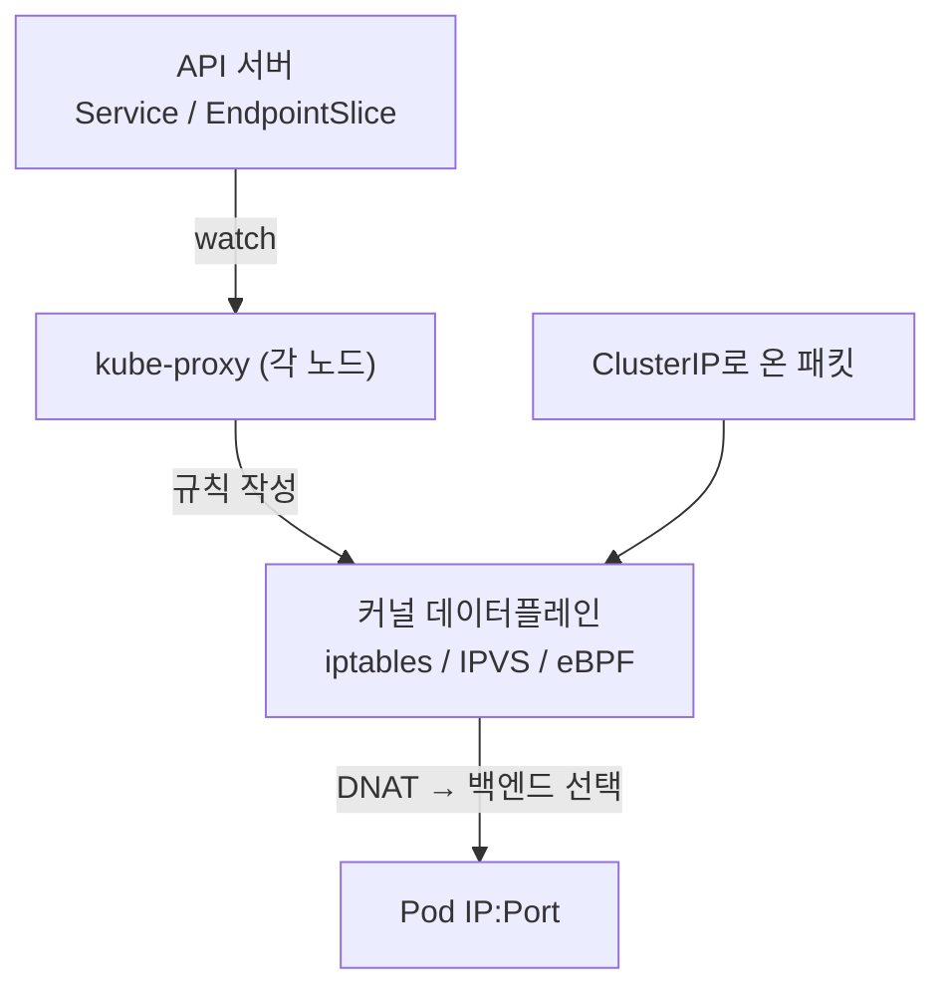
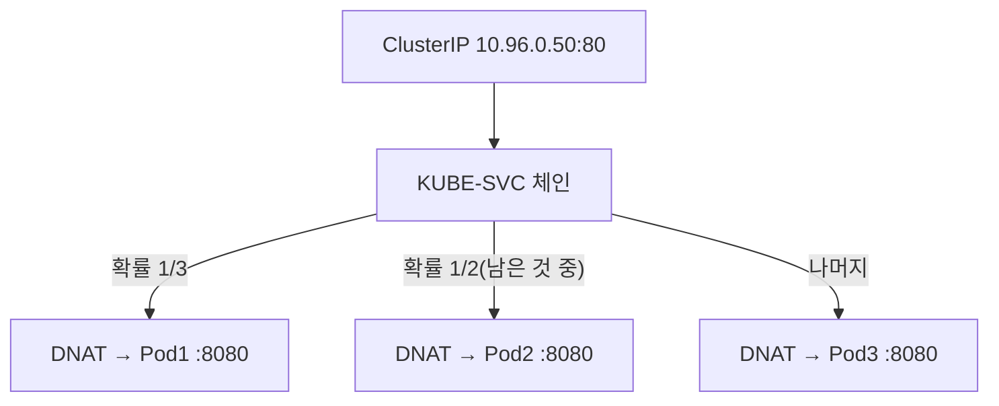
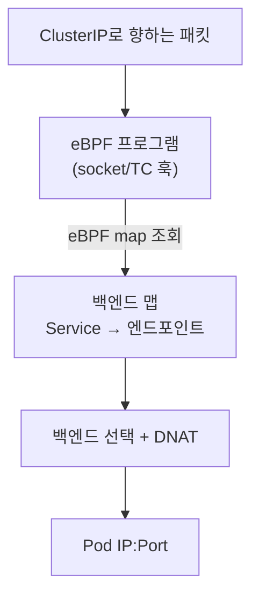
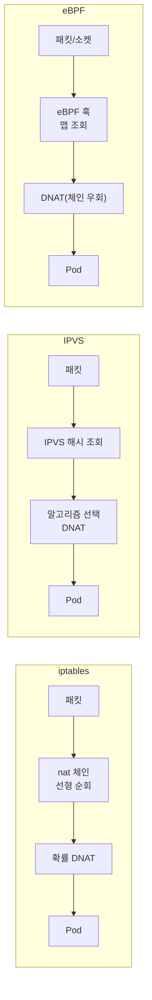

# kube-proxy와 데이터플레인

::: info 학습 목표
- kube-proxy가 Service 추상화를 실제 패킷 전달로 바꾸는 역할을 이해한다.
- iptables 모드의 동작 원리와 규모 확장 시의 한계를 안다.
- IPVS 모드가 iptables 대비 어떤 점에서 우수한지 파악한다.
- eBPF 기반 kube-proxy replacement의 접근과 이점을 이해한다.
:::

## 1. kube-proxy의 역할

<strong>kube-proxy</strong>는 각 노드에서 DaemonSet으로 도는 네트워크 컴포넌트다. 핵심 임무는 단순하다. <strong>Service의 가상 IP(ClusterIP)로 온 패킷을 실제 백엔드 Pod 중 하나로 전달</strong>하는 것이다. kube-proxy는 직접 패킷을 프록시하지 않는다(초기 userspace 모드를 제외하면). 대신 커널의 패킷 처리 규칙을 프로그래밍해 두고, 실제 전달은 커널이 한다.

kube-proxy는 API 서버를 감시(watch)하며 Service와 EndpointSlice의 변화를 받아, 노드의 데이터플레인 규칙을 그에 맞게 갱신한다.



데이터플레인을 무엇으로 구현하느냐에 따라 <strong>모드</strong>가 나뉜다. 대표적으로 iptables, IPVS가 있고, Cilium 같은 CNI는 eBPF로 kube-proxy 자체를 대체한다. 자세한 내용은 [kube-proxy 문서](https://kubernetes.io/docs/reference/networking/virtual-ips/)에 정리돼 있다.

## 2. iptables 모드

가장 널리 쓰이는 기본 모드다. kube-proxy가 Service마다 iptables 규칙 체인을 만들고, ClusterIP로 향하는 패킷을 <strong>DNAT(목적지 주소 변환)</strong>해 백엔드 Pod로 보낸다. 여러 백엔드 중 하나를 고를 때는 `statistic` 모듈로 확률 기반 분기를 한다.

```bash
# Service에 대한 iptables 규칙 확인
sudo iptables -t nat -L KUBE-SERVICES -n | head
# 백엔드 선택은 확률 기반 점프로 구현된다
sudo iptables -t nat -L KUBE-SVC-XXXX -n
```

개념적으로 백엔드가 3개라면 다음과 같이 동작한다.



iptables 모드는 안정적이고 어디서나 동작하지만 구조적 한계가 있다.

- 규칙이 <strong>선형 체인</strong>으로 평가된다. Service·엔드포인트가 많아지면 규칙 수가 폭증하고, 패킷마다 긴 체인을 순회하게 된다.
- 규칙 갱신이 비효율적이다. 변경이 잦은 대규모 클러스터에서는 전체 규칙 테이블을 다시 쓰는 비용이 커진다.
- 백엔드 선택이 진정한 로드밸런싱이 아니라 확률 기반이라 정교한 알고리즘을 못 쓴다.

::: warning iptables의 확장 한계
수천 개 Service와 수만 개 엔드포인트 규모에서는 iptables 규칙 평가와 갱신 지연이 눈에 띄게 커질 수 있다. 이 지점이 IPVS와 eBPF 모드가 등장한 배경이다.
:::

## 3. IPVS 모드

<strong>IPVS(IP Virtual Server)</strong>는 리눅스 커널에 내장된 L4 로드밸런서다. kube-proxy의 IPVS 모드는 Service를 IPVS 가상 서버로, 백엔드 Pod를 실제 서버로 등록한다. IPVS는 내부적으로 해시 테이블을 쓰므로 백엔드가 많아져도 조회가 <strong>O(1)에 가깝게</strong> 유지된다.

```bash
# IPVS 모드로 전환하려면 kube-proxy 설정에서 mode: ipvs 지정 후 재시작
# 노드에 ipvsadm이 있으면 가상 서버 목록을 볼 수 있다
sudo ipvsadm -Ln
# TCP  10.96.0.50:80 rr
#   -> 10.244.1.7:8080  Masq  1  0  0
#   -> 10.244.2.3:8080  Masq  1  0  0
```

IPVS의 장점은 다음과 같다.

- <strong>해시 기반 조회</strong>로 대규모에서도 성능이 일정하게 유지된다.
- 여러 <strong>로드밸런싱 알고리즘</strong>을 지원한다(rr 라운드로빈, lc 최소 연결, sh 소스 해싱 등).
- 규칙 동기화가 iptables보다 효율적이다.

| 항목 | iptables 모드 | IPVS 모드 |
|------|--------------|-----------|
| 백엔드 조회 | 선형(체인 순회) | 해시(거의 O(1)) |
| 대규모 성능 | 규칙 폭증 시 저하 | 일정하게 유지 |
| LB 알고리즘 | 확률 기반만 | rr/lc/sh 등 다양 |
| 의존성 | 기본 내장 | IPVS 커널 모듈 필요 |

IPVS 모드도 일부 작업(예: 패킷 마킹)에서는 여전히 iptables를 보조적으로 사용한다.

## 4. eBPF 기반 데이터플레인 — kube-proxy replacement

<strong>eBPF</strong>는 리눅스 커널 안에서 안전하게 사용자 정의 프로그램을 실행하는 기술이다. Cilium은 이를 활용해 <strong>kube-proxy를 완전히 대체(kube-proxy replacement)</strong>할 수 있다. iptables/IPVS 규칙 체인 대신, 커널의 적절한 훅 지점(예: TC, XDP, socket)에 eBPF 프로그램을 붙여 Service 로드밸런싱을 직접 수행한다.



eBPF 데이터플레인의 이점은 다음과 같다.

- iptables 체인을 거치지 않아 <strong>대규모에서도 일정한 성능</strong>을 낸다. 엔드포인트는 해시 맵으로 관리된다.
- 일부 경로에서는 <strong>socket 레벨 로드밸런싱</strong>으로 패킷이 네트워크 스택을 덜 거치게 해 지연을 줄인다.
- 같은 프레임워크로 NetworkPolicy·관측성(Hubble)·암호화까지 통합한다.

```bash
# Cilium kube-proxy replacement 상태 확인
kubectl exec -n kube-system ds/cilium -- cilium status | grep KubeProxyReplacement
# KubeProxyReplacement:   True   [eth0 ...]

# Cilium이 관리하는 서비스 로드밸런싱 목록
kubectl exec -n kube-system ds/cilium -- cilium service list
```

## 5. 패킷 흐름 비교

세 가지 모드에서 ClusterIP로 온 패킷이 Pod에 닿기까지의 경로를 비교하면 차이가 분명해진다.



핵심 차이를 정리하면 다음과 같다.

- <strong>iptables</strong>: 규칙을 선형으로 순회하므로 규모에 따라 비용이 증가한다. 호환성이 가장 좋다.
- <strong>IPVS</strong>: 해시 조회와 전용 LB 알고리즘으로 대규모에서 성능이 일정하다.
- <strong>eBPF</strong>: 체인을 우회하고 커널 내에서 직접 처리해 가장 효율적이며, 정책·관측성과 통합된다.

::: tip 핵심 정리
- kube-proxy는 Service 가상 IP로 온 패킷을 백엔드 Pod로 전달하는 데이터플레인 규칙을 노드마다 프로그래밍한다.
- iptables 모드는 호환성이 좋지만 규칙이 선형으로 평가돼 대규모에서 성능과 갱신 비용 문제가 있다.
- IPVS 모드는 해시 기반 조회와 다양한 LB 알고리즘으로 대규모에서 일정한 성능을 제공한다.
- eBPF 기반 kube-proxy replacement는 규칙 체인을 우회해 커널 내에서 직접 로드밸런싱하며 정책·관측성과 통합된다.
- 세 모드의 본질적 차이는 "백엔드 선택을 어떤 자료구조로 하느냐"(선형 vs 해시 vs eBPF 맵)에 있다.
:::

## 다음 챕터

지금까지는 L4(IP·포트) 수준의 트래픽 전달을 다뤘다. 하지만 HTTP 호스트·경로 기반 라우팅, TLS 종료처럼 L7 기능이 필요할 때가 많다. 다음 챕터 [Ingress와 Gateway API](/study/kubernetes/27-ingress-gateway)에서는 L7 라우팅을 다루는 두 가지 모델을 깊게 비교한다.
