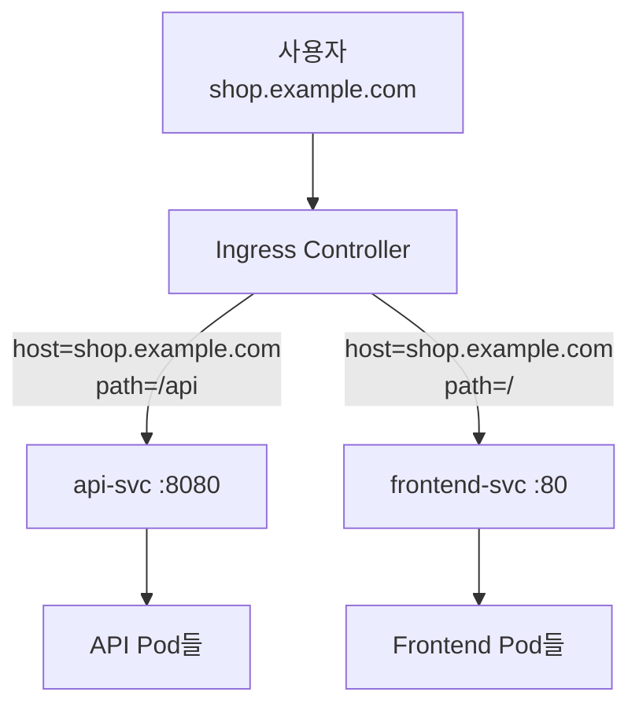
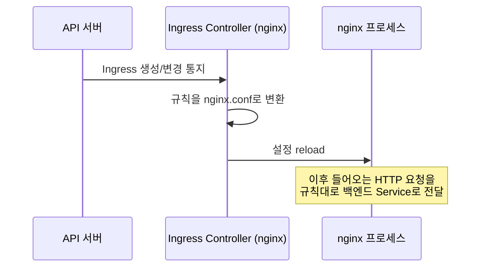
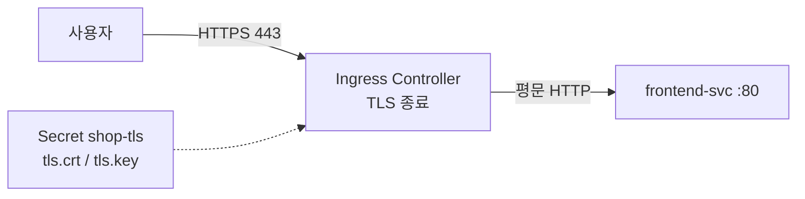
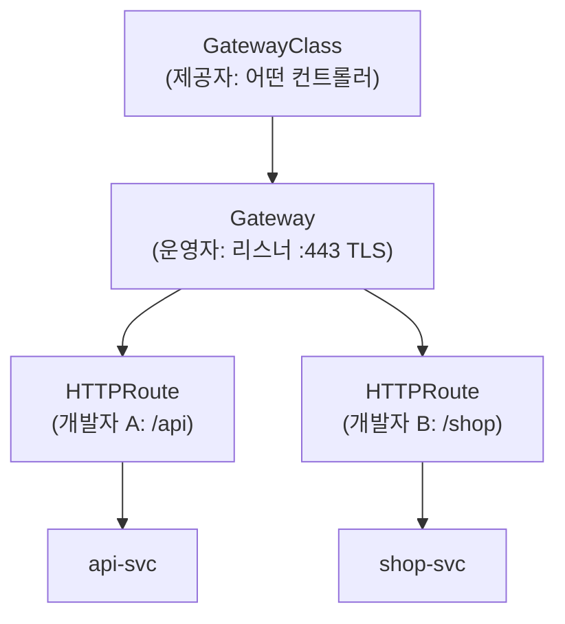

# Ingress와 Gateway API

::: info 학습 목표
- Ingress가 무엇이고 host/path 규칙으로 어떻게 L7 라우팅을 하는지 이해한다.
- Ingress Controller의 역할과 nginx 같은 구현이 어떻게 동작하는지 안다.
- Ingress에서 TLS 종료를 설정하는 방법을 익힌다.
- Gateway API의 역할 분리(Gateway/HTTPRoute)와 Ingress 대비 이점을 파악한다.
:::

## 1. Ingress 개념과 host/path 규칙

Service의 LoadBalancer 타입은 Service 하나마다 외부 로드밸런서를 만든다. 웹 서비스가 수십 개라면 로드밸런서가 수십 개 필요해 비용과 관리 부담이 크다. <strong>Ingress</strong>는 하나의 진입점에서 <strong>HTTP 호스트와 경로</strong>를 기준으로 여러 Service에 트래픽을 분배하는 L7 라우팅 규칙이다.

```yaml
apiVersion: networking.k8s.io/v1
kind: Ingress
metadata:
  name: web-ingress
spec:
  ingressClassName: nginx
  rules:
  - host: shop.example.com
    http:
      paths:
      - path: /api
        pathType: Prefix
        backend:
          service:
            name: api-svc
            port:
              number: 8080
      - path: /
        pathType: Prefix
        backend:
          service:
            name: frontend-svc
            port:
              number: 80
```

위 예에서 `shop.example.com/api`로 온 요청은 `api-svc`로, 나머지는 `frontend-svc`로 간다. `pathType`은 `Prefix`(접두사), `Exact`(완전 일치), `ImplementationSpecific`(구현 의존)이 있다. 전체 개념은 [Ingress 문서](https://kubernetes.io/docs/concepts/services-networking/ingress/)에 정리돼 있다.



## 2. Ingress Controller

여기서 중요한 점은 <strong>Ingress 리소스 자체는 아무 일도 하지 않는다</strong>는 것이다. Ingress는 단지 규칙을 선언할 뿐이고, 실제로 트래픽을 받아 규칙대로 라우팅하는 것은 <strong>Ingress Controller</strong>다. 컨트롤러를 설치하지 않으면 Ingress를 만들어도 동작하지 않는다.

대표적인 컨트롤러로 ingress-nginx, HAProxy, Traefik, 클라우드 제공자의 ALB/GLB 컨트롤러 등이 있다. ingress-nginx는 Ingress 리소스를 감시하다가, 규칙을 nginx 설정으로 변환해 reload하는 방식으로 동작한다.



`ingressClassName`으로 어떤 컨트롤러가 이 Ingress를 처리할지 지정한다. 여러 컨트롤러가 공존하는 클러스터에서 이 필드로 소유권을 가린다.

```bash
# 설치된 IngressClass 확인
kubectl get ingressclass

# Ingress 상태 확인 (ADDRESS에 외부 IP가 채워지면 준비됨)
kubectl get ingress web-ingress
# NAME          CLASS   HOSTS              ADDRESS         PORTS
# web-ingress   nginx   shop.example.com   203.0.113.20    80, 443
```

::: tip 어노테이션으로 컨트롤러 고유 기능을 쓴다
재작성(rewrite), 타임아웃, 속도 제한, 인증 같은 고급 기능은 표준 Ingress 스펙에 없어 컨트롤러별 어노테이션(`nginx.ingress.kubernetes.io/...`)으로 설정한다. 이 어노테이션 의존성이 곧 Ingress의 한계이자 Gateway API가 등장한 이유다.
:::

## 3. TLS 종료

Ingress는 HTTPS 트래픽의 <strong>TLS 종료</strong>를 담당할 수 있다. 인증서와 키를 담은 `kubernetes.io/tls` 타입 Secret을 만들고, Ingress의 `tls` 필드에서 참조한다. 컨트롤러가 외부에서는 HTTPS로 받고, 내부 Service로는 평문 HTTP로 전달한다.

```yaml
apiVersion: networking.k8s.io/v1
kind: Ingress
metadata:
  name: web-ingress-tls
spec:
  ingressClassName: nginx
  tls:
  - hosts:
    - shop.example.com
    secretName: shop-tls       # tls.crt / tls.key를 담은 Secret
  rules:
  - host: shop.example.com
    http:
      paths:
      - path: /
        pathType: Prefix
        backend:
          service:
            name: frontend-svc
            port:
              number: 80
```

TLS Secret은 다음처럼 만든다.

```bash
kubectl create secret tls shop-tls \
  --cert=shop.crt --key=shop.key
```

실무에서는 cert-manager를 함께 써서 Let's Encrypt로 인증서를 자동 발급·갱신하는 패턴이 흔하다.



## 4. Ingress의 한계와 Gateway API의 등장

Ingress는 단순하지만 표현력이 부족하다. 한계는 다음과 같다.

- HTTP 호스트/경로 라우팅 외의 기능(헤더 기반 분기, 트래픽 분할, 재작성 등)이 표준에 없어 <strong>벤더별 어노테이션</strong>에 의존한다. 이식성이 떨어진다.
- 역할 분리가 안 된다. 인프라 운영자(로드밸런서·인증서 담당)와 앱 개발자(라우팅 규칙 담당)가 같은 Ingress 리소스를 다뤄야 한다.
- TCP·UDP·gRPC 같은 비-HTTP 프로토콜을 표준으로 다루기 어렵다.

<strong>Gateway API</strong>는 이를 풀기 위해 설계된 차세대 표준이다. 핵심은 <strong>역할에 따른 리소스 분리</strong>다.

| 리소스 | 담당 역할 | 의미 |
|--------|----------|------|
| GatewayClass | 인프라 제공자 | 어떤 구현(컨트롤러)을 쓸지 정의 |
| Gateway | 클러스터 운영자 | 리스너(포트·프로토콜·TLS)를 선언 |
| HTTPRoute | 애플리케이션 개발자 | 호스트·경로·헤더 라우팅 규칙 |



## 5. Gateway와 HTTPRoute 예제

운영자가 Gateway로 진입점(리스너)을 정의한다.

```yaml
apiVersion: gateway.networking.k8s.io/v1
kind: Gateway
metadata:
  name: prod-gateway
spec:
  gatewayClassName: nginx       # 사용할 구현
  listeners:
  - name: https
    protocol: HTTPS
    port: 443
    tls:
      mode: Terminate
      certificateRefs:
      - name: shop-tls
    allowedRoutes:
      namespaces:
        from: All               # 어느 네임스페이스의 Route를 붙일지
```

개발자는 HTTPRoute로 라우팅 규칙만 선언하고 위 Gateway에 붙인다.

```yaml
apiVersion: gateway.networking.k8s.io/v1
kind: HTTPRoute
metadata:
  name: api-route
spec:
  parentRefs:
  - name: prod-gateway          # 어느 Gateway에 붙을지
  hostnames:
  - "shop.example.com"
  rules:
  - matches:
    - path:
        type: PathPrefix
        value: /api
    backendRefs:
    - name: api-svc
      port: 8080
```

Gateway API는 어노테이션 없이 표준 필드로 트래픽 분할(가중치 기반 카나리), 헤더 매칭, 요청 재작성 등을 표현한다. 예컨대 백엔드 두 개에 가중치를 줘 카나리 배포를 표준화할 수 있다.

```yaml
  rules:
  - backendRefs:
    - name: api-v1
      port: 8080
      weight: 90
    - name: api-v2
      port: 8080
      weight: 10        # 10% 트래픽을 새 버전으로
```

Gateway API는 이식성과 역할 분리가 핵심 이점이며, 점차 Ingress를 대체하는 표준으로 자리잡고 있다. 자세한 내용은 [Gateway API 문서](https://gateway-api.sigs.k8s.io/)와 [Ingress 대비 비교](https://kubernetes.io/docs/concepts/services-networking/gateway/)를 참고한다.

::: tip 핵심 정리
- Ingress는 하나의 진입점에서 HTTP host/path 규칙으로 여러 Service에 트래픽을 분배하는 L7 라우팅이다.
- Ingress 리소스는 선언일 뿐이며, 실제 라우팅은 Ingress Controller(nginx 등)가 수행한다.
- TLS 종료는 tls 타입 Secret을 참조해 설정하며, 실무에서는 cert-manager로 자동 발급·갱신한다.
- Ingress는 벤더 어노테이션 의존과 역할 미분리라는 한계가 있다.
- Gateway API는 GatewayClass/Gateway/HTTPRoute로 역할을 분리하고, 트래픽 분할·헤더 매칭을 표준 필드로 제공한다.
:::

## 다음 챕터

지금까지 트래픽을 외부에서 받아 라우팅하는 방법을 다뤘다. 그런데 클러스터 내부에서 Service를 이름으로 찾는 것은 어떻게 동작할까. 다음 챕터 [DNS와 서비스 디스커버리](/study/kubernetes/28-dns-discovery)에서는 CoreDNS와 DNS 레코드 규칙, dnsPolicy를 깊게 다룬다.
