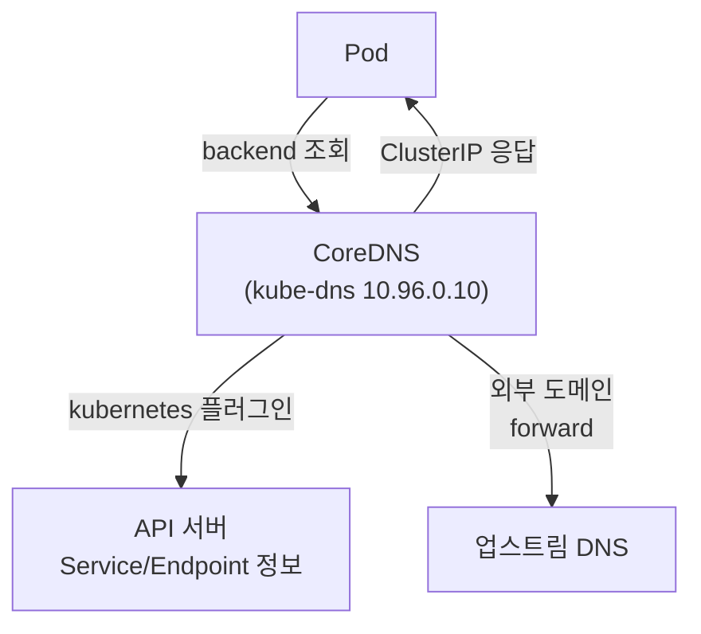
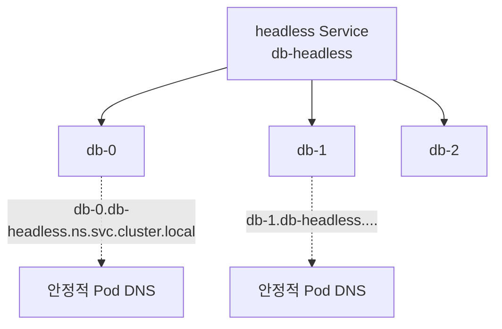
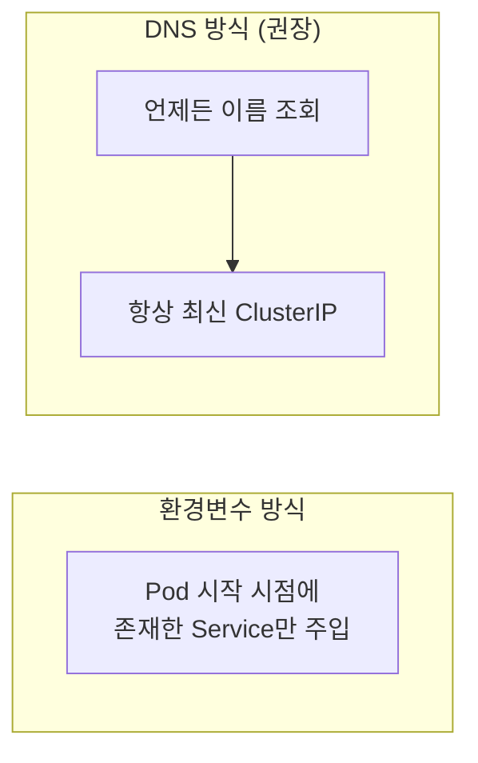

# DNS와 서비스 디스커버리

::: info 학습 목표
- CoreDNS가 클러스터 DNS로서 어떤 역할을 하는지 이해한다.
- Service와 Pod의 DNS 레코드 명명 규칙을 정확히 안다.
- dnsPolicy와 search 도메인이 짧은 이름 조회를 어떻게 가능하게 하는지 파악한다.
- 서비스 디스커버리 패턴(환경변수 vs DNS, headless)을 비교한다.
:::

## 1. CoreDNS의 역할

쿠버네티스에서 Service를 IP 대신 이름으로 부를 수 있는 것은 클러스터 내부 DNS 덕분이다. 현재 기본 구현은 <strong>CoreDNS</strong>로, `kube-system` 네임스페이스에 Deployment로 떠 있고 `kube-dns`라는 Service로 노출된다. 모든 Pod는 이 DNS 서버를 가리키도록 자동 설정된다.

CoreDNS는 API 서버를 감시하며 Service·엔드포인트 정보를 받아, 그에 대응하는 DNS 레코드를 동적으로 제공한다. Pod가 `backend`를 조회하면 CoreDNS가 해당 Service의 ClusterIP를 응답한다.

```bash
# CoreDNS 확인
kubectl get pods -n kube-system -l k8s-app=kube-dns
kubectl get svc -n kube-system kube-dns
# NAME       TYPE        CLUSTER-IP   PORT(S)
# kube-dns   ClusterIP   10.96.0.10   53/UDP,53/TCP

# Pod의 resolv.conf는 이 DNS를 가리킨다
kubectl exec -it some-pod -- cat /etc/resolv.conf
```

CoreDNS의 동작은 `Corefile`이라는 설정(ConfigMap)으로 정의된다. `kubernetes` 플러그인이 클러스터 도메인을 처리하고, 그 외 외부 도메인은 업스트림 DNS로 포워딩한다.



전체 동작은 [DNS for Services and Pods 문서](https://kubernetes.io/docs/concepts/services-networking/dns-pod-service/)에 정리돼 있다.

## 2. Service의 DNS 레코드 규칙

Service의 DNS 이름은 정해진 규칙을 따른다. 표준 형식은 다음과 같다.

```
<service-name>.<namespace>.svc.<cluster-domain>
```

기본 클러스터 도메인은 `cluster.local`이므로, `default` 네임스페이스의 `backend` Service는 다음 FQDN을 가진다.

```
backend.default.svc.cluster.local
```

핵심은 이름이 <strong>네임스페이스를 포함</strong>한다는 점이다. 같은 네임스페이스 안에서는 짧게 `backend`만 써도 되지만, 다른 네임스페이스의 Service를 부르려면 네임스페이스를 명시해야 한다.

```bash
# 같은 네임스페이스: 짧은 이름
curl http://backend:8080

# 다른 네임스페이스(payment)의 Service
curl http://gateway.payment:8080
curl http://gateway.payment.svc.cluster.local:8080   # FQDN
```

| 대상 | DNS 이름 | 반환 |
|------|----------|------|
| 일반 Service | `svc.ns.svc.cluster.local` | A 레코드 = ClusterIP |
| headless Service | `svc.ns.svc.cluster.local` | A 레코드 = 각 Pod IP들 |
| 명명된 포트 | `_http._tcp.svc.ns.svc.cluster.local` | SRV 레코드 |

## 3. Pod의 DNS 레코드

Pod에도 DNS 레코드를 만들 수 있다. 일반 Pod의 기본 A 레코드 형식은 IP의 점을 대시로 바꾼 형태다.

```
<pod-ip-dashes>.<namespace>.pod.cluster.local
# 예: 10.244.1.7 → 10-244-1-7.default.pod.cluster.local
```

이 형태는 잘 쓰이지 않는다. 실무에서 의미 있는 것은 <strong>headless Service에 속한 Pod</strong>의 안정적인 이름이다. StatefulSet과 headless Service를 함께 쓰면 각 Pod가 다음 이름을 가진다.

```
<pod-hostname>.<headless-svc>.<namespace>.svc.cluster.local
# 예: db-0.db-headless.default.svc.cluster.local
```



이 안정적인 이름 덕분에 데이터베이스 클러스터 같은 스테이트풀 워크로드에서 각 멤버를 고정된 주소로 지칭할 수 있다.

## 4. dnsPolicy와 search 도메인

`backend`처럼 짧은 이름이 어떻게 FQDN으로 해석되는지는 Pod의 `/etc/resolv.conf`에 있는 <strong>search 도메인</strong> 덕분이다.

```bash
kubectl exec -it some-pod -- cat /etc/resolv.conf
# nameserver 10.96.0.10
# search default.svc.cluster.local svc.cluster.local cluster.local
# options ndots:5
```

`backend`를 조회하면 리졸버가 search 도메인을 순서대로 붙여 `backend.default.svc.cluster.local`을 먼저 시도하고, 거기서 응답을 받는다. `ndots:5`는 점이 5개 미만인 이름은 우선 search 도메인을 붙여 시도하라는 의미다.

Pod의 DNS 동작은 <strong>dnsPolicy</strong>로 제어한다.

| dnsPolicy | 동작 |
|-----------|------|
| ClusterFirst | (기본) 클러스터 DNS를 먼저, 외부는 업스트림으로 포워딩 |
| Default | 노드의 resolv.conf를 그대로 상속(클러스터 DNS 미사용) |
| ClusterFirstWithHostNet | hostNetwork Pod에서 클러스터 DNS를 쓰려면 이걸로 |
| None | 모든 DNS 설정을 dnsConfig로 직접 지정 |

`None`을 쓰면 search·nameserver·options를 완전히 커스터마이즈할 수 있다.

```yaml
spec:
  dnsPolicy: "None"
  dnsConfig:
    nameservers:
    - 10.96.0.10
    searches:
    - custom.svc.cluster.local
    options:
    - name: ndots
      value: "2"
```

::: warning ndots:5와 외부 도메인 조회
`ndots:5` 때문에 `api.github.com`(점 2개)처럼 외부 도메인을 조회하면, 리졸버가 search 도메인을 먼저 붙여 여러 번 헛조회한 뒤에야 본래 이름을 시도한다. 외부 호출이 많은 워크로드에서 DNS 지연이 의심되면 FQDN(끝에 점, `api.github.com.`)을 쓰거나 ndots를 낮추는 것을 고려한다.
:::

## 5. 서비스 디스커버리 패턴

쿠버네티스에서 다른 서비스를 찾는 방법은 크게 두 가지다.

<strong>환경변수 방식.</strong> Pod가 생성될 때, 이미 존재하는 Service들의 정보가 환경변수로 주입된다(예: `BACKEND_SERVICE_HOST`, `BACKEND_SERVICE_PORT`). 단, <strong>Pod 생성 시점에 이미 있던 Service만</strong> 반영된다는 결정적 한계가 있다. 나중에 만들어진 Service는 보이지 않는다.

```bash
kubectl exec -it some-pod -- env | grep SERVICE
# BACKEND_SERVICE_HOST=10.96.0.42
# BACKEND_SERVICE_PORT=8080
```

<strong>DNS 방식.</strong> 위에서 본 것처럼 이름으로 조회한다. 생성 순서와 무관하게 항상 최신 상태를 반영하므로 <strong>권장되는 표준 방식</strong>이다.



일반 Service는 DNS가 ClusterIP를 주고 그 뒤를 kube-proxy가 로드밸런싱한다. 반면 headless Service는 DNS가 개별 Pod IP들을 직접 주므로, 클라이언트가 직접 멤버를 고르거나 모든 멤버에 연결하는 패턴(예: 분산 캐시, DB 클러스터)에 적합하다.

::: tip 핵심 정리
- CoreDNS는 클러스터 기본 DNS로, API 서버를 감시해 Service·Pod 레코드를 동적으로 제공한다.
- Service의 표준 DNS 이름은 svc.namespace.svc.cluster.local이며, 다른 네임스페이스는 이름에 명시해야 한다.
- headless Service + StatefulSet은 db-0.svc.ns.svc.cluster.local 같은 안정적인 Pod별 이름을 제공한다.
- search 도메인과 ndots 덕분에 짧은 이름이 FQDN으로 해석되며, dnsPolicy로 DNS 동작을 제어한다.
- 서비스 디스커버리는 생성 순서 한계가 있는 환경변수보다 항상 최신을 반영하는 DNS 방식이 표준이다.
:::

## 다음 챕터

지금까지 Pod끼리 어떻게 찾고 통신하는지를 다뤘다. 그런데 모든 Pod가 서로 자유롭게 통신할 수 있다는 기본 상태는 보안상 위험하다. 다음 챕터 [NetworkPolicy](/study/kubernetes/29-network-policy)에서는 트래픽을 명시적으로 허용·차단하는 방화벽 규칙을 깊게 다룬다.
