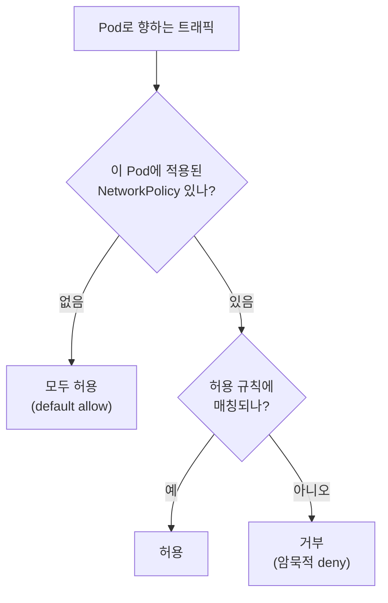
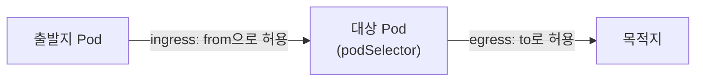
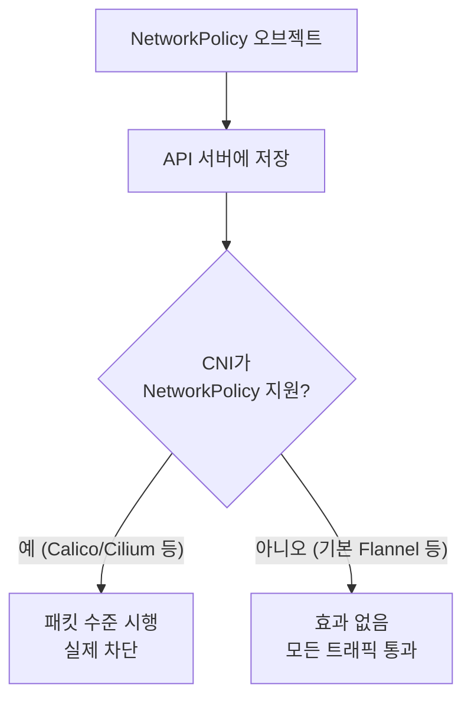

# NetworkPolicy

::: info 학습 목표
- 기본 상태가 "모두 허용"인 이유와 NetworkPolicy로 "거부"로 전환하는 원리를 이해한다.
- ingress와 egress 규칙의 방향과 의미를 정확히 안다.
- podSelector·namespaceSelector·ipBlock으로 대상을 어떻게 지정하는지 익힌다.
- NetworkPolicy가 CNI에 의존한다는 점과 그 의미를 파악한다.
:::

## 1. NetworkPolicy 개념 — default allow에서 deny로

쿠버네티스의 기본 상태에서는 <strong>모든 Pod가 모든 Pod와 자유롭게 통신</strong>할 수 있다(default allow). 즉 격리가 없다. 이는 편리하지만, 침해된 Pod 하나가 클러스터 전체를 자유롭게 탐색할 수 있다는 보안 위험을 뜻한다.

<strong>NetworkPolicy</strong>는 Pod 수준의 방화벽 규칙이다. 핵심 동작 원리는 다음과 같다.

- 어떤 Pod에 NetworkPolicy가 <strong>하나라도 적용되면</strong>, 그 Pod는 해당 방향(ingress/egress)에 대해 <strong>기본 거부(deny)</strong> 상태가 된다.
- 그 뒤로는 정책에서 <strong>명시적으로 허용한 트래픽만</strong> 통과한다.
- 정책은 <strong>화이트리스트</strong> 방식이다. "거부" 규칙은 없고, 허용 규칙의 합집합만 존재한다.



전체 개념은 [Network Policies 문서](https://kubernetes.io/docs/concepts/services-networking/network-policies/)에 정리돼 있다.

## 2. default deny — 격리의 시작

좋은 보안 출발점은 네임스페이스 전체에 <strong>모든 인그레스를 기본 거부</strong>하는 정책을 깔고, 필요한 통신만 추가로 허용하는 것이다. 다음 정책은 `default` 네임스페이스의 모든 Pod에 대해 들어오는 트래픽을 전부 막는다.

```yaml
apiVersion: networking.k8s.io/v1
kind: NetworkPolicy
metadata:
  name: default-deny-ingress
  namespace: default
spec:
  podSelector: {}        # 빈 셀렉터 = 네임스페이스의 모든 Pod
  policyTypes:
  - Ingress
  # ingress 규칙이 없으므로 모든 인그레스 거부
```

`podSelector: {}`는 네임스페이스의 모든 Pod를 대상으로 하고, `Ingress`를 `policyTypes`에 넣었지만 허용 규칙(`ingress:`)을 비워 두었으므로 결과적으로 모든 인그레스를 차단한다. egress까지 막으려면 `policyTypes`에 `Egress`를 추가한다.

```yaml
spec:
  podSelector: {}
  policyTypes:
  - Ingress
  - Egress
# 양방향 모두 기본 거부
```

::: warning egress 차단 시 DNS도 막힌다
egress를 전부 막으면 Pod가 CoreDNS(53/UDP, 53/TCP)에도 접근하지 못해 이름 조회가 깨진다. egress 정책을 도입할 때는 거의 항상 kube-system의 DNS로 가는 트래픽을 명시적으로 허용해야 한다.
:::

## 3. ingress와 egress 규칙

NetworkPolicy 규칙은 방향이 분명하다.

- <strong>ingress</strong>: 대상 Pod로 <strong>들어오는</strong> 트래픽. `from`으로 출발지를 지정한다.
- <strong>egress</strong>: 대상 Pod에서 <strong>나가는</strong> 트래픽. `to`로 목적지를 지정한다.



다음은 `app=web`인 Pod로, `app=frontend`인 Pod에서 오는 8080 트래픽만 허용하는 정책이다.

```yaml
apiVersion: networking.k8s.io/v1
kind: NetworkPolicy
metadata:
  name: web-allow-frontend
  namespace: default
spec:
  podSelector:
    matchLabels:
      app: web              # 이 정책이 적용되는 대상 Pod
  policyTypes:
  - Ingress
  ingress:
  - from:
    - podSelector:
        matchLabels:
          app: frontend     # frontend Pod에서 오는 것만
    ports:
    - protocol: TCP
      port: 8080
```

이 정책이 web Pod에 적용되는 순간, frontend가 아닌 다른 Pod에서 오는 트래픽은 모두 거부된다.

## 4. 셀렉터 — podSelector, namespaceSelector, ipBlock

`from`/`to`에서 출발지·목적지를 지정하는 방법은 세 가지다.

<strong>podSelector.</strong> 같은 네임스페이스 안에서 레이블로 Pod를 고른다.

```yaml
  ingress:
  - from:
    - podSelector:
        matchLabels:
          role: api
```

<strong>namespaceSelector.</strong> 레이블이 맞는 네임스페이스 전체를 고른다. 다른 네임스페이스에서 오는 트래픽을 허용할 때 쓴다.

```yaml
  ingress:
  - from:
    - namespaceSelector:
        matchLabels:
          team: payment
```

<strong>ipBlock.</strong> CIDR로 IP 대역을 고른다. 클러스터 외부 주소를 허용·차단할 때 쓴다. `except`로 일부를 빼낼 수 있다.

```yaml
  egress:
  - to:
    - ipBlock:
        cidr: 10.0.0.0/8
        except:
        - 10.0.5.0/24      # 이 대역만 제외
```

::: warning podSelector와 namespaceSelector의 AND vs OR
한 `from` 항목 안에서 podSelector와 namespaceSelector를 <strong>같은 리스트 요소</strong>에 함께 쓰면 AND(둘 다 만족)이고, <strong>별도 리스트 요소</strong>로 나누면 OR이다. 들여쓰기 한 칸 차이로 의미가 정반대가 되므로 매우 주의한다.
:::

```yaml
  # AND: payment 네임스페이스의 role=api Pod
  ingress:
  - from:
    - namespaceSelector:
        matchLabels:
          team: payment
      podSelector:               # 같은 요소(- 없음) → AND
        matchLabels:
          role: api

  # OR: payment 네임스페이스의 모든 Pod 또는 role=api Pod
  ingress:
  - from:
    - namespaceSelector:
        matchLabels:
          team: payment
    - podSelector:               # 별도 요소(- 있음) → OR
        matchLabels:
          role: api
```

## 5. CNI 지원 요건과 종합 예제

여기서 반드시 알아야 할 점은, <strong>NetworkPolicy는 CNI 플러그인이 실제로 시행(enforce)해야만 동작</strong>한다는 것이다. 쿠버네티스 API는 NetworkPolicy 오브젝트를 받아 저장하지만, 그것을 패킷 수준에서 막는 일은 CNI가 한다. NetworkPolicy를 지원하지 않는 CNI(예: 기본 Flannel)에서는 정책을 만들어도 <strong>아무 효과 없이 모든 트래픽이 통과</strong>한다.



따라서 NetworkPolicy를 쓰려면 Calico, Cilium처럼 정책을 지원하는 CNI를 깔아야 한다(24장 참고).

다음은 3티어 앱의 종합 예제다. db Pod로는 오직 backend Pod의 5432만 들어오게 하고, db가 나가는 트래픽은 DNS만 허용한다.

```yaml
apiVersion: networking.k8s.io/v1
kind: NetworkPolicy
metadata:
  name: db-policy
  namespace: default
spec:
  podSelector:
    matchLabels:
      app: db
  policyTypes:
  - Ingress
  - Egress
  ingress:
  - from:
    - podSelector:
        matchLabels:
          app: backend
    ports:
    - protocol: TCP
      port: 5432
  egress:
  - to:
    - namespaceSelector:
        matchLabels:
          kubernetes.io/metadata.name: kube-system
    ports:
    - protocol: UDP
      port: 53
    - protocol: TCP
      port: 53
```

```bash
# 정책 확인
kubectl get networkpolicy -n default
kubectl describe networkpolicy db-policy -n default

# 차단 검증 (frontend에서 db로의 접근은 거부돼야 한다)
kubectl exec -it frontend-pod -- nc -zv db 5432   # 실패해야 정상
```

::: tip 핵심 정리
- 기본 상태는 모두 허용이며, NetworkPolicy가 하나라도 적용된 Pod는 해당 방향에 대해 기본 거부로 바뀐다.
- NetworkPolicy는 화이트리스트(허용만 존재)이며, 보통 default deny를 깔고 필요한 통신만 추가한다.
- ingress는 from으로 들어오는 트래픽을, egress는 to로 나가는 트래픽을 제어하며 egress 차단 시 DNS를 별도 허용해야 한다.
- podSelector/namespaceSelector/ipBlock으로 대상을 고르며, 같은 요소냐 별도 요소냐에 따라 AND/OR이 갈린다.
- NetworkPolicy는 CNI가 시행해야 동작하므로 Calico·Cilium처럼 정책을 지원하는 CNI가 필요하다.
:::

## 다음 챕터

지금까지 네트워킹 전반을 다뤘다. 이제 데이터를 영속적으로 저장하는 스토리지로 넘어간다. 다음 챕터 [Volume과 PV/PVC](/study/kubernetes/30-volume-pv-pvc)에서는 일시적인 Pod 너머에서 데이터를 유지하는 볼륨 추상화를 깊게 다룬다.
