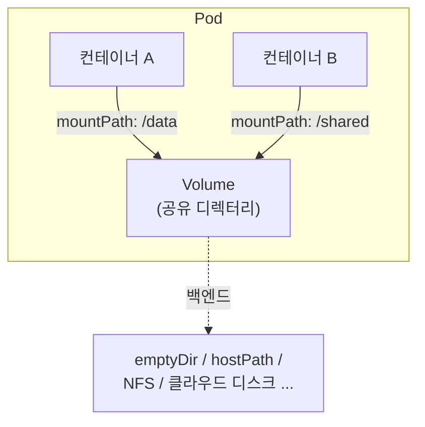
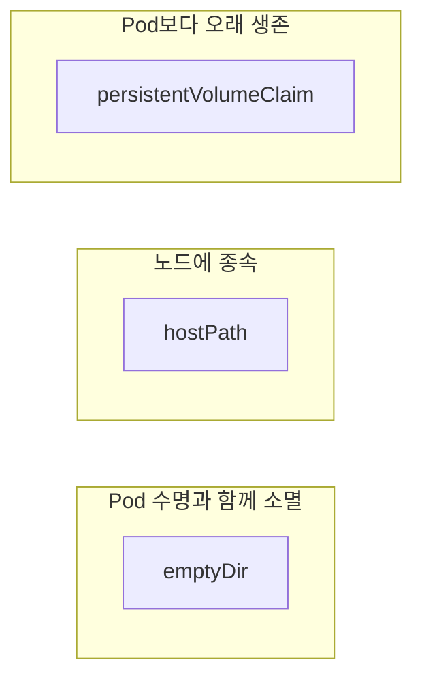
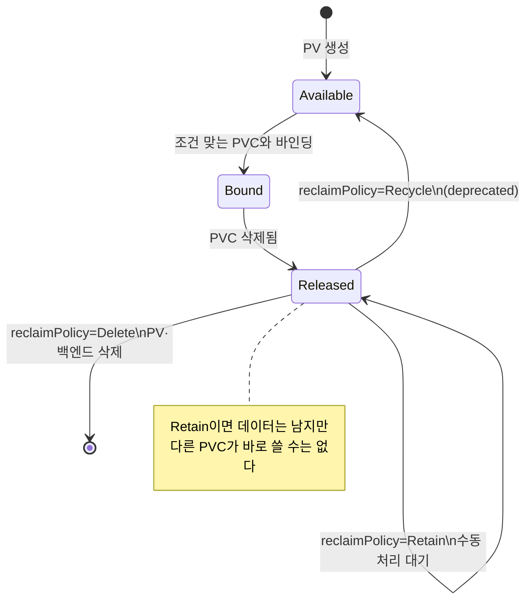

# Volume과 PV/PVC

::: info 학습 목표
- 컨테이너 파일시스템의 휘발성 문제와 Volume이 그것을 어떻게 해결하는지 이해한다.
- emptyDir·hostPath·configMap 등 Volume의 종류와 각각의 수명·용도를 구분한다.
- 스토리지의 프로비저닝(PV)과 소비(PVC)를 분리하는 추상화와 바인딩·라이프사이클을 익힌다.
- StorageClass, reclaimPolicy, accessModes의 의미와 선택 기준을 다룬다.
:::

## 1. 왜 Volume이 필요한가

컨테이너의 파일시스템은 기본적으로 휘발성이다. 컨테이너가 재시작되면 이미지 레이어 위에 쌓인 쓰기 레이어가 사라지고, 컨테이너가 작성한 데이터는 초기 상태로 돌아간다. 데이터베이스라면 모든 레코드가 날아가는 셈이다.

쿠버네티스의 <strong>Volume</strong>은 이 문제를 푸는 추상화다. Volume은 Pod에 속한 디렉터리로, Pod 안의 컨테이너들이 공유하며 접근할 수 있다. 핵심은 Volume의 수명이 컨테이너보다 길다는 점이다 — 컨테이너가 죽었다 살아나도 Volume의 데이터는 유지된다.



Volume은 두 가지 일을 한다. 하나는 컨테이너 재시작에도 데이터를 보존하는 것이고, 다른 하나는 한 Pod 안의 여러 컨테이너가 같은 파일을 공유하게 하는 것이다(예: 사이드카 패턴). 전체 개념은 [Storage 개요 문서](https://kubernetes.io/docs/concepts/storage/)와 [Volumes 문서](https://kubernetes.io/docs/concepts/storage/volumes/)에 정리돼 있다.

다만 Volume의 수명이 컨테이너보다는 길어도, 종류에 따라 <strong>Pod의 수명</strong>과 함께 사라지는 것과, Pod가 사라져도 살아남는 것이 갈린다. 이 차이가 다음 절의 핵심이다.

## 2. Volume의 종류

Volume에는 백엔드에 따라 여러 종류가 있다. 자주 쓰는 것들을 수명 관점에서 묶어보면 다음과 같다.

<strong>emptyDir</strong> — Pod가 노드에 스케줄될 때 빈 디렉터리로 생성되고, Pod가 노드에서 제거되면 영구히 삭제된다. 즉 수명이 Pod와 같다. 컨테이너 간 임시 공유, 캐시, 스크래치 공간에 쓴다. `medium: Memory`로 두면 디스크 대신 tmpfs(RAM)에 올린다.

```yaml
apiVersion: v1
kind: Pod
metadata:
  name: shared-cache
spec:
  containers:
  - name: writer
    image: busybox
    command: ["sh", "-c", "while true; do date >> /cache/log; sleep 5; done"]
    volumeMounts:
    - name: scratch
      mountPath: /cache
  - name: reader
    image: busybox
    command: ["sh", "-c", "tail -f /cache/log"]
    volumeMounts:
    - name: scratch
      mountPath: /cache
  volumes:
  - name: scratch
    emptyDir: {}
```

<strong>hostPath</strong> — 노드의 파일시스템에 있는 경로를 Pod에 마운트한다. 노드에 묶이므로 Pod가 다른 노드로 옮겨가면 데이터를 잃고, 노드 파일시스템에 직접 접근하므로 보안상 위험하다. DaemonSet에서 노드의 로그·소켓에 접근하는 등 한정된 용도에만 쓴다.

```yaml
  volumes:
  - name: node-logs
    hostPath:
      path: /var/log
      type: Directory
```

<strong>configMap·secret</strong> — 앞 챕터에서 다뤘듯 설정·비밀 데이터를 파일로 마운트하는 특수 Volume이다. 데이터의 출처가 API 오브젝트라는 점만 다를 뿐 마운트 방식은 동일하다.

<strong>persistentVolumeClaim</strong> — 아래에서 자세히 다룰, 영속 스토리지를 요청하는 Volume이다. 실무에서 데이터를 진짜로 오래 보존하려면 거의 항상 이것을 쓴다.



::: warning hostPath 주의
hostPath는 노드의 임의 경로를 Pod에 노출하므로, 권한을 잘못 주면 컨테이너가 노드 전체를 침해할 수 있다. 멀티 테넌트 클러스터에서는 정책으로 막는 것이 일반적이다. 영속 데이터가 필요하면 hostPath 대신 PV/PVC를 쓴다.
:::

## 3. PersistentVolume과 PersistentVolumeClaim

위의 Volume 정의는 백엔드 세부사항(NFS 주소, 디스크 ID 등)을 Pod 스펙에 직접 박아야 한다는 문제가 있다. 애플리케이션 개발자가 인프라 스토리지의 내부를 알아야 하는 셈이다.

쿠버네티스는 이를 두 오브젝트로 분리한다.

- <strong>PersistentVolume(PV)</strong> — 클러스터에 존재하는 실제 스토리지 조각. 관리자가 미리 만들거나(정적 프로비저닝) StorageClass가 동적으로 만든다. Pod와 독립적인, 클러스터 수준의 리소스다.
- <strong>PersistentVolumeClaim(PVC)</strong> — 사용자가 "이만큼의 스토리지를, 이런 접근 방식으로 달라"고 내는 요청. 네임스페이스에 속한다.

개발자는 PVC만 작성하고, 쿠버네티스가 조건에 맞는 PV를 찾아 묶어준다. 스토리지의 <strong>제공</strong>과 <strong>소비</strong>가 분리되는 것이다. 이는 Pod가 CPU·메모리를 요청하면 노드가 제공하는 관계와 같은 구조다.

```yaml
apiVersion: v1
kind: PersistentVolume
metadata:
  name: pv-manual
spec:
  capacity:
    storage: 5Gi
  accessModes:
  - ReadWriteOnce
  persistentVolumeReclaimPolicy: Retain
  storageClassName: manual
  nfs:
    server: 10.0.0.10
    path: /exports/data
---
apiVersion: v1
kind: PersistentVolumeClaim
metadata:
  name: data-claim
spec:
  accessModes:
  - ReadWriteOnce
  resources:
    requests:
      storage: 3Gi
  storageClassName: manual
```

Pod에서는 PVC 이름만 참조한다. 백엔드가 NFS인지 클라우드 디스크인지는 Pod 스펙에 드러나지 않는다.

```yaml
apiVersion: v1
kind: Pod
metadata:
  name: app
spec:
  containers:
  - name: app
    image: myapp:1.0
    volumeMounts:
    - name: data
      mountPath: /var/lib/data
  volumes:
  - name: data
    persistentVolumeClaim:
      claimName: data-claim
```

자세한 정의는 [Persistent Volumes 문서](https://kubernetes.io/docs/concepts/storage/persistent-volumes/)를 참고한다.

## 4. 바인딩과 라이프사이클

PVC를 만들면 컨트롤 플레인은 조건(용량, accessModes, storageClassName 등)에 맞는 PV를 찾아 <strong>바인딩(Bound)</strong>한다. 바인딩은 1:1 관계다 — 하나의 PV는 하나의 PVC에만 묶인다. 적합한 PV가 없고 동적 프로비저닝도 안 되면 PVC는 <strong>Pending</strong> 상태로 기다린다.

PV는 다음 상태를 거친다.

- <strong>Available</strong>: 아직 어떤 PVC에도 묶이지 않은 빈 PV
- <strong>Bound</strong>: PVC와 묶여 사용 중
- <strong>Released</strong>: 묶였던 PVC가 삭제됐지만 아직 회수(reclaim)되지 않음
- <strong>Failed</strong>: 자동 회수에 실패



PVC가 삭제되면 PV는 Released가 되는데, 이때 PV에 남은 데이터를 어떻게 처리할지는 다음 절의 reclaimPolicy가 결정한다. 중요한 점은 PVC를 쓰는 Pod가 살아 있는 동안에는 PVC를 삭제해도 [Storage Object in Use Protection](https://kubernetes.io/docs/concepts/storage/persistent-volumes/#storage-object-in-use-protection) 덕분에 즉시 사라지지 않고, Pod가 그것을 놓을 때까지 삭제가 보류된다는 것이다. 데이터 유실 사고를 막는 안전장치다.

## 5. StorageClass와 reclaimPolicy

PV를 사람이 일일이 만들어두는 정적 방식은 규모가 커지면 감당이 안 된다. <strong>StorageClass</strong>는 "어떤 종류의 스토리지를 어떻게 만들지"를 템플릿으로 정의해, PVC가 들어오면 그에 맞는 PV를 <strong>동적으로</strong> 생성하게 한다(동적 프로비저닝은 다음 챕터에서 자세히 다룬다).

```yaml
apiVersion: storage.k8s.io/v1
kind: StorageClass
metadata:
  name: fast-ssd
provisioner: ebs.csi.aws.com
parameters:
  type: gp3
reclaimPolicy: Delete
allowVolumeExpansion: true
volumeBindingMode: WaitForFirstConsumer
```

PVC에 `storageClassName: fast-ssd`만 지정하면 PV가 자동으로 만들어진다. StorageClass를 생략하면 클러스터의 <strong>default StorageClass</strong>가 쓰인다.

`volumeBindingMode: WaitForFirstConsumer`는 PVC가 생기자마자 바인딩하지 않고, 그 PVC를 쓰는 Pod가 스케줄될 때까지 기다렸다가 그 Pod가 갈 노드의 토폴로지(zone 등)에 맞는 PV를 만든다. 디스크가 Pod와 다른 zone에 만들어지는 사고를 막는다.

<strong>reclaimPolicy</strong>는 PVC가 삭제된 뒤 PV(와 그 뒤의 실제 스토리지)를 어떻게 할지 결정한다.

| reclaimPolicy | 동작 |
|---------------|------|
| Delete | PV와 백엔드 스토리지를 함께 삭제. 동적 프로비저닝의 기본값 |
| Retain | PV·데이터를 보존. 관리자가 수동으로 정리·재사용. 중요 데이터에 권장 |
| Recycle | (deprecated) 데이터를 지우고 재사용. 동적 프로비저닝으로 대체됨 |

운영 데이터베이스라면 실수로 PVC를 지워도 데이터가 살아남도록 `Retain`을 쓰는 편이 안전하다. 일회성·캐시 성격이면 `Delete`로 비용을 아낀다. StorageClass 상세는 [StorageClass 문서](https://kubernetes.io/docs/concepts/storage/storage-classes/)를 참고한다.

## 6. accessModes와 용량

PVC와 PV의 매칭에서 용량 못지않게 중요한 게 <strong>accessModes</strong>다. 어떤 방식으로 여러 노드가 동시에 마운트할 수 있는지를 나타낸다.

| accessMode | 약어 | 의미 |
|------------|------|------|
| ReadWriteOnce | RWO | 단일 노드에서 읽기·쓰기 마운트 (그 노드의 여러 Pod는 가능) |
| ReadOnlyMany | ROX | 여러 노드에서 읽기 전용 마운트 |
| ReadWriteMany | RWX | 여러 노드에서 읽기·쓰기 마운트 |
| ReadWriteOncePod | RWOP | 단일 Pod만 읽기·쓰기 마운트 (가장 엄격) |

주의할 점은 accessMode가 백엔드가 실제로 지원하는 능력을 바꿔주지는 않는다는 것이다. 클라우드 블록 디스크(EBS 등)는 본질적으로 RWO만 되고, RWX는 NFS·CephFS 같은 공유 파일시스템이라야 가능하다. PVC에 RWX를 적었어도 백엔드가 못 하면 마운트가 실패한다.

```yaml
apiVersion: v1
kind: PersistentVolumeClaim
metadata:
  name: shared-data
spec:
  accessModes:
  - ReadWriteMany       # NFS 등 공유 FS라야 가능
  resources:
    requests:
      storage: 20Gi
  storageClassName: nfs-sc
```

용량은 `resources.requests.storage`로 요청하며, 바인딩되는 PV는 그 요청 이상의 capacity를 가져야 한다. accessModes의 정확한 의미와 백엔드별 지원 여부는 [Access Modes 문서](https://kubernetes.io/docs/concepts/storage/persistent-volumes/#access-modes)에 정리돼 있다.

::: tip 핵심 정리
- 컨테이너 파일시스템은 휘발성이며, Volume은 컨테이너보다 긴 수명으로 데이터 보존과 컨테이너 간 공유를 제공한다.
- emptyDir은 Pod와 수명을 같이하고, hostPath는 노드에 종속되며, 영속 데이터는 PVC를 쓴다.
- PV는 실제 스토리지(클러스터 리소스), PVC는 그에 대한 요청(네임스페이스 리소스)으로, 스토리지의 제공과 소비를 분리한다.
- 바인딩은 1:1이며 PV는 Available→Bound→Released 상태를 거치고, Released 후 처리는 reclaimPolicy가 결정한다.
- StorageClass는 동적 프로비저닝의 템플릿이고, accessModes(RWO/ROX/RWX/RWOP)는 백엔드가 실제 지원해야만 유효하다.
:::

## 다음 챕터

지금까지 스토리지를 정적으로 정의하고 소비하는 추상화를 봤다. 하지만 실무에서 PV를 사람이 미리 만들어두는 일은 드물고, 대부분 PVC를 내면 디스크가 자동으로 만들어진다. 다음 챕터 [CSI와 동적 프로비저닝](/study/kubernetes/31-csi-snapshot)에서는 그 자동화를 담당하는 CSI 아키텍처와 동적 프로비저닝, 스냅샷, 볼륨 확장을 다룬다.
