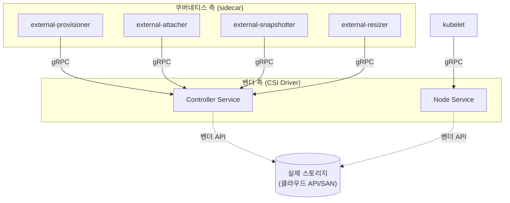
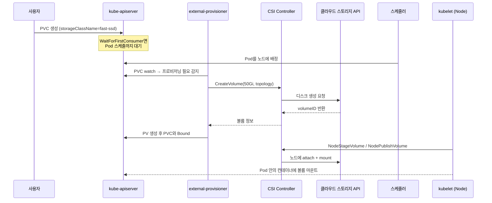
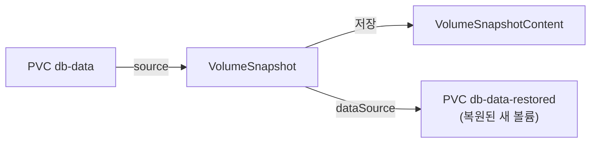
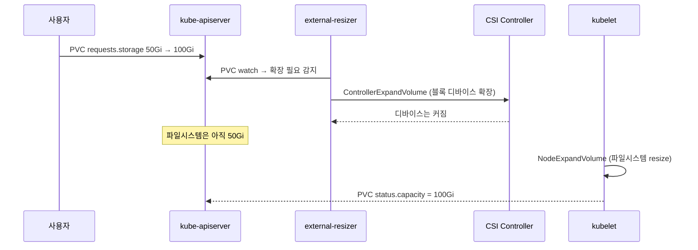

# CSI와 동적 프로비저닝

::: info 학습 목표
- CSI가 왜 등장했는지, 그리고 그 아키텍처가 어떤 컴포넌트로 구성되는지 이해한다.
- PVC 하나로 PV·실제 디스크가 자동 생성되는 동적 프로비저닝의 단계별 흐름을 익힌다.
- VolumeSnapshot으로 스냅샷을 만들고 그것으로부터 새 볼륨을 복원하는 방법을 다룬다.
- 운영 중인 볼륨을 무중단으로 확장(expansion)하는 조건과 절차를 안다.
:::

## 1. CSI는 왜 등장했나

초기 쿠버네티스는 스토리지 벤더 코드를 자기 본체(in-tree)에 직접 담았다. AWS EBS, GCE PD, Cinder 같은 드라이버가 쿠버네티스 소스 안에 들어 있었다. 이 방식은 문제가 많았다. 새 스토리지를 지원하려면 쿠버네티스 자체를 고쳐 릴리스해야 했고, 벤더 코드의 버그가 핵심 컴포넌트(kubelet, controller-manager)를 위협했다.

<strong>CSI(Container Storage Interface)</strong>는 이 결합을 끊는 표준 인터페이스다. 스토리지 제공자가 쿠버네티스 밖에서 독립적으로 드라이버를 개발·배포할 수 있게 하고, 쿠버네티스는 표준 gRPC 인터페이스로 그 드라이버와 통신한다. 같은 인터페이스를 Kubernetes 외 다른 오케스트레이터(Nomad 등)도 쓸 수 있어, 한 번 만든 드라이버를 여러 플랫폼에서 재사용한다.

CSI 드라이버는 보통 세 종류의 gRPC 서비스를 구현한다.

- <strong>Identity</strong>: 드라이버 이름·능력 보고
- <strong>Controller</strong>: 볼륨 생성·삭제·스냅샷 등 클러스터 수준 작업
- <strong>Node</strong>: 노드에서 볼륨을 stage/publish(실제 마운트)하는 작업



위에서 `external-provisioner`, `external-attacher` 같은 <strong>사이드카</strong>들은 쿠버네티스 SIG가 제공하는 공용 컴포넌트로, 쿠버네티스 API 오브젝트(PVC, VolumeAttachment 등)를 감시하다가 적절한 시점에 벤더의 CSI 드라이버 gRPC를 호출한다. 벤더는 Controller·Node 서비스만 구현하면 된다. 전체 개요는 [CSI 개념 문서](https://kubernetes.io/docs/concepts/storage/volumes/#csi)에 있다.

## 2. 동적 프로비저닝의 흐름

앞 챕터에서 본 정적 프로비저닝은 관리자가 PV를 미리 만들어둬야 했다. <strong>동적 프로비저닝</strong>은 PVC가 들어오면 StorageClass의 지시에 따라 PV와 실제 디스크가 그 자리에서 자동 생성된다. 사용자는 PVC 한 장만 내면 된다.

```yaml
apiVersion: v1
kind: PersistentVolumeClaim
metadata:
  name: db-data
spec:
  accessModes:
  - ReadWriteOnce
  storageClassName: fast-ssd
  resources:
    requests:
      storage: 50Gi
```

이 PVC가 만들어진 뒤 실제로 무슨 일이 일어나는지를 단계별로 보면 다음과 같다.



핵심은 두 단계로 나뉜다는 점이다. <strong>provision(생성·바인딩)</strong>은 클러스터 수준에서 디스크를 만들고 PV를 묶는 일이고, <strong>attach/mount</strong>는 그 디스크를 Pod가 배정된 노드에 실제로 붙이고 마운트하는 일이다. `volumeBindingMode: WaitForFirstConsumer`를 쓰면 provision이 Pod 스케줄 이후로 미뤄져, 디스크가 Pod와 같은 zone에 생성되도록 보장한다. 동적 프로비저닝 상세는 [Dynamic Provisioning 문서](https://kubernetes.io/docs/concepts/storage/dynamic-provisioning/)를 참고한다.

## 3. VolumeSnapshot — 스냅샷 뜨기

운영 중인 볼륨의 특정 시점 상태를 보존하고 싶을 때 <strong>VolumeSnapshot</strong>을 쓴다. 백업, 배포 전 안전점 확보, 데이터 복제(예: 운영 DB를 떠서 스테이징에 붙이기) 같은 데 활용한다. 스냅샷도 CSI 드라이버가 그 기능을 지원해야 동작하며, 클러스터에 external-snapshotter 사이드카와 관련 CRD가 설치돼 있어야 한다.

스냅샷에는 세 오브젝트가 관여한다. PVC/PV 구조와 닮은꼴이다.

- <strong>VolumeSnapshotClass</strong>: 스냅샷을 어떤 드라이버로 어떻게 만들지 (StorageClass에 대응)
- <strong>VolumeSnapshot</strong>: 사용자가 내는 스냅샷 요청 (PVC에 대응, 네임스페이스 리소스)
- <strong>VolumeSnapshotContent</strong>: 실제로 저장된 스냅샷 (PV에 대응, 클러스터 리소스)

```yaml
apiVersion: snapshot.storage.k8s.io/v1
kind: VolumeSnapshotClass
metadata:
  name: csi-snapclass
driver: ebs.csi.aws.com
deletionPolicy: Retain
---
apiVersion: snapshot.storage.k8s.io/v1
kind: VolumeSnapshot
metadata:
  name: db-snap-2026-06-15
spec:
  volumeSnapshotClassName: csi-snapclass
  source:
    persistentVolumeClaimName: db-data
```

`status.readyToUse: true`가 되면 스냅샷이 완성된 것이다. `deletionPolicy`는 reclaimPolicy처럼 VolumeSnapshot이 삭제될 때 실제 스냅샷 데이터를 지울지(Delete) 남길지(Retain) 결정한다. 자세한 내용은 [Volume Snapshots 문서](https://kubernetes.io/docs/concepts/storage/volume-snapshots/)에 정리돼 있다.

## 4. 스냅샷으로부터 복원하기

스냅샷의 진짜 가치는 복원이다. 새 PVC를 만들 때 `dataSource`로 스냅샷을 가리키면, 그 스냅샷 내용으로 채워진 새 볼륨이 프로비저닝된다.

```yaml
apiVersion: v1
kind: PersistentVolumeClaim
metadata:
  name: db-data-restored
spec:
  storageClassName: fast-ssd
  dataSource:
    name: db-snap-2026-06-15
    kind: VolumeSnapshot
    apiGroup: snapshot.storage.k8s.io
  accessModes:
  - ReadWriteOnce
  resources:
    requests:
      storage: 50Gi
```



복원 시 주의점이 있다. 복원 PVC의 요청 용량은 원본 스냅샷의 크기 이상이어야 하며, 같은 CSI 드라이버·호환되는 StorageClass라야 한다. 또 스냅샷은 특정 시점의 사본이므로, 데이터베이스라면 스냅샷을 뜨기 전에 정합성(애플리케이션 레벨 quiesce/flush)을 확보해야 복원본이 깨지지 않는다. CSI 스냅샷 자체는 블록 수준 사본일 뿐 애플리케이션 일관성을 보장하지는 않는다.

비슷한 메커니즘으로 기존 PVC를 직접 `dataSource`로 지정해 볼륨을 통째 복제(clone)하는 것도 가능하다.

## 5. 볼륨 확장(expansion)

운영하다 보면 디스크가 가득 차서 더 큰 용량이 필요해진다. CSI는 무중단에 가까운 <strong>볼륨 확장</strong>을 지원한다(축소는 불가능하다 — 늘리기만 된다).

전제 조건은 두 가지다. StorageClass에 `allowVolumeExpansion: true`가 있어야 하고, CSI 드라이버가 확장을 지원해야 한다.

```yaml
apiVersion: storage.k8s.io/v1
kind: StorageClass
metadata:
  name: fast-ssd
provisioner: ebs.csi.aws.com
allowVolumeExpansion: true
```

확장은 PVC의 요청 용량을 키우는 것으로 트리거한다.

```bash
kubectl patch pvc db-data \
  -p '{"spec":{"resources":{"requests":{"storage":"100Gi"}}}}'
```

이후 일어나는 일은 두 단계다.



블록 디바이스를 키운 뒤, 파일시스템까지 늘려야 실제로 공간이 보인다. 대부분의 CSI 드라이버는 파일시스템 확장을 위해 Pod 재시작 없이 노드에서 온라인으로 처리하지만, 일부 환경에서는 Pod 재시작이 필요할 수 있다. PVC의 `status.capacity`가 새 값으로 바뀌면 확장이 끝난 것이다. 상세 조건은 [Expanding Persistent Volumes Claims 문서](https://kubernetes.io/docs/concepts/storage/persistent-volumes/#expanding-persistent-volumes-claims)를 참고한다.

::: warning 확장은 비가역
볼륨은 늘릴 수만 있고 줄일 수 없다. 너무 크게 잡으면 클라우드 비용이 그대로 누적되므로, 필요한 만큼 단계적으로 키우는 편이 안전하다.
:::

::: tip 핵심 정리
- CSI는 스토리지 벤더 코드를 쿠버네티스 본체 밖으로 분리한 표준 gRPC 인터페이스로, Identity·Controller·Node 서비스로 구성된다.
- external-provisioner 등 사이드카가 쿠버네티스 오브젝트를 감시하다 적절한 시점에 벤더 드라이버를 호출한다.
- 동적 프로비저닝은 provision(디스크 생성·PV 바인딩)과 attach/mount(노드에 마운트) 두 단계로 나뉜다.
- VolumeSnapshot은 VolumeSnapshotClass·VolumeSnapshot·VolumeSnapshotContent로 구성되며, dataSource로 복원·복제할 수 있다.
- 볼륨 확장은 allowVolumeExpansion과 드라이버 지원이 전제이고, 블록 디바이스→파일시스템 두 단계로 진행되며 축소는 불가능하다.
:::

## 다음 챕터

지금까지 스토리지를 동적으로 만들고 스냅샷·확장하는 메커니즘을 봤다. 이제 이 영속 스토리지를 데이터베이스 같은 스테이트풀 애플리케이션에 어떻게 결합하는지가 남았다. 다음 챕터 [StatefulSet 스토리지 패턴](/study/kubernetes/32-statefulset-storage)에서는 volumeClaimTemplates로 Pod마다 안정적인 스토리지를 주는 방법과 스테이트풀 앱 배포·스케일·백업 패턴을 다룬다.
