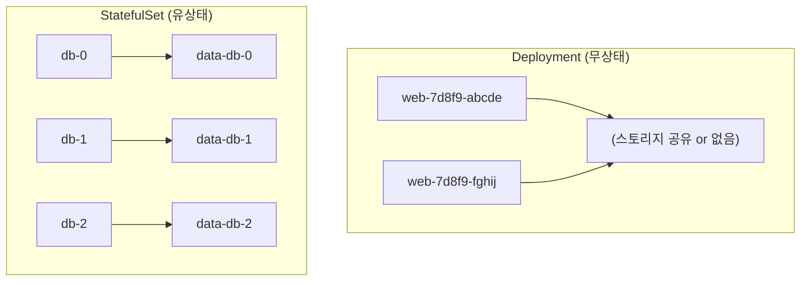
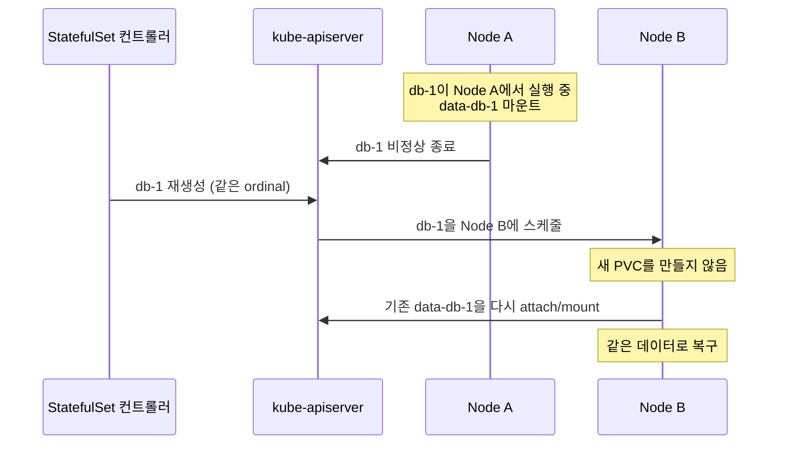
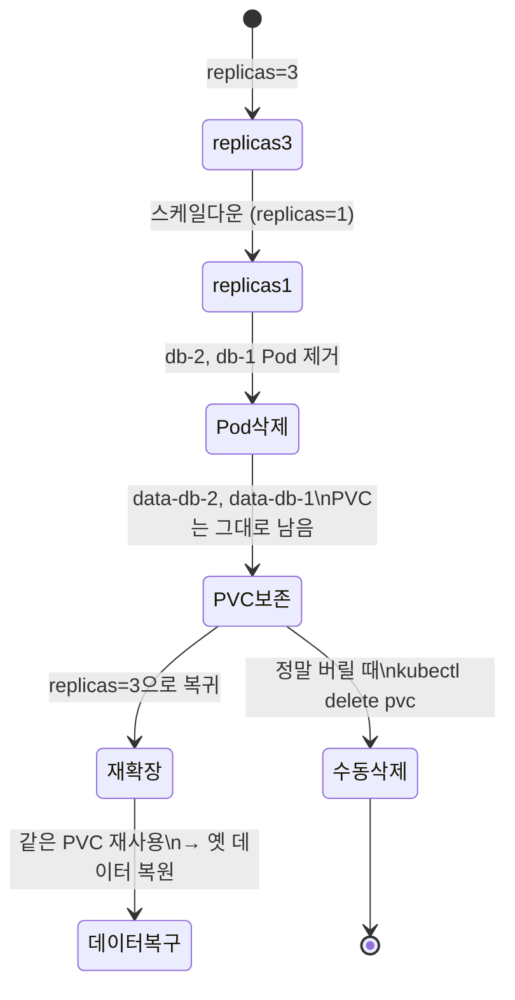

# StatefulSet 스토리지 패턴

::: info 학습 목표
- volumeClaimTemplates가 Pod마다 전용 PVC를 어떻게 자동 발급하는지 이해한다.
- Pod가 재시작·재스케줄돼도 같은 디스크에 다시 붙는 안정적 스토리지 식별자의 원리를 익힌다.
- 데이터베이스·메시지 큐 같은 스테이트풀 앱을 StatefulSet으로 배포하는 패턴을 다룬다.
- 스케일다운 시 PVC가 보존되는 동작과 그에 따른 백업·정리 운영을 안다.
:::

## 1. Deployment로는 안 되는 이유

Deployment의 Pod들은 서로 구분되지 않는 일회용 복제본이다. 이름이 랜덤 해시로 끝나고(`web-7d8f9-abcde`), 죽으면 전혀 다른 이름의 새 Pod로 대체되며, 모두 같은 PVC를 공유하거나 아예 스토리지가 없다. 무상태 웹 서버에는 완벽하지만, 데이터베이스에는 치명적이다.

데이터베이스 복제본 3개를 생각해보자. 각 Pod는 자기만의 데이터 디렉터리를 가져야 하고, 재시작 후에도 바로 그 디렉터리에 다시 붙어야 하며, 클러스터 멤버로서 안정적인 네트워크 신원이 필요하다. <strong>StatefulSet</strong>은 이 세 가지 — 안정적 이름, 안정적 네트워크, 안정적 스토리지 — 를 보장한다.



StatefulSet의 Pod는 `db-0`, `db-1`, `db-2`처럼 순차적이고 안정적인 이름(ordinal)을 받는다. 이 이름이 스토리지와 네트워크 신원의 닻이 된다. 전체 개념은 [StatefulSet 문서](https://kubernetes.io/docs/concepts/workloads/controllers/statefulset/)에 있다.

## 2. volumeClaimTemplates — Pod마다 전용 PVC

핵심 메커니즘은 <strong>volumeClaimTemplates</strong>다. StatefulSet 스펙에 PVC 템플릿을 넣으면, 컨트롤러가 각 Pod마다 그 템플릿으로 별도의 PVC를 자동 생성한다. Pod 하나에 디스크 하나씩 1:1로 배정되는 것이다.

```yaml
apiVersion: apps/v1
kind: StatefulSet
metadata:
  name: db
spec:
  serviceName: db-headless
  replicas: 3
  selector:
    matchLabels:
      app: db
  template:
    metadata:
      labels:
        app: db
    spec:
      containers:
      - name: postgres
        image: postgres:16
        ports:
        - containerPort: 5432
        volumeMounts:
        - name: data
          mountPath: /var/lib/postgresql/data
  volumeClaimTemplates:
  - metadata:
      name: data
    spec:
      accessModes:
      - ReadWriteOnce
      storageClassName: fast-ssd
      resources:
        requests:
          storage: 50Gi
```

이 StatefulSet을 만들면 PVC가 자동으로 생성된다.

```bash
$ kubectl get pvc
NAME          STATUS   VOLUME     CAPACITY   ACCESS MODES   STORAGECLASS
data-db-0     Bound    pvc-a1..   50Gi       RWO            fast-ssd
data-db-1     Bound    pvc-b2..   50Gi       RWO            fast-ssd
data-db-2     Bound    pvc-c3..   50Gi       RWO            fast-ssd
```

PVC 이름은 `<템플릿이름>-<StatefulSet이름>-<ordinal>` 규칙으로 결정론적으로 만들어진다(`data-db-0`). 이 결정론적 이름이 다음 절의 안정성을 가능하게 하는 열쇠다.

## 3. 안정적 스토리지 식별자

StatefulSet의 가장 중요한 보장은, Pod가 죽고 다시 만들어져도 <strong>같은 ordinal의 Pod는 항상 같은 PVC에 다시 붙는다</strong>는 것이다. `db-1`이 죽으면 컨트롤러는 새 `db-1`을 만들고, 새 PVC를 만드는 게 아니라 기존 `data-db-1`을 그대로 다시 마운트한다.



이 덕분에 데이터베이스 복제본이 노드 장애로 다른 노드에 재스케줄돼도 자기 데이터를 잃지 않는다. PVC가 Pod가 아니라 StatefulSet에 묶여 독립적으로 존재하기 때문이다(앞 챕터에서 본 PV 라이프사이클이 여기서 진가를 발휘한다).

여기에 더해 StatefulSet은 안정적 네트워크 신원도 준다. `serviceName`으로 지정한 <strong>headless Service</strong>와 결합하면 각 Pod가 `db-0.db-headless.<네임스페이스>.svc.cluster.local` 같은 고정 DNS 이름을 갖는다. 데이터베이스 클러스터 멤버끼리 서로를 이 안정적 주소로 찾는다.

```yaml
apiVersion: v1
kind: Service
metadata:
  name: db-headless
spec:
  clusterIP: None        # headless
  selector:
    app: db
  ports:
  - port: 5432
```

## 4. 스테이트풀 앱 배포 패턴

스테이트풀 앱을 StatefulSet으로 올릴 때 자주 쓰는 패턴들이 있다.

<strong>순차 기동(OrderedReady).</strong> 기본 동작은 Pod를 `db-0` → `db-1` → `db-2` 순서로 하나씩, 앞 Pod가 Ready가 된 뒤에야 다음을 띄운다. 프라이머리가 먼저 떠야 레플리카가 붙을 수 있는 DB에 적합하다. 순서가 중요치 않으면 `podManagementPolicy: Parallel`로 동시에 띄워 기동을 빠르게 한다.

<strong>초기화는 init container 또는 ordinal 분기.</strong> `db-0`을 프라이머리로, 나머지를 레플리카로 부팅하는 식의 역할 분기는 Pod 이름의 ordinal(`hostname`이 `db-0`인지)로 판단하는 패턴을 흔히 쓴다.

<strong>업데이트는 역순 롤링.</strong> `updateStrategy: RollingUpdate`이면 가장 큰 ordinal부터(`db-2` → `db-1` → `db-0`) 하나씩 교체한다. `partition`을 지정하면 그 번호 이상만 업데이트해 카나리 배포처럼 단계적으로 굴릴 수 있다.

```yaml
spec:
  podManagementPolicy: OrderedReady
  updateStrategy:
    type: RollingUpdate
    rollingUpdate:
      partition: 2        # db-2만 먼저 업데이트
```

실제로는 직접 StatefulSet을 작성하기보다 검증된 Operator(예: CloudNativePG, Strimzi)를 쓰는 경우가 많지만, 그 Operator들도 내부적으로 StatefulSet과 volumeClaimTemplates를 이렇게 활용한다.

## 5. 스케일다운과 PVC 보존

운영에서 가장 많이 놀라는 지점이 스케일다운이다. StatefulSet의 replicas를 3에서 1로 줄이면 `db-2`, `db-1` Pod는 삭제되지만, <strong>그들의 PVC(`data-db-2`, `data-db-1`)는 자동으로 삭제되지 않고 그대로 남는다.</strong>



이것은 버그가 아니라 안전을 위한 의도된 동작이다. 실수로 스케일을 줄였다가 다시 늘리면 같은 PVC에 다시 붙어 데이터가 복구된다. 대신 부작용이 있다 — 정말로 디스크가 필요 없어졌다면 그 PVC를 수동으로 지워야 클라우드 비용이 멈춘다.

```bash
# 스케일다운 후 정말 버릴 PVC 정리
kubectl delete pvc data-db-2 data-db-1
```

쿠버네티스 최신 버전에서는 이 정리를 자동화하는 [persistentVolumeClaimRetentionPolicy](https://kubernetes.io/docs/concepts/workloads/controllers/statefulset/#persistentvolumeclaim-retention)를 StatefulSet에 직접 지정할 수 있다.

```yaml
spec:
  persistentVolumeClaimRetentionPolicy:
    whenScaled: Delete       # 스케일다운 시 PVC 삭제
    whenDeleted: Retain      # StatefulSet 삭제 시엔 보존
```

`whenScaled`는 스케일다운 시, `whenDeleted`는 StatefulSet 자체를 지울 때의 PVC 처리를 각각 `Retain`(기본, 보존) 또는 `Delete`(삭제)로 정한다.

## 6. 백업 고려사항

스토리지가 Pod에 안정적으로 붙는다고 해서 백업이 저절로 되는 건 아니다. PVC·디스크는 노드·zone 장애에는 버텨도, 논리적 손상(잘못된 DELETE, 앱 버그, 랜섬웨어)에는 무력하다. 별도의 백업 전략이 반드시 필요하다.

- <strong>볼륨 스냅샷 기반.</strong> 앞 챕터의 VolumeSnapshot으로 각 PVC를 주기적으로 떠둔다. 단, DB는 스냅샷 직전에 애플리케이션 레벨 정합성(예: `pg_backup_start`, fsync, 또는 잠깐 read-only)을 확보해야 복원본이 깨지지 않는다. 블록 스냅샷만으로는 일관성이 보장되지 않는다.
- <strong>애플리케이션 레벨 백업.</strong> `pg_dump`, `mysqldump`, 또는 DB 자체의 PITR(Point-In-Time Recovery)을 CronJob으로 돌려 오브젝트 스토리지에 적재한다. 스냅샷보다 느리지만 논리적 일관성과 부분 복원에 강하다.
- <strong>클러스터 전체 백업 도구.</strong> Velero 같은 도구로 StatefulSet 매니페스트와 PVC 스냅샷을 함께 백업해 클러스터 단위 복구를 준비한다.

복원 절차도 미리 검증해야 한다. 스냅샷에서 새 PVC를 만들 때 StatefulSet의 결정론적 PVC 이름 규칙(`data-db-0`)에 맞춰 미리 PVC를 깔아두고 StatefulSet을 붙이면, 컨트롤러가 새 디스크를 만들지 않고 복원된 PVC를 그대로 채택하게 할 수 있다. 백업은 떠두는 것보다 복원이 되는지 정기적으로 확인하는 게 더 중요하다.

::: tip 핵심 정리
- Deployment는 무상태 복제본용이고, StatefulSet은 Pod마다 안정적 이름·네트워크·스토리지를 보장해 스테이트풀 앱에 쓴다.
- volumeClaimTemplates는 Pod마다 `<템플릿>-<셋이름>-<ordinal>` 규칙의 전용 PVC를 결정론적으로 자동 발급한다.
- 같은 ordinal의 Pod는 재시작·재스케줄돼도 항상 같은 PVC에 다시 붙어 데이터를 잃지 않으며, headless Service로 안정적 DNS 신원까지 얻는다.
- 스케일다운 시 PVC는 기본적으로 보존되며(안전장치), persistentVolumeClaimRetentionPolicy로 자동 정리를 제어할 수 있다.
- 안정적 스토리지가 백업을 대신하지는 않는다 — 정합성을 확보한 스냅샷·앱 레벨 백업과 복원 검증이 별도로 필요하다.
:::

## 다음 챕터

지금까지 스토리지 영역 — Volume, PV/PVC, CSI, StatefulSet 스토리지 — 를 깊게 다뤘다. 데이터가 안전하게 보존되는 기반을 세웠으니, 이제 그 데이터와 클러스터 자원에 누가 접근할 수 있는지를 통제할 차례다. 다음 챕터 [인증·인가와 RBAC](/study/kubernetes/33-authn-authz-rbac)에서는 클러스터의 인증 흐름과 RBAC로 권한을 다스리는 방법을 다룬다.
