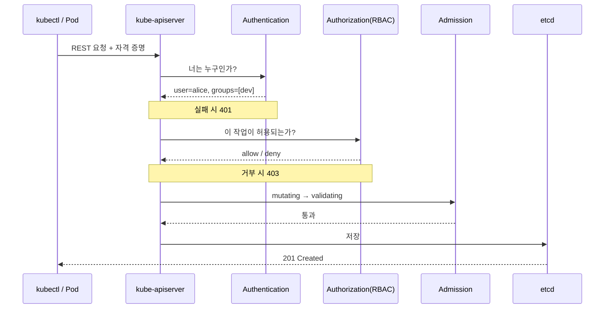
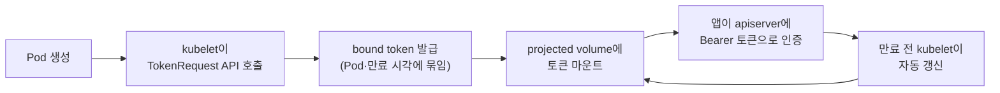
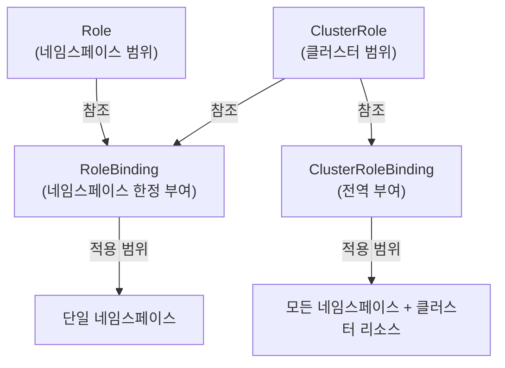

# 인증과 인가 (RBAC)

::: info 학습 목표
- kube-apiserver가 모든 요청을 인증→인가→admission 순서로 처리하는 과정을 이해한다.
- 인증서·베어러 토큰·OIDC 등 쿠버네티스가 지원하는 인증 방식과 그 동작 차이를 안다.
- ServiceAccount가 무엇이고 Pod 안에서 토큰이 어떻게 주입·갱신되는지 파악한다.
- RBAC의 Role/ClusterRole/RoleBinding/ClusterRoleBinding을 조합해 최소 권한을 설계한다.
:::

## 1. API 요청이 처리되는 세 단계

쿠버네티스의 모든 변경은 [kube-apiserver](https://kubernetes.io/docs/concepts/security/controlling-access/)를 거친다. `kubectl`, 컨트롤러, kubelet, 그리고 Pod 안의 애플리케이션까지 전부 REST 요청을 apiserver로 보낸다. apiserver는 들어온 요청을 세 단계로 통과시킨다.

<strong>1단계 인증(Authentication).</strong> "당신은 누구인가"를 확인한다. 요청에 담긴 자격 증명(클라이언트 인증서, 베어러 토큰 등)을 검사해 사용자명과 그룹을 결정한다. 어느 인증 모듈도 통과하지 못하면 `401 Unauthorized`로 거절한다.

<strong>2단계 인가(Authorization).</strong> "당신은 이 작업을 할 수 있는가"를 판단한다. 인증된 사용자가 특정 리소스에 특정 동작(get/list/create/delete 등)을 수행할 권한이 있는지 검사한다. 권한이 없으면 `403 Forbidden`이다.

<strong>3단계 어드미션 컨트롤(Admission Control).</strong> 인가까지 통과한 요청을 etcd에 저장하기 직전에 가로채 변형(mutate)하거나 검증(validate)한다. 이 단계는 다음 챕터에서 자세히 다룬다.



중요한 점은 인증과 인가가 분리돼 있다는 것이다. 인증은 신원만 결정할 뿐, 권한은 전적으로 인가 단계가 판단한다. 그래서 동일한 사용자라도 RBAC 설정에 따라 권한이 완전히 달라진다.

## 2. 인증 방식 — 인증서, 토큰, OIDC

쿠버네티스는 자체 사용자 데이터베이스를 갖지 않는다. 대신 여러 [인증 모듈](https://kubernetes.io/docs/reference/access-authn-authz/authentication/)을 순서대로 시도해, 하나라도 성공하면 그 신원을 채택한다. 사용자(user)는 클러스터 외부에서 관리되는 개념이고, 쿠버네티스가 관리하는 신원은 ServiceAccount뿐이다.

<strong>X.509 클라이언트 인증서.</strong> 가장 기본적인 방식이다. apiserver는 `--client-ca-file`로 지정된 CA로 서명된 인증서를 신뢰한다. 인증서의 `CN`(Common Name)이 사용자명이, `O`(Organization)가 그룹이 된다. `kubeadm`이 만드는 관리자 kubeconfig가 이 방식을 쓴다.

```bash
# 인증서의 subject 확인 — CN이 user, O가 group
openssl x509 -in admin.crt -noout -subject
# subject=O = system:masters, CN = kubernetes-admin
```

`O = system:masters`는 쿠버네티스에 내장된 슈퍼유저 그룹으로, RBAC을 우회해 모든 권한을 가진다. 그래서 이 인증서는 매우 신중히 다뤄야 한다.

<strong>베어러 토큰(Bearer Token).</strong> `Authorization: Bearer <token>` 헤더로 신원을 증명한다. ServiceAccount 토큰이 대표적이며, 정적 토큰 파일이나 부트스트랩 토큰도 여기에 속한다.

<strong>OIDC(OpenID Connect).</strong> 외부 신원 공급자(Keycloak, Google, Okta 등)와 연동하는 표준 방식이다. 사용자는 IdP에서 발급한 JWT `id_token`을 제출하고, apiserver는 그 토큰의 서명·발급자·만료를 검증한 뒤 클레임에서 사용자명과 그룹을 추출한다.

```yaml
# kube-apiserver 플래그 예 (OIDC 연동)
- --oidc-issuer-url=https://keycloak.example.com/realms/k8s
- --oidc-client-id=kubernetes
- --oidc-username-claim=email
- --oidc-groups-claim=groups
```

OIDC를 쓰면 사내 SSO 계정으로 클러스터에 접근하고, IdP에서 계정을 비활성화하면 클러스터 접근도 끊을 수 있어 운영상 깔끔하다. 자세한 흐름은 [OIDC 인증 문서](https://kubernetes.io/docs/reference/access-authn-authz/authentication/#openid-connect-tokens)에 정리돼 있다.

## 3. ServiceAccount — Pod의 신원

사람 사용자가 kubeconfig로 클러스터에 접근한다면, Pod 안에서 도는 애플리케이션은 [ServiceAccount](https://kubernetes.io/docs/concepts/security/service-accounts/)라는 신원으로 apiserver와 통신한다. ServiceAccount는 쿠버네티스가 직접 관리하는 유일한 신원 타입이며, 네임스페이스에 속한 리소스다.

```yaml
apiVersion: v1
kind: ServiceAccount
metadata:
  name: app-sa
  namespace: payments
```

```yaml
apiVersion: apps/v1
kind: Deployment
metadata:
  name: api
  namespace: payments
spec:
  template:
    spec:
      serviceAccountName: app-sa   # 지정 안 하면 default SA 사용
      containers:
      - name: api
        image: myapp:1.0
```

Pod가 뜨면 kubelet은 해당 ServiceAccount의 단명(short-lived) 토큰을 받아 `/var/run/secrets/kubernetes.io/serviceaccount/token` 경로에 마운트한다. 이 토큰은 [bound token](https://kubernetes.io/docs/concepts/security/service-accounts/#bound-service-account-tokens)으로, Pod의 수명에 묶여 있고 일정 주기로 자동 갱신되며 만료된다. 과거의 영구 Secret 기반 토큰보다 훨씬 안전하다.



토큰이 자동 주입되는 게 위험할 수도 있다. apiserver와 통신할 필요가 없는 Pod라면 `automountServiceAccountToken: false`로 주입을 끄는 것이 최소 권한 원칙에 맞다.

## 4. RBAC — Role과 ClusterRole

쿠버네티스의 표준 인가 방식은 [RBAC(Role-Based Access Control)](https://kubernetes.io/docs/reference/access-authn-authz/rbac/)다. RBAC은 "어떤 리소스에 어떤 동작이 허용되는가"를 정의하는 <strong>역할(Role)</strong>과, 그 역할을 "누구에게 부여하는가"를 정의하는 <strong>바인딩(Binding)</strong>으로 구성된다. RBAC은 오직 허용 규칙만 있고 거부 규칙은 없다 — 명시적으로 허용되지 않은 모든 것은 거부다.

<strong>Role</strong>은 네임스페이스 범위의 권한을 정의한다.

```yaml
apiVersion: rbac.authorization.k8s.io/v1
kind: Role
metadata:
  namespace: payments
  name: pod-reader
rules:
- apiGroups: [""]            # 코어 그룹 (Pod, Service 등)
  resources: ["pods", "pods/log"]
  verbs: ["get", "list", "watch"]
```

<strong>ClusterRole</strong>은 클러스터 전역 또는 네임스페이스에 속하지 않는 리소스(Node, PersistentVolume, Namespace 등)에 대한 권한을 정의한다. ClusterRole은 네임스페이스에 묶이지 않으므로, 모든 네임스페이스에 공통으로 쓸 권한 묶음을 정의할 때도 유용하다.

```yaml
apiVersion: rbac.authorization.k8s.io/v1
kind: ClusterRole
metadata:
  name: node-reader
rules:
- apiGroups: [""]
  resources: ["nodes"]
  verbs: ["get", "list", "watch"]
```

규칙의 핵심은 세 필드다. `apiGroups`는 리소스가 속한 API 그룹(코어는 `""`, Deployment는 `apps`), `resources`는 대상 리소스, `verbs`는 허용 동작이다. 와일드카드(`["*"]`)도 가능하지만 최소 권한과는 정반대이므로 신중히 써야 한다.

## 5. RoleBinding과 ClusterRoleBinding

역할을 정의했다면 이제 주체(subject)에게 부여해야 한다. 주체는 `User`, `Group`, `ServiceAccount` 세 종류다.

<strong>RoleBinding</strong>은 특정 네임스페이스 안에서 역할을 부여한다. Role뿐 아니라 ClusterRole도 참조할 수 있는데, 이 경우 ClusterRole의 권한이 해당 네임스페이스로 한정돼 적용된다.

```yaml
apiVersion: rbac.authorization.k8s.io/v1
kind: RoleBinding
metadata:
  name: read-pods
  namespace: payments
subjects:
- kind: ServiceAccount
  name: app-sa
  namespace: payments
roleRef:
  kind: Role
  name: pod-reader
  apiGroup: rbac.authorization.k8s.io
```

<strong>ClusterRoleBinding</strong>은 ClusterRole을 클러스터 전역에 부여한다. 모든 네임스페이스에 걸쳐 권한이 적용되므로 영향 범위가 넓다.

```yaml
apiVersion: rbac.authorization.k8s.io/v1
kind: ClusterRoleBinding
metadata:
  name: read-nodes-global
subjects:
- kind: Group
  name: monitoring
  apiGroup: rbac.authorization.k8s.io
roleRef:
  kind: ClusterRole
  name: node-reader
  apiGroup: rbac.authorization.k8s.io
```

네 가지 조합을 정리하면 이렇다.



자주 헷갈리는 조합은 "RoleBinding이 ClusterRole을 참조"하는 경우다. 이것은 공통 ClusterRole(예: `view`, `edit`) 하나를 정의해 두고 여러 네임스페이스에서 각각 RoleBinding으로 한정 적용하는, 매우 흔하고 유용한 패턴이다. 쿠버네티스가 기본 제공하는 `view`/`edit`/`admin`/`cluster-admin` [default ClusterRole](https://kubernetes.io/docs/reference/access-authn-authz/rbac/#user-facing-roles)이 바로 이렇게 쓰인다.

## 6. 최소 권한 설계와 점검

[최소 권한 원칙(Principle of Least Privilege)](https://kubernetes.io/docs/concepts/security/rbac-good-practices/)은 "각 주체에게 꼭 필요한 권한만 준다"는 보안의 기본이다. 쿠버네티스에서 이를 실천하는 구체적 지침은 다음과 같다.

- <strong>와일드카드를 피한다.</strong> `verbs: ["*"]`, `resources: ["*"]`는 의도치 않은 권한을 열어 둔다. 필요한 동작만 나열한다.
- <strong>`cluster-admin`을 남발하지 않는다.</strong> 이 ClusterRole은 모든 것을 할 수 있다. 사람·자동화 어느 쪽에도 기본값으로 주면 안 된다.
- <strong>네임스페이스 단위로 격리한다.</strong> 가능하면 ClusterRoleBinding보다 RoleBinding을 써서 영향 범위를 좁힌다.
- <strong>`escalate`·`bind`·`impersonate` 동사를 경계한다.</strong> 이들은 권한 상승으로 이어질 수 있는 위험 동사다.

설계한 권한이 실제로 어떻게 작동하는지는 `kubectl auth can-i`로 검증할 수 있다.

```bash
# 특정 ServiceAccount가 payments 네임스페이스에서 Pod를 지울 수 있는가?
kubectl auth can-i delete pods \
  --namespace=payments \
  --as=system:serviceaccount:payments:app-sa
# no

# 내가 할 수 있는 모든 동작을 한눈에
kubectl auth can-i --list --namespace=payments
```

이렇게 부여 → 검증 → 축소를 반복하며 권한을 깎아 나가는 것이 안전한 RBAC 운영의 핵심이다.

::: tip 핵심 정리
- 모든 API 요청은 인증(누구인가) → 인가(허용되는가) → admission(변형·검증) 순서로 처리된다.
- 쿠버네티스는 사용자 DB가 없다 — 인증은 인증서·베어러 토큰·OIDC 등 외부 모듈에 위임한다.
- ServiceAccount는 Pod의 신원이며, bound token이 Pod 수명에 묶여 자동 주입·갱신된다.
- RBAC은 Role/ClusterRole(권한 정의)과 RoleBinding/ClusterRoleBinding(주체에 부여)의 조합이고, 거부 규칙 없이 허용만 있다.
- 와일드카드·cluster-admin을 피하고 `kubectl auth can-i`로 검증하며 최소 권한을 설계한다.
:::

## 다음 챕터

인증과 인가를 통과한 요청도 곧바로 저장되지 않는다. 그 전에 한 단계가 더 있다. 다음 챕터 [Admission Control](/study/kubernetes/34-admission-control)에서는 요청을 가로채 변형하고 검증하는 admission controller, dynamic webhook, 그리고 OPA/Gatekeeper·Kyverno·CEL 기반 정책 엔진까지 다룬다.
