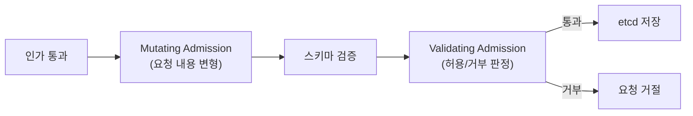
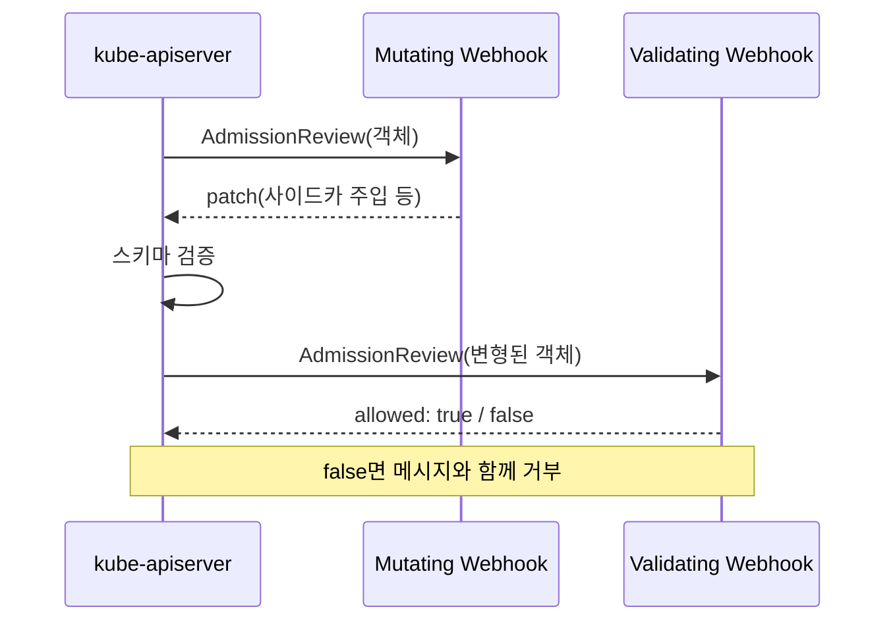
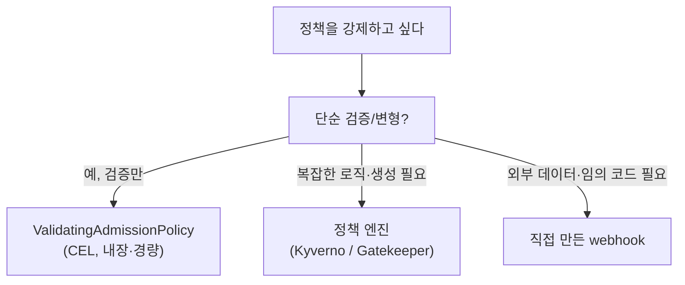

# Admission Control

::: info 학습 목표
- admission controller가 무엇이고 mutating→validating 두 단계로 동작하는 이유를 이해한다.
- apiserver에 내장된 주요 admission controller의 역할을 안다.
- dynamic admission webhook(Mutating/Validating)으로 직접 정책을 확장하는 구조를 파악한다.
- OPA/Gatekeeper·Kyverno와 CEL 기반 ValidatingAdmissionPolicy로 정책을 강제하는 방법을 익힌다.
:::

## 1. Admission Control이란

[Admission controller](https://kubernetes.io/docs/reference/access-authn-authz/admission-controllers/)는 인증·인가를 통과한 요청을 etcd에 저장하기 직전에 가로채는 관문이다. 인가가 "이 사람이 이 작업을 할 수 있는가"를 묻는다면, admission은 "이 작업의 내용이 클러스터 정책에 맞는가"를 묻는다.

예를 들어 인가는 "alice가 Pod를 만들 수 있다"까지만 판단한다. 하지만 "그 Pod가 root로 실행되면 안 된다", "모든 Pod에 비용 추적용 라벨이 있어야 한다" 같은 규칙은 admission이 강제한다. 이것이 인가만으로는 부족한 이유다.

admission 단계는 두 페이즈로 나뉘고, 항상 이 순서로 동작한다.



<strong>Mutating 페이즈</strong>가 먼저 와서 요청 객체를 변형한다(라벨 추가, 사이드카 주입, 기본값 설정 등). 그다음 <strong>Validating 페이즈</strong>가 최종 형태를 검사해 허용 또는 거부한다. validating은 객체를 바꿀 수 없고 판정만 한다. mutating이 먼저인 이유는 명확하다 — 변형이 끝난 최종 객체를 보고 검증해야 일관성이 보장되기 때문이다.

## 2. 내장 Admission Controller

apiserver는 컴파일 시점에 포함된 다수의 admission controller를 `--enable-admission-plugins` 플래그로 켜고 끈다. 운영에서 자주 보는 [내장 컨트롤러](https://kubernetes.io/docs/reference/access-authn-authz/admission-controllers/#what-does-each-admission-controller-do)는 다음과 같다.

- <strong>NamespaceLifecycle</strong> — 삭제 중이거나 존재하지 않는 네임스페이스에 리소스 생성을 막는다.
- <strong>LimitRanger</strong> — LimitRange에 따라 컨테이너에 기본 requests/limits를 채워 넣는다(mutating).
- <strong>ResourceQuota</strong> — 네임스페이스의 ResourceQuota를 초과하는 생성을 거부한다(validating).
- <strong>ServiceAccount</strong> — Pod에 ServiceAccount를 자동 연결하고 토큰을 주입한다.
- <strong>DefaultStorageClass</strong> — StorageClass를 지정하지 않은 PVC에 기본 클래스를 채운다.
- <strong>PodSecurity</strong> — Pod Security Standards를 강제한다(다음 챕터에서 다룬다).

이 컨트롤러들은 apiserver 안에 박혀 있어 빠르고 신뢰성이 높지만, 우리가 원하는 임의의 정책을 추가할 수는 없다. 그래서 외부 확장 메커니즘이 필요하다.

## 3. Dynamic Admission Webhook

[Dynamic admission webhook](https://kubernetes.io/docs/reference/access-authn-authz/extensible-admission-controllers/)은 apiserver를 다시 빌드하지 않고도 admission 로직을 추가하는 방법이다. apiserver는 admission 시점에 우리가 운영하는 HTTP 웹훅 서버를 호출하고, 그 응답(allow/deny 또는 patch)을 반영한다.

두 종류가 있다. `MutatingWebhookConfiguration`은 객체를 변형(JSON Patch)하고, `ValidatingWebhookConfiguration`은 검증만 한다.

```yaml
apiVersion: admissionregistration.k8s.io/v1
kind: ValidatingWebhookConfiguration
metadata:
  name: require-team-label
webhooks:
- name: team-label.example.com
  rules:
  - apiGroups: ["apps"]
    apiVersions: ["v1"]
    operations: ["CREATE", "UPDATE"]
    resources: ["deployments"]
  clientConfig:
    service:
      namespace: webhook-system
      name: policy-webhook
      path: "/validate"
    caBundle: <base64 CA>
  admissionReviewVersions: ["v1"]
  sideEffects: None
  failurePolicy: Fail        # 웹훅 장애 시 거부(보수적)
```



설계에서 가장 중요한 결정은 `failurePolicy`다. `Fail`은 웹훅 서버가 죽으면 관련 요청을 모두 거부해 클러스터가 멈출 수 있고, `Ignore`는 장애 시 정책을 건너뛰어 보안 구멍이 생긴다. 그래서 핵심 정책 웹훅은 고가용성으로 운영하고, `namespaceSelector`로 적용 범위를 좁혀 위험을 줄인다. Istio의 사이드카 자동 주입이 대표적인 mutating webhook 사례다.

## 4. 정책 엔진 — OPA/Gatekeeper와 Kyverno

웹훅 서버를 직접 구현하는 대신, 정책을 선언적으로 작성하면 알아서 웹훅으로 강제해 주는 정책 엔진을 쓰는 것이 일반적이다. 두 가지가 대표적이다.

<strong>OPA Gatekeeper</strong>는 [Open Policy Agent](https://www.openpolicyagent.org/)를 쿠버네티스에 통합한 것으로, Rego 언어로 정책을 작성한다. `ConstraintTemplate`으로 정책 로직을 정의하고, `Constraint`로 그 정책을 실제 리소스에 적용한다.

```yaml
apiVersion: constraints.gatekeeper.sh/v1beta1
kind: K8sRequiredLabels
metadata:
  name: deployments-must-have-team
spec:
  match:
    kinds:
    - apiGroups: ["apps"]
      kinds: ["Deployment"]
  parameters:
    labels: ["team"]
```

<strong>Kyverno</strong>는 별도 언어를 배우지 않고 YAML 그대로 정책을 쓰는 쿠버네티스 네이티브 엔진이다. validate·mutate·generate 세 가지 작업을 모두 지원한다.

```yaml
apiVersion: kyverno.io/v1
kind: ClusterPolicy
metadata:
  name: require-team-label
spec:
  validationFailureAction: Enforce
  rules:
  - name: check-team-label
    match:
      any:
      - resources:
          kinds: ["Deployment"]
    validate:
      message: "team 라벨이 반드시 필요하다."
      pattern:
        metadata:
          labels:
            team: "?*"
```

둘 다 내부적으로는 dynamic admission webhook으로 동작한다. Rego의 표현력이 필요하면 Gatekeeper, 학습 비용 없이 빠르게 도입하려면 Kyverno가 흔한 선택이다.

## 5. ValidatingAdmissionPolicy — CEL 내장 정책

외부 웹훅 서버는 강력하지만, 추가 컴포넌트를 배포·운영해야 하고 네트워크 왕복으로 인한 지연·장애 위험이 있다. 이를 줄이기 위해 쿠버네티스는 apiserver 안에서 직접 정책을 평가하는 [ValidatingAdmissionPolicy](https://kubernetes.io/docs/reference/access-authn-authz/validating-admission-policy/)를 도입했다(v1.30 GA). 정책은 [CEL(Common Expression Language)](https://kubernetes.io/docs/reference/using-api/cel/)로 작성한다.

```yaml
apiVersion: admissionregistration.k8s.io/v1
kind: ValidatingAdmissionPolicy
metadata:
  name: "require-team-label"
spec:
  matchConstraints:
    resourceRules:
    - apiGroups: ["apps"]
      apiVersions: ["v1"]
      operations: ["CREATE", "UPDATE"]
      resources: ["deployments"]
  validations:
  - expression: "has(object.metadata.labels) && 'team' in object.metadata.labels"
    message: "Deployment에는 team 라벨이 필요하다."
```

정책을 어디에 적용할지는 별도 바인딩으로 분리한다.

```yaml
apiVersion: admissionregistration.k8s.io/v1
kind: ValidatingAdmissionPolicyBinding
metadata:
  name: "require-team-label-binding"
spec:
  policyName: "require-team-label"
  validationActions: ["Deny"]
  matchResources:
    namespaceSelector:
      matchLabels:
        environment: production
```

CEL은 apiserver 안에서 평가되므로 웹훅 같은 외부 의존성이 없다. 별도 서버·인증서·HA 운영이 필요 없어 가볍고, 웹훅 장애로 클러스터가 멈출 위험도 없다. 다음과 같이 정책 강제 수단을 점점 가벼운 쪽으로 선택할 수 있다.



간단한 검증은 ValidatingAdmissionPolicy로 충분하고, mutate·generate나 외부 데이터 조회가 필요하면 정책 엔진이나 커스텀 웹훅으로 올라가는 식이다.

::: tip 핵심 정리
- admission controller는 인가 후 etcd 저장 직전에 요청을 변형·검증하는 관문이다.
- 항상 mutating이 먼저, validating이 나중이다 — 변형 완료된 최종 객체를 검증해야 일관적이다.
- 내장 컨트롤러(LimitRanger·ResourceQuota·PodSecurity 등)는 빠르지만 임의 정책은 못 넣는다.
- dynamic admission webhook으로 정책을 확장하며, failurePolicy 설계가 가용성·보안의 핵심이다.
- 복잡한 정책은 Gatekeeper/Kyverno로, 단순 검증은 apiserver 내장 CEL 기반 ValidatingAdmissionPolicy로 처리한다.
:::

## 다음 챕터

admission으로 정책을 강제하는 법을 배웠다. 가장 흔히 강제하는 정책이 바로 Pod의 보안 설정이다. 다음 챕터 [Pod 보안과 seccomp](/study/kubernetes/35-pod-security)에서는 Pod Security Standards, Pod Security Admission, SecurityContext, 그리고 seccomp/AppArmor 프로파일을 다룬다.
