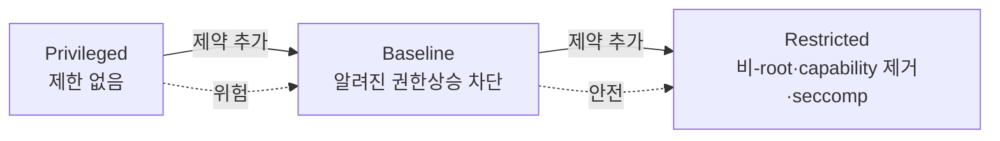
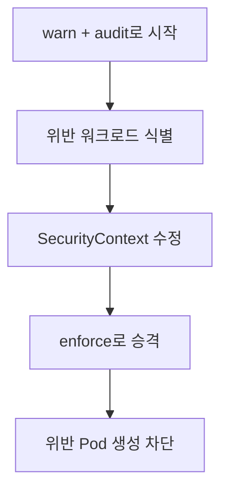
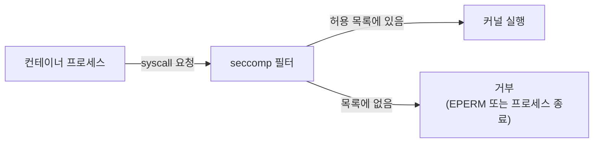
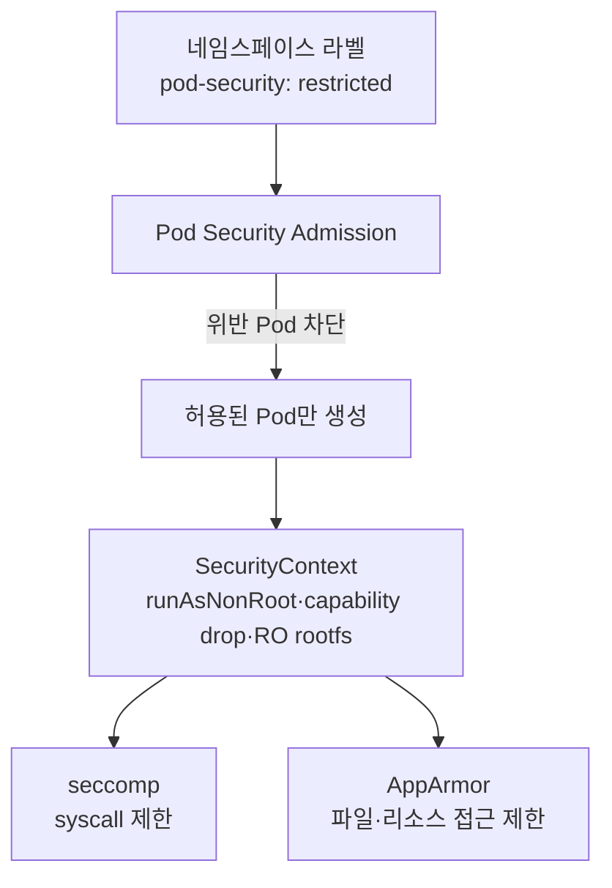

# Pod 보안과 seccomp

::: info 학습 목표
- Pod Security Standards의 세 단계(privileged/baseline/restricted)와 각 단계가 막는 위험을 이해한다.
- Pod Security Admission으로 네임스페이스 단위 보안 수준을 enforce/audit/warn 모드로 강제한다.
- SecurityContext의 runAsNonRoot·readOnlyRootFilesystem·capabilities로 컨테이너 권한을 좁힌다.
- seccomp·AppArmor 프로파일로 커널 시스템 콜과 파일 접근을 제한하는 원리를 익힌다.
:::

## 1. Pod Security Standards

컨테이너는 호스트 커널을 공유하므로, 잘못 설정된 Pod 하나가 노드 전체를 위협할 수 있다. 쿠버네티스는 이런 위험을 막기 위해 [Pod Security Standards(PSS)](https://kubernetes.io/docs/concepts/security/pod-security-standards/)라는 세 단계의 표준 정책을 정의한다.

- <strong>Privileged</strong> — 제한이 거의 없는 정책이다. 호스트 네임스페이스 공유, 권한 있는 컨테이너 등 모든 것이 허용된다. CNI·CSI 같은 인프라 컴포넌트처럼 호스트 접근이 본질적으로 필요한 워크로드에만 쓴다.
- <strong>Baseline</strong> — 알려진 권한 상승을 막는 최소한의 제한이다. privileged 컨테이너, 호스트 네트워크/PID, hostPath 등 명백히 위험한 것을 금지한다. 기존 애플리케이션이 대부분 큰 수정 없이 통과한다.
- <strong>Restricted</strong> — 강력한 하드닝 정책이다. 반드시 비-root로 실행하고, 모든 Linux capability를 떨어뜨리며, seccomp 프로파일을 요구하는 등 모범 보안 설정을 강제한다.



세 단계는 누적적이다. restricted는 baseline의 모든 제약에 더해 추가 하드닝을 요구한다. 새로 만드는 애플리케이션은 restricted를 목표로 설계하는 것이 바람직하다.

## 2. Pod Security Admission

표준을 정의했으면 강제해야 한다. [Pod Security Admission(PSA)](https://kubernetes.io/docs/concepts/security/pod-security-admission/)은 앞 챕터에서 본 내장 admission controller로, 네임스페이스 라벨을 읽어 그 네임스페이스의 Pod에 PSS를 적용한다.

적용은 세 가지 모드로 나뉜다.

- <strong>enforce</strong> — 정책을 위반하는 Pod 생성을 거부한다.
- <strong>audit</strong> — 위반을 막지는 않지만 감사 로그에 기록한다.
- <strong>warn</strong> — 위반 시 사용자에게 경고 메시지를 보여 준다.

```yaml
apiVersion: v1
kind: Namespace
metadata:
  name: payments
  labels:
    pod-security.kubernetes.io/enforce: restricted
    pod-security.kubernetes.io/enforce-version: latest
    pod-security.kubernetes.io/warn: restricted
    pod-security.kubernetes.io/audit: restricted
```

여기서 운영의 지혜가 하나 있다. 기존 네임스페이스에 곧바로 `enforce: restricted`를 걸면 멀쩡히 돌던 Pod가 거부될 수 있다. 그래서 먼저 `warn`/`audit`만 켜서 어떤 워크로드가 위반하는지 파악하고, 수정한 뒤 마지막에 `enforce`로 올리는 단계적 적용이 안전하다.



## 3. SecurityContext — 컨테이너 권한 좁히기

PSS가 "무엇을 금지하는가"의 기준이라면, 실제로 그 기준을 만족시키는 설정은 [SecurityContext](https://kubernetes.io/docs/tasks/configure-pod-container/security-context/)에서 한다. Pod 수준과 컨테이너 수준 양쪽에 둘 수 있으며, 컨테이너 수준이 더 우선한다.

```yaml
apiVersion: v1
kind: Pod
metadata:
  name: hardened
spec:
  securityContext:
    runAsNonRoot: true        # root(uid 0)로 실행 금지
    runAsUser: 1000
    fsGroup: 2000
    seccompProfile:
      type: RuntimeDefault
  containers:
  - name: app
    image: myapp:1.0
    securityContext:
      allowPrivilegeEscalation: false   # setuid 등으로 권한 상승 차단
      readOnlyRootFilesystem: true      # 루트 파일시스템 쓰기 금지
      capabilities:
        drop: ["ALL"]                   # 모든 capability 제거
        add: ["NET_BIND_SERVICE"]       # 필요한 것만 다시 추가
```

각 설정이 막는 위험을 짚어 보자.

- <strong>runAsNonRoot / runAsUser</strong> — 컨테이너가 root로 돌지 않게 한다. 컨테이너 탈출이 일어나도 호스트에서 root 권한을 갖지 못하게 만드는 가장 기본적인 방어다.
- <strong>readOnlyRootFilesystem</strong> — 루트 파일시스템을 읽기 전용으로 만든다. 공격자가 바이너리를 심거나 설정을 변조하기 어려워진다. 쓰기가 필요한 경로는 `emptyDir`로 별도 마운트한다.
- <strong>allowPrivilegeEscalation: false</strong> — `setuid` 바이너리 등을 통한 권한 상승을 차단한다.
- <strong>capabilities</strong> — [Linux capability](https://man7.org/linux/man-pages/man7/capabilities.7.html)는 root 권한을 잘게 쪼갠 단위다. 기본적으로 모두 떨어뜨리고(`drop: ALL`) 꼭 필요한 것만(예: 1024 미만 포트 바인딩에 `NET_BIND_SERVICE`) 더하는 것이 최소 권한이다.

이 조합이 곧 restricted 정책이 요구하는 설정과 맞닿아 있다. SecurityContext를 제대로 채우면 자연히 restricted를 통과한다.

## 4. seccomp 프로파일

[seccomp(secure computing mode)](https://kubernetes.io/docs/tutorials/security/seccomp/)는 컨테이너가 호출할 수 있는 리눅스 시스템 콜을 제한하는 커널 기능이다. 컨테이너가 실제로 쓰는 syscall은 전체의 일부에 불과한데, 나머지 수백 개의 syscall이 모두 공격 표면이 된다. seccomp는 이 표면을 좁힌다.

가장 쉬운 출발점은 컨테이너 런타임이 제공하는 기본 프로파일을 켜는 것이다.

```yaml
spec:
  securityContext:
    seccompProfile:
      type: RuntimeDefault   # 런타임의 기본 차단 목록 적용
```

`RuntimeDefault`만 켜도 위험한 syscall 상당수가 막힌다. 더 엄격하게는 애플리케이션이 실제 쓰는 syscall만 허용하는 커스텀 프로파일을 노드에 배치하고 참조한다.

```yaml
spec:
  securityContext:
    seccompProfile:
      type: Localhost
      localhostProfile: profiles/audit.json
```



커스텀 프로파일은 강력하지만, 너무 좁게 잡으면 애플리케이션이 멀쩡한 syscall을 못 써서 죽는다. 그래서 보통 audit 모드로 실제 호출되는 syscall을 수집한 뒤 그 목록으로 프로파일을 만든다.

## 5. AppArmor 프로파일

[AppArmor](https://kubernetes.io/docs/tutorials/security/apparmor/)는 seccomp와 보완 관계의 리눅스 보안 모듈(LSM)이다. seccomp가 "어떤 syscall을 부를 수 있는가"를 제어한다면, AppArmor는 "어떤 파일·경로·기능에 접근할 수 있는가"를 프로파일로 제어한다. 예를 들어 특정 디렉터리 쓰기 금지, 네트워크 차단 같은 규칙을 건다.

v1.30부터는 Pod 스펙 필드로 직접 지정할 수 있다.

```yaml
apiVersion: v1
kind: Pod
metadata:
  name: apparmor-demo
spec:
  containers:
  - name: app
    image: myapp:1.0
    securityContext:
      appArmorProfile:
        type: Localhost
        localhostProfile: k8s-apparmor-restrict
```

AppArmor 프로파일은 노드에 미리 로드돼 있어야 한다. seccomp(syscall 차단)와 AppArmor(파일/리소스 접근 차단)를 함께 쓰면 서로 다른 층위에서 방어가 겹쳐 심층 방어(defense in depth)가 된다.

## 6. 종합 — 계층적 방어

지금까지의 도구는 하나의 정책을 여러 층에서 강제하는 구조로 맞물린다.



PSA가 입구에서 위험한 Pod를 막고, SecurityContext가 컨테이너 권한을 좁히며, seccomp·AppArmor가 커널 수준에서 한 번 더 가둔다. 어느 한 층이 뚫려도 다음 층이 피해를 제한한다. 새 애플리케이션은 처음부터 restricted를 목표로 SecurityContext를 채우고 `RuntimeDefault` seccomp를 켜는 것을 기본값으로 삼는 게 좋다.

::: tip 핵심 정리
- Pod Security Standards는 privileged → baseline → restricted 누적 단계로 보안 수준을 정의한다.
- Pod Security Admission은 네임스페이스 라벨로 PSS를 enforce/audit/warn 모드로 강제하며, warn→enforce 단계 적용이 안전하다.
- SecurityContext의 runAsNonRoot·readOnlyRootFilesystem·capability drop·allowPrivilegeEscalation:false가 restricted의 핵심 설정이다.
- seccomp는 syscall을, AppArmor는 파일·리소스 접근을 제한하며 RuntimeDefault가 손쉬운 출발점이다.
- PSA·SecurityContext·seccomp·AppArmor가 층층이 겹쳐 심층 방어를 이룬다.
:::

## 다음 챕터

Pod 자체의 보안을 다졌다. 하지만 그 Pod가 실행하는 이미지가 변조됐다면 어떨까? 다음 챕터 [공급망·런타임 보안](/study/kubernetes/36-supplychain-runtime-security)에서는 cosign 이미지 서명·검증과 스캔, etcd 저장 데이터 암호화, 그리고 Falco 기반 런타임 위협 탐지를 다룬다.
