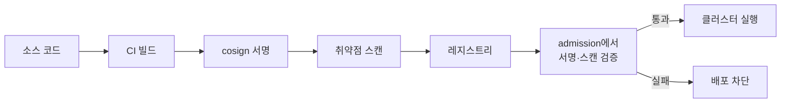
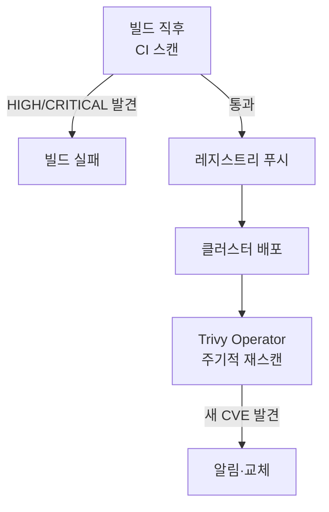
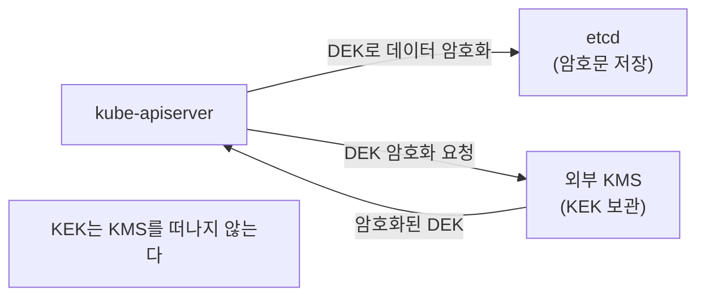
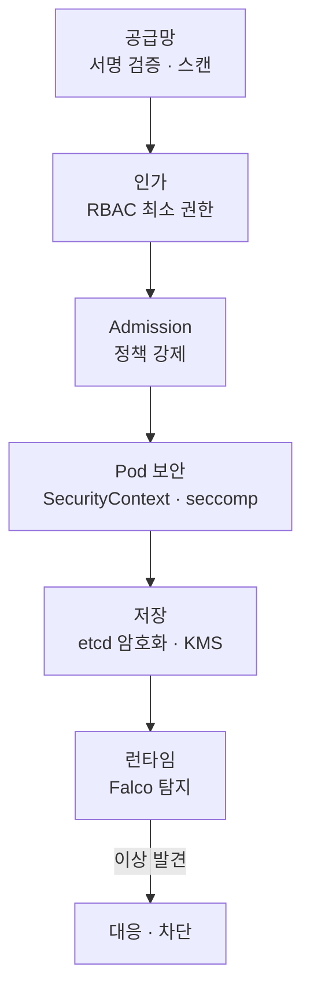

# 공급망·런타임 보안

::: info 학습 목표
- 소프트웨어 공급망 위협을 이해하고 cosign/sigstore로 이미지를 서명·검증한다.
- 이미지 취약점 스캔을 admission 단계에 결합해 위험한 이미지를 차단하는 흐름을 안다.
- etcd에 저장되는 Secret을 EncryptionConfiguration·KMS로 암호화하는 방법을 파악한다.
- Falco로 런타임 이상 행위를 탐지하고, 최소 권한·격리를 종합한 심층 방어를 설계한다.
:::

## 1. 소프트웨어 공급망 위협

클러스터를 아무리 단단히 잠가도, 그 위에서 도는 컨테이너 이미지가 변조됐다면 의미가 없다. 이미지는 베이스 이미지 → 의존성 라이브러리 → 빌드 파이프라인 → 레지스트리 → 배포까지 긴 경로를 거치는데, 이 [공급망(supply chain)](https://kubernetes.io/docs/concepts/security/supply-chain-security/)의 어느 단계든 악성 코드가 끼어들 수 있다.

대표적 위협은 세 가지다. 변조된 이미지가 레지스트리에 올라가는 경우, 알려진 취약점(CVE)을 포함한 의존성을 그대로 배포하는 경우, 그리고 신뢰할 수 없는 출처의 이미지를 검증 없이 실행하는 경우다. 이를 막으려면 "이 이미지가 진짜 우리가 빌드한 것인가(무결성)"와 "이 이미지에 알려진 취약점이 없는가(스캔)" 두 축을 모두 확인해야 한다.



## 2. 이미지 서명과 검증 — cosign/sigstore

[sigstore](https://www.sigstore.dev/)는 소프트웨어 서명을 쉽게 만드는 오픈소스 프로젝트이고, 그중 [cosign](https://docs.sigstore.dev/cosign/overview/)이 컨테이너 이미지 서명 도구다. 빌드 파이프라인에서 이미지를 서명하면, 배포 시점에 "이 다이제스트의 이미지가 우리 키로 서명됐는가"를 검증할 수 있다.

```bash
# 키 쌍 생성 후 이미지 서명
cosign generate-key-pair
cosign sign --key cosign.key registry.example.com/app@sha256:abc123...

# 배포 전 서명 검증
cosign verify --key cosign.pub registry.example.com/app@sha256:abc123...
```

cosign은 키리스(keyless) 서명도 지원한다. 장기 보관하는 개인 키 없이 OIDC 신원으로 단명 인증서를 발급받아 서명하고, 그 기록을 [Rekor](https://docs.sigstore.dev/logging/overview/) 투명성 로그에 남긴다. 키 유출 위험을 없애는 방식이다.

서명 검증을 사람이 매번 할 수는 없으니, 앞 챕터의 admission으로 강제한다. Kyverno나 Gatekeeper의 이미지 검증 정책, 또는 [sigstore policy-controller](https://docs.sigstore.dev/policy-controller/overview/)를 쓰면 서명되지 않은 이미지의 Pod 생성을 거부할 수 있다.

```yaml
apiVersion: kyverno.io/v1
kind: ClusterPolicy
metadata:
  name: verify-image-signature
spec:
  validationFailureAction: Enforce
  rules:
  - name: check-signature
    match:
      any:
      - resources:
          kinds: ["Pod"]
    verifyImages:
    - imageReferences:
      - "registry.example.com/*"
      attestors:
      - entries:
        - keys:
            publicKeys: |-
              -----BEGIN PUBLIC KEY-----
              ...
              -----END PUBLIC KEY-----
```

## 3. 이미지 취약점 스캔

서명이 무결성을 증명한다면, 스캔은 그 이미지에 알려진 취약점이 있는지를 본다. [Trivy](https://trivy.dev/), Grype 같은 스캐너가 이미지의 OS 패키지와 애플리케이션 의존성을 [CVE 데이터베이스](https://www.cve.org/)와 대조한다.

```bash
# 이미지 스캔 — HIGH/CRITICAL 발견 시 종료 코드 1
trivy image --severity HIGH,CRITICAL --exit-code 1 \
  registry.example.com/app:1.2.3
```

스캔은 두 지점에 배치한다. CI 파이프라인에서 빌드 직후 스캔해 위험한 이미지가 레지스트리에 올라가는 것을 1차로 막고, 클러스터에서는 admission이나 주기적 스캐너(예: Trivy Operator)로 이미 실행 중인 이미지의 새 CVE를 지속 감시한다. CVE는 시간이 지나며 새로 발견되므로 한 번의 스캔으로 끝나지 않고 반복돼야 한다.



## 4. etcd 저장 데이터 암호화

쿠버네티스의 모든 오브젝트는 etcd에 저장되는데, 기본적으로는 평문이다. 특히 Secret이 평문으로 디스크에 남는다는 뜻이라, etcd 데이터나 백업이 유출되면 모든 비밀이 노출된다. [Encryption at Rest](https://kubernetes.io/docs/tasks/administer-cluster/encrypt-data/)는 apiserver가 etcd에 쓰기 전에 데이터를 암호화하게 한다.

apiserver에 `EncryptionConfiguration`을 제공한다.

```yaml
apiVersion: apiserver.config.k8s.io/v1
kind: EncryptionConfiguration
resources:
- resources:
  - secrets
  providers:
  - aescbc:                 # 실제 암호화 제공자
      keys:
      - name: key1
        secret: <base64 32바이트 키>
  - identity: {}            # 기존 평문 데이터 읽기용(마이그레이션)
```

`providers` 목록은 순서가 의미를 가진다. <strong>쓰기</strong>는 항상 첫 번째 제공자를 쓰고, <strong>읽기</strong>는 위에서부터 매칭되는 첫 제공자를 쓴다. 그래서 평문 → 암호화 마이그레이션 시 처음에는 `identity`를 첫 줄에 두고, 키를 추가한 뒤 순서를 바꿔 가며 `kubectl get secrets -A -o json | kubectl replace -f -`로 모든 Secret을 다시 써 암호문으로 변환한다.

여기서 한 가지 한계가 있다. `aescbc` 같은 방식은 암호화 키 자체가 apiserver 설정 파일에 평문으로 들어간다. 그래서 운영 환경에서는 키를 외부 KMS(Key Management Service)에 두는 [KMS provider](https://kubernetes.io/docs/tasks/administer-cluster/kms-provider/)를 권장한다.



KMS 방식은 데이터를 암호화하는 키(DEK)를, 외부 KMS가 가진 키(KEK)로 다시 암호화하는 봉투 암호화(envelope encryption) 구조다. 마스터 키가 클러스터 밖에 안전하게 보관되고 키 교체·감사가 쉬워진다.

## 5. 런타임 위협 탐지 — Falco

서명·스캔·암호화는 배포 전·저장 시점의 방어다. 하지만 실행 중인 컨테이너가 공격당하는 경우는 어떻게 알아챌까? [Falco](https://falco.org/)는 CNCF 런타임 보안 도구로, 커널 이벤트(syscall)를 실시간으로 관찰해 이상 행위를 탐지한다.

Falco는 규칙(rule)으로 "정상이 아닌 행동"을 정의한다. 예를 들면 다음과 같은 것들이다.

- 컨테이너 안에서 셸(`/bin/sh`)이 새로 실행됨 — 침입자의 대화형 접근 징후
- `/etc/shadow` 같은 민감 파일을 읽음
- 예상치 못한 아웃바운드 네트워크 연결이 생김
- 컨테이너에서 패키지 매니저가 실행됨

```yaml
# Falco 규칙 예 — 컨테이너 내 셸 실행 탐지
- rule: Terminal shell in container
  desc: 컨테이너 안에서 대화형 셸이 떴다
  condition: >
    spawned_process and container
    and shell_procs and proc.tty != 0
  output: >
    컨테이너에서 셸 실행 (user=%user.name container=%container.name
    command=%proc.cmdline)
  priority: WARNING
```

Falco는 막는 게 아니라 알리는 도구다. admission·SecurityContext가 사전 예방(prevention)이라면 Falco는 탐지(detection)를 맡아, 사전 방어를 뚫고 들어온 공격을 실시간으로 드러낸다. 알림은 보통 Falcosidekick을 통해 Slack·SIEM 등으로 보내 대응을 자동화한다.

## 6. 최소 권한과 격리 — 종합

지금까지 본 보안 챕터들(RBAC·admission·Pod 보안·공급망·런타임)은 따로 노는 게 아니라 하나의 [심층 방어(defense in depth)](https://kubernetes.io/docs/concepts/security/multi-tenancy/)로 엮인다. 어느 한 통제가 뚫려도 다음 층이 피해를 가두는 구조다.



핵심 원칙은 일관되게 둘이다. <strong>최소 권한</strong> — 사용자·ServiceAccount·컨테이너·이미지 모두에게 꼭 필요한 권한만 준다. <strong>격리</strong> — 네임스페이스, 네트워크 정책, seccomp/AppArmor로 폭발 반경(blast radius)을 좁혀 한 곳의 침해가 전체로 번지지 않게 한다. 어떤 단일 도구도 클러스터를 완전히 지키지 못하며, 이 층들이 함께 작동할 때 비로소 견고한 보안이 된다.

::: tip 핵심 정리
- 공급망 보안은 무결성(cosign/sigstore 서명 검증)과 취약점(Trivy 등 스캔) 두 축을 모두 확인한다.
- 서명·스캔 검증은 admission 정책으로 강제해 신뢰할 수 없는 이미지의 실행을 차단한다.
- etcd의 Secret은 EncryptionConfiguration으로 암호화하고, 운영에선 KMS 봉투 암호화를 권장한다.
- Falco는 syscall을 관찰해 런타임 이상 행위를 탐지하는 detection 도구로, prevention을 보완한다.
- 모든 보안 통제는 최소 권한과 격리를 원칙으로 한 심층 방어로 엮여 작동한다.
:::

## 다음 챕터

보안 영역을 마쳤다. 이제 쿠버네티스를 확장하는 방법으로 넘어간다. 다음 챕터 [Custom Resource Definition(CRD)](/study/kubernetes/37-crd)에서는 쿠버네티스 API를 사용자 정의 리소스로 확장하고, 자신만의 선언적 API를 만드는 방법을 다룬다.
