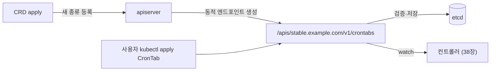
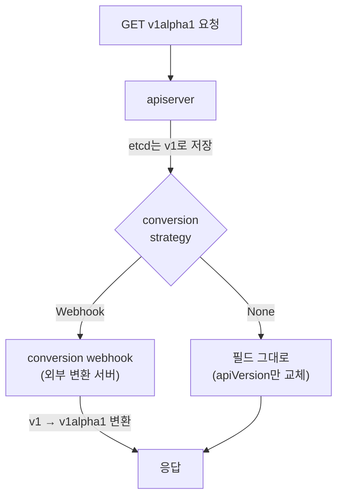
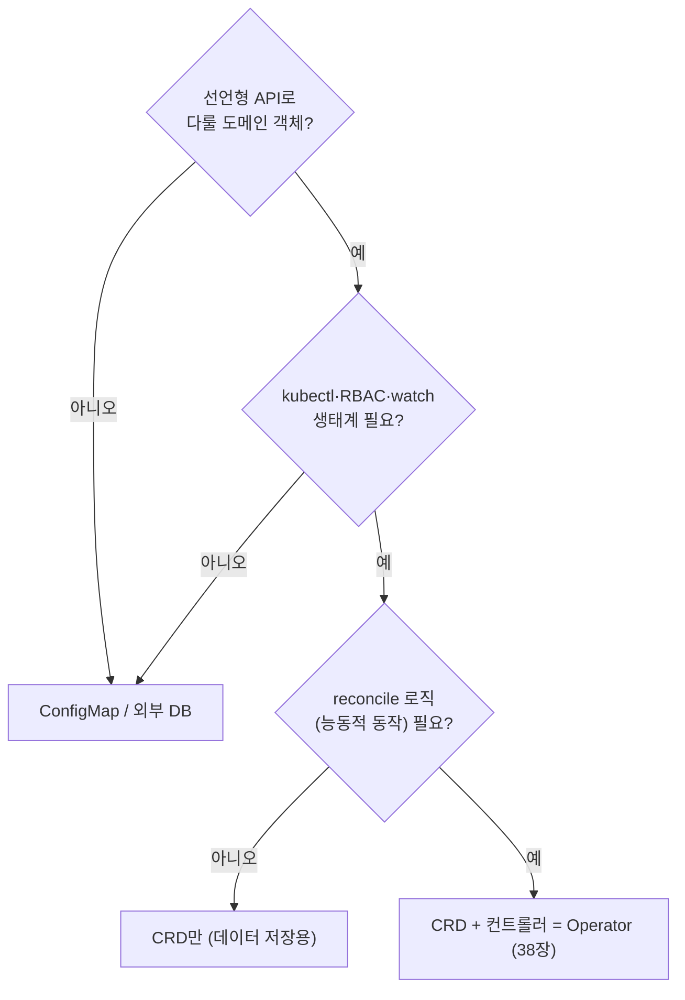

# CRD와 커스텀 리소스

::: info 학습 목표
- CustomResourceDefinition(CRD)이 apiserver에 새로운 리소스 종류를 어떻게 등록하는지 설명할 수 있다.
- OpenAPI v3 스키마로 커스텀 리소스의 필드를 검증하는 방법을 안다.
- 여러 버전(version)과 conversion이 CRD의 스키마 진화를 어떻게 지원하는지 이해한다.
- additionalPrinterColumns와 status/scale subresource가 커스텀 리소스를 내장 리소스처럼 만드는 원리를 안다.
:::

## 1. CustomResourceDefinition — API를 코드 없이 확장하다

8장에서 본 대로 쿠버네티스의 모든 것은 <strong>API 오브젝트</strong>다. Pod, Deployment, Service 같은 내장 리소스가 그렇다. 그런데 우리가 운영하는 도메인에는 "데이터베이스 클러스터", "인증서 발급 요청", "백업 정책" 같은 고유한 개념이 있다. 이런 개념을 쿠버네티스 방식으로 — `kubectl get`, `kubectl apply`, RBAC, watch가 모두 통하는 일급 리소스로 — 다루고 싶다.

[CustomResourceDefinition(CRD)](https://kubernetes.io/docs/concepts/extend-kubernetes/api-extension/custom-resources/)이 그 답이다. CRD는 "이런 이름과 이런 스키마를 가진 새 리소스 종류를 추가하라"고 apiserver에 선언하는 또 하나의 API 오브젝트다. CRD를 apply하면 apiserver가 동적으로 새 [REST 엔드포인트](https://kubernetes.io/docs/concepts/extend-kubernetes/api-extension/custom-resources/)를 띄우고, 그 순간부터 해당 리소스는 etcd에 저장되고 watch 가능한 일급 시민이 된다.

가장 단순한 CRD 예시를 보자.

```yaml
apiVersion: apiextensions.k8s.io/v1
kind: CustomResourceDefinition
metadata:
  # 이름은 반드시 <plural>.<group> 형식
  name: crontabs.stable.example.com
spec:
  group: stable.example.com
  scope: Namespaced            # 또는 Cluster
  names:
    plural: crontabs           # /apis/stable.example.com/v1/crontabs
    singular: crontab
    kind: CronTab              # 매니페스트의 kind
    shortNames: [ct]           # kubectl get ct
  versions:
    - name: v1
      served: true             # 이 버전을 REST로 제공할지
      storage: true            # etcd에 이 버전으로 저장(정확히 하나만 true)
      schema:
        openAPIV3Schema:
          type: object
          properties:
            spec:
              type: object
              properties:
                cronSpec:
                  type: string
                image:
                  type: string
                replicas:
                  type: integer
```

이 CRD를 apply하면 바로 다음이 가능해진다.

```yaml
apiVersion: stable.example.com/v1
kind: CronTab
metadata:
  name: my-crontab
spec:
  cronSpec: "* * * * */5"
  image: my-cron-image:1.2
  replicas: 3
```

```bash
kubectl apply -f my-crontab.yaml
kubectl get crontabs        # 또는 kubectl get ct
kubectl describe ct my-crontab
```



여기서 결정적인 점은 <strong>CRD만으로는 아무 일도 일어나지 않는다</strong>는 것이다. CRD는 데이터를 저장·조회·watch할 수 있게 해줄 뿐, 그 데이터를 보고 실제로 무언가를 하는 주체는 별도의 <strong>컨트롤러</strong>다. CRD에 반응하는 컨트롤러를 붙이는 패턴이 바로 38장의 Operator다.

## 2. OpenAPI v3 스키마 검증

CRD의 `versions[].schema.openAPIV3Schema`는 단순한 문서가 아니다. apiserver가 이 스키마로 들어오는 커스텀 리소스를 <strong>실제로 검증(validation)</strong>한다. 스키마에 맞지 않는 manifest는 apply 단계에서 거부된다. 즉 CRD 작성자는 자기 리소스의 "타입 시스템"을 정의하는 셈이다.

[구조적 스키마(structural schema)](https://kubernetes.io/docs/tasks/extend-kubernetes/custom-resources/custom-resource-definitions/#specifying-a-structural-schema)는 `apiextensions.k8s.io/v1`에서 필수다. 모든 필드의 타입이 명시되어야 하고, `properties`/`items`/`additionalProperties` 외의 곳에서 타입이 모호하면 안 된다.

```yaml
schema:
  openAPIV3Schema:
    type: object
    required: [spec]
    properties:
      spec:
        type: object
        required: [cronSpec, image]
        properties:
          cronSpec:
            type: string
            pattern: '^(\d+|\*)(/\d+)?(\s+(\d+|\*)(/\d+)?){4}$'
          image:
            type: string
          replicas:
            type: integer
            minimum: 1
            maximum: 10
            default: 1          # 미지정 시 기본값 주입
          mode:
            type: string
            enum: [Active, Suspended]
```

여기서 쓰인 검증 키워드들을 정리한다.

| 키워드 | 의미 |
|--------|------|
| `required` | 반드시 있어야 하는 필드 |
| `pattern` | 문자열 정규식 제약 |
| `minimum`/`maximum` | 숫자 범위 |
| `enum` | 허용 값 집합 |
| `default` | 미지정 시 apiserver가 주입하는 기본값 |
| `additionalProperties: false` | 정의되지 않은 필드 금지 |

더 복잡한 조건(필드 간 상호 의존, 불변성 등)은 [CEL 기반 validation rules](https://kubernetes.io/docs/tasks/extend-kubernetes/custom-resources/custom-resource-definitions/#validation-rules)로 표현한다.

```yaml
replicas:
  type: integer
  x-kubernetes-validations:
    - rule: "self <= 10"
      message: "replicas는 10을 넘을 수 없다"
```

::: warning 구조적 스키마가 강제되는 이유
status/scale subresource, server-side apply, conversion 같은 고급 기능은 모두 구조적 스키마를 전제로 동작한다. 타입이 모호한 스키마에서는 apiserver가 필드 단위로 안전하게 병합·검증할 수 없기 때문이다. 새 CRD는 항상 완전한 구조적 스키마로 작성한다.
:::

## 3. 버전과 conversion

CRD도 소프트웨어처럼 진화한다. `v1alpha1`에서 시작해 `v1beta1`, `v1`으로 필드가 바뀐다. 쿠버네티스는 <strong>한 CRD가 여러 버전을 동시에 제공</strong>하도록 허용한다. 핵심 규칙은 두 가지다.

- `served: true`인 버전은 여러 개일 수 있다(클라이언트가 골라 쓴다).
- `storage: true`는 <strong>정확히 하나</strong>여야 한다. etcd에는 이 버전으로만 저장된다.

```yaml
spec:
  versions:
    - name: v1alpha1
      served: true
      storage: false
      schema: { ... }
    - name: v1
      served: true
      storage: true       # etcd 저장은 항상 v1
      schema: { ... }
```

문제는 사용자가 `v1alpha1`로 GET했는데 etcd에는 `v1`로 저장되어 있을 때다. 이 간극을 메우는 것이 <strong>conversion</strong>이다. 두 전략이 있다.



[conversion 전략](https://kubernetes.io/docs/tasks/extend-kubernetes/custom-resources/custom-resource-definition-versioning/)은 다음과 같다.

- <strong>None</strong>: 변환 없이 `apiVersion`만 바꿔 돌려준다. 버전 간 필드가 동일할 때만 안전하다.
- <strong>Webhook</strong>: apiserver가 외부 [conversion webhook](https://kubernetes.io/docs/tasks/extend-kubernetes/custom-resources/custom-resource-definition-versioning/#webhook-conversion) 서버를 호출해 임의의 변환을 위임한다. 필드 구조가 바뀐 경우 필수다.

```yaml
spec:
  conversion:
    strategy: Webhook
    webhook:
      clientConfig:
        service:
          namespace: my-system
          name: my-conversion-webhook
          path: /convert
        caBundle: <base64 CA>
      conversionReviewVersions: ["v1"]
```

저장 버전을 바꾼 뒤에는 기존 객체들을 새 storage 버전으로 다시 쓰는 마이그레이션이 필요하다(`status.storedVersions` 정리 포함). 이 부분은 Operator 운영에서 흔히 놓치는 함정이다.

## 4. additionalPrinterColumns와 subresource

CRD가 진짜로 "내장 리소스처럼" 느껴지게 만드는 두 기능이 있다.

### additionalPrinterColumns

`kubectl get`을 했을 때 기본으로는 NAME과 AGE만 나온다. 내장 리소스는 READY, STATUS 같은 유용한 컬럼을 더 보여준다. CRD도 [additionalPrinterColumns](https://kubernetes.io/docs/tasks/extend-kubernetes/custom-resources/custom-resource-definitions/#additional-printer-columns)로 같은 경험을 줄 수 있다. JSONPath로 필드를 골라 컬럼화한다.

```yaml
versions:
  - name: v1
    served: true
    storage: true
    additionalPrinterColumns:
      - name: Schedule
        type: string
        jsonPath: .spec.cronSpec
      - name: Replicas
        type: integer
        jsonPath: .spec.replicas
      - name: Phase
        type: string
        jsonPath: .status.phase
      - name: Age
        type: date
        jsonPath: .metadata.creationTimestamp
```

```bash
$ kubectl get ct
NAME          SCHEDULE        REPLICAS   PHASE     AGE
my-crontab    * * * * */5     3          Running   2m
```

### status subresource

내장 리소스는 `spec`(사용자가 쓰는 desired)과 `status`(컨트롤러가 쓰는 관찰 결과)를 분리한다. CRD에서 [status subresource](https://kubernetes.io/docs/tasks/extend-kubernetes/custom-resources/custom-resource-definitions/#status-subresource)를 켜면 같은 분리가 생긴다.

```yaml
versions:
  - name: v1
    served: true
    storage: true
    subresources:
      status: {}     # /apis/.../crontabs/<name>/status 엔드포인트 생성
      scale:          # /scale 엔드포인트로 kubectl scale 지원
        specReplicasPath: .spec.replicas
        statusReplicasPath: .status.replicas
        labelSelectorPath: .status.selector
```

status subresource를 켜면 두 가지 효과가 있다.

- <strong>권한 분리</strong>: `spec`을 수정하는 일반 PUT은 `status`를 못 바꾼다. 컨트롤러는 `/status` 엔드포인트로 status만 갱신한다. 사용자 desired와 컨트롤러 observed가 서로를 덮어쓰지 않는다.
- <strong>generation 추적</strong>: `spec`이 바뀔 때만 `metadata.generation`이 증가한다. 컨트롤러는 `status.observedGeneration`과 비교해 "내가 본 spec이 최신인가"를 판단한다.

### scale subresource

`scale` subresource를 켜면 커스텀 리소스가 `kubectl scale`과 [HorizontalPodAutoscaler](https://kubernetes.io/docs/tasks/run-application/horizontal-pod-autoscale/)의 대상이 된다. HPA가 `/scale`을 읽고 써서 임의의 커스텀 리소스를 오토스케일링할 수 있게 되는, 강력한 확장점이다.

```bash
kubectl scale crontab my-crontab --replicas=5
```

## 5. 커스텀 리소스 활용 — 언제, 어떻게

CRD는 만능이 아니다. [CRD를 쓸지 판단하는 기준](https://kubernetes.io/docs/concepts/extend-kubernetes/api-extension/custom-resources/#should-i-add-a-custom-resource-to-my-kubernetes-cluster)을 공식 문서가 제시한다. 대략 다음 신호가 있으면 CRD가 적합하다.

- 선언형 API로 다루고 싶은 도메인 객체가 있다(설정이 아니라 "원하는 상태").
- `kubectl`, RBAC, watch 같은 쿠버네티스 생태계 도구를 그대로 쓰고 싶다.
- 객체 수가 적당하고(수만 개 단위까지), 변경 빈도가 극단적으로 높지 않다.

반대로 단순 key-value 설정이거나, 초고빈도 쓰기, 대용량 데이터라면 CRD보다 일반 데이터베이스나 ConfigMap이 낫다.



실제 생태계에서 CRD는 어디에나 있다. cert-manager의 `Certificate`/`Issuer`, Prometheus Operator의 `ServiceMonitor`/`PrometheusRule`, Istio의 `VirtualService`/`Gateway`, Argo의 `Application`/`Workflow` — 이들이 전부 CRD다. 우리가 `kubectl get certificate`를 칠 수 있는 이유가 cert-manager가 등록한 CRD 덕분이다. CRD를 이해한다는 것은 곧 현대 쿠버네티스 생태계의 작동 방식을 이해하는 것이다.

::: tip 핵심 정리
- <strong>CRD</strong>는 apiserver에 새로운 리소스 종류를 등록하는 API 오브젝트다. apply하면 동적 REST 엔드포인트가 생기고 그 리소스는 일급 시민이 된다.
- <strong>OpenAPI v3 구조적 스키마</strong>로 필드 타입·범위·기본값·CEL 규칙을 정의하면 apiserver가 직접 검증한다.
- 한 CRD는 여러 <strong>버전</strong>을 제공하되 storage는 하나여야 하며, 버전 간 차이는 <strong>conversion(None/Webhook)</strong>으로 메운다.
- <strong>additionalPrinterColumns</strong>로 kubectl 출력을, <strong>status/scale subresource</strong>로 spec/status 분리와 HPA 연동을 얻어 내장 리소스 수준의 경험을 만든다.
- CRD 자체는 데이터를 저장할 뿐이고, 거기에 반응해 능동적으로 동작하는 <strong>컨트롤러</strong>를 붙인 것이 Operator다.
:::

## 다음 챕터

CRD로 새로운 리소스 종류를 정의했지만, 그것을 보고 실제로 데이터베이스를 띄우거나 인증서를 발급하는 "두뇌"는 아직 없다. [38장 Operator 패턴](/study/kubernetes/38-operator)에서 CRD에 컨트롤러를 결합해, 도메인 운영 지식을 코드로 자동화하는 Operator를 controller-runtime과 함께 만든다.
