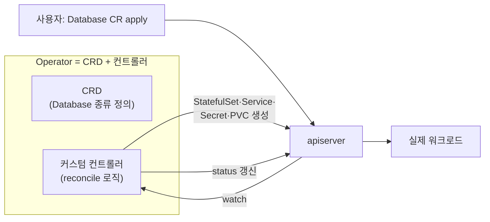
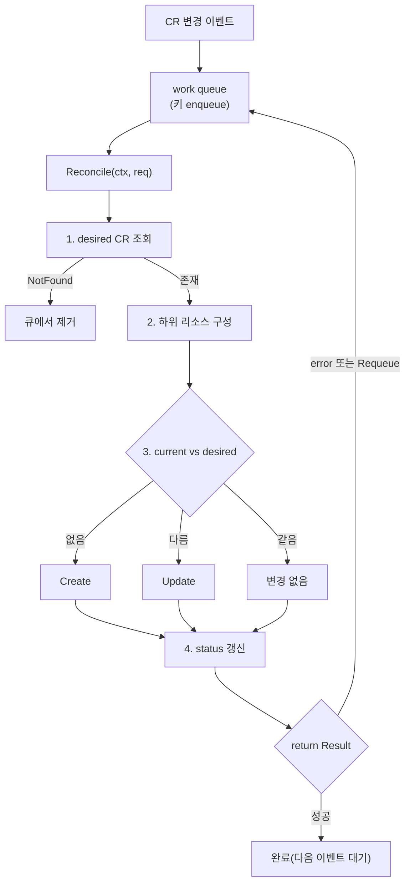
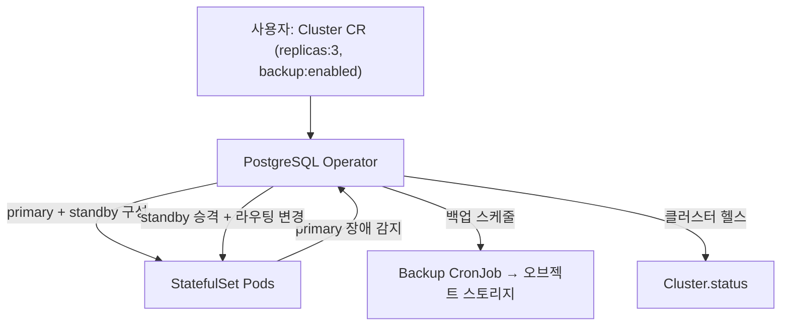
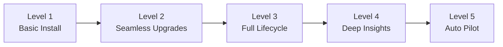

# Operator 패턴

::: info 학습 목표
- Operator가 "CRD + 커스텀 컨트롤러"로 운영 지식을 자동화하는 패턴임을 설명할 수 있다.
- controller-runtime의 Manager·Reconciler 구조와 reconcile 흐름을 따라갈 수 있다.
- Operator SDK / Kubebuilder가 어떤 뼈대를 생성하고 무엇을 채워 넣어야 하는지 안다.
- Operator 성숙도 레벨(Capability Level)로 Operator의 완성도를 평가할 수 있다.
:::

## 1. Operator 패턴 — 운영 지식을 코드로

37장에서 CRD는 데이터를 저장할 뿐, 거기에 반응해 무언가를 하는 건 컨트롤러라고 했다. 10장에서 컨트롤러는 desired와 current를 reconcile하는 control loop라고 했다. 이 둘을 합치면 <strong>Operator</strong>가 된다.

[Operator 패턴](https://kubernetes.io/docs/concepts/extend-kubernetes/operator/)의 핵심 발상은 이렇다. 사람 운영자(operator)가 "PostgreSQL 클러스터를 어떻게 띄우고, 백업하고, 장애 시 failover하는가"라는 지식을 머릿속에 갖고 손으로 수행한다. Operator는 <strong>그 운영 지식을 reconcile 코드로 옮겨</strong> 쿠버네티스 컨트롤러가 24시간 자동 수행하게 만든다. 그래서 Operator를 "병에 담은 SRE(SRE in a bottle)"라고 부른다.



내장 컨트롤러(ReplicaSet 등)와 Operator의 차이는 <strong>대상 리소스</strong>뿐이다. ReplicaSet 컨트롤러가 ReplicaSet을 reconcile하듯, Database Operator는 `Database` CR을 reconcile한다. 메커니즘(watch → work queue → reconcile)은 동일하다. 그래서 10장의 컨트롤러 골격을 그대로 재사용할 수 있고, 그것을 라이브러리로 제공하는 것이 controller-runtime이다.

## 2. controller-runtime과 reconcile 구현

[controller-runtime](https://kubernetes.io/docs/concepts/extend-kubernetes/operator/)은 컨트롤러를 만들 때 매번 다시 짜야 하는 공통 골격 — informer, work queue, 캐시, leader election — 을 추상화한 Go 라이브러리다. 개발자는 <strong>Reconcile 함수 하나</strong>에 도메인 로직만 집중하면 된다.

핵심 구성요소는 <strong>Manager</strong>와 <strong>Reconciler</strong>다. Manager는 캐시·클라이언트·컨트롤러들의 수명주기를 관리하고, Reconciler는 `Reconcile(ctx, req)` 메서드 하나를 가진 인터페이스다.

```go
// Reconciler는 이 인터페이스 하나를 구현하면 된다
type Reconciler interface {
    Reconcile(ctx context.Context, req ctrl.Request) (ctrl.Result, error)
}
```

`req`에는 변경된 객체의 <strong>NamespacedName(키)만</strong> 담긴다. 객체 본문이 아니다. 10장에서 강조한 level-triggered 원칙 그대로다. reconcile은 이 키로 현재 상태를 직접 조회해, "지금 desired는 무엇이고 current는 무엇인가"만 본다.

전형적인 reconcile 구현은 다음 형태를 따른다.

```go
func (r *DatabaseReconciler) Reconcile(ctx context.Context, req ctrl.Request) (ctrl.Result, error) {
    log := log.FromContext(ctx)

    // 1) 현재 desired(CR) 조회
    var db examplev1.Database
    if err := r.Get(ctx, req.NamespacedName, &db); err != nil {
        // NotFound면 이미 삭제됨 → 정리는 GC/finalizer가 처리, 큐에서 제거
        return ctrl.Result{}, client.IgnoreNotFound(err)
    }

    // 2) desired에 맞는 하위 리소스(StatefulSet) 구성
    desired := buildStatefulSet(&db)
    if err := ctrl.SetControllerReference(&db, desired, r.Scheme); err != nil {
        return ctrl.Result{}, err
    }

    // 3) current 조회 후 없으면 생성, 다르면 갱신 (멱등)
    var current appsv1.StatefulSet
    err := r.Get(ctx, client.ObjectKeyFromObject(desired), &current)
    if apierrors.IsNotFound(err) {
        if err := r.Create(ctx, desired); err != nil {
            return ctrl.Result{}, err
        }
    } else if err == nil {
        if !equalSpec(&current, desired) {
            current.Spec = desired.Spec
            if err := r.Update(ctx, &current); err != nil {
                return ctrl.Result{}, err
            }
        }
    } else {
        return ctrl.Result{}, err
    }

    // 4) status 갱신 (observed state 기록)
    db.Status.Phase = "Running"
    db.Status.ObservedGeneration = db.Generation
    if err := r.Status().Update(ctx, &db); err != nil {
        return ctrl.Result{}, err
    }

    return ctrl.Result{}, nil
}
```



Manager에 컨트롤러를 등록할 때 <strong>무엇을 watch할지</strong>를 선언한다. `Owns`로 하위 리소스를 watch하면, 누가 StatefulSet을 손대도 reconcile이 트리거되어 자동 복구된다.

```go
func (r *DatabaseReconciler) SetupWithManager(mgr ctrl.Manager) error {
    return ctrl.NewControllerManagedBy(mgr).
        For(&examplev1.Database{}).         // 주 리소스
        Owns(&appsv1.StatefulSet{}).        // 소유한 하위 리소스도 watch
        Complete(r)
}
```

::: tip reconcile은 항상 멱등해야 한다
"StatefulSet을 만들어라"가 아니라 "StatefulSet이 desired와 같게 하라"로 짠다. 이미 있으면 비교 후 필요할 때만 Update, 없으면 Create. 그래야 work queue가 같은 키를 여러 번 처리해도, Operator가 재시작해도 안전하다. `ctrl.Result{Requeue: true}`나 error 반환은 자동 backoff 재시도로 이어지므로, "다음에 다시 와도 똑같이 동작한다"는 보장이 필수다.
:::

## 3. Operator SDK와 Kubebuilder

controller-runtime을 맨손으로 쓰기보다, 대부분 [Operator SDK](https://kubernetes.io/docs/concepts/extend-kubernetes/operator/)나 Kubebuilder로 뼈대를 생성한다. 둘은 사실상 같은 controller-runtime 위에 빌드 위에 만들어졌고, 프로젝트 레이아웃·코드 생성·매니페스트 생성을 자동화한다.

전형적인 Kubebuilder 워크플로우는 다음과 같다.

```bash
# 1) 프로젝트 초기화
kubebuilder init --domain example.com --repo example.com/database-operator

# 2) API(CRD 타입) + 컨트롤러 뼈대 생성
kubebuilder create api --group apps --version v1 --kind Database
# → api/v1/database_types.go (Go 구조체 = CRD 스키마)
# → internal/controller/database_controller.go (Reconcile 뼈대)

# 3) Go 구조체에 필드 정의 후 매니페스트·코드 재생성
make manifests   # CRD YAML, RBAC 생성 (마커 주석 기반)
make generate    # DeepCopy 등 보일러플레이트 생성

# 4) 빌드·배포
make install     # CRD를 클러스터에 등록
make run         # 로컬에서 Operator 실행 (개발용)
make deploy      # 이미지 빌드 후 클러스터에 배포
```

여기서 흥미로운 점은 <strong>Go 구조체가 곧 CRD 스키마</strong>라는 것이다. 37장에서 본 OpenAPI v3 스키마를 손으로 쓰지 않고, 마커(marker) 주석이 달린 Go 타입에서 `make manifests`가 자동 생성한다.

```go
// +kubebuilder:validation:Minimum=1
// +kubebuilder:validation:Maximum=10
type DatabaseSpec struct {
    // +kubebuilder:validation:Required
    Version string `json:"version"`

    Replicas int32 `json:"replicas,omitempty"`
}

// +kubebuilder:subresource:status
// +kubebuilder:printcolumn:name="Phase",type=string,JSONPath=`.status.phase`
type Database struct {
    metav1.TypeMeta   `json:",inline"`
    metav1.ObjectMeta `json:"metadata,omitempty"`
    Spec   DatabaseSpec   `json:"spec,omitempty"`
    Status DatabaseStatus `json:"status,omitempty"`
}
```

`+kubebuilder:validation:Maximum=10` 마커가 37장에서 손으로 썼던 `maximum: 10` 스키마로, `+kubebuilder:subresource:status`가 status subresource 활성화로 변환된다. 코드와 스키마가 한 곳에서 동기화되는 셈이다.

## 4. 실제 Operator 사례

Operator 패턴은 이론이 아니라 생태계의 기본 골격이다. [OperatorHub](https://kubernetes.io/docs/concepts/extend-kubernetes/operator/)에는 수백 개가 있다. 대표 사례를 도메인별로 본다.

| Operator | 관리하는 CR | 자동화하는 운영 |
|----------|-------------|-----------------|
| Prometheus Operator | `Prometheus`, `ServiceMonitor`, `Alertmanager` | 모니터링 스택 배포·스크레이프 타깃 자동 발견 |
| cert-manager | `Certificate`, `Issuer`, `ClusterIssuer` | TLS 인증서 발급·자동 갱신 |
| CloudNativePG / Zalando | `Cluster`, `postgresql` | PostgreSQL 프로비저닝·failover·백업 |
| Strimzi | `Kafka`, `KafkaTopic`, `KafkaUser` | Kafka 클러스터·토픽·유저 운영 |
| etcd Operator | `EtcdCluster` | etcd 멤버 관리·복구 |

이들의 공통 가치는 "도메인 전문가의 운영 절차를 reconcile로 인코딩"한다는 데 있다. 예컨대 PostgreSQL Operator는 단순히 StatefulSet을 띄우는 게 아니라, primary 장애 시 standby를 승격하고, 새 standby를 base backup으로 복구하고, connection을 새 primary로 라우팅하는 <strong>장애 대응 절차 전체</strong>를 reconcile 안에 담는다. 사람이 새벽에 깨서 하던 일을 컨트롤러가 한다.



## 5. Operator 성숙도 레벨

모든 Operator가 같은 수준은 아니다. 어떤 건 단순 설치만 하고, 어떤 건 자가 튜닝까지 한다. [Operator Capability Level](https://kubernetes.io/docs/concepts/extend-kubernetes/operator/) 모델은 이를 5단계로 분류해 완성도를 평가한다.



| 레벨 | 이름 | 능력 |
|------|------|------|
| 1 | Basic Install | CR로 애플리케이션 프로비저닝·기본 설정 |
| 2 | Seamless Upgrades | 무중단 버전 업그레이드, conversion 관리 |
| 3 | Full Lifecycle | 백업·복구·failover 등 라이프사이클 전반 |
| 4 | Deep Insights | 메트릭·알림·로그 연동, 워크로드 인사이트 제공 |
| 5 | Auto Pilot | 자동 스케일링·자가 튜닝·이상 자동 치유 |

레벨이 높을수록 reconcile에 담긴 운영 지식이 깊다. Level 1은 `helm install`과 큰 차이가 없지만, Level 3 이상부터는 "운영자를 대체"하기 시작한다. 새 Operator를 설계할 때 이 모델은 "다음에 어떤 운영 능력을 자동화할까"의 로드맵이 된다.

::: warning Operator는 만능이 아니다
상태가 없고 단순한 워크로드라면 Deployment + Helm이면 충분하다. Operator는 <strong>상태 관리·장애 대응·복잡한 라이프사이클</strong>이 필요한 도메인(데이터베이스, 메시지 큐, 인증서 등)에서 진가를 발휘한다. 단순한 앱에 Operator를 만드는 것은 reconcile 버그·업그레이드 부담이라는 비용만 늘린다.
:::

::: tip 핵심 정리
- <strong>Operator</strong> = CRD(도메인 리소스 정의) + 커스텀 컨트롤러(reconcile 로직). 사람의 운영 지식을 코드로 자동화한 "병에 담은 SRE"다.
- <strong>controller-runtime</strong>은 informer·work queue·캐시를 추상화하고, 개발자는 멱등한 <strong>Reconcile 함수</strong>에만 집중한다. `req`에는 키만 오고, 현재 상태는 직접 조회한다.
- <strong>Kubebuilder/Operator SDK</strong>는 뼈대를 생성하며, 마커가 달린 Go 구조체에서 CRD 스키마·RBAC·DeepCopy를 자동 생성한다.
- cert-manager·Prometheus Operator·PostgreSQL Operator 등 실제 생태계 핵심이 모두 이 패턴이며, 장애 대응 같은 운영 절차 전체를 reconcile에 담는다.
- <strong>Capability Level 1~5</strong>로 Operator 완성도를 평가한다. Level 3 이상부터 진짜 "운영자 대체"가 시작된다.
:::

## 다음 챕터

CRD + 컨트롤러로 API를 확장하는 방법을 봤다. 그러나 쿠버네티스 API를 확장하는 길은 CRD만이 아니다. 자체 apiserver를 끼워 넣는 Aggregation Layer, 그리고 요청을 가로채 검증·변형하는 admission webhook이 있다. [39장 API Aggregation과 Webhook](/study/kubernetes/39-api-extension)에서 이 확장 메커니즘들을 비교하고 구현 주의점까지 다룬다.
