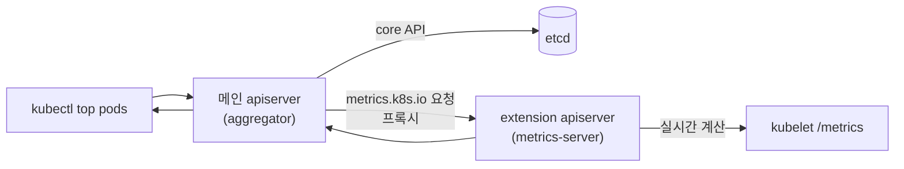
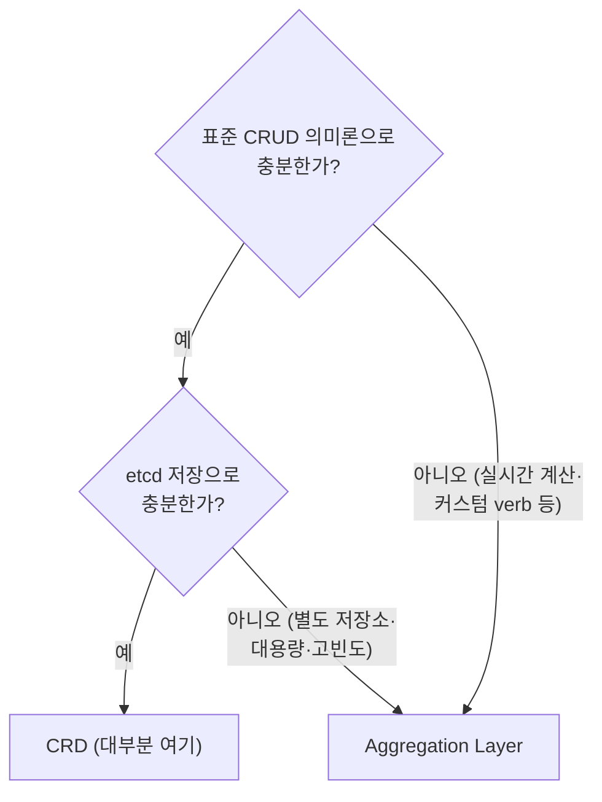
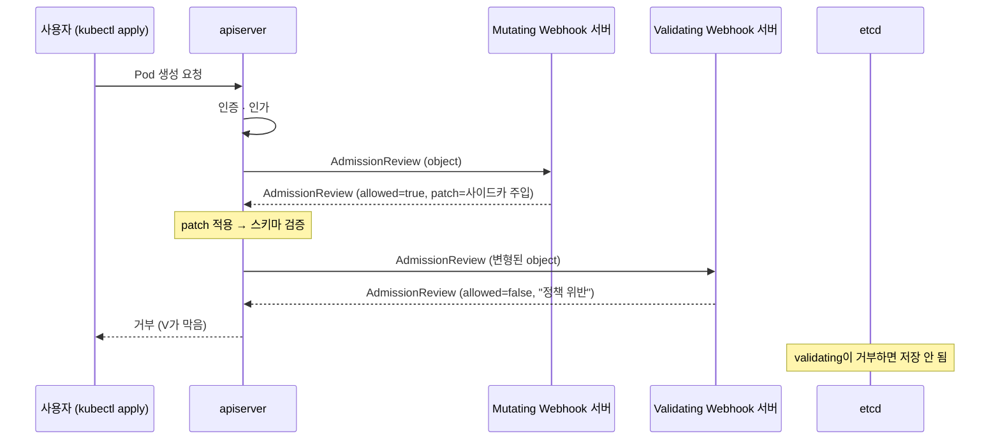
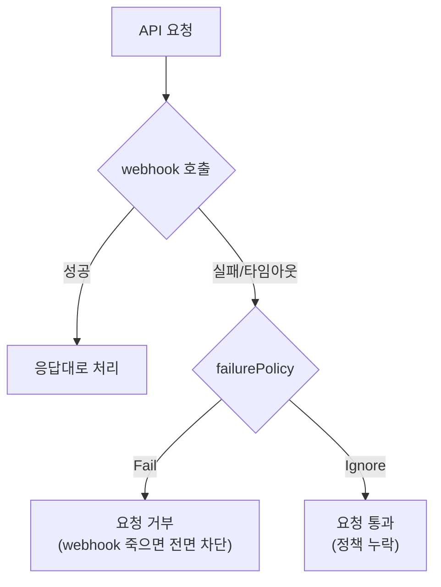

# API Aggregation과 Webhook

::: info 학습 목표
- API Aggregation Layer가 자체 apiserver를 어떻게 메인 apiserver 뒤에 끼워 넣는지 설명할 수 있다.
- CRD와 Aggregation Layer를 비교해 언제 무엇을 선택할지 판단할 수 있다.
- admission webhook(validating/mutating)의 요청 흐름과 구현 요소(서버·인증서·구성)를 안다.
- webhook 운영의 함정(가용성·failurePolicy·순환 의존)을 이해하고 피할 수 있다.
:::

## 1. API Aggregation Layer

37·38장의 CRD는 "apiserver가 대신 저장·검증해주는" 확장이었다. 데이터는 etcd에 들어가고, 스키마 검증만 우리가 정의했다. 그런데 어떤 API는 etcd에 저장하면 안 된다. [metrics-server](https://kubernetes.io/docs/tasks/debug/debug-cluster/resource-metrics-pipeline/)의 `metrics.k8s.io` API가 그렇다. 파드 CPU·메모리는 매초 변하는 실시간 값이라 저장할 필요도 없고 저장해서도 안 된다. 요청이 올 때 즉석에서 계산해 돌려줘야 한다.

이럴 때 쓰는 것이 [API Aggregation Layer](https://kubernetes.io/docs/concepts/extend-kubernetes/api-extension/apiserver-aggregation/)다. 우리가 직접 만든 <strong>extension apiserver</strong>를 띄우고, 메인 apiserver에게 "`metrics.k8s.io` 그룹 요청은 내 서버로 프록시해라"라고 등록한다. 등록 수단이 [APIService](https://kubernetes.io/docs/concepts/extend-kubernetes/api-extension/apiserver-aggregation/) 오브젝트다.

```yaml
apiVersion: apiregistration.k8s.io/v1
kind: APIService
metadata:
  name: v1beta1.metrics.k8s.io
spec:
  group: metrics.k8s.io
  version: v1beta1
  # 이 그룹/버전 요청을 아래 서비스로 프록시
  service:
    name: metrics-server
    namespace: kube-system
    port: 443
  groupPriorityMinimum: 100
  versionPriority: 100
  # extension apiserver의 TLS를 검증할 CA
  caBundle: <base64 CA>
```



여기서 메인 apiserver는 <strong>aggregator(역방향 프록시)</strong> 역할을 한다. 클라이언트 입장에서는 `metrics.k8s.io`가 마치 내장 API인 것처럼 보이지만, 실제 처리는 별도 프로세스가 한다. extension apiserver는 자체 저장소를 가질 수도 있고(metrics처럼) 아예 안 가질 수도 있다. 즉 <strong>저장·계산·인증을 우리가 완전히 제어</strong>한다는 점이 CRD와 결정적으로 다르다.

## 2. CRD vs Aggregation Layer

두 확장 방식은 같은 목표(새 API 추가)를 다른 비용·자유도로 달성한다. [공식 비교 문서](https://kubernetes.io/docs/concepts/extend-kubernetes/api-extension/custom-resources/#comparing-ease-of-use)를 바탕으로 정리한다.

| 측면 | CRD | Aggregation Layer |
|------|-----|-------------------|
| 구현 난이도 | YAML만으로 등록, 코드 불필요 | 자체 apiserver를 Go로 구현·운영 |
| 저장소 | etcd(쿠버네티스가 관리) | 자유(etcd 별도 인스턴스, DB, 무저장 등) |
| 검증·기본값 | OpenAPI 스키마 + CEL | 임의 로직(코드로 무엇이든) |
| 커스텀 동작 | 표준 CRUD 의미론에 한정 | 임의 verb·서브리소스·프로토콜 |
| 운영 부담 | 낮음(apiserver가 다 함) | 높음(가용성·업그레이드·인증서 직접) |



실무 원칙은 단순하다. <strong>가능하면 CRD, 어쩔 수 없을 때만 Aggregation</strong>이다. CRD는 운영 부담이 거의 없고 생태계 도구가 다 통한다. Aggregation은 metrics-server, `apiservices`를 쓰는 custom/external metrics API, 일부 보안 제품처럼 "etcd에 못 담거나 표준 CRUD를 벗어나는" 경우에만 정당화된다. 대다수 Operator는 CRD로 충분하다.

## 3. admission webhook — 요청을 가로채다

API 확장의 또 다른 축은 <strong>새 API를 추가하는 게 아니라 기존 요청을 가로채는</strong> 것이다. 8장에서 본 [admission control](https://kubernetes.io/docs/reference/access-authn-authz/admission-controllers/)을 떠올리자. 요청이 인증·인가를 통과한 뒤, etcd에 저장되기 직전에 admission 단계를 거친다. 여기에 우리 로직을 꽂는 것이 [admission webhook](https://kubernetes.io/docs/reference/access-authn-authz/extensible-admission-controllers/)이다.

두 종류가 있다.

- <strong>Mutating webhook</strong>: 객체를 <strong>변형</strong>한다. 사이드카 주입, 기본값 설정, 레이블 추가 등. JSON Patch를 돌려준다.
- <strong>Validating webhook</strong>: 객체를 <strong>검증만</strong> 한다. 정책 위반이면 거부. 변형은 못 한다.

순서가 중요하다. mutating이 먼저 돌아 객체를 바꾸고, 그다음 validating이 최종 결과를 검증한다.



[Istio 사이드카 자동 주입](https://kubernetes.io/docs/reference/access-authn-authz/extensible-admission-controllers/)이 mutating webhook의 대표 사례다. 사용자가 평범한 Deployment를 apply하면, mutating webhook이 Envoy 사이드카 컨테이너를 슬쩍 추가해 저장한다. 사용자는 사이드카를 의식하지 못한다. OPA Gatekeeper·Kyverno의 정책 강제는 validating webhook 사례다.

## 4. admission webhook 구현 — 서버·인증서·구성

webhook은 세 조각으로 구성된다. <strong>(1) HTTPS 서버, (2) TLS 인증서, (3) Configuration 오브젝트</strong>다.

### (1) webhook 서버

webhook 서버는 apiserver가 보내는 [AdmissionReview](https://kubernetes.io/docs/reference/access-authn-authz/extensible-admission-controllers/#request) JSON을 받아, allowed 여부(와 mutating이면 patch)를 담은 AdmissionReview를 응답하는 HTTPS 핸들러다.

```go
func handleMutate(w http.ResponseWriter, r *http.Request) {
    var review admissionv1.AdmissionReview
    json.NewDecoder(r.Body).Decode(&review)

    // 예: 모든 파드에 레이블 주입하는 JSON Patch
    patch := `[{"op":"add","path":"/metadata/labels/injected","value":"true"}]`
    patchType := admissionv1.PatchTypeJSONPatch

    review.Response = &admissionv1.AdmissionResponse{
        UID:       review.Request.UID,   // 요청 UID를 반드시 echo
        Allowed:   true,
        Patch:     []byte(patch),
        PatchType: &patchType,
    }
    json.NewEncoder(w).Encode(review)
}
```

### (2) TLS 인증서

apiserver는 webhook을 <strong>반드시 HTTPS</strong>로 호출하고, webhook 서버 인증서를 검증한다. 그래서 서버 인증서와, 그것을 검증할 CA 번들을 준비해 webhook configuration의 `caBundle`에 넣어야 한다. 운영에서는 cert-manager로 인증서를 발급·갱신하고 [CA Injector](https://kubernetes.io/docs/reference/access-authn-authz/extensible-admission-controllers/#authenticate-apiservers)로 caBundle을 자동 주입하는 패턴이 표준이다.

### (3) Configuration 오브젝트

어떤 요청을 어떤 webhook으로 보낼지는 `ValidatingWebhookConfiguration` / `MutatingWebhookConfiguration`으로 선언한다.

```yaml
apiVersion: admissionregistration.k8s.io/v1
kind: MutatingWebhookConfiguration
metadata:
  name: pod-label-injector
webhooks:
  - name: inject.example.com
    clientConfig:
      service:
        namespace: webhook-system
        name: webhook-svc
        path: /mutate
      caBundle: <base64 CA>
    rules:                       # 어떤 요청을 가로챌지
      - apiGroups: [""]
        apiVersions: ["v1"]
        operations: ["CREATE"]
        resources: ["pods"]
        scope: "Namespaced"
    # 가용성·범위 제어
    namespaceSelector:           # 특정 네임스페이스만
      matchLabels:
        webhook: enabled
    failurePolicy: Fail          # webhook 실패 시 요청 거부(Fail) vs 통과(Ignore)
    sideEffects: None
    timeoutSeconds: 5
    admissionReviewVersions: ["v1"]
```

`rules`로 대상 요청을 좁히고, `namespaceSelector`/`objectSelector`로 범위를 제한하고, `failurePolicy`/`timeoutSeconds`로 가용성 동작을 정한다. 이 필드들의 설계가 곧 webhook 운영 안정성을 좌우한다.

## 5. webhook 운영 주의점

webhook은 강력하지만, <strong>모든 관련 API 요청 경로에 끼어드는</strong> 단일 장애점이 될 수 있다. 실무에서 반드시 챙겨야 할 함정들이다.

### failurePolicy의 딜레마

webhook 서버가 죽거나 느리면 어떻게 할 것인가.

- `failurePolicy: Fail`: webhook 호출 실패 시 요청을 거부한다. 정책이 확실히 강제되지만, <strong>webhook이 죽으면 해당 리소스 생성이 전부 막힌다</strong>. 보안 정책처럼 우회를 절대 허용하면 안 될 때 쓴다.
- `failurePolicy: Ignore`: 실패 시 요청을 통과시킨다. 가용성은 지키지만 정책이 새어 나간다.



### 순환 의존(circular dependency)

가장 위험한 함정이다. webhook 서버 자신이 Pod로 떠 있고, 그 webhook이 `pods` CREATE를 `failurePolicy: Fail`로 가로챈다고 하자. 어느 날 webhook 파드가 전부 죽으면, 새 webhook 파드를 띄우려는 Pod CREATE 요청이 <strong>죽은 webhook을 호출하려다 거부</strong>된다. 영영 못 살아난다. 이를 피하려면 `namespaceSelector`로 자기 네임스페이스(kube-system 등 핵심 네임스페이스 포함)를 <strong>webhook 대상에서 제외</strong>해야 한다.

### 그 밖의 운영 수칙

| 주의점 | 대응 |
|--------|------|
| 지연(latency) | webhook은 동기 호출이라 모든 요청을 느리게 만든다. 빠르게 응답하고 `timeoutSeconds`를 짧게 |
| 가용성 | webhook 서버를 multi-replica + PodDisruptionBudget으로 고가용 구성 |
| 범위 폭주 | `objectSelector`/`namespaceSelector`로 꼭 필요한 대상만 |
| 멱등성 | mutating은 재호출돼도 같은 결과가 되게(이미 주입된 사이드카를 또 주입하지 않게) |
| sideEffects | 외부 상태를 바꾸면 `sideEffects`를 정확히 선언(dry-run 안전성) |

::: warning failurePolicy: Fail은 클러스터를 멈출 수 있다
넓은 `rules`(예: 모든 리소스)에 `Fail`을 걸어두고 webhook이 죽으면, 클러스터의 거의 모든 쓰기가 막힌다. 핵심 네임스페이스 제외, 좁은 rules, 짧은 timeout, 고가용 webhook을 함께 갖추지 않은 채 `Fail`을 쓰는 것은 클러스터 전체를 인질로 잡는 행위다.
:::

::: tip 핵심 정리
- <strong>API Aggregation Layer</strong>는 자체 extension apiserver를 메인 apiserver 뒤에 프록시로 끼우며, <strong>APIService</strong>로 등록한다. 저장·계산·인증을 완전히 제어한다(예: metrics-server).
- <strong>CRD vs Aggregation</strong>: 가능하면 CRD(운영 부담 낮음), etcd에 못 담거나 표준 CRUD를 벗어날 때만 Aggregation.
- <strong>admission webhook</strong>은 요청을 가로채 mutating(변형)·validating(검증)한다. mutating이 먼저, validating이 나중에 돈다.
- webhook은 <strong>HTTPS 서버 + TLS 인증서(caBundle) + Configuration 오브젝트</strong> 세 조각으로 구성되며, rules·selector·failurePolicy로 범위와 가용성 동작을 정한다.
- 운영의 핵심은 <strong>failurePolicy 선택, 순환 의존 회피(핵심 네임스페이스 제외), 짧은 timeout, 고가용 구성</strong>이다. 잘못 쓰면 webhook이 클러스터 전체를 멈춘다.
:::

## 다음 챕터

여기까지 쿠버네티스 API를 확장하는 세 길 — CRD, Operator, Aggregation/Webhook — 을 모두 다뤘다. 확장한 시스템이 잘 도는지 알려면 관측이 필요하다. [40장 메트릭과 모니터링](/study/kubernetes/40-metrics-monitoring)에서 metrics-server, Prometheus, 그리고 이번 장에서 본 custom/external metrics API가 어떻게 오토스케일링과 관측성으로 이어지는지 살펴본다.
